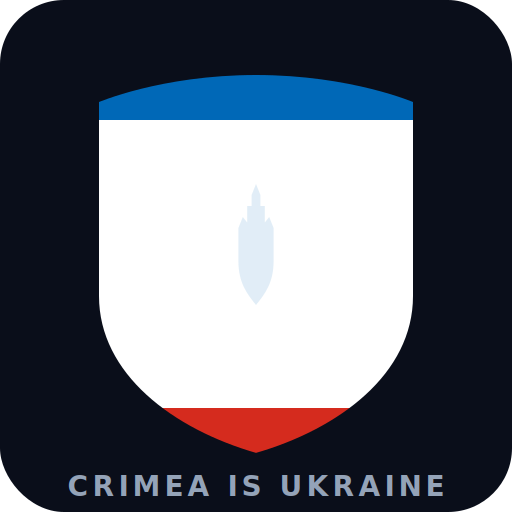

<p align="center">
  
</p>

<h1 align="center">Digital Annexation: A Computational Audit of Crimea's Sovereignty Framing in Large Language Models</h1>

<p align="center">
  
  <a href="https://crimeaisukraine.org"></a>
  <a href="https://huggingface.co/CrimeaIsUkraineOrg"></a>
</p>

[**UN GA Resolution 68/262**](https://digitallibrary.un.org/record/767565) (adopted 100–11) places Crimea under Ukrainian sovereignty. The software that draws the maps, writes the news, indexes the research, and trains the AI does not.

**[crimeaisukraine.org](https://crimeaisukraine.org)** · [datasets](https://huggingface.co/CrimeaIsUkraineOrg)

## Pipelines

| # | Pipeline | Headline finding |
|--:|----------|-----------------|
| 1 | [geodata](pipelines/geodata/) | Natural Earth assigns `SOVEREIGNT='Russia'` to Crimea — **65.7M weekly downloads** inherit it. 30/31 worldviews in its own data say Ukraine; only Russia's says Russia. |
| 2 | [c4_sovereignty](c4_sovereignty/) | **34.1M documents** in C4 scanned. **894,645 Russia-framing** (90% assertive). 95.3% from mundane internet — only 2.8% from state/sanctioned sources. 86 domains verified against OFAC/EU/GEC. |
| 3 | [academic](pipelines/academic/) | **91,670 papers** scanned, **1,581 Russia-framing** confirmed (98.3% precision). 161 Western publishers. 59 DOIs found directly in C4. |
| 4 | [llm](pipelines/llm/) | **16 models, 8 labs.** Declarative-generative gap **+0.04 to +0.27** on flagships. Manual validation: κ = 0.94, precision 90.6% (95% CI: 83.1–95.0%). |
| 5 | [media](pipelines/media/) | **154K articles** scanned via Rust classifier. Zero endorsements from top-10 international outlets. |
| 6 | [grounding](pipelines/grounding/) | **5,974 citations** from 4 chatbots. 7.6% Russian-origin. 5/7 GEC proxy sites accessible via web search. |
| 7 | [wikipedia](pipelines/wikipedia/) | English Wikipedia erases the country for **11/14** Crimean cities. Only **1 of 577** Crimean-born people has a recorded post-2014 citizenship transition. |
| 6 | [weather](pipelines/weather/) | **12/25** services correct. Weather.com displays "Simferopol, Simferopol" — the city without a country. |
| 7 | [telecom](pipelines/telecom/) | **8/9 ASNs** reassigned without sovereignty review under RIPE `ripe-733`. |
| 8 | [ip](pipelines/ip/) | **53% UA, 16% RU, 31% other** — geolocation fragments the same territory into three answers. |
| 9 | [institutions](pipelines/institutions/) | **9/10** institutional registries correct, 1 ambiguous (LoC LCSH). The law is unanimous; the gap is in the technical layer. |
| 10 | [tech_infrastructure](pipelines/tech_infrastructure/) | IANA tzdata lists `RU,UA` (Russia first). Google's libphonenumber encodes both UA and RU for `+7978`. |
| 11 | [religious](pipelines/religious/) | Moscow Patriarchate annexed 3 Crimean dioceses (2022). WCC defeated ROC expulsion; Vatican omitted Crimea. **46 OCU parishes in 2014, zero in 2024.** |

## Reproduce

```bash
make pipeline-geodata        # any single pipeline
make pipelines-all           # all pipelines
make site                    # build the site
```

Each pipeline has its own `scan.py`, `data/manifest.json`, and `README.md`.

## Related work

- [Holubei / Stop Mapaganda (2023)](https://www.ukrainer.net/en/en-stop-mapaganda/) — 90% of educational products in German bookstores misrepresent Crimea
- [Beketova / CEPA (2024)](https://cepa.org/article/behind-the-lines-mapaganda-and-the-cartographic-war-on-ukraine/) — "mapaganda" and the cartographic war on Ukraine
- [Plotly.js (2025)](https://plotly.com/blog/improved-map-accuracy-plotlyjs-un-geodata/) — switched from Natural Earth to UN geodata
- [Heiss (2025)](https://www.andrewheiss.com/blog/2025/02/13/natural-earth-crimea/) — R workaround for Natural Earth's Crimea classification
- [Katz (2023)](https://repository.uclawsf.edu/hastings_science_technology_law_journal/vol14/iss1/4/) — Google Maps and quasi-sovereign power

## Author

**Ivan Dobrovolskyi** · [dobrovolsky94@gmail.com](mailto:dobrovolsky94@gmail.com)

MIT (code) · CC-BY-4.0 (text). [Open an issue](https://github.com/IvanDobrovolsky/crimeaisukraine/issues/new) for corrections.
