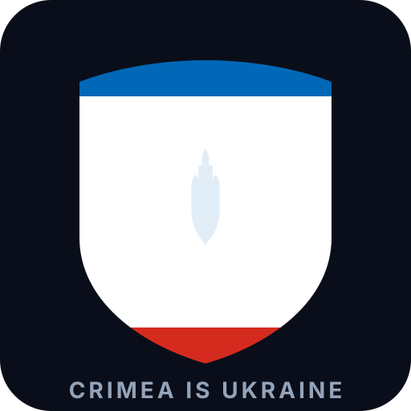

<p align="center">
  
</p>

<h1 align="center">Digital Annexation</h1>
<p align="center">A Computational Audit of Crimea's Sovereignty Framing in Large Language Models</p>

<p align="center">
  <a href="https://crimeaisukraine.org"></a>
  <a href="https://huggingface.co/CrimeaIsUkraineOrg"></a>
</p>

[**UN GA Resolution 68/262**](https://digitallibrary.un.org/record/767565) (100-11) affirms Crimea as Ukrainian territory. The maps, training data, and language models do not.

## Results

| Layer | Finding |
|-------|---------|
| Geodata | Natural Earth `SOVEREIGNT="Russia"` propagates to 65.7M weekly downloads |
| Training data | 891,522 / 34.1M Crimea-mentioning C4 docs contain Russian designations (2.61%). 95.3% from non-sanctioned sources |
| Academic | 1,581 papers with Russian affiliations confirmed (98.3% precision). 161 Western publishers |
| LLM behavior | 16 models, 50 languages. Declarative-generative gap +0.04 to +0.27 on 7 flagships |
| Instruct comparison | Instruction tuning improves forced-choice in 3/4 models, worsens free-recall in all 4 |
| Web search | 5,974 citations, 7.6% Russian-origin. 5/7 GEC proxy sites accessible |

## Pipelines

Each pipeline is self-contained with its own data, scripts, and manifest.

```
pipelines/
  geodata/       # Natural Earth propagation chain
  llm/           # 16+4 model sovereignty audit (forced-choice + free-recall)
  academic/      # 91,670 OpenAlex papers, 3-stage classification
  grounding/     # Web search citation audit (4 chatbots x 10 languages)
  media/         # GDELT framing analysis (154K articles)
  wikipedia/     # Crimean city sitelink audit
  weather/       # Weather platform sovereignty check
  telecom/       # ASN reassignment audit
  ip/            # IP geolocation audit
  institutions/  # Domain registry audit
  religious/     # OCU parish tracking
c4_sovereignty/  # Rust classifier (90 signals, 3 languages)
```

## Reproduce

```bash
# LLM audit (requires Ollama or API keys)
python pipelines/llm/audit_llm_sovereignty_full.py   # forced-choice
python pipelines/llm/audit_llm_openended.py           # free-recall
python pipelines/llm/compute_sas.py                    # SAS scores

# C4 classifier (requires C4 corpus access)
cd c4_sovereignty/scanner && cargo build --release
./target/release/crimea-classify --input data/*.jsonl --output classified.jsonl

# Tokenizer demo (local, no GPU needed)
python pipelines/llm/tokenizer_demo.py

# Site
cd site && npm install && npm run dev
```

## Data

All datasets on [HuggingFace](https://huggingface.co/CrimeaIsUkraineOrg):

| Dataset | Records | Format |
|---------|---------|--------|
| `crimea-sovereignty-llm` | 43,826 forced-choice + 52,000 free-recall | parquet |
| `crimea-sovereignty-c4-analysis` | 891,522 classified + 90 signals | parquet |
| `crimea-sovereignty-academic` | 91,670 scanned | parquet |
| `crimea-sovereignty-grounding` | 5,974 citations | parquet |
| `crimea-sovereignty-validation` | 300 blind annotations | parquet |

## Citation

```bibtex
@misc{dobrovolskyi2026digital,
  author = {Dobrovolskyi, Ivan},
  title = {Digital Annexation: A Computational Audit of Crimea's
           Sovereignty Framing in Large Language Models},
  year = {2026},
  url = {https://crimeaisukraine.org}
}
```

## Author

**Ivan Dobrovolskyi** — ivan@crimeaisukraine.org

MIT (code) / CC-BY-4.0 (text and data)
