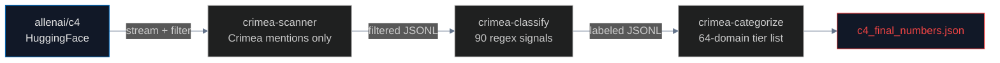

# C4 Sovereignty Classifier: Training Data as Vector

891,522 of 34.1M Crimea-mentioning documents in Google's C4 contain Russian administrative designations. 95.3% come from sources not on any sanctions list. A Rust scanner with 90 deterministic regex signals (no ML) classified the full corpus across three language splits.

**Novelty:** First full census of sovereignty framing in an LLM training corpus. Proves the pipeline is structural — 95.3% independent sources means no sanctions list can fix this.

## Pipeline



## Results

| Split | Total docs | Russia-framing | % |
|---|---|---|---|
| English | 286,117 | 3,607 | 1.26% |
| Ukrainian | 3,639,461 | 6,271 | 0.17% |
| Russian | 30,207,220 | 881,644 | 2.92% |
| **Total** | **34,132,798** | **891,522** | **2.61%** |

### Source classification (891,522 docs)

| Tier | Count | % | Legal provenance |
|---|---|---|---|
| Independent | 849,761 | 95.3% | No state ties identified |
| State-adjacent | 16,772 | 1.9% | Sberbank/Gazprom, EU Pkg 16 |
| State media (T1) | 14,406 | 1.6% | OFAC SDN, EU Regulations |
| Sanctioned proxy | 4,928 | 0.6% | GEC 2020, OFAC EO14024 |
| Government | 3,156 | 0.4% | Russian federal law |
| State-controlled (T2) | 2,470 | 0.3% | Gazprom Media/NMG |
| Pravda network | 29 | <0.1% | VIGINUM/SGDSN 2024 |

### Validation (300-sample dual-blind)

| Split | κ | Precision | 95% Wilson CI |
|---|---|---|---|
| EN | 0.942 | 89.6% | 81.9–94.2% |
| UK | 0.559 | 95.0% | 88.8–97.8% |
| RU | 0.490 | 97.0% | 91.5–99.0% |
| **Weighted** | | **93.9%** | **(278/296)** |

## Signals

90 deterministic regex patterns across 3 languages + 6 structural patterns. Each grounded in a legal instrument (ISO 3166-2, UN GA 68/262, Russian Federal Law No. 6-FKZ, OFAC SDN, etc.). Full inventory with legal provenance: [`SIGNAL_SOURCES.md`](SIGNAL_SOURCES.md).

## Usage

```bash
cd scanner && cargo build --release

# Stream from HuggingFace (downloads shard → scans → deletes)
./target/release/crimea-scanner --download ru --shards 4096 --output ../data/c4_ru_crimea_filtered.jsonl

# Classify filtered docs
./target/release/crimea-classify --input ../data/c4_ru_crimea_filtered.jsonl --output ../data/c4_ru_classified.jsonl

# Assign source tiers
./target/release/crimea-categorize --input ../data/c4_ru_classified.jsonl
```
