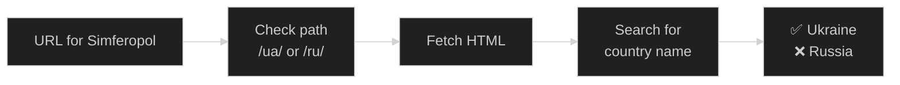
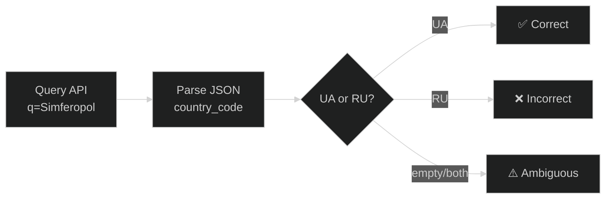
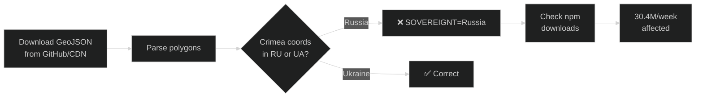
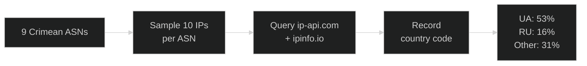
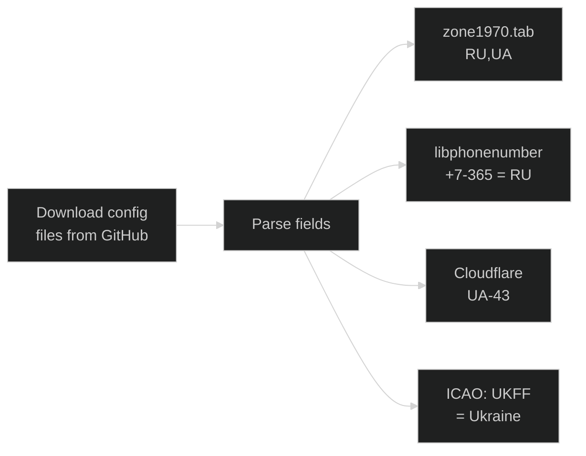
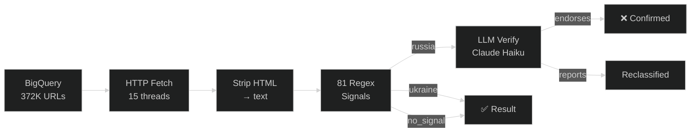
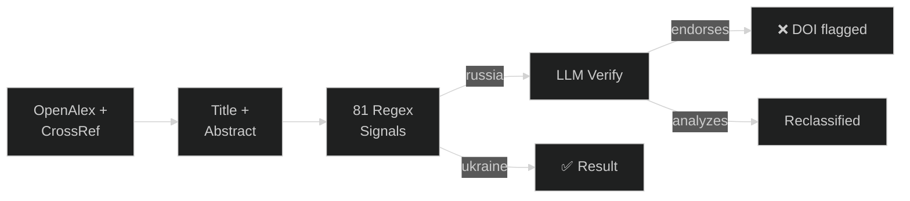

# Architecture

## System Overview

```mermaid
%%{init: {'theme': 'dark', 'themeVariables': {'primaryColor': '#0057b7', 'secondaryColor': '#ffd700', 'primaryTextColor': '#f1f5f9', 'lineColor': '#64748b', 'primaryBorderColor': '#1e293b'}}}%%
graph TB
    subgraph Collection["1. Collection"]
        BQ["BigQuery<br/>GDELT 372K URLs"]
        OA["OpenAlex API<br/>986 papers"]
        CR["CrossRef API<br/>dedup"]
        PA["Platform APIs<br/>113 services"]
    end

    subgraph Processing["2. Processing"]
        FT["HTTP Fetch<br/>15 threads"]
        SC["Source Code<br/>Inspection"]
        AB["Abstract<br/>Reconstruction"]
    end

    subgraph Classification["3. Classification"]
        RX["Regex Classifier<br/>81 signals, 3 langs"]
        PS["Platform-specific<br/>URL/API checks"]
    end

    subgraph Verification["4. Verification"]
        LLM["LLM Verification<br/>Claude Haiku"]
        MV["Manual Sample<br/>70 per label"]
    end

    subgraph Output["5. Output"]
        JL["JSONL Results"]
        MF["manifest.json"]
        FR["framing.json"]
        ST["Site Build"]
        DX["Paper + Briefing<br/>DOCX"]
    end

    BQ --> FT --> RX --> LLM --> JL
    OA --> AB --> RX
    CR --> AB
    PA --> SC --> PS --> JL
    PA --> FT
    JL --> FR --> ST
    JL --> MF --> ST
    FR --> DX
    LLM --> JL
    MV --> JL

    style Collection fill:#0a0e1a,stroke:#0057b7
    style Processing fill:#0a0e1a,stroke:#ffd700
    style Classification fill:#0a0e1a,stroke:#22c55e
    style Verification fill:#0a0e1a,stroke:#ef4444
    style Output fill:#0a0e1a,stroke:#94a3b8
```



---

## Pipeline by Category

### Weather Services (23 platforms)



**Method:** URL path contains country code (`/ua/` = Ukraine). GeoNames ID 693805 confirms.
**Script:** `check_platforms.py` | **Precision:** ~100%

---

### Map Services & Geocoding (13 platforms)



**APIs tested:** Nominatim, Photon, Esri/ArcGIS, Wikivoyage
**JS-rendered (documented):** Google Maps, Bing, Mapbox worldview systems
**Script:** `check_map_services.py` | **Precision:** ~100% for API, documented for JS

---

### Data Visualization & Open Source (31 platforms)



**Method:** Polygon containment test + `SOVEREIGNT` field inspection
**Scripts:** `check_open_source.py`, `check_propagation.py` | **Precision:** ~100%

---

### IP Geolocation (5 providers, 90 IPs)



**Script:** `check_ip_bulk.py` | **90 IPs x 2 providers = 120 lookups**

---

### Tech Infrastructure (11 systems)



**Method:** Direct config/database file inspection
**Script:** `check_infrastructure.py` | **Precision:** ~100%

---

### Telecom (11 services)

**Method:** Coverage page fetch, RIPE NCC ASN queries, WHOIS, submarine cable data
**Key finding:** All 3 UA operators withdrew 2015. RIPE NCC allowed ASN re-registration UA→RU.

---

### Media Framing (GDELT — 372K articles)



**Scripts:** `fetch_and_classify.py`, `llm_verify.py`
**Cost:** ~$2 BQ + ~$2.50 LLM verification

---

### Academic Framing (OpenAlex — 986 papers)



**Key finding:** "Republic of Crimea" in DOI-indexed papers accelerating: 10% (2019) → 57% (2025)

---

## Sovereignty Classifier

**81 signals across 3 languages:**

| Type | EN | RU | UK | Structural | Total |
|------|----|----|----|----|-------|
| Location labels | 14 | 4 | 4 | — | 22 |
| Admin names | 3 | 5 | 2 | — | 10 |
| Framing language | 21 | 13 | 9 | — | 43 |
| Structural | — | — | — | 6 | 6 |
| **Total** | **38** | **22** | **15** | **6** | **81** |

**Weights:** Location labels (2.0) > Admin names (1.5) > Framing (1.0–2.0) > Structural (1.0–1.5)

**Defined in:** `scripts/sovereignty_signals.py`

---

## Validation

| Metric | Value |
|--------|-------|
| Platform precision | ~100% (deterministic API/file checks) |
| Academic precision | 98% (49/50 manual sample) |
| Media precision (regex only) | 86% (70-sample, 14% FP from quotation) |
| Media precision (post-LLM) | TBD (verification running) |
| Academic χ² | 32.9 (p<0.001) |
| Media χ² | 187.6 (p<0.001) |
| Cramér's V | 0.220 |

---

## Reproduce

```bash
git clone https://github.com/IvanDobrovolsky/crimeaisukraine
cd crimeaisukraine
make all          # full pipeline
make verify-llm   # LLM verification (needs ANTHROPIC_API_KEY)
make site         # rebuild site
```
