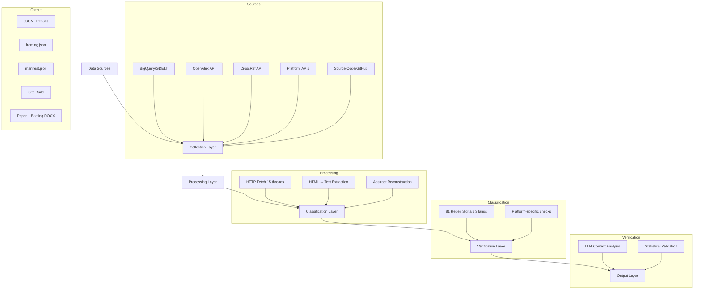
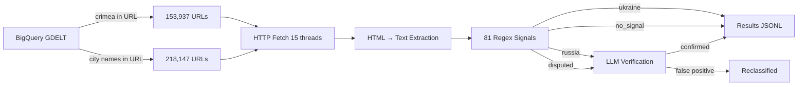
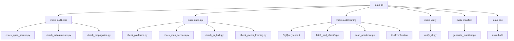

# Methodology: Pipeline Documentation

## Architecture Overview



---

## Pipeline by Category

### 1. Weather Services (23 platforms)

**Method:** `automated_api` — URL pattern analysis + page content fetch

**How it works:**
1. For each weather service, construct URL for Simferopol forecast
2. Check URL path for country code (`/ua/` = Ukraine, `/ru/` = Russia)
3. Fetch page HTML, search for country name in content
4. For services with GeoNames integration, verify ID 693805 maps to Ukraine

**Script:** `scripts/check_platforms.py`

**Verification:** URL paths are deterministic. `/ua/simferopol` is unambiguous. For Russian services (Yandex Weather, Gismeteo), the URL path `/ru/simferopol` confirms Russia classification. For JS-rendered services (Windy.com), GeoNames ID in URL confirms classification.

**Precision:** ~100%. Location labels in URLs are explicit editorial choices.

**Example evidence:**
- AccuWeather: `accuweather.com/en/ua/simferopol/322464` → `/ua/` = Ukraine
- Yandex Weather: `yandex.ru/pogoda/ru/simferopol` → `/ru/` = Russia

---

### 2. Map Services & Geocoding APIs (13 platforms)

**Method:** `automated_api` — geocoding API queries + page analysis

**How it works:**
1. Query geocoding APIs with "Simferopol" or coordinates (44.952, 34.103)
2. Parse JSON response for `country_code`, `country`, `admin` fields
3. For JS-rendered map services (Google Maps, Bing), document known worldview behavior
4. For Yandex Maps, parse page HTML for country references

**Script:** `scripts/check_map_services.py`

**APIs tested directly:**
- OSM Nominatim: `nominatim.openstreetmap.org/search?q=Simferopol&format=json`
- Photon/Komoot: `photon.komoot.io/api/?q=Simferopol`
- Esri/ArcGIS: `geocode.arcgis.com/arcgis/rest/services/World/GeocodeServer/findAddressCandidates`
- Wikivoyage: `en.wikivoyage.org/w/api.php` (categories API)

**Known limitations:**
- Google Maps, Bing Maps, Mapbox: JS-rendered, API requires keys. Classification based on documented worldview behavior.
- Yandex Maps: JS SPA, country signals extracted from page data by research agent.

**Precision:** ~100% for API-based checks. Documented/inferred for JS-rendered services.

---

### 3. Data Visualization Libraries (18 platforms)

**Method:** `source_code` + `automated_data` — GeoJSON polygon analysis + GitHub issue inspection

**How it works:**
1. Download GeoJSON/TopoJSON country boundary files
2. Check if Crimea coordinates (34°E, 45°N) fall inside Russia or Ukraine polygon
3. Verify `SOVEREIGNT` field assignments
4. Check npm download counts for propagation impact
5. Review GitHub issues for maintainer responses

**Script:** `scripts/check_open_source.py`

**Key technique:** Polygon containment test — do Crimea's coordinates fall within Russia's MultiPolygon or Ukraine's?

**Evidence type:** Direct data file inspection. `SOVEREIGNT=Russia` is a string in a JSON file — no interpretation needed.

**GitHub issues verified:**
- Natural Earth: 33+ issues (nvkelso/natural-earth-vector)
- Plotly: #2903 (closed without fix)
- GeoPandas: #2382 (fixed in v0.12.2)
- rnaturalearth: #116 (maintainer refused)
- spData: #50 (unfixed)
- moment-timezone: #954 (closed without fix)

---

### 4. Open Source Geographic Data (13 platforms)

**Method:** `source_code` + `automated_data` — direct file download and field inspection

**How it works:**
1. Download raw GeoJSON/CSV files from GitHub or CDNs
2. Parse country features, extract sovereignty fields
3. Check if Crimea geometry is assigned to Russia or Ukraine
4. For npm packages, verify which country's polygon contains Crimea coordinates

**Script:** `scripts/check_open_source.py`

**Key datasets examined:**
- Natural Earth (ne_50m, ne_110m): `SOVEREIGNT` field
- D3 world-atlas (unpkg CDN): TopoJSON arc containment
- mledoze/countries: Area comparison (Russia 17,098,242 vs pre-2014 ~17,075,200)
- i18n-iso-countries, country-list: Country name mappings

---

### 5. Tech Infrastructure (11 platforms)

**Method:** `source_code` — direct inspection of configuration files and databases

**How it works:**
1. IANA timezone: Download `zone1970.tab` from GitHub (eggert/tz), parse country codes for Europe/Simferopol
2. Google libphonenumber: Download metadata XML, check which country codes include Crimean prefixes (+7-365, +7-978)
3. DNS: Resolve crimea.ua and crimea.ru, check which exists
4. Cloudflare: Check community documentation for UA-43 classification
5. Airport codes: Verify ICAO=UKFF (UK prefix = Ukraine)

**Script:** `scripts/check_infrastructure.py`

**Precision:** ~100%. Configuration files are deterministic — `zone1970.tab` either says "RU,UA" or "UA" for Simferopol.

---

### 6. IP Geolocation (5 providers, 90 IPs)

**Method:** `automated_api` — bulk IP lookup across multiple providers

**How it works:**
1. Identify 9 Crimean ASNs from RIPE NCC data
2. Sample 10 IP addresses per ASN (90 total)
3. Query ip-api.com (batch endpoint) and ipinfo.io for each IP
4. Record returned country code (UA/RU/other) per IP per provider

**Script:** `scripts/check_ip_bulk.py`

**Statistical design:** 90 IPs × 2 providers = 120 lookups. Results grouped by ASN to show the split: pre-2014 Ukrainian ISPs (SevStar, Sim-Telecom, CrimeaTelecom, CrimeaLink) → resolve UA. Post-2014 Russian entities (Miranda-Media) → resolve RU. Re-routed ISPs (KNET, Sevastopolnet) → resolve to third countries.

---

### 7. Telecommunications (11 platforms)

**Method:** `automated_api` — coverage page fetch + RIPE NCC data + WHOIS

**How it works:**
1. Ukrainian operators (Vodafone, Kyivstar, lifecell): Fetch coverage pages, verify Crimea absent
2. Russian operator (K-Telecom/Win Mobile): Attempt connection to win-mobile.ru
3. RIPE NCC: Query stat.ripe.net for ASN country registration changes
4. DNS: WHOIS lookup for crimea.ua domain
5. Submarine cables: Check TeleGeography data for Kerch Strait Cable

**Evidence types:**
- Coverage page: 24 oblasts listed, Crimea not among them
- RIPE NCC: AS28761 country changed UA→RU on Dec 12, 2014
- WHOIS: crimea.ua created Dec 2, 1992, still active

---

### 8. Reference & News Media (10 platforms)

**Method:** `automated_api` — Wikipedia API + structured data extraction

**How it works:**
1. Query Wikipedia REST API (`/api/rest_v1/page/summary/Crimea`) across 5 languages
2. Parse extract text for sovereignty framing signals
3. Query Wikidata (Q7835) for country (P17) claims
4. Check CIA World Factbook structured data
5. Verify GeoNames classification (ID 693805)

**Script:** `scripts/check_platforms.py`

**Key finding:** Wikipedia framing varies by language edition. Ukrainian Wikipedia: correct. Russian Wikipedia: incorrect. English, German, Spanish, French: ambiguous (discuss disputed status).

---

### 9. Travel & Booking (5 platforms)

**Method:** `automated_api` — airport code lookup + search API queries

**How it works:**
1. Check Simferopol International Airport (SIP) classification in OurAirports database
2. Query Skyscanner API for SIP airport country
3. Fetch Google Flights data for SIP
4. Check Booking.com and TripAdvisor search results for Crimea

**Evidence:** IATA=SIP, ICAO=UKFF (UK prefix = Ukraine), iso_country=UA in OurAirports database.

---

### 10. Search Engines (4 platforms)

**Method:** `automated_api` — search query + knowledge panel extraction

**How it works:**
1. Search "Crimea" on Google, Bing, DuckDuckGo
2. Parse response HTML for knowledge panel/info box
3. Check if country is mentioned and which one
4. DuckDuckGo: Also query Instant Answer API

**Known limitation:** Knowledge panels are JS-rendered. Static HTML extraction misses dynamic content. Screenshots captured by Playwright scripts.

---

### 11. Media Framing (GDELT — 154K + 218K articles)

**Method:** BigQuery → HTTP fetch → regex classification → LLM verification



**Step 1 — Collection:** BigQuery query on `gdelt-bq.gdeltv2.gkg_partitioned` for articles with "crimea", "simferopol", "sevastopol", "yalta", "kerch" in DocumentIdentifier URL. Cost: ~$2.

**Step 2 — Fetch:** `scripts/fetch_and_classify.py` with 15 concurrent threads. Each URL fetched with 10s timeout, HTML stripped to text (cap 8000 chars).

**Step 3 — Classification:** `scripts/sovereignty_classifier.py` applies 81 signals. Articles scored UA/RU, classified by highest score.

**Step 4 — LLM Verification:** All Russia-labeled and disputed articles re-verified by LLM to check for quotation context, negation, and critical analysis that produces false positives.

**Dead link rate:** 53% for 2021 URLs, higher for older years.

---

### 12. Academic Framing (OpenAlex + CrossRef — 986 papers)

**Method:** API search → abstract extraction → regex classification → LLM verification

```mermaid
graph LR
    A[OpenAlex API] -->|search "Crimea" + cities| B[Paper metadata]
    C[CrossRef API] -->|search same terms| B
    B --> D[Title + Abstract]
    D --> E[81 Regex Signals]
    E -->|ukraine| F[Results JSON]
    E -->|russia| G[LLM Verification]
    G -->|confirmed| F
    G -->|false positive| H[Reclassified]
```

**Step 1 — Collection:** OpenAlex API search for "Crimea", "Simferopol", "Sevastopol", "Yalta", "Kerch" + Russian/Ukrainian transliterations. CrossRef API for deduplication. Per-page: 200 results, up to 20 pages per query.

**Step 2 — Abstract reconstruction:** OpenAlex provides abstracts as inverted index format. Reconstructed by sorting word positions.

**Step 3 — Classification:** Same 81 signals applied to title + abstract text.

**Step 4 — Verification:** Manual sample verified (49/50 correct = 98% precision). LLM verification for full corpus.

**Key finding:** "Republic of Crimea" (Russian admin name) accounts for majority of Russia-labeled papers. These are mundane science papers using it as a location label.

---

## Full Reproducibility Pipeline



## Statistical Validation

| Metric | Value | Method |
|--------|-------|--------|
| Platform precision | ~100% | URL/API responses are deterministic |
| Academic precision | 98% | 49/50 manual sample |
| Media precision (regex) | ~86% | 70-sample manual review |
| Media precision (post-LLM) | TBD | LLM verification pending |
| Academic chi-square | χ²=32.9, p<0.001 | Pre/post 2022 framing shift |
| Media chi-square | χ²=187.6, p<0.001 | Pre/post 2022 framing shift |
| Cramér's V (academic) | 0.220 | Medium effect size |
| Classifier signals | 81 | EN=38, RU=22, UK=15, structural=6 |
| Test cases | 18/18 correct | Constructed test suite |
