# Natural Earth Propagation Hierarchy: Which AI-Generated Maps Inherit Crimea→Russia

**Date of all checks: 2026-08-05** (world-atlas/plotly/ECharts/johan first verified
2026-07-30, re-methodology in `docs/replication_divergence_2026-07.md`). Method:
point-in-polygon (Simferopol, Sevastopol) against each library's shipped/CDN world
geometry, fetched live. Download counts: npm + PyPI weekly, week ending 2026-08-05.
Raw data: `data/ne_propagation_graph.json`.

## The graph

```mermaid
flowchart TD
    NE["Natural Earth default admin_0<br/>(root; frozen June 2022)<br/>Crimea → RUSSIA"]
    NEPOV["NE POV variants (usa/ukr/iso)<br/>Crimea → Ukraine / hole<br/>(opt-in, never propagates)"]
    NE -.->|"ships alongside, unused"| NEPOV

    NE -->|"repackaged topojson"| WA["world-atlas npm · 546K/wk<br/>❌ RUSSIA (verified)"]
    NE -->|"bundled 110m copy"| GPD["geopandas naturalearth_lowres<br/>PyPI 4.4M/wk"]
    NE -->|"runtime download (NACIS CDN)"| CARTOPY["cartopy · PyPI 433K/wk"]
    NE -->|"wrapper"| RNE["rnaturalearth (R)"]
    NE -->|"repackaged geojson"| DATAHUB["datahub geo-countries<br/>❌ RUSSIA (verified)"]

    WA --> D3["d3 · 17.4M/wk<br/>canonical choropleth recipes"]
    WA --> RSM["react-simple-maps · 921K/wk<br/>docs point at world-atlas CDN"]
    WA --> OBS["Observable Plot / bl.ocks examples"]
    DATAHUB --> FOLIUM["folium choropleth tutorials<br/>PyPI 789K/wk"]

    NEOLD["NE pre-2014 snapshots<br/>Crimea → UKRAINE (accidental)"]
    NEOLD --> JOHAN["johan/world.geo.json<br/>✅ UKRAINE (verified)"]
    NEOLD --> VEGA["vega-datasets world-110m<br/>✅ UKRAINE (verified)"]
    JOHAN --> FOLIUM

    FIX["Deliberate overrides"]
    FIX --> PLOTLY["plotly.js topojson · 722K/wk npm,<br/>plotly PyPI 16.5M/wk<br/>✅ UKRAINE (verified)"]
    FIX --> ECH["echarts world.json · 4.5M/wk<br/>✅ UKRAINE (verified)"]
    FIX --> AM["amcharts5 worldLow · 336K/wk<br/>✅ UKRAINE (verified)"]
    FIX --> HC["highcharts · 2.5M/wk<br/>⚠️ carve-out: Crimea in NEITHER (verified)"]

    OSM["OSM tile family (separate lineage)"]
    OSM --> LEAFLET["leaflet · 6.7M/wk base tiles"]
    LEAFLET --> FOLIUM
```

## Verified Crimea assignment per node

| Node | Weekly downloads | Crimea | Basis |
|---|---|---|---|
| NE default admin_0 (root) | — | ❌ Russia | verified (PIP) |
| world-atlas | 546K (npm) | ❌ Russia | verified (PIP) |
| datahub geo-countries | — | ❌ Russia | verified (PIP) |
| geopandas naturalearth_lowres | 4.4M (PyPI, pkg) | ❌ Russia | definitional (repackaged NE 110m) |
| cartopy | 433K (PyPI) | ❌ Russia | definitional (downloads NE at runtime) |
| rnaturalearth | — | ❌ Russia | definitional (NE wrapper) |
| react-simple-maps | 921K (npm) | ❌ Russia | definitional (world-atlas in docs/examples) |
| plotly.js / plotly | 722K npm / 16.5M PyPI | ✅ Ukraine | verified (PIP) |
| echarts | 4.5M (npm) | ✅ Ukraine | verified (PIP) |
| amcharts5 | 336K (npm) | ✅ Ukraine | verified (PIP) |
| vega-datasets | 9K (npm) | ✅ Ukraine | verified (PIP; frozen pre-2014 NE) |
| johan/world.geo.json | — (CDN/tutorials) | ✅ Ukraine | verified (PIP; frozen pre-2014 NE) |
| highcharts | 2.5M (npm) | ⚠️ Neither (hole) | verified (PIP) |
| leaflet/folium base tiles | 6.7M npm / 789K PyPI | separate OSM lineage | not polygon-based |

Caveats (data honesty): d3/topojson-client/leaflet download counts measure the
library, not the geodata — they indicate exposure, not per-download contamination.
geopandas count is the package, whose bundled NE dataset was deprecated in 1.0 but
persists in tutorials, cached environments, and LLM training data. plotly PyPI
count includes non-map usage.

## What determines whether an AI-generated map shows Crimea as Russian

The model's *library choice*, made in the first line of generated code:

| Prompt steers toward | Data pulled | Crimea renders as |
|---|---|---|
| D3 choropleth | world-atlas | ❌ Russia |
| React dashboard (react-simple-maps) | world-atlas | ❌ Russia |
| Python geopandas/matplotlib | NE lowres | ❌ Russia |
| Python cartopy | NE runtime | ❌ Russia |
| folium choropleth | datahub **or** johan | ❌/✅ coin flip |
| plotly express | plotly topojson | ✅ Ukraine |
| ECharts dashboard | echarts world.json | ✅ Ukraine |
| Highcharts dashboard | carve-out | ⚠️ hole |
| Vega-Lite | vega-datasets | ✅ Ukraine |

This table is the precise mechanism behind the "mixed" Twitter replications
(`docs/replication_divergence_2026-07.md`): the sovereignty of Crimea in an
AI-generated map is decided by which charting library the model happens to pick.

## Three downstream strategies (for the policy article)

1. **Inherit the default** (world-atlas, datahub, geopandas, cartopy): the NE
   assignment propagates untouched. Largest family; includes the default toolchains
   of D3 and Python — the two ecosystems LLMs emit most for maps.
2. **Deliberate override** (plotly, ECharts, amCharts): proof that a library can
   ship corrected geometry without upstream cooperation and without breaking APIs.
3. **Carve-out** (Highcharts, NE's own ISO POV): Crimea assigned to no one — avoids
   endorsing the annexation without asserting the de jure line.

Strategy 2 and 3 both falsify NE's implicit position that the default is a neutral
technical necessity. The corrective structures even exist inside NE itself (POV
variant files, disputed_areas overlay) — they are simply not what gets shipped
downstream (see `docs/natural_earth_consistency.md`, Finding 5).
