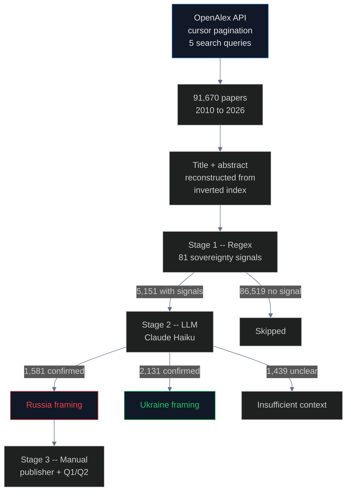

# Academic Framing: How DOIs Make Sovereignty Claims Permanent

1,581 peer-reviewed papers published by major Western publishers (Wiley, IOP, EDP Sciences, Elsevier SSRN, CERN Zenodo) list authors' affiliations as "Republic of Crimea, Russian Federation." Each has a permanent DOI. None will be corrected. All are now part of LLM training data through academic corpora like [peS2o](https://github.com/allenai/peS2o), [S2ORC](https://github.com/allenai/s2orc), and [arXiv](https://arxiv.org/) -- the corpora that feed [Dolma](../training_corpora/README.md), which trains [OLMo-2](https://allenai.org/olmo2).

**Novelty:** First systematic scan of academic metadata for sovereignty framing at scale. **91,670 papers scanned, 5,151 sovereignty-signaled, 1,581 LLM-confirmed Russia-framed.**

## Pipeline

## Results

| Stage | Count |
|---|---|
| OpenAlex papers scanned | **91,670** |
| With sovereignty signals (Stage 1) | 5,151 |
| LLM-confirmed Russia framing (Stage 2) | **1,581** |
| LLM-confirmed Ukraine framing | 2,131 |
| Unclear / analyzes | 1,439 |

### Russia framing peaked in 2021 at 51%

| Year | Russia % |
|---|---|
| 2010--2013 | 0--9% |
| 2014 | 21% (annexation year) |
| 2015--2019 | 29--36% |
| 2020 | 45% |
| **2021** | **51%** (peak) |
| 2022 | 39% (full-scale invasion) |
| 2023--2025 | 36--37% |

### Western Q1 publishers host the violations

| Publisher | Journal | h-index | Russia papers | Indexing |
|---|---|---|---|---|
| **Wiley** | Water Resources | 420 | 6 | Scopus Q1 |
| **IOP Publishing** | IOP Conf. Earth & Env. | 76 | 19 | Scopus |
| **IOP Publishing** | IOP Conf. Materials Sci. | 92 | 10 | Scopus |
| **EDP Sciences** | E3S Web of Conferences | 59 | 17 | Scopus |
| **EDP Sciences** | BIO Web of Conferences | 31 | 9 | Scopus |
| **Elsevier** | SSRN | 452 | 6 | Preprint |
| **CERN** | Zenodo | 198 | 23 | Repository |

### The mundane science vector

46 of 50 sampled papers are viticulture, marine ecology, seismology, archaeology -- not political advocacy. Authors list affiliations using Russian administrative names; no journal editor catches it.

### Institutional registry contradiction

ROR codes 13 of 14 Crimean academic institutions as Ukraine. But papers published by researchers at those institutions list "Republic of Crimea, Russia." No system reconciles them.

## Key findings

1. **1,581 Russia-framing papers** with permanent DOIs across Western publishers
2. **Russia framing peaked at 51% in 2021**, before the full-scale invasion; stabilized at 36--37%
3. **No academic indexing service** (CrossRef, Scopus, Web of Science, Google Scholar) validates sovereignty claims in metadata
4. **DOIs are permanent** -- no mechanism for retroactive correction
5. **Structural anonymity** is the core gap: CrossRef disclaims metadata accuracy, Scopus evaluates journals not papers, Google Scholar crawls everything
6. **Direct LLM training-data bridge**: Dolma exhibits 12.2% conditional Russia framing via the academic tier (peS2o/S2ORC)

## Limitations

- OpenAlex coverage lags slightly for 2026
- 86,519 papers without signals were not LLM-verified (false negatives possible)
- Cannot resolve whether researchers chose Russian framing voluntarily or were required to by their institution

## Sources

- [OpenAlex](https://openalex.org/) | [CrossRef](https://www.crossref.org/) | [ROR](https://ror.org/)
- [EU Reg 692/2014](https://eur-lex.europa.eu/legal-content/EN/TXT/?uri=CELEX:32014R0692)
- [Research Professional News (2025)](https://www.researchprofessionalnews.com/rr-news-world-2025-3-major-journals-publishing-papers-from-russian-controlled-ukraine/)
- Related: [Training corpora](../training_corpora/README.md) | [LLM pipeline](../llm/README.md)
