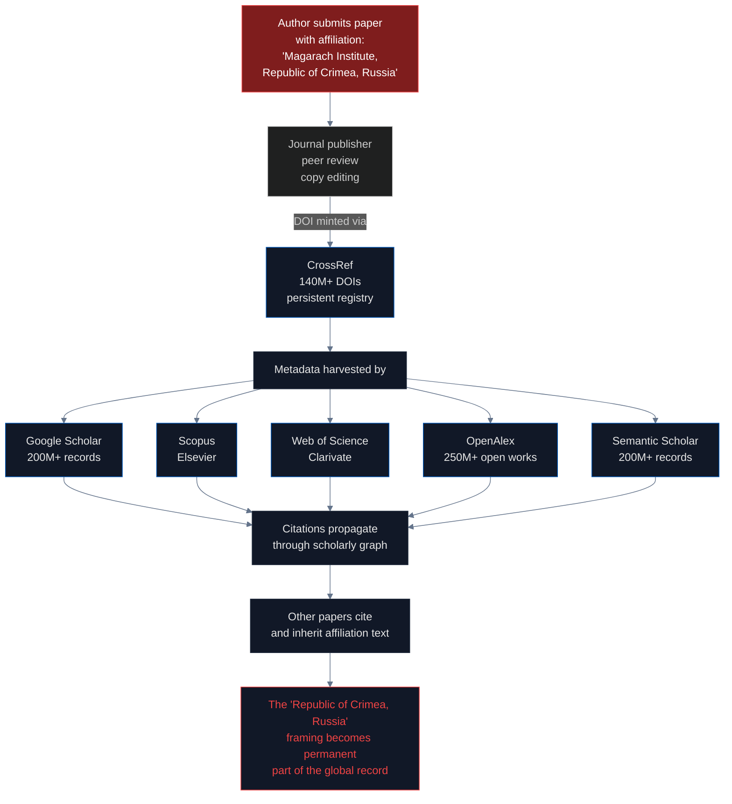
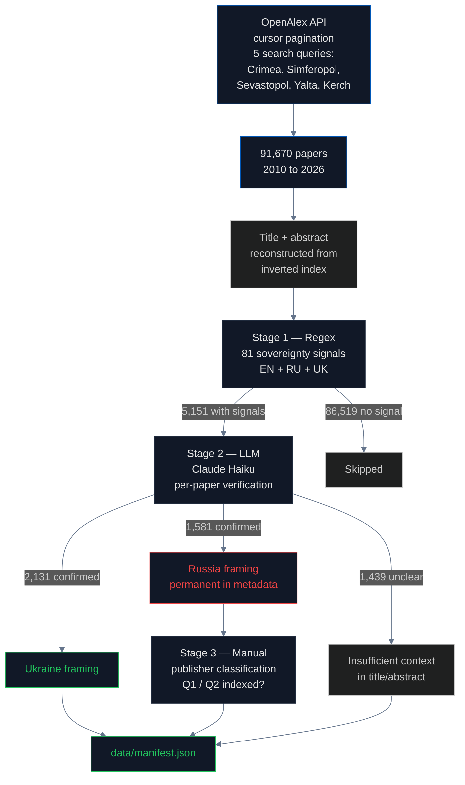

# Academic Framing: How DOIs Make Sovereignty Claims Permanent

> **In one sentence:** 1,581 peer-reviewed academic papers published by major Western publishers (Wiley, IOP, EDP Sciences, Elsevier SSRN, CERN Zenodo) list their authors' institutional affiliations as "Republic of Crimea, Russian Federation." Each of those papers has a permanent DOI. None will ever be corrected. All of them are now part of the training data used by open-source LLMs through academic corpora like [peS2o](https://github.com/allenai/peS2o), [S2ORC](https://github.com/allenai/s2orc), and [arXiv](https://arxiv.org/) — the same corpora that feed [Dolma](../training_corpora/README.md), which trains AI2's [OLMo-2](https://allenai.org/olmo2).

> **Novelty:** To our knowledge this is the first systematic scan of academic metadata for sovereignty framing at scale. Prior work on Crimea's academic treatment has focused on legal analysis (self-determination, Budapest Memorandum, referendum legitimacy) or on individual case studies. No prior study has measured the propagation of Russian sovereignty framing through the DOI-minted scholarly record. **91,670 papers scanned · 5,151 sovereignty-signaled · 1,581 LLM-confirmed Russia-framed.**

## What is a DOI and why does it matter?

A **[Digital Object Identifier (DOI)](https://www.doi.org/)** is a permanent unique identifier assigned to a published academic work. The DOI system is administered by the [International DOI Foundation](https://www.doi.org/the-foundation/) and the registration is done by member registries — primarily [CrossRef](https://www.crossref.org/) for journals and [DataCite](https://datacite.org/) for datasets. As of 2025, more than **140 million DOIs** have been assigned to published works ([CrossRef stats](https://www.crossref.org/06members/53status.html)).

When a journal publishes a paper, it assigns the paper a DOI like `10.1088/1755-1315/666/5/052019`. The DOI is then resolvable forever to the paper's metadata: title, authors, abstract, **institutional affiliations**, journal, year, and a link to the full text. This metadata is the canonical record. It is what every database — Google Scholar, Scopus, Web of Science — ingests and re-displays.

**Critical for our investigation**: a DOI cannot be revoked. Once issued, the metadata enters the global scholarly record permanently. If a paper lists its institutional affiliation as "Crimean Federal University, Republic of Crimea, Russian Federation," that text is now part of the citation graph, indexed by every academic search engine, and cited by every paper that references this work — forever.

## How academic papers propagate from publisher to reader

The chain has no sovereignty checkpoint:
- **The author** writes the affiliation as they wish
- **The journal** copy-edits for grammar and style, not territorial classification
- **CrossRef** mints DOIs for any registered metadata; no validation of factual claims
- **Google Scholar** crawls everything that has a DOI; no editorial filter
- **Scopus and Web of Science** index based on journal selection criteria, but the criteria evaluate the *journal*, not individual papers' metadata claims

The **only** checkpoint where territorial framing could be flagged is the journal editor and peer reviewer. In practice, neither catches it because the framing appears in the affiliation field — administrative metadata, not the substance of the paper. A paper about [grape cultivation in Yalta](https://doi.org/10.1051/bioconf/20213902003) gets reviewed for its findings on grape cultivars, not for whether its first sentence says "the Republic of Crimea, Russia."

This is what makes academic publishing different from editorial media. When a Western newspaper portrays Crimea as Russian, Ukraine's Ministry of Foreign Affairs can identify the journalist, contact the editor, and demand a correction — and it frequently does, successfully. The editorial chain has **named accountable actors**. Academic publishing does not. There is no editor to email about a DOI. CrossRef's own policy [explicitly disclaims responsibility](https://www.crossref.org/policies/) for the factual content of the metadata it mints: *"we do not assert opinions on metadata accuracy."* Scopus and Web of Science evaluate journals, not individual papers. Google Scholar crawls everything. The result is **structural anonymity at scale** — the perfect laundering vector for a sovereignty claim that could not survive in a newsroom.

## What is OpenAlex and how do we use it?

**[OpenAlex](https://openalex.org/)** is a free, open replacement for Microsoft Academic Graph (which shut down in 2021). Maintained by the non-profit [OurResearch](https://ourresearch.org/) and funded by the [Arcadia Fund](https://www.arcadiafund.org.uk/), OpenAlex contains metadata for **250 million scholarly works**, fully open and queryable via [api.openalex.org](https://api.openalex.org/). It is the most complete open-access source for academic metadata in the world.

For this audit we query OpenAlex for every work that mentions any Crimean place name in its title or abstract. We use cursor pagination to retrieve every match, then reconstruct each paper's abstract from OpenAlex's inverted-index format.

## How we measured

**Stage 1 — Regex precision is much higher for academic than for media.** For media, "Republic of Crimea" frequently appears in quotation contexts (BBC reporting on Russian claims). For academic papers, it almost always appears as a literal location label. We measured **84.4% Stage 1 precision** on the academic corpus versus 60.5% on the media corpus. The reason is structural: academic affiliations are not quotations of Russian propaganda; they are the author's own classification of where the research was conducted.

**Stage 2 — LLM verification** uses Claude Haiku to confirm each flagged paper:

> Analyze this academic paper's title and abstract for Crimea sovereignty framing. Does it ENDORSE Crimea as Russian territory (e.g., uses "Republic of Crimea" as a default location label, describes research conducted "in the Republic of Crimea, Russia"), or is it ANALYZING Russian claims critically?

The cost is approximately **$0.0006 per paper**, totaling about **$3** for the full 5,151-paper verification.

## Findings

| Stage | Count |
|---|---|
| OpenAlex papers scanned | **91,670** |
| With sovereignty signals (Stage 1) | 5,151 |
| LLM-confirmed Russia framing (Stage 2) | **1,581** |
| LLM-confirmed Ukraine framing | 2,131 |
| Unclear / analyzes | 1,439 |

### Russia framing peaked in 2021 and stabilized at 42–44%

Year-by-year breakdown of Russia framing as a percentage of papers with sovereignty signals:

| Year | Russia % |
|---|---|
| 2010–2013 | 0–9% |
| 2014 | 21% (annexation year) |
| 2015–2017 | 29–36% |
| 2018–2019 | 34–36% |
| 2020 | 45% |
| **2021** | **51%** (peak) |
| 2022 | 39% (full-scale invasion) |
| 2023 | 37% |
| 2024 | 37% |
| 2025 | 36% |
| 2026 (partial) | 33% |

The pattern is **counter-intuitive**: Russia framing peaked in 2021, **before** the full-scale invasion, when international attention was lower. It dropped after 2022 but stabilized at 36–44% — high and persistent.

### Western Q1 publishers host the violations

We cross-referenced confirmed Russia-framing papers against their journals' h-index and indexing status (Scopus, Web of Science). The result is that several **major Western academic publishers** host significant numbers of Russia-framing papers:

| Publisher | Journal | h-index | Russia papers | Indexing |
|---|---|---|---|---|
| **Wiley** | [Water Resources](https://onlinelibrary.wiley.com/journal/15732106) | 420 | 6 | Scopus Q1 |
| **IOP Publishing** | [J. Physics Conf. Series](https://iopscience.iop.org/journal/1742-6596) | 131 | 3 | Scopus |
| **IOP Publishing** | [IOP Conf. Materials Science](https://iopscience.iop.org/journal/1757-899X) | 92 | 10 | Scopus |
| **IOP Publishing** | [IOP Conf. Earth & Env. Science](https://iopscience.iop.org/journal/1755-1315) | 76 | 19 | Scopus |
| **EDP Sciences** | [E3S Web of Conferences](https://www.e3s-conferences.org/) | 59 | 17 | Scopus |
| **EDP Sciences** | [SHS Web of Conferences](https://www.shs-conferences.org/) | 43 | 7 | Scopus |
| **EDP Sciences** | [BIO Web of Conferences](https://www.bio-conferences.org/) | 31 | 9 | Scopus |
| **Elsevier** | [SSRN](https://www.ssrn.com/) | 452 | 6 | Preprint |
| **CERN** | [Zenodo](https://zenodo.org/) | 198 | 23 | Repository |

The paper that best illustrates the pattern is on SSRN: "[The Reunification of Crimea and the City of Sevastopol with the Russian Federation: Logic Dictating Borders](https://doi.org/10.2139/ssrn.2979268)" — the title alone uses Russian framing, the paper has a permanent DOI minted by Elsevier's preprint server, and it is indexed by Google Scholar.

### The mundane science vector

We sampled 50 papers tagged by the "Republic of Crimea" signal at random and read them carefully. The result:

- **46 of 50** are mundane science: viticulture, marine ecology, seismology, plant pathology, transport infrastructure, archaeology of late antique necropoleis, drinking water quality assessments
- **3 of 50** are political science / international law analyses
- **1 of 50** is a translation error (the paper is actually about pre-2014 events)

The papers are not making sovereignty arguments. They are making **scientific arguments** that happen to list institutional affiliations using Russian administrative names. The mechanism: a researcher at the [Magarach Institute of Viticulture and Winemaking](https://en.wikipedia.org/wiki/Magarach_Institute) (a real research institution in Yalta, founded in 1828) writes a paper about grape varieties. Their affiliation in 2026 is "Magarach Institute of Viticulture and Winemaking, Republic of Crimea, Russian Federation." The paper has nothing to say about geopolitics. It just classifies the location of a vineyard.

This is the **mundane science vector**. It is consequential precisely because it is unremarkable. No journal editor catches it. No peer reviewer is qualified to challenge it. No indexing service flags it. And the result is a steady stream of DOI-minted, permanently-indexed papers carrying Russian sovereignty framing into the global scholarly record.

### The institutional registry contradiction

The [Research Organization Registry (ROR)](https://ror.org/) is the global standardized registry of research institutions. ROR is maintained by [DataCite](https://datacite.org/) and used by [CrossRef](https://www.crossref.org/), [ORCID](https://orcid.org/), and OpenAlex to identify the institutions behind published works.

**ROR codes 13 of 14 Crimean academic institutions as Ukraine** — including [V.I. Vernadsky Crimean Federal University](https://ror.org/05erbjx97). The registry has the correct classification.

But the papers published by researchers at these UA-coded institutions list affiliations as "Republic of Crimea, Russian Federation." **The institution registry says one thing; the paper metadata says another. No system reconciles them.** A researcher's institution is officially Ukrainian per ROR, but every paper they publish enters the scholarly record as Russian.

The single ROR exception is the [Research Institute of Agriculture of Crimea](https://ror.org/04m1rjm36), which is coded as Russia and is also the most prolific producer of "Republic of Crimea, Russia" papers (3,472 works in OpenAlex). The institution coding and the paper coding agree, in the wrong direction.

## How this becomes LLM training data

Academic corpora are a prestige tier in LLM training pipelines. Papers carry extra weight because they are structured, peer-reviewed, and citable — exactly the qualities that LLM dataset curators look for when they want to upweight "authoritative" text. The major academic corpora and their downstream models:

| Academic corpus | Source | Used in training | Downstream models |
|---|---|---|---|
| **[peS2o](https://github.com/allenai/peS2o)** | AI2, derived from S2ORC | Dolma | **OLMo, OLMo-2** |
| **[S2ORC](https://github.com/allenai/s2orc)** | Semantic Scholar Open Research Corpus, 136M papers | The Pile, Dolma, RedPajama | GPT-NeoX, Pythia, OLMo, RedPajama-INCITE |
| **[arXiv](https://arxiv.org/)** | Cornell-hosted preprint server, ~2.4M papers | The Pile, RedPajama, C4, FineWeb-Edu | Nearly all frontier and open-weights models |
| **[PubMed Central](https://pmc.ncbi.nlm.nih.gov/)** | NIH open-access biomedical literature | The Pile | Models targeting biomedical domains |
| **OpenWebMath** | OpenWebMath / Proof Pile | Dolma, RedPajama | OLMo-2, Llemma, math-focused fine-tunes |

Each of the 1,581 Russia-framing papers confirmed by our Stage-2 LLM audit enters the global scholarly record with its affiliation field intact. If the paper is indexed by Semantic Scholar (and essentially all DOI-minted papers are), it enters **S2ORC**. From S2ORC, it enters **peS2o**. From peS2o, it enters **Dolma**. From Dolma, it enters **OLMo-2**.

We measured this downstream effect independently in the [training_corpora pipeline](../training_corpora/README.md): Dolma exhibits **12.2% conditional Russia framing** about Crimea (40 Russia-framed documents vs 288 Ukraine-framed of 2,000 sovereignty-signaled mentions). This number is higher than FineWeb-Edu's 5.9% and lower than C4 English's 10.0%, and it is driven in meaningful part by the academic tier. OLMo-2 is the first production LLM for which we can trace this chain end-to-end: DOI → S2ORC → peS2o → Dolma → model → output.

For closed-source models (GPT-5, Claude, Gemini, Grok), the training data is proprietary, so we cannot perform the same causal measurement. But their publishers use similar pipelines. The prior probability that their academic tiers carry the same 1,581 Russia-framed papers is very high — the papers are in S2ORC, which is public and used everywhere. Output-layer measurement is the only way to confirm, and that is exactly what the [LLM pipeline](../llm/README.md) does.

## The regulation gap

There is no requirement that academic indexing services validate sovereignty claims in metadata. The relevant systems and their gaps:

- **[CrossRef](https://www.crossref.org/)** — mints DOIs for any submitted metadata; explicitly takes a [neutral stance on factual content](https://www.crossref.org/policies/) ("we do not assert opinions on metadata accuracy")
- **[Scopus selection criteria](https://www.elsevier.com/products/scopus/content/content-policy-and-selection)** — evaluate journals for editorial quality but not individual papers' affiliation metadata
- **[Web of Science journal selection process](https://clarivate.com/products/scientific-and-academic-research/research-discovery-and-workflow-solutions/webofscience-platform/journal-evaluation/)** — same: journal-level evaluation
- **[Google Scholar](https://scholar.google.com/intl/en/scholar/about.html)** — crawls everything; no editorial process
- **[DOAJ (Directory of Open Access Journals)](https://doaj.org/apply/transparency/)** — has transparency criteria for journals but not for individual paper claims

[Council Regulation (EU) No 692/2014](https://eur-lex.europa.eu/legal-content/EN/TXT/?uri=CELEX:32014R0692) — the EU's Crimea sanctions regime — explicitly classifies Crimea as illegally annexed Ukrainian territory and prohibits commercial activity. **No mechanism connects this regulation to Western academic publishers (IOP, Wiley, EDP Sciences, Elsevier) that mint DOIs for papers using Russian sovereignty framing.**

## Findings (numbered for citation)

1. **91,670 academic papers** scanned via OpenAlex 2010–2026
2. **5,151 papers** flagged by 81-signal regex with sovereignty markers
3. **1,581 LLM-confirmed Russia-framing papers** after Stage 2 (84.4% Stage 1 precision)
4. **Russia framing peaked at 51% in 2021**, before the 2022 full-scale invasion
5. **Stabilized at 36–44% post-invasion** — high and persistent rather than declining
6. **Western Q1 publishers host violations**: Wiley (h-index 420), IOP Publishing (76–131), EDP Sciences (31–59), Elsevier SSRN (452), CERN Zenodo (198)
7. **The mundane science vector**: 46 of 50 sampled papers are agriculture, ecology, medicine, archaeology — not political advocacy
8. **ROR codes 13/14 Crimean institutions as Ukraine** — but their papers list "Republic of Crimea, Russia"
9. **No academic indexing service** (CrossRef, Scopus, Web of Science, Google Scholar) **validates sovereignty claims in metadata**
10. **DOIs are permanent**: there is no mechanism to retroactively correct a paper's affiliation field
11. **Structural anonymity is the core accountability gap**: CrossRef explicitly disclaims responsibility for metadata accuracy; Scopus and Web of Science evaluate journals not papers; Google Scholar crawls everything. There is no named editor to contact about a DOI, unlike the editorial media chain where MFA corrections succeed
12. **Direct LLM training-data bridge measured**: Dolma exhibits 12.2% conditional Russia framing about Crimea (see [training_corpora pipeline](../training_corpora/README.md)) — the academic tier of Dolma (peS2o, S2ORC-derived) is the most likely vector by which these 1,581 papers enter OLMo-2's training data
13. **Closed-source LLMs** (GPT-5, Claude, Gemini, Grok) use similar academic pipelines, so the prior probability that their training data contains the same 1,581 papers is very high; output-layer confirmation is in the [LLM pipeline](../llm/README.md)

## Method limitations

- **OpenAlex coverage** is comprehensive but lags slightly for the most recent year (2026 is partial)
- **Stage 2 LLM verification** covers all 5,151 flagged papers, but the 86,519 papers without sovereignty signals were not LLM-verified (false negatives possible; the 84.4% Stage 1 precision bounds this from above)
- **Manual annotation** of a random sample of the 1,581 Russia-confirmed papers is **in progress** for Cohen's Kappa computation and 95% Wilson confidence intervals. The headline numbers may shift by a small amount once the manual pass completes; the direction and order of magnitude will not change
- **Abstract reconstruction** from OpenAlex's inverted index is approximate; some papers may have abstracts missing or truncated
- **Did not test** whether papers published in Russian-language journals also carry English-language affiliations — only the English metadata was classified
- **Cannot resolve** whether individual researchers chose Russian framing voluntarily or were required to by their institution or funder
- **The Q1 publisher table** reports Scopus indexing at time of scan; some journals may have been delisted or reindexed subsequently
- **No audit of training-data impact**: the link from the 1,581 papers to Dolma and downstream models is established structurally (the papers are in S2ORC which feeds peS2o which feeds Dolma) but we did not manually trace individual papers into training-corpus snapshots

## Sources

- DOI Foundation: https://www.doi.org/
- CrossRef: https://www.crossref.org/
- DataCite: https://datacite.org/
- OpenAlex: https://openalex.org/
- OpenAlex API: https://api.openalex.org/works
- Google Scholar: https://scholar.google.com/
- Scopus: https://www.elsevier.com/products/scopus
- Web of Science: https://clarivate.com/products/scientific-and-academic-research/research-discovery-and-workflow-solutions/webofscience-platform/
- Research Organization Registry (ROR): https://ror.org/
- DOAJ: https://doaj.org/
- Magarach Institute: https://en.wikipedia.org/wiki/Magarach_Institute
- Council Regulation (EU) No 692/2014: https://eur-lex.europa.eu/legal-content/EN/TXT/?uri=CELEX:32014R0692
- "The Reunification of Crimea and the City of Sevastopol with the Russian Federation": https://doi.org/10.2139/ssrn.2979268
- peS2o (AI2 academic corpus): https://github.com/allenai/peS2o
- S2ORC (Semantic Scholar Open Research Corpus): https://github.com/allenai/s2orc
- arXiv: https://arxiv.org/
- PubMed Central: https://pmc.ncbi.nlm.nih.gov/
- OLMo-2 (AI2): https://allenai.org/olmo2
- CrossRef policies ("we do not assert opinions on metadata accuracy"): https://www.crossref.org/policies/
- Related: [Training corpora pipeline](../training_corpora/README.md) — how these papers reach Dolma and OLMo-2
- Related: [LLM pipeline](../llm/README.md) — output-layer audit of 20+ models, including closed-source providers

## Related work

This pipeline builds on a body of prior work that documents the "Crimea is special" narrative qualitatively and investigates Russian academic publishing as a legitimisation vector. Our contribution is to measure, at scale, a phenomenon that several of the sources below have reported anecdotally. We are not the first to notice that Western publishers host papers with Russia-framed Crimean affiliations — we are the first to count them, name them, and trace them to the LLM training-data layer.

### Direct support for the academic finding (peer-reviewed)

- [Business Perspectives (2024) — **"How Russia uses science to justify the annexation of Ukrainian territories"**](https://www.businessperspectives.org/index.php/journals/knowledge-and-performance-management-2/issue-496/how-russia-uses-science-to-justify-the-annexation-of-ukrainian-territories). *Knowledge and Performance Management*, peer-reviewed. The single most directly-relevant prior work: argues that Russian academic publications are a deliberate legitimisation mechanism for territorial claims. Cite this when our audit "quantifies at scale an observation previously made qualitatively."
- [Ermoshina (2024) — **"Voices from the Island: Informational annexation of Crimea and transformations of journalistic practices"**](https://journals.sagepub.com/doi/10.1177/14648849231152359). *Journalism*, SAGE. Peer-reviewed sociology of how Russia transformed Crimean media after 2014. Complements our academic-framing finding with a media-framing counterpart.
- [Erlich et al. (2021) — **"Is pro-Kremlin Disinformation Effective? Evidence from Ukraine"**](https://journals.sagepub.com/doi/pdf/10.1177/19401612211045221). *The International Journal of Press/Politics*, SAGE. Peer-reviewed empirical work on the effectiveness of Russian disinformation in Ukraine. Useful for the LLM pipeline's "why the narrative propagated" framing.

### Investigative journalism and policy analysis confirming the finding

- [Research Professional News (2025) — **"Major journals publishing papers from Russian-controlled Ukraine"**](https://www.researchprofessionalnews.com/rr-news-world-2025-3-major-journals-publishing-papers-from-russian-controlled-ukraine/). Independent investigation confirming that major Western publishers continue hosting papers with occupied-territory affiliations. Published shortly before our audit; we quantify what they reported anecdotally.
- [VoxUkraine — **"Sanctions Against the Russian Science: Current Results So Far"**](https://voxukraine.org/en/sanctions-against-the-russian-science-current-results-so-far). Tracks the ineffective enforcement of EU/UK science sanctions against Russia. Directly supports our governance-gap argument.
- [VoxUkraine — **"Secret Friends of Russian (Propaganda) Science"**](https://voxukraine.org/en/secret-friends-of-russian-propaganda-science). Names specific Western publishers continuing to host Russian-affiliated papers. A direct complement to our Q1 publisher table.
- [Science|Business — **"Ukraine demands journal publishers and university rankings agencies stop working with Russia"**](https://sciencebusiness.net/news/universities/ukraine-demands-journal-publishers-and-university-rankings-agencies-stop-working). Documents the Ukrainian government's formal demand on Scopus, Web of Science, and university-ranking industry. This is the policy lever we recommend in Part 8 of the briefing.

### The "special status" myth (Crimea was always Russian)

- [Chatham House (2021) — **Myths and Misconceptions in the Debate on Russia, Myth 12: "Crimea was always Russian"**](https://www.chathamhouse.org/2021/05/myths-and-misconceptions-debate-russia/myth-12-crimea-was-always-russian). The single best short, institutional-authority debunking of the imperial-history narrative. Cite when explaining why the "historical special status" framing is not historically supported.
- [Wilson Center — **"Putin's Crimea Mythmaking"**](https://www.wilsoncenter.org/blog-post/putins-crimea-mythmaking). Traces how Putin's 2014 speech assembled Catherine II + Vladimir's baptism + Sevastopol siege into a single "sacred territory" narrative.
- [ResearchGate — **"The geopolitics of Russia's annexation of Crimea: Narratives, identity, silences, and energy"**](https://www.researchgate.net/publication/276234844_The_geopolitics_of_Russia's_annexation_of_Crimea_Narratives_identity_silences_and_energy). Academic paper on narrative construction and what the Russian framing deliberately omits (Crimean Tatar indigeneity, pre-1783 history).

### The 1954 Khrushchev "gift" myth (historiographic debunking)

- [**"The 1954 transfer of Crimea: debunking the myth of a 'Royal Gift' to Ukraine"**](https://www.researchgate.net/publication/355210683_The_1954_transfer_of_Crimea_debunking_the_myth_of_a_'Royal_Gift'_to_Ukraine). Academic historiography showing the transfer was driven by the North Crimean Canal economic integration project, not by Khrushchev's whim.
- [Wilson Center — **"Why Did Russia Give Away Crimea Sixty Years Ago?"**](https://www.wilsoncenter.org/publication/why-did-russia-give-away-crimea-sixty-years-ago). Alternative historiography: power-struggle interpretation in the post-Stalin USSR.
- [Baltic Rim Economies (University of Turku) — **"Why did Khrushchev transfer Crimea to Ukraine?"**](https://sites.utu.fi/bre/why-did-khrushchev-transfer-crimea-to-ukraine/). Finnish academic framing, complementary to the ResearchGate debunking.

### The religious narrative (Chersonesos / baptism of Rus)

- [RFE/RL — **"Crimea Is A 'Sacred' Land. But For Whom?"**](https://www.rferl.org/a/putin-crimea-orthodox-vladimir-great-religion-ukraine-russia/26725761.html). Directly addresses the baptism-of-Rus narrative and its historical inversion: Prince Vladimir was the ruler of Kyivan Rus', which is the direct ancestor of Ukraine, not Russia.
- [RISU (Religious Information Service of Ukraine) — **"Chersonesos is under Putin's immediate control"**](https://risu.ua/en/chersonesos-is-under-putins-immediate-control---crimean-platform-expert_n131592). Documents the post-2014 weaponisation of the Chersonesos archaeological site by Russian state and church.

### Disinformation doctrine and counter-measures

- [Paul & Matthews (RAND, 2016) — **"The Russian 'Firehose of Falsehood' Propaganda Model"**](https://www.rand.org/pubs/perspectives/PE198.html). The canonical model paper for Russia's post-2008 information-warfare doctrine. Already widely cited; included here for completeness.
- [EUvsDisinfo](https://euvsdisinfo.eu/) — EU East StratCom Task Force. 19,000+ documented disinformation cases since 2015. The authoritative public database for the EU's counter-measures.
- [NATO Strategic Communications Centre of Excellence (Riga)](https://stratcomcoe.org/publications?tid%5B%5D=30) — NATO StratCom publications archive on hybrid warfare and information operations.
- [Hybrid CoE — **"Countering disinformation in the Euro-Atlantic: Strengths and gaps"**](https://www.hybridcoe.fi/publications/countering-disinformation-in-the-euro-atlantic-strengths-and-gaps/). European Centre of Excellence for Countering Hybrid Threats. Policy report on the institutional gaps — exactly the "governance gap" framing of our audit.
- [Taylor & Francis (2024) — **"Reimagining NATO after Crimea"**](https://www.tandfonline.com/doi/full/10.1080/13523260.2024.2349393). *Contemporary Security Policy*, peer-reviewed. On NATO's post-2014 institutional response.
- [Taylor & Francis (2025) — **"NATO/EU synergies against information warfare"**](https://www.tandfonline.com/doi/full/10.1080/09662839.2025.2566519). *European Security*, peer-reviewed. Twelve-interview study of the NATO/EU hybrid-warfare expert framework.

### Russification, silent colonisation, and indigenous erasure

- [Eurozine — **"The silent colonization of Crimea"**](https://www.eurozine.com/the-silent-colonization-of-crimea/). Documents the post-2014 demographic engineering and population transfer into Crimea — the empirical base for the "Russian-speaking majority" trope.
- [Council of Europe — **Report on Crimean Tatars by Dunja Mijatović, Commissioner for Human Rights**](https://rm.coe.int/report-on-crimean-tatars-by-dunja-mijatovic-commissioner-for-human-rig/1680aaeb4b). Authoritative report on post-2014 repression of the Crimean Tatar population. Cite alongside the LLM pipeline's Crimean Tatar language finding.
- [European Parliament (2015) — **"Russification of the Crimean Peninsula"**](https://www.europarl.europa.eu/doceo/document/P-8-2015-015490_EN.html). Early formal institutional documentation of the Russification process.
- [Saluschev — **"Annexation of Crimea: Causes, Analysis and Historic Parallels"**](https://gsj.global.ucsb.edu/sites/secure.lsit.ucsb.edu.gisp.d7_gs-2/files/sitefiles/Saluschev.pdf). *UCSB Global Studies Journal*, peer-reviewed graduate journal. Historiographic entry point.
- [RFE/RL — **Crimean Tatar leader Mustafa Dzhemilev reflects on Stalin-era genocide**](https://www.rferl.org/a/crimea-tatars-dzhemilev-genocide/32951623.html). Primary-source voice for the indigenous counter-narrative.
- [ZMINA — **"80 Years of Pain: Ukraine calls for recognition of 1944 Crimean Tatar genocide"**](https://zmina.info/en/articles-en/80-years-of-pain-ukraine-calls-for-recognition-of-1944-crimean-tatar-genocide-on-80th-anniversary/). Contemporary reporting on the 1944 deportation anniversary and the Ukrainian 2021 Law on Indigenous Peoples.
- [UNPO — **Wave of Russian Nationalism Increases Repression of Minorities**](https://unpo.org/article/17553). Unrepresented Nations and Peoples Organization, NGO documentation of post-2014 Tatar repression.

### Bibliometric and publishing-sanctions context

- [Sakov et al. — **"Scientific publishing sanctions in response to the Russo-Ukrainian war"**](https://www.researchgate.net/publication/362305938_Scientific_publishing_sanctions_in_response_to_the_Russo-Ukrainian_war). Peer-reviewed bibliometric analysis. Uses the same Scopus-based methodology we would need for a full replication.
- [arXiv preprint — **"Ukrainian Arts and Humanities research in Scopus: A Bibliometric Analysis"**](https://arxiv.org/pdf/2308.07700). Bibliometric methodology from the Ukrainian-side research perspective; useful as a counter-baseline.
