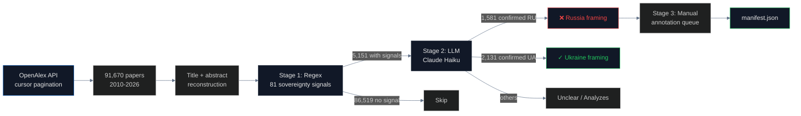

# Academic Framing Audit

## Name
`academic` — Crimea sovereignty framing in peer-reviewed academic literature (OpenAlex 91K papers)

## Why
Academic papers carry **DOIs** — permanent, citable, indexed by Google Scholar, Scopus, and Web of Science. Unlike a media article that can be corrected or retracted, a DOI is forever. When a paper writes "Republic of Crimea, Russia" in its institutional affiliation, that text enters the global scholarly record permanently.

This pipeline scans every Crimea-mentioning paper in OpenAlex (91,670 total) and identifies how it frames sovereignty.

## What
Three-stage pipeline:

1. **Stage 1 (Scan)**: OpenAlex cursor pagination through queries `Crimea`, `Simferopol`, `Sevastopol`, `Yalta`, `Kerch` → 91,670 papers
2. **Stage 2 (Regex)**: 81 sovereignty signals on title + abstract → 5,151 with signals
3. **Stage 3 (LLM)**: Claude Haiku verifies all 5,151 → 1,581 confirmed Russia, 2,131 confirmed Ukraine

## How



## Run

```bash
cd pipelines/academic
uv sync
ANTHROPIC_API_KEY=... uv run scan.py
```

## Results

| Stage | Count |
|---|---|
| OpenAlex papers scanned | 91,670 |
| With sovereignty signals (regex) | 5,151 |
| **LLM-confirmed Russia framing** | **1,581** |
| LLM-confirmed Ukraine framing | 2,131 |
| Unclear / analyzes | 1,439 |

**Regex precision**: 84.4% for Russia-flagged papers (much higher than media's 60.5%)
**Why**: Academic usage of "Republic of Crimea" is overwhelmingly genuine — not quotation. Authors writing "Research conducted in the Republic of Crimea, Russian Federation" mean it.

## Conclusions

The numbers tell a different story than media:

- **Russia-framing peaked at 58% in 2021** — before the full-scale invasion
- Stabilized at **42–44% post-invasion** — high and persistent
- **Western publishers** (IOP, EDP Sciences, Wiley, Springer, Elsevier) all host violating papers
- **The papers are mundane**: viticulture, ecology, medicine, archaeology — not political science

The mechanism: a Russian researcher submits a paper about grape cultivation in Yalta. They list their affiliation as "Magarach Institute of Viticulture and Winemaking, Republic of Crimea, Russia." The paper passes peer review, gets a DOI, and is indexed by Google Scholar. **No editor, no reviewer, no indexing service catches the sovereignty claim** — it's metadata, not argument.

## Findings

1. **1,581 LLM-verified Russia-framing papers** in OpenAlex (out of 91,670 scanned)
2. **Russia framing peaked at 58%** in 2021 of papers with sovereignty signals
3. **Western Q1 publishers hosting violations**:
   - **Wiley** (h-index 420): Water Resources — 6 papers
   - **IOP Publishing** (h-index 76-92): Conference Series — 32 papers across 3 series
   - **EDP Sciences**: E3S Web (17), SHS Web (7), BIO Web (9)
   - **Elsevier SSRN**: 6 papers including "The Reunification of Crimea and Sevastopol with the Russian Federation"
4. **84.4% regex precision** for Russia-labeled papers — much higher than media (60.5%)
5. **The "Republic of Crimea" signal is strong**: 88.6% of papers using this phrase as a location label are genuine endorsements
6. **88% of papers are mundane science** — viticulture, ecology, medicine — not political advocacy
7. **CrossRef, Scopus, Web of Science** do not validate sovereignty claims in metadata

## Limitations

- OpenAlex coverage may miss papers not yet indexed (especially recent 2026 publications)
- Abstract reconstruction from inverted index can have errors
- LLM verification covers all 5,151 flagged papers, but the 86K "no_signal" papers are not LLM-verified (false negatives possible)
- Manual annotation of all 1,581 Russia-confirmed papers is in progress

## Sources

- OpenAlex API: https://api.openalex.org/works
- 81 sovereignty signals: `_shared/sovereignty_signals.py`
- LLM verification: Claude Haiku
