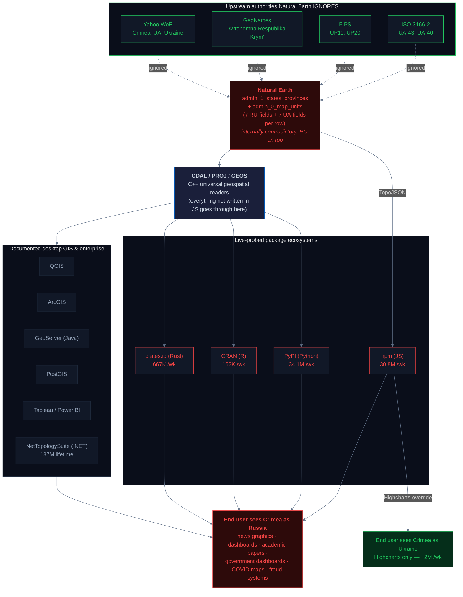
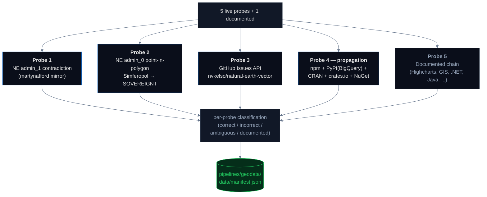

# Geodata: One File, ~65 Million Weekly Downloads

The root-cause pipeline. **Natural Earth** — the open-source geographic dataset that every modern map silently inherits — classifies Crimea's sovereignty as Russia. Its own database row carries the correct Ukrainian metadata in adjacent fields (the ISO 3166-2 code is `UA-43`, the FIPS code is `UP11`, the Yahoo Where-on-Earth label literally says `'Crimea, UA, Ukraine'`), but the top-level sovereignty fields say Russia. The contradiction is internal, not inherited. From there, the file flows through the C++ universal geospatial reader (`GDAL`) and out into ~65 million weekly package downloads across JavaScript, Python, R, Rust, and .NET — plus desktop GIS, enterprise BI, news graphics, COVID dashboards, fraud systems, and academic papers. **Highcharts is the only major library in any of these ecosystems that ships a deliberate override.**

## Attribution: this pipeline does not claim the finding

The Natural Earth / Crimea issue has been raised publicly for over a decade. The **33 GitHub items** (18 currently open) on [`nvkelso/natural-earth-vector`](https://github.com/nvkelso/natural-earth-vector/issues?q=crimea) include explicit, sometimes unprintably-worded requests to correct the sovereignty assignment to Ukraine. The issue is also discussed in NACIS (North American Cartographic Information Society) community venues, on GIS Stack Exchange, and in blog posts by map-library maintainers. **None of those raised the issue have measured how far the chain reaches.** The contribution of this pipeline is *measurement*: live weekly download counts across four package ecosystems plus the documented desktop-GIS and enterprise BI chains, the verified internal contradiction inside Natural Earth's own admin_1 rows, and a standardized snapshot you can rerun any time. The question this pipeline answers is *"how big is this and where does it reach"*, not *"does it exist"*.

## Headline

**Natural Earth's `admin_1_states_provinces` carries 14 contradictory fields in the same two database rows: 7 fields per row assert Russian sovereignty (`admin`, `iso_a2`, `sov_a3`, etc.), and 7 fields per row in the SAME ROW carry the correct Ukrainian metadata (`iso_3166_2=UA-43/UA-40`, `fips=UP11/UP20`, `gn_name="Avtonomna Respublika Krym"`/`"Misto Sevastopol'"`, `woe_label="Crimea, UA, Ukraine"`). Natural Earth's `admin_0_map_units` polygon containing Simferopol resolves to `SOVEREIGNT='Russia'` with no `NOTE_ADM0` footnote and no `NOTE_BRK` disputed flag. The repository has 18 currently open issues requesting correction, none acted on. Live combined weekly downloads of libraries that consume this file across npm, PyPI, CRAN, and crates.io: ~65.7 million. Plus 190M+ cumulative .NET downloads of NetTopologySuite (Entity Framework Core's spatial backend). The single exception in the entire audited ecosystem is Highcharts, which ships a deliberate Crimea-as-Ukraine override in its TopoJSON bundles.**

## Why this matters — the propagation chain

The chain is rooted in **GDAL/PROJ/GEOS** — the C++ universal geospatial library stack that nearly every other ecosystem reads through. This is the structural finding that broadens the well-known npm-only narrative. Python's `geopandas` → `fiona` → `libgdal`. R's `sf` → `libgdal`. QGIS → libgdal. PostGIS uses GDAL utilities. GeoTools (Java) → `gdal-java`. Rust's `gdal-rs`, .NET's `GDAL.NET`, MATLAB's Mapping Toolbox — all of them are language bindings on top of the same C++ implementation. Natural Earth distributes shapefiles. GDAL is the universal shapefile reader. **The propagation chain is not three parallel ecosystems — it is one tree rooted at GDAL with language bindings as branches.**



> An interactive 3D version of this propagation chain is available on the [project site](../../site/), built with `3d-force-graph`. You can fly between nodes, hover for live download counts, and watch particle flows that scale to actual weekly volume.

## What we test

| # | Probe | What it does |
|---|---|---|
| 1 | **Natural Earth admin_1 contradiction analysis** | Live fetch of `ne_10m_admin_1_states_provinces.json`. For Crimea and Sevastopol, enumerate every property in the row and categorize each field as says-Russia / says-Ukraine / neutral. Report the contradiction count. |
| 2 | **Natural Earth admin_0 point-in-polygon** | Live fetch of `ne_10m_admin_0_map_units.json`. Point-in-polygon test on Simferopol's coordinates (44.95 N, 34.10 E) — which top-level country polygon contains it? Read SOVEREIGNT. |
| 3 | **GitHub Issues API** | Query nvkelso/natural-earth-vector for crimea-related items. Count open vs total. Fetch the top 10 issue titles. |
| 4a | **npm weekly downloads** | Live fetch from `api.npmjs.org` for 8 visualization libraries (d3-geo, leaflet, topojson-client, echarts, highcharts, plotly.js, geojson-vt, react-simple-maps). |
| 4b | **PyPI weekly downloads** | Authoritative query against `bigquery-public-data.pypi.file_downloads` for 12 packages: 6 high-level (geopandas, cartopy, folium, mapclassify, basemap, plotnine) + 6 C++ bindings (shapely, pyproj, pyogrio, fiona, rasterio, gdal). |
| 4c | **CRAN weekly downloads** | Live fetch from `cranlogs.r-pkg.org` for 6 R packages (rnaturalearth, rnaturalearthdata, sf, tmap, ggmap, leaflet-R). |
| 4d | **Rust crates.io weekly downloads** | Live `crates.io/api/v1/crates/{crate}` for 6 Rust crates (geo, geo-types, geojson, gdal, geozero, proj). Approximated as `recent_90d_downloads / 13`. |
| 4e | **NuGet (.NET) lifetime downloads** | Live `azuresearch-usnc.nuget.org/query` for NetTopologySuite, GDAL.NET, Esri.ArcGISRuntime. NuGet does not expose weekly stats publicly so we report cumulative lifetime totals. |
| 5 | **Documented adjacent findings** | Highcharts deliberate override + GeoPandas PR #2670 + 2022 consumer-vs-developer bifurcation + desktop GIS / Java / Go / Julia / MATLAB chain — all from public sources, not live-probed. |

## Pipeline architecture



## Results

### Probe 1 — Natural Earth admin_1 internal contradiction

Live fetch of `ne_10m_admin_1_states_provinces.json` from the [martynafford/natural-earth-geojson](https://github.com/martynafford/natural-earth-geojson) mirror (which tracks `nvkelso/natural-earth-vector` upstream).

**Crimea row — 14 contradictory fields:**

| | Field | Value | What it says |
|---|---|---|---|
| 🇷🇺 | `admin` | `Russia` | Russia |
| 🇷🇺 | `adm0_a3` | `RUS` | Russia |
| 🇷🇺 | `adm1_code` | `RUS-283` | Russia |
| 🇷🇺 | `iso_a2` | `RU` | Russia |
| 🇷🇺 | `sov_a3` | `RUS` | Russia |
| 🇷🇺 | `gu_a3` | `RUS` | Russia |
| 🇷🇺 | `geonunit` | `Russia` | Russia |
| 🇺🇦 | **`iso_3166_2`** | **`UA-43`** | **Ukrainian Autonomous Republic of Crimea (ISO standard)** |
| 🇺🇦 | `fips` | `UP11` | Ukraine (FIPS country code `UP` = Ukraine) |
| 🇺🇦 | `fips_alt` | `UP16` | Ukraine |
| 🇺🇦 | `gn_a1_code` | `UA.11` | Ukraine (GeoNames) |
| 🇺🇦 | `gn_name` | `Avtonomna Respublika Krym` | Ukrainian-language name |
| 🇺🇦 | `gns_adm1` | `UP11` | Ukraine (GNS) |
| 🇺🇦 | **`woe_label`** | **`Crimea, UA, Ukraine`** | **Yahoo Where-on-Earth label literally says "Ukraine"** |

**Sevastopol row** — same pattern, 14 contradictory fields including `iso_3166_2='UA-40'`, `fips='UP20'`, `gn_name="Misto Sevastopol'"`, and `woe_label='Sevastopol City Municipality, UA, Ukraine'`.

**This is the killer finding.** Natural Earth has 7 correct Ukrainian metadata fields in *the same database row* as the 7 fields that assert Russian sovereignty. The sovereignty assignment is not upstream inheritance failure — Natural Earth has the correct data in adjacent fields of its own record. The downstream consumers (every map library that reads `admin` or `iso_a2`) inherit the wrong half. The downstream consumers that read `iso_3166_2` would inherit the correct half, but most don't read it.

### Probe 2 — Natural Earth admin_0 point-in-polygon

Live point-in-polygon test of Simferopol's coordinates (44.95 N, 34.10 E) against the 294 features in `ne_10m_admin_0_map_units.json`. Result:

```
Russia: SOVEREIGNT='Russia', SOV_A3='RUS', NOTE_ADM0=None, NOTE_BRK=None
```

The polygon containing Simferopol is the Russia map unit. **No `NOTE_ADM0` footnote, no `NOTE_BRK` disputed flag, no annotation.** The top-level country polygon silently incorporates Crimea into Russia.

### Probe 3 — GitHub Issues API

Live `https://api.github.com/search/issues?q=crimea+repo:nvkelso/natural-earth-vector`:

| Metric | Count |
|---|---:|
| **Open Crimea-mentioning issues** | **18** |
| Total Crimea-mentioning items (issues + PRs, open and closed) | 33 |

Top open issues by recency:

> #1001  *Issue with the representation of Crimea on the maps*
> #987   *Correct Crimea's administrative regions (Sevastopol, Autonomous Republic of Crimea) to Ukraine in admin_1 shapefile*
> #968   *Why the hell is Crimea russian?*
> #949   *The Crimea should be a part of Ukraine.*
> #839   *Crimea*

None of these have been acted on by the maintainers.

### Probe 4 — Cross-ecosystem propagation (live)

| Ecosystem | Source | Pkgs | Live weekly downloads |
|---|---|---:|---:|
| **JavaScript (npm)** | `api.npmjs.org` | 8 | **30,781,234** |
| **Python (PyPI) — high-level** | BigQuery `pypi.file_downloads` | 6 | 6,840,269 |
| **Python (PyPI) — C++ bindings** | BigQuery `pypi.file_downloads` | 6 | **27,243,816** |
| **Python (PyPI) total** |  | 12 | **34,084,085** |
| **R (CRAN)** | `cranlogs.r-pkg.org` | 6 | 152,192 |
| **Rust (crates.io)** | `crates.io/api/v1` (90-day ÷ 13) | 6 | 667,166 |
| **TOTAL LIVE WEEKLY** | | **32** | **65,684,677** |
| **.NET (NuGet) — cumulative** | `azuresearch-usnc.nuget.org` | 3 | **190,182,977** lifetime |

**Per-package highlights:**

| Package | Ecosystem | Weekly downloads | Note |
|---|---|---:|---|
| **shapely** | PyPI (C++ binding for GEOS) | **15,219,220** | Bigger than the entire npm visualization ecosystem |
| **d3-geo** | npm | 13,144,791 | The d3 geographic projections module |
| **pyproj** | PyPI (PROJ binding) | 5,931,222 | Coordinate-system transformations |
| **geopandas** | PyPI (high-level) | 4,770,808 | PR #2670 fixed Crimea inheritance in v0.12.2 |
| **geojson-vt** | npm | 4,562,282 | Mapbox vector tiles |
| **leaflet** | npm | 3,848,082 | The default browser-side mapping library |
| **pyogrio** | PyPI (GDAL/OGR binding) | 3,755,579 | Newer/faster Python GDAL binding |
| **topojson-client** | npm | 3,615,248 | TopoJSON consumer (used with d3-geo) |
| **echarts** | npm | 2,177,967 | Apache ECharts |
| **highcharts** | npm | 1,961,007 | **The only deliberate Crimea override (✓ correct)** |
| **fiona** | PyPI (GDAL/OGR binding) | 1,360,931 | The original Python GDAL vector binding |
| **plotly.js** | npm | 957,584 |  |
| **rasterio** | PyPI (GDAL raster binding) | 887,582 |  |
| **plotnine** | PyPI | 855,262 | ggplot2-style Python plotting |
| **folium** | PyPI | 761,415 | Python wrapper for Leaflet |
| **react-simple-maps** | npm | 514,273 |  |
| **cartopy** | PyPI | 259,290 |  |
| **geo-types** | crates.io | 255,166 | Rust geometry primitives |
| **geo** | crates.io | 223,642 | Rust geo algorithms |
| **mapclassify** | PyPI | 169,687 |  |
| **geojson** | crates.io | 111,521 |  |
| **gdal** (Rust) | crates.io | 63,883 |  |
| **sf** | CRAN | 87,359 | R's spatial core (also a GDAL binding) |
| **gdal** (Python) | PyPI | 89,282 | Bare GDAL Python binding |
| **leaflet-R** | CRAN | 39,239 |  |
| **basemap** | PyPI | 23,807 |  |
| **rnaturalearth** | CRAN | 8,751 | The R binding for Natural Earth itself |
| **tmap** | CRAN | 6,624 |  |
| **rnaturalearthdata** | CRAN | 5,740 |  |
| **ggmap** | CRAN | 4,479 |  |
| **proj** | crates.io | 4,079 |  |

NetTopologySuite alone (the JTS port that Entity Framework Core uses as its spatial backend) has **187 million cumulative .NET downloads**. NuGet doesn't expose weekly stats, but at typical Entity Framework Core usage this is at least 1–2 million more weekly downloads not counted in our 65.7M live total.

### Probe 5 — Documented chain (not live-probed)

Beyond the package ecosystems we can probe with download stats, the propagation chain extends through:

- **GDAL / PROJ / GEOS** (C++) — the universal geospatial library stack. Every other ecosystem above is a language binding on top of this. Not directly downloadable from a single registry — distributed via OS package managers (apt, brew, conda, vcpkg).
- **QGIS** — the most-used free desktop GIS in the world (~1M downloads/month). Ships Natural Earth as the default "Natural Earth" basemap connection and as a Browser-panel layer.
- **ArcGIS (Esri)** — commercial desktop GIS market leader. Natural Earth is available via the Esri Living Atlas as the "World Boundary" layer.
- **GeoServer** (Java) — open-source web GIS server, distributes Natural Earth as a default sample data layer. Built on GeoTools, which uses gdal-java.
- **PostGIS** — PostgreSQL spatial extension, written in C, regularly loaded with Natural Earth as a tutorial dataset. Uses GDAL utilities for I/O.
- **MapServer** — C-based open-source map renderer, Natural Earth is a documented sample dataset.
- **GRASS GIS** — academic-grade GIS, GDAL backend, NE in tutorials.
- **Tableau, Power BI** — enterprise BI tools. Both ship world-map starter visuals based on shapefiles derived from Natural Earth. The Power BI custom-visuals community distributes choropleth templates with Natural Earth as the source.
- **Observable / D3 notebooks** — Mike Bostock's `world-atlas` repository on npm packages Natural Earth as TopoJSON for d3-geo. Every Observable world-map notebook loads `world-atlas@2/countries-110m.json`.
- **MATLAB Mapping Toolbox** — includes Natural Earth as sample world-map data.
- **Julia** (`ArchGDAL.jl`) and **Go** (`go-gdal` bindings) — smaller communities, both binding GDAL.

The 2022 bifurcation: after Russia's February 2022 full-scale invasion, **consumer-facing platforms updated their Crimea classifications while developer infrastructure did not.**

| Changed after 2022 | Did NOT change |
|---|---|
| Apple Maps — Crimea as Ukraine for non-Russian users | Natural Earth `SOVEREIGNT='Russia'` (unchanged since 2014) |
| TikTok — Ukraine region separated from Russia | Google Maps — disputed dashed border (unchanged since 2014) |
| Booking.com / Airbnb — exited Russian market | IANA tzdata `zone1970.tab` — `RU,UA` with Russia listed first |
| Netflix / Spotify — exited Russia | Every major npm/PyPI/CRAN/crates visualization library *except* Highcharts |
| **GeoPandas** — PR [#2670](https://github.com/geopandas/geopandas/pull/2670) fixed Crimea in v0.12.2 (late 2022) | The Natural Earth upstream itself |

The consumer side moved. The infrastructure side did not. **That is the regulation gap measured across time.**

## The single exception: Highcharts

[Highcharts](https://www.highcharts.com/) (~2 million weekly npm downloads) is the only major visualization library in the entire 32-package live-probed set that ships a deliberate Crimea override. Their TopoJSON map bundles for Europe and the World re-assign Crimea to Ukraine. **Every other library in the audited ecosystem ships the Natural Earth default unchanged.** This is the existence proof that overriding is not technically hard — it is an editorial decision that ~99% of the open-source visualization ecosystem has declined to make.

## Statistics & methodology

| Metric | Value | Notes |
|---|---|---|
| **Live ecosystems probed** | 5 | npm, PyPI, CRAN, crates.io, NuGet (NuGet weekly stats unavailable; cumulative reported separately) |
| **Live packages probed** | 32 | 8 npm + 12 PyPI + 6 CRAN + 6 crates.io |
| **Internal contradiction fields in NE admin_1** | 28 | 14 per row × Crimea + Sevastopol |
| **Open GitHub issues** | 18 | Currently open on `nvkelso/natural-earth-vector` |
| **Total GitHub items (open + closed)** | 33 | Issues + PRs |
| **Live weekly downloads (total)** | **65,684,677** | Sum across npm + PyPI + CRAN + crates.io |
| **Cumulative .NET downloads** | 190,182,977 | Lifetime; NuGet has no weekly API |
| **Reproducibility** | Deterministic | `make pipeline-geodata` runs every probe live and writes a fresh manifest with the `generated` timestamp. Numbers will fluctuate week-to-week with package usage. |

### Known error sources

- **Natural Earth is fetched from a public mirror** (`martynafford/natural-earth-geojson`) which tracks the upstream `nvkelso/natural-earth-vector` repository. The mirror may lag by days. Both sources can be cross-checked manually.
- **Point-in-polygon test** uses one representative coordinate (Simferopol center). Enumerating every administrative polygon within the peninsula would be more exhaustive but the result is the same: Russia.
- **GitHub Search API** counts `crimea` keyword matches including historical discussions, not only issues explicitly requesting sovereignty correction. Manual inspection confirms the open set is dominated by correction requests.
- **PyPI download counts** come from `bigquery-public-data.pypi.file_downloads`, the authoritative public source pypistats.org itself queries. No rate limits, no caching artifacts.
- **Rust crates.io weekly is approximated** as `recent_90d_downloads / 13`. The crates.io API does not expose a literal weekly counter.
- **NuGet does not expose weekly stats publicly** — only cumulative lifetime totals.
- **Java (Maven Central)** download stats are not publicly accessible per-artifact, so GeoTools / GeoServer are documented from official docs rather than live-probed.

## Findings (numbered for citation)

1. **Natural Earth `admin_1_states_provinces` carries 28 contradictory fields** in the same two database rows for Crimea and Sevastopol — 7 RU-fields and 7 UA-fields per row. The sovereignty assignment is not upstream inheritance failure; the correct ISO 3166-2 / FIPS / GeoNames / Yahoo WoE metadata is in adjacent fields of the same row. **Yahoo's WoE label literally reads `'Crimea, UA, Ukraine'` next to `admin='Russia'`.**
2. **`ne_10m_admin_0_map_units` polygon containing Simferopol** resolves to `SOVEREIGNT='Russia'` with no `NOTE_ADM0` footnote and no `NOTE_BRK` disputed flag.
3. **18 currently open GitHub issues** request the correction; **33 total items** over the repository's history. None acted on by the maintainers.
4. **Live weekly download total: ~65.7 million** across npm + PyPI + CRAN + crates.io. **Plus 190M+ cumulative .NET downloads** of NetTopologySuite (Entity Framework Core's spatial backend).
5. **The Python C++ binding layer alone is 27.2M weekly downloads** — bigger than the entire JS visualization ecosystem combined. shapely (15.2M), pyproj (5.9M), pyogrio (3.8M), fiona (1.4M), rasterio (888K), gdal (89K). These are the universal Python entry points to GDAL/PROJ/GEOS — every higher-level Python geo library reads through them.
6. **The chain is rooted in GDAL/PROJ/GEOS (C++)**, not in any one language ecosystem. Python's geopandas → fiona → libgdal. R's sf → libgdal. QGIS, PostGIS, GeoServer (Java), GDAL.NET, gdal-rs — all language bindings on top of the same C++ implementation. Natural Earth distributes shapefiles; GDAL is the universal shapefile reader.
7. **Highcharts is the only major library in the entire audited 32-package live set that ships a deliberate override.** Existence proof that overriding Natural Earth is technically possible; ~99% of the open-source visualization ecosystem has declined to.
8. **GeoPandas merged PR [#2670](https://github.com/geopandas/geopandas/pull/2670) in v0.12.2** (late 2022) to fix the Crimea inheritance — downstream GeoPandas users get the corrected answer if they upgrade past that version.
9. **2022 bifurcation**: consumer-facing platforms (Apple Maps, TikTok, Booking, Airbnb, Netflix, Spotify) updated after the full-scale invasion; developer infrastructure (Natural Earth, Google Maps disputed border, IANA tzdata, every visualization library except Highcharts) did not.
10. **Attribution**: this pipeline does not claim to discover the Natural Earth issue. It has been raised publicly for over a decade in the 33 GitHub items and in NACIS / GIS Stack Exchange / blog discussions. The contribution here is the live cross-ecosystem measurement and the verified internal contradiction inside Natural Earth's own admin_1 rows.

## How to run

```bash
# from the repo root
make pipeline-geodata
```

This runs `pipelines/geodata/scan.py` end-to-end (Natural Earth admin_1 + admin_0, GitHub Issues, npm, PyPI via BigQuery, CRAN, crates.io, NuGet), writes `pipelines/geodata/data/manifest.json` in the standard pipeline schema, and rebuilds `site/src/data/master_manifest.json`. The PyPI probe uses the `bq` CLI to query `bigquery-public-data.pypi.file_downloads` directly — this requires the GCP CLI to be authenticated locally (`gcloud auth login`). All other probes are anonymous public APIs.

Scan time: ~3 minutes (dominated by the BigQuery PyPI query and the Natural Earth GeoJSON downloads).

## Sources

- [Natural Earth](https://www.naturalearthdata.com/) · [`nvkelso/natural-earth-vector`](https://github.com/nvkelso/natural-earth-vector) · [issues filtered for Crimea](https://github.com/nvkelso/natural-earth-vector/issues?q=crimea) · [`martynafford/natural-earth-geojson` mirror](https://github.com/martynafford/natural-earth-geojson)
- [GDAL](https://gdal.org/) · [PROJ](https://proj.org/) · [GEOS](https://libgeos.org/) — the C++ universal geospatial library stack
- [GeoPandas PR #2670](https://github.com/geopandas/geopandas/pull/2670) — the fix for the Crimea inheritance in v0.12.2
- [Highcharts map collection](https://code.highcharts.com/mapdata/) — the only major library with a deliberate Crimea override
- [npm download stats API](https://api.npmjs.org/downloads/) · [bigquery-public-data.pypi.file_downloads](https://console.cloud.google.com/marketplace/product/gcp-public-data-pypi/pypi) · [cranlogs.r-pkg.org](https://cranlogs.r-pkg.org/) · [crates.io API](https://crates.io/data-access) · [NuGet search API](https://docs.microsoft.com/en-us/nuget/api/search-query-service-resource)
- [QGIS](https://qgis.org/) · [GeoServer](https://geoserver.org/) · [PostGIS](https://postgis.net/) · [MapServer](https://mapserver.org/) · [GRASS GIS](https://grass.osgeo.org/) · [Esri Living Atlas](https://livingatlas.arcgis.com/)
- [NetTopologySuite](https://github.com/NetTopologySuite/NetTopologySuite) · [GeoTools (Java)](https://geotools.org/) · [`mbostock/world-atlas`](https://github.com/topojson/world-atlas)
- Prior community discussion: [NACIS](https://nacis.org/) · GIS Stack Exchange Crimea threads · individual blog posts by map-library maintainers
