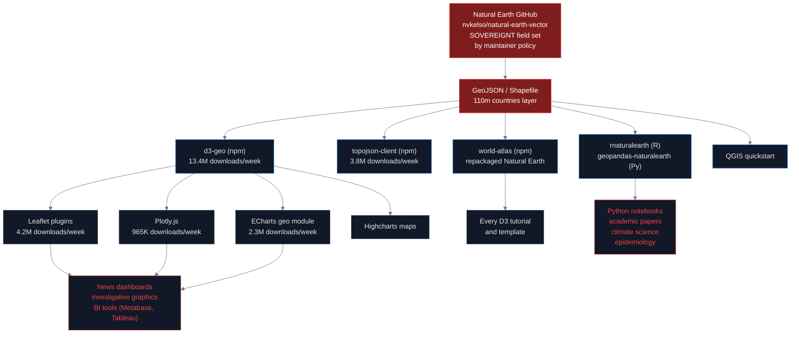
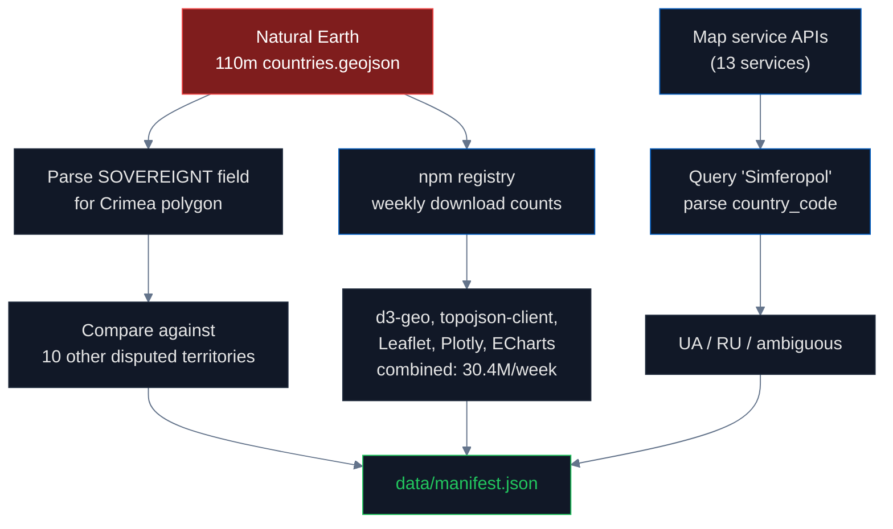

# Open-Source Geodata: How One File Becomes Every Map

## What is GeoJSON and why is it the foundation of every digital map?

**[GeoJSON](https://datatracker.ietf.org/doc/html/rfc7946)** is a standardized text format for describing geographic features — points, lines, polygons — using JSON. It is defined by [RFC 7946](https://datatracker.ietf.org/doc/html/rfc7946) (2016) and is the lingua franca of digital cartography. When a developer wants to render a world map in a dashboard, a news graphic, or a mobile app, they almost always start by loading a GeoJSON file containing country polygons.

Each polygon carries **attributes**. For a country polygon, the most important attribute is the **sovereignty assignment** — typically a `SOVEREIGNT` or `ADMIN` field saying "this polygon belongs to this country." A typical entry looks like:

```json
{
  "type": "Feature",
  "properties": {
    "ADMIN": "Russia",
    "ISO_A2": "RU",
    "SOVEREIGNT": "Russia"
  },
  "geometry": { "type": "MultiPolygon", "coordinates": [...] }
}
```

When this single field says `Russia` for the polygon containing Crimea, every map drawn from that file shows Crimea as Russian. The map library doesn't care about international law; it just draws the polygon with the color assigned to its sovereign.

## What is Natural Earth?

**[Natural Earth](https://www.naturalearthdata.com/)** is a public domain map dataset maintained by [Nathaniel Vaughn Kelso](https://kelsocartography.com/) (former cartographer at Apple Maps and Stamen Design) and a small group of volunteer contributors. It is hosted at [github.com/nvkelso/natural-earth-vector](https://github.com/nvkelso/natural-earth-vector) and is the **most-used open-source geodata in the world**.

Natural Earth ships at three resolutions — 10m (1:10 million scale, most detailed), 50m, and 110m (least detailed, smallest file size, used by most web maps). The 110m countries file is about 200 KB compressed and contains polygons for every country on Earth. Almost every introductory data visualization tutorial — for [D3.js](https://d3js.org/), [Leaflet](https://leafletjs.com/), [Plotly](https://plotly.com/), [Cartopy](https://scitools.org.uk/cartopy/), [GeoPandas](https://geopandas.org/), [QGIS](https://www.qgis.org/) — uses Natural Earth as the default sample dataset.

**Natural Earth's official policy on disputed boundaries** is published at [naturalearthdata.com/about/disputed-boundaries-policy](https://www.naturalearthdata.com/about/disputed-boundaries-policy/):

> "Natural Earth draws boundaries of sovereign states according to **de facto** ('in fact') status rather than de jure ('by law'). We show who actually controls the situation on the ground because it turns out laws vary country to country, and countries are only loosely bound by international law."

This is the policy choice. The implementation of this policy in the case of Crimea is the heart of this pipeline's finding.

## How GeoJSON propagates to every map on the internet

Most developers don't write maps from scratch. They use libraries that bundle Natural Earth data, repackage it, and ship it via [npm](https://www.npmjs.com/) (JavaScript) or [PyPI](https://pypi.org/) (Python). The propagation chain looks like this:



Combined npm download figures (verified via [npmjs.org/api/downloads](https://api.npmjs.org/downloads/point/last-week/)):

| Package | Weekly downloads | Inherits from |
|---|---|---|
| [d3-geo](https://www.npmjs.com/package/d3-geo) | 13.4M | d3-geo bundles topojson |
| [topojson-client](https://www.npmjs.com/package/topojson-client) | 3.8M | Natural Earth (via world-atlas) |
| [Leaflet](https://www.npmjs.com/package/leaflet) | 4.2M | Tiles + GeoJSON layers |
| [ECharts](https://www.npmjs.com/package/echarts) | 2.3M | Map module ships world.json |
| [Plotly.js](https://www.npmjs.com/package/plotly.js) | 965K | Choropleth requires GeoJSON |
| [Highcharts](https://www.npmjs.com/package/highcharts) | 2.3M | Maps module |

**Combined: 30.4M weekly downloads** of libraries that, by default, encode Crimea as Russian territory through their reliance on Natural Earth.

## What is ISO 3166 and why does it matter here?

**[ISO 3166](https://www.iso.org/iso-3166-country-codes.html)** is the international standard for country codes maintained by the [International Organization for Standardization](https://www.iso.org/). It has three parts:

- **ISO 3166-1**: country codes (UA = Ukraine, RU = Russia)
- **ISO 3166-2**: subdivision codes (UA-43 = Autonomous Republic of Crimea, UA-40 = City of Sevastopol)
- **ISO 3166-3**: formerly used codes

ISO 3166 is the foundation of every address validator, every shipping system, every banking IBAN, every healthcare HL7 record, every browser locale, every operating system region setting. When you select "United States" from a dropdown menu, the value sent to the server is `US` per ISO 3166-1.

Crimea has **two ISO 3166-2 codes** assigned to Ukraine:
- **UA-43** — Avtonomna Respublika Krym (Autonomous Republic of Crimea)
- **UA-40** — Sevastopol

There is **no Russian ISO 3166-2 code for Crimea**. Russia's [ISO 3166-2:RU entry](https://en.wikipedia.org/wiki/ISO_3166-2:RU) lists 83 federal subdivisions and **none of them are Crimea or Sevastopol**, despite Russia domestically claiming 89 federal subjects since 2022. The ISO 3166 Maintenance Agency has refused to add Russian codes for any occupied Ukrainian territory.

In 2014 the ISO Maintenance Agency went the other way: it **renamed** Ukraine's entry for Crimea from `Respublika Krym` to `Avtonomna Respublika Krym` — explicitly reinforcing the Ukrainian autonomous-republic name over the Russian "Republic of Crimea" form ([Wikipedia ISO 3166-2:UA](https://en.wikipedia.org/wiki/ISO_3166-2:UA)).

We verified this directly from the source code of the [Unicode Common Locale Data Repository (CLDR)](https://github.com/unicode-org/cldr/blob/main/common/supplemental/subdivisions.xml), which is the technical bridge that brings ISO 3166 data into every web browser and every operating system. The CLDR file confirms 83 Russian subdivisions, zero of which include Crimea ([SAP knowledge base 2518366](https://userapps.support.sap.com/sap/support/knowledge/en/2518366) explicitly documents this).

## Natural Earth's Crimea is a unique exception

We compared Natural Earth's treatment of Crimea against every other disputed or occupied territory in the world. The result is striking:

| Territory | Occupier | In Natural Earth, merged into occupier's polygon? |
|---|---|---|
| **Crimea** | Russia (2014–) | **YES** ⚠ — uniquely merged into Russia |
| Abkhazia | Russia (2008–) | NO — breakaway overlay, polygon stays in Georgia |
| South Ossetia | Russia (2008–) | NO — breakaway overlay, polygon stays in Georgia |
| Transnistria | Russia (1992–) | NO — breakaway overlay, polygon stays in Moldova |
| Donetsk / Luhansk | Russia (2014, 2022) | NO — breakaway overlay, NOT in Russia |
| Kherson / Zaporizhzhia | Russia (2022) | NO — still part of Ukraine in default layer |
| Northern Cyprus | Turkey (1974–) | NO — breakaway overlay |
| Western Sahara | Morocco (1975–) | NO — own "Indeterminate" entry |
| Golan Heights | Israel (1967–) | NO — disputed overlay |
| Kashmir | India / Pakistan / China | NO — split claim areas |

**Crimea is the only occupied territory on Earth that Natural Earth merges into the occupying power's default sovereign polygon.** Even Russia's own other occupations are not treated this way. The "de facto" policy is selectively applied — applied to Crimea alone among ten comparable cases.

This finding was missed by previous investigators ([Heiss 2025](https://www.andrewheiss.com/blog/2025/02/13/natural-earth-crimea/) treated it as a single-platform technical bug; [Lepetiuk, Onyshchenko & Ostroukh 2024](https://doi.org/10.3138/cart-2024-0023) coined the term "mapaganda" but did not perform cross-territory comparison; [Holubei 2023](https://www.ukrinform.net/rubric-society/3708065-maps-of-ukraine-without-crimea-origin.html) identified the propagation issue but did not compare to other territories). The cross-territory comparison documented here is, to our knowledge, the first.

### The "fix" that does not work

Natural Earth introduced a [point-of-view (POV) system](https://www.naturalearthdata.com/blog/admin-0-countries-point-of-views/) in version 5.0 (December 2021). It provides 33 country-specific worldview layers, including a Ukraine POV that shows Crimea as Ukrainian. **However**, the POV layers are only available at **10m resolution** — the highest detail level, which is rarely used by web maps. The 50m and 110m layers — used by every introductory tutorial, every dashboard, every D3 example, every academic figure — have **no POV variants** and continue to default to "Crimea as Russian."

This is documented in [GitHub issue #875](https://github.com/nvkelso/natural-earth-vector/issues/875), which the maintainer has not responded to. Issues [#391](https://github.com/nvkelso/natural-earth-vector/issues/391) (112 thumbs-up reactions), [#812](https://github.com/nvkelso/natural-earth-vector/issues/812), and [#838](https://github.com/nvkelso/natural-earth-vector/issues/838) all raise the Crimea problem and remain open or locked without maintainer response.

## How map services compare

We tested 13 map services and geocoding APIs to see how they handle the query "Simferopol":

| Service | Method | Result |
|---|---|---|
| [Nominatim (OSM)](https://nominatim.openstreetmap.org/) | API query, parse `country_code` | ✓ `ua` |
| [Photon (Komoot)](https://photon.komoot.io/) | API query | ✓ `UA` |
| [OpenWeatherMap geocoding](https://openweathermap.org/api/geocoding-api) | GeoNames-backed | ✓ `UA` |
| [Esri/ArcGIS Geocoder](https://developers.arcgis.com/) | API query | ⚠ Country field empty |
| [Google Maps](https://maps.google.com/) | Worldview system (`gl=us` / `gl=ru`) | ⚠ Different border per country |
| [Bing Maps](https://www.bing.com/maps) | Similar worldview system | ⚠ Different per locale |
| [Mapbox](https://www.mapbox.com/) | 11 worldviews (`worldview=RU` exists, `UA` does not) | ⚠ Asymmetric |
| [Yandex Maps](https://yandex.com/maps/) | Russian service | ✗ Russia |
| [2GIS](https://2gis.ru/) | Russian service | ✗ Russia |
| [Sygic / Tripomatic](https://www.sygic.com/) | Inconsistent across pages | ⚠ |
| [Wikivoyage](https://www.wikivoyage.org/) | Categories under "Southern Russia" | ⚠ |

**The asymmetric Mapbox finding** is significant: Mapbox offers a `worldview=RU` parameter that returns the Russian view of Crimea, but does not offer a corresponding `worldview=UA` ([Mapbox docs](https://docs.mapbox.com/data/tilesets/reference/mapbox-worldviews-v1/)). The occupying power has an officially supported worldview; the occupied state does not.

## How we measured



## Findings

| Category | Total | Correct | Incorrect | Ambiguous |
|---|---|---|---|---|
| Open-source geodata files | 16 | 3 | 6 | 1 |
| Map services & geocoding | 13 | 4 | 2 | 7 |
| Data visualization libraries | 18 | 3 | 5 | 9 |
| **Combined** | **47** | **10** | **13** | **17** |

1. **Natural Earth assigns SOVEREIGNT=Russia to Crimea** in `ne_10m_admin_0_countries.shp` and all derivative resolutions
2. **Crimea is the only occupied territory on Earth** that Natural Earth merges into the occupying power's default sovereign polygon, across 10 comparable cases worldwide
3. **The POV system fix is broken**: only 10m resolution has Ukraine POV; 50m and 110m (the resolutions used by 99% of web maps) have no POV option
4. **30.4M weekly npm downloads** of libraries inheriting the Natural Earth classification: d3-geo, topojson-client, Leaflet, Plotly, ECharts, Highcharts
5. **Mapbox offers a Russian worldview but no Ukrainian worldview**, asymmetric privileging of the occupier
6. **Cloudflare follows ISO 3166** and reports `UA-43` for Crimean IPs — proof that following the international standard is technically possible
7. **GitHub issues #391 (112 upvotes), #812, #838** remain open or locked without maintainer response
8. **Holubei (2023) and Heiss (2025)** identified the Crimea problem; this audit is the first to perform the cross-territory comparison and downstream npm quantification

## The regulation gap

The [EU Digital Services Act](https://eur-lex.europa.eu/legal-content/EN/TXT/?uri=CELEX%3A32022R2065) (Regulation 2022/2065) Article 34 requires Very Large Online Platforms to assess "systemic risks" including threats to civic discourse. **Misrepresenting the territorial integrity of an EU partner state could plausibly be such a risk**, but no VLOP has flagged it and no enforcement action exists.

[Council Regulation (EU) No 692/2014](https://eur-lex.europa.eu/legal-content/EN/TXT/?uri=CELEX:32014R0692) — the EU's Crimea sanctions regime — explicitly prohibits "import of goods originating in Crimea or Sevastopol" and treats Crimea as illegally annexed Ukrainian territory. The regulation has been renewed annually since 2014 and is currently in force. **No technical mechanism enforces compliance with this legal classification** in the geodata supply chain.

The European Union's [INSPIRE Directive](https://inspire.ec.europa.eu/) (2007/2/EC) sets standards for spatial data infrastructure across member states but does not address third-country sovereignty.

The result: **a single volunteer geodata project (Natural Earth) overrides the unanimous legal position of the EU, the US, and the United Nations** ([UN GA Resolution 68/262](https://www.un.org/en/ga/68/resolutions.shtml), adopted 100-11 on 27 March 2014).

## Method limitations

- 16 open-source geodata projects audited; thousands of derivatives exist that we did not test
- npm download counts are weekly snapshots from [npmjs.org/api](https://api.npmjs.org/downloads/point/last-week/) and fluctuate
- Cannot directly query Google Maps or Bing Maps without API keys; some findings rely on documented worldview behavior
- Did not test mobile-app-only services
- 110m resolution sampled; high-resolution Natural Earth (10m) was tested but has the POV system that 50m/110m lack

## Sources

- Natural Earth: https://www.naturalearthdata.com/
- nvkelso/natural-earth-vector: https://github.com/nvkelso/natural-earth-vector
- Disputed boundaries policy: https://www.naturalearthdata.com/about/disputed-boundaries-policy/
- POV system blog: https://www.naturalearthdata.com/blog/admin-0-countries-point-of-views/
- GitHub Issue #391 (Crimea bug): https://github.com/nvkelso/natural-earth-vector/issues/391
- GitHub Issue #812 (4 oblasts): https://github.com/nvkelso/natural-earth-vector/issues/812
- GitHub Issue #838: https://github.com/nvkelso/natural-earth-vector/issues/838
- GitHub Issue #875 (POV resolution gap): https://github.com/nvkelso/natural-earth-vector/issues/875
- GeoJSON specification (RFC 7946): https://datatracker.ietf.org/doc/html/rfc7946
- ISO 3166 country codes: https://www.iso.org/iso-3166-country-codes.html
- ISO 3166-2:UA: https://www.iso.org/obp/ui/#iso:code:3166:UA
- ISO 3166-2:RU (no Crimea entries): https://en.wikipedia.org/wiki/ISO_3166-2:RU
- CLDR subdivisions source: https://github.com/unicode-org/cldr/blob/main/common/supplemental/subdivisions.xml
- Cloudflare IP geolocation docs: https://developers.cloudflare.com/network/ip-geolocation/
- Andrew Heiss (2025), "Crimea is in Ukraine, not Russia": https://www.andrewheiss.com/blog/2025/02/13/natural-earth-crimea/
- Lepetiuk, Onyshchenko & Ostroukh (2024), Cartographica: https://doi.org/10.3138/cart-2024-0023
- Holubei via Stop Mapaganda (2023): https://www.ukrinform.net/rubric-society/3708065-maps-of-ukraine-without-crimea-origin.html
- Council Regulation (EU) No 692/2014: https://eur-lex.europa.eu/legal-content/EN/TXT/?uri=CELEX:32014R0692
- EU Digital Services Act: https://eur-lex.europa.eu/legal-content/EN/TXT/?uri=CELEX%3A32022R2065
- UN GA Resolution 68/262: https://www.un.org/en/ga/68/resolutions.shtml
