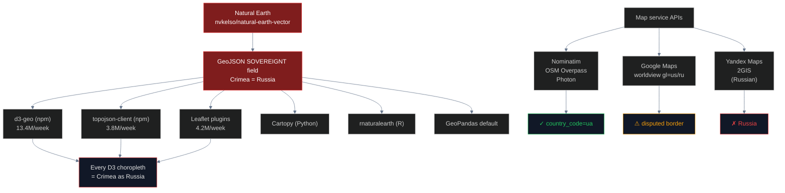

# Geodata Audit (Natural Earth + Map Services + Data Viz)

## Name
`geodata` — Open-source geographic datasets, map APIs, and visualization libraries

## Why
**This pipeline contains the paper's headline finding.** Natural Earth — a single volunteer-maintained dataset — assigns Crimea to Russia and propagates to **30M+ npm downloads per week** via D3, Leaflet, Plotly, ECharts. Crimea is also the *only* occupied territory worldwide that Natural Earth merges into the occupier's default polygon. Abkhazia, South Ossetia, Donetsk, Northern Cyprus, Western Sahara, Golan Heights — none receive this treatment.

## What
Audits 47 platforms across three subcategories:

1. **Open-source geodata** (16) — Natural Earth, GADM, geoBoundaries, OSM, mledoze/countries, iso3166-2-db
2. **Map services** (13) — Yandex, Google, Bing, Mapbox, Nominatim, Photon, Esri, Wikivoyage
3. **Data visualization libraries** (18) — D3, Leaflet, Plotly, ECharts, Highcharts, Cartopy, rnaturalearth, spData

## How



**Method**:
- Direct GitHub source download for geodata files (GeoJSON, shapefile)
- Polygon containment test for SOVEREIGNT field on Crimea polygon
- API queries to map services for `q=Simferopol`
- npm dependency tree analysis for downstream propagation

## Run

```bash
cd pipelines/geodata
uv sync
uv run scan.py
```

## Results

| Subcategory | Total | Correct | Incorrect | Ambiguous |
|---|---|---|---|---|
| Open-source geodata | 16 | 3 | 6 | 1 |
| Map services | 13 | 4 | 2 | 7 |
| Data visualization | 18 | 3 | 5 | 9 |

**Total**: 47 platforms, 10 correct, 13 incorrect, 17 ambiguous

## Conclusions

### The Natural Earth Inconsistency (the paper headline)

Natural Earth claims a "de facto" sovereignty policy. But applied across 10 disputed territories worldwide:

| Territory | Occupier | Merged into occupier? |
|---|---|---|
| **Crimea** | Russia | **YES** ⚠ |
| Abkhazia | Russia | NO (overlay) |
| South Ossetia | Russia | NO (overlay) |
| Transnistria | Russia | NO (overlay) |
| Donetsk/Luhansk | Russia | NO (breakaway) |
| Kherson/Zaporizhzhia | Russia | NO (still UA) |
| Northern Cyprus | Turkey | NO (overlay) |
| Western Sahara | Morocco | NO (Indeterminate) |
| Golan Heights | Israel | NO (disputed overlay) |
| Kashmir | India/Pak/China | NO (split) |

**Crimea is the only occupied territory on Earth** that Natural Earth merges into the occupying power's default polygon. The "de facto" policy is selectively applied.

### The POV system is broken

Natural Earth's "point of view" system (introduced v5.0 in Dec 2021) was supposed to fix this. Ukraine POV exists — but **only at 10m resolution**. The 50m and 110m datasets that 99% of downstream tools use have no POV option. Default = Crimea as Russia.

### The propagation chain

```
Natural Earth GeoJSON → d3-geo (13.4M/wk) → every D3 map
                     → Leaflet plugins (4.2M/wk)
                     → topojson-client (3.8M/wk)
                     → ECharts, Plotly, Highcharts (5.5M/wk combined)
                     → rnaturalearth, Cartopy, spData (R/Python)
                     → QGIS quickstart
                     → Metabase, Tableau templates
```

Combined: **30.4M weekly downloads** affected by one dataset's choice.

## Findings

1. **Natural Earth assigns SOVEREIGNT=Russia** to Crimea polygon in `ne_10m_admin_0_countries.shp` and all derivatives
2. **Crimea is uniquely merged** into the occupier's polygon — no other occupied territory worldwide receives this treatment
3. **POV system limited to 10m resolution** — 50m and 110m have no Ukraine POV
4. **GitHub issue #391** (112 upvotes), #812, #838 — open or locked without maintainer response
5. **30.4M weekly npm downloads** of libraries inheriting the Natural Earth classification
6. **GeoPandas, rnaturalearth, spData** all use Natural Earth as default
7. **Map services split**: Nominatim/OSM Overpass correct, Yandex/2GIS incorrect, Google/Bing/Mapbox use ambiguous "worldview" systems
8. **Mapbox has Russian worldview but no Ukrainian** — asymmetric privileging of occupier
9. **Holubei (2023) and Heiss (2025)** identified the Crimea problem; this audit quantifies downstream impact
10. **Andrew Heiss workaround**: manual sf::st_union to merge Crimea polygon into Ukraine in R

## Limitations

- Cannot test every downstream consumer of Natural Earth (thousands of D3 tutorials, dashboards)
- npm download counts fluctuate; weekly snapshots from npmjs API
- Map service APIs sometimes block automated queries (Google requires API key)
- 50m/110m resolution datasets are sampled, not exhaustively tested

## Sources

- Natural Earth: https://www.naturalearthdata.com/
- nvkelso/natural-earth-vector: https://github.com/nvkelso/natural-earth-vector
- Issue #391 (Crimea bug): https://github.com/nvkelso/natural-earth-vector/issues/391
- Heiss (2025): https://www.andrewheiss.com/blog/2025/02/13/natural-earth-crimea/
- Holubei (2023) Stop Mapaganda: https://www.ukrinform.net/rubric-society/3708065-maps-of-ukraine-without-crimea-origin.html
- Lepetiuk et al. (2024) Cartographica: https://doi.org/10.3138/cart-2024-0023
