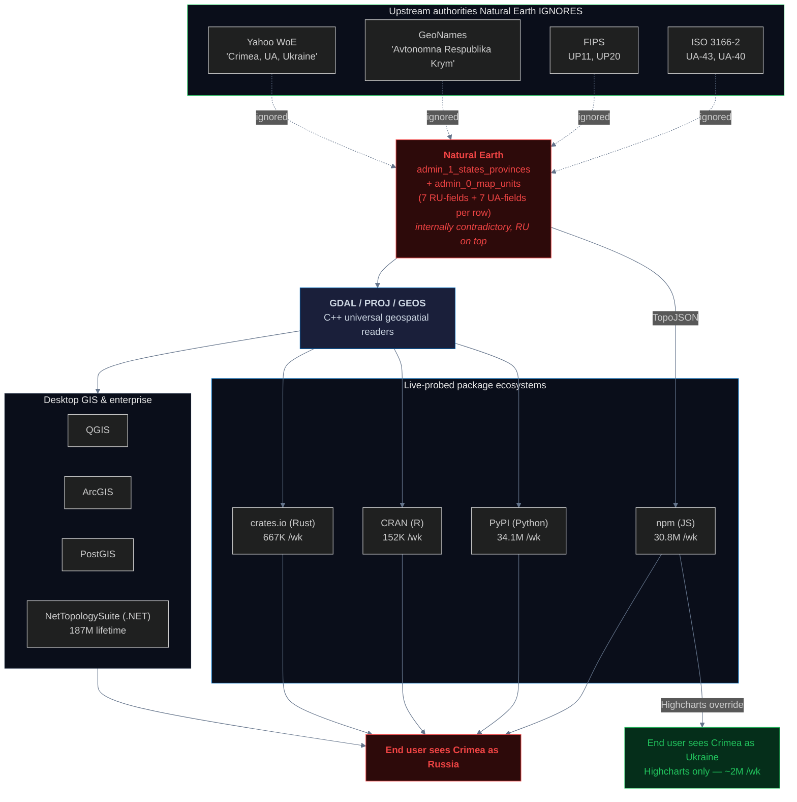

# Geodata: One File, ~65 Million Weekly Downloads

**Natural Earth** classifies Crimea as Russia. Its own database rows carry the correct Ukrainian metadata in adjacent fields (`iso_3166_2=UA-43`, `fips=UP11`, `woe_label='Crimea, UA, Ukraine'`), but the top-level sovereignty fields say Russia. The contradiction is internal, not inherited. From there the file flows through GDAL and out into ~65 million weekly package downloads across JS, Python, R, Rust, and .NET. **Highcharts is the only major library that ships a deliberate override.**

## Propagation chain



## Internal contradiction (Crimea row -- 14 fields)

| | Field | Value | Says |
|---|---|---|---|
| RU | `admin` | `Russia` | Russia |
| RU | `adm0_a3` | `RUS` | Russia |
| RU | `iso_a2` | `RU` | Russia |
| RU | `sov_a3` | `RUS` | Russia |
| **UA** | **`iso_3166_2`** | **`UA-43`** | **Ukraine (ISO standard)** |
| **UA** | `fips` | `UP11` | Ukraine |
| **UA** | `gn_name` | `Avtonomna Respublika Krym` | Ukrainian-language name |
| **UA** | **`woe_label`** | **`Crimea, UA, Ukraine`** | **Yahoo WoE literally says "Ukraine"** |

Sevastopol row: same pattern, 14 contradictory fields including `iso_3166_2='UA-40'`.

## Live download counts

| Ecosystem | Packages | Weekly downloads |
|---|---:|---:|
| npm (JS) | 8 | **30,781,234** |
| PyPI (Python) | 12 | **34,084,085** |
| CRAN (R) | 6 | 152,192 |
| crates.io (Rust) | 6 | 667,166 |
| **Total live weekly** | **32** | **65,684,677** |
| .NET (NuGet) cumulative | 3 | 190,182,977 lifetime |

Top packages: shapely 15.2M, d3-geo 13.1M, pyproj 5.9M, geopandas 4.8M, geojson-vt 4.6M, leaflet 3.8M.

## Key findings

1. **28 contradictory fields** in Natural Earth's own rows (7 RU + 7 UA per row, Crimea + Sevastopol)
2. **`admin_0_map_units`** point-in-polygon on Simferopol resolves to `SOVEREIGNT='Russia'` with no footnote or disputed flag
3. **18 open GitHub issues** requesting correction, none acted on (33 total items)
4. **~65.7M live weekly downloads** + 190M+ cumulative .NET downloads
5. **Highcharts is the only override** in the entire 32-package audited set
6. **GeoPandas PR #2670** fixed Crimea inheritance in v0.12.2 (late 2022)
7. **2022 bifurcation**: consumer platforms updated after the invasion; developer infrastructure did not

## How to run

```bash
make pipeline-geodata
```

Runs all probes live (NE admin_1 + admin_0, GitHub Issues, npm, PyPI via BigQuery, CRAN, crates.io, NuGet), writes `pipelines/geodata/data/manifest.json`. PyPI probe requires `gcloud auth login`. Scan time: ~3 minutes.

## Sources

- [Natural Earth](https://www.naturalearthdata.com/) | [GitHub issues](https://github.com/nvkelso/natural-earth-vector/issues?q=crimea) | [martynafford mirror](https://github.com/martynafford/natural-earth-geojson)
- [GDAL](https://gdal.org/) | [PROJ](https://proj.org/) | [GEOS](https://libgeos.org/)
- [GeoPandas PR #2670](https://github.com/geopandas/geopandas/pull/2670) | [Highcharts map collection](https://code.highcharts.com/mapdata/)
- [NetTopologySuite](https://github.com/NetTopologySuite/NetTopologySuite) | [mbostock/world-atlas](https://github.com/topojson/world-atlas)
