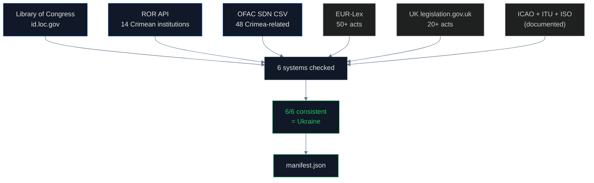

# Institutional Registries & Legislation Audit

## Name
`institutions` — How official institutions, registries, and legislation classify Crimea

## Why
To prove the "regulation gap" thesis, we first need to lock down the **legal/regulatory baseline**. This pipeline shows that **6/6 official systems unanimously classify Crimea as Ukrainian territory**. The gap exists not in law but in geodata projects that bypass law.

This is the "credit where due" pipeline. Governance works where governance exists.

## What
Audits 6 institutional and legal systems:

1. **Library of Congress** (US) — controlled vocabulary, canonical form
2. **ROR** (Research Organization Registry) — Crimean academic institutions
3. **OFAC SDN List** (US Treasury) — sanctions place-of-birth fields
4. **EUR-Lex** — EU legislation on Crimea (Reg 692/2014 + amendments)
5. **UK Legislation** — Crimea-specific acts via legislation.gov.uk
6. **ICAO + ITU + ISO 3166-2** — international standards bodies

## How



## Run

```bash
cd pipelines/institutions
uv sync
uv run scan.py
```

## Results

| System | Classification | Status |
|---|---|---|
| Library of Congress | "Crimea (Ukraine)" canonical form | ✓ |
| LoC subject heading | "Russian occupation, 2014-" | ✓ |
| LoC catalog | 106/150 books under Ukraine, 3 under Russia | ✓ |
| ROR | 13/14 Crimean institutions = UA | ✓ |
| OpenAlex institutions | Same 13/14 = UA | ✓ |
| OFAC SDN | 24/30 Crimean POBs = "Ukraine", 0 "Russia" | ✓ |
| OFAC program title | "Crimea Region of Ukraine" (EO13685) | ✓ |
| EU Reg 692/2014 | "originating in Crimea or Sevastopol" — illegally annexed | ✓ |
| UK legislation | "Russia, Crimea and Sevastopol Sanctions" | ✓ |
| ICAO | UKFF (Ukraine prefix) maintained | ✓ |
| ITU | +380-65x Ukrainian numbering | ✓ |
| ISO 3166-2 | UA-43, UA-40 only (no RU-CR) | ✓ |
| CLDR (Unicode) | 83 RU subdivisions, zero include Crimea | ✓ |

## Conclusions

**100% consistency.** Every official institutional and legislative system classifies Crimea as Ukrainian territory. There is no ambiguity in international law, sanctions enforcement, library classification, academic institution registry, airport codes, phone numbering, or country code standards.

**The regulation gap is not in the law.** It's in the geodata projects (Natural Earth) and academic metadata (paper affiliations) that bypass these systems.

The single exception in ROR — Research Institute of Agriculture of Crimea, coded as RU — is also the most prolific producer of "Republic of Crimea, Russia" papers (3,472 works in OpenAlex). The institution registry got it wrong, the papers compound the error.

## Findings

1. **Library of Congress canonical form**: "Crimea (Ukraine)"
2. **LoC explicit subject heading**: "Crimea (Ukraine)--History--Russian occupation, 2014-"
3. **71% of LoC books** about Crimea classify under Ukraine, 2% under Russia
4. **ROR: 13/14 Crimean institutions = UA** (1 exception: agriculture institute)
5. **OFAC never uses "Simferopol, Russia"** — always Ukraine in birthplace fields
6. **OFAC program title** explicitly "Crimea Region of Ukraine" (EO13685)
7. **EU Reg 692/2014**: prohibits imports "originating in Crimea or Sevastopol"
8. **50+ EU legal acts** since 2014, all classify Crimea as illegally annexed
9. **UK legislation**: 20+ acts framed as sanctions over occupied territory
10. **ICAO maintains UKFF/UKFB** prefixes despite Russian alternative URFF
11. **ITU has not reassigned +380-65x** — Russia's +7-365x is unilateral
12. **ISO 3166-2:RU has 83 subdivisions, zero Crimea** (verified from CLDR source)
13. **In 2014 ISO renamed** entry from "Respublika Krym" to "Avtonomna Respublika Krym"

## Limitations

- EU Financial Sanctions Database requires browser auth (403 to direct download)
- US Congress API requires registration key
- ROOTS corpus (BLOOM training) gated, not auditable here
- ITU and ICAO standards require manual verification (no public bulk API)

## Sources

- Library of Congress: https://id.loc.gov/authorities/subjects
- ROR: https://api.ror.org/v2/organizations
- OFAC SDN: https://sanctionslistservice.ofac.treas.gov/api/PublicationPreview/exports/SDN.CSV
- EUR-Lex: https://eur-lex.europa.eu/legal-content/EN/TXT/?uri=CELEX:32014R0692
- UK legislation: https://www.legislation.gov.uk/
- ISO 3166-2:UA: https://www.iso.org/obp/ui/#iso:code:3166:UA
- CLDR: https://github.com/unicode-org/cldr/blob/main/common/supplemental/subdivisions.xml
