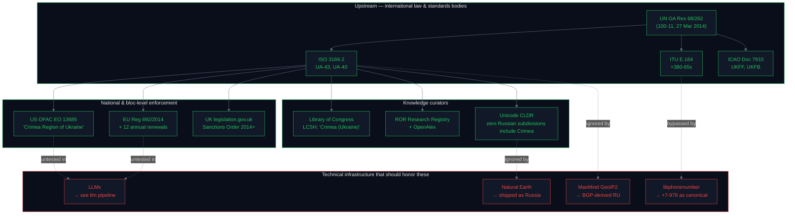
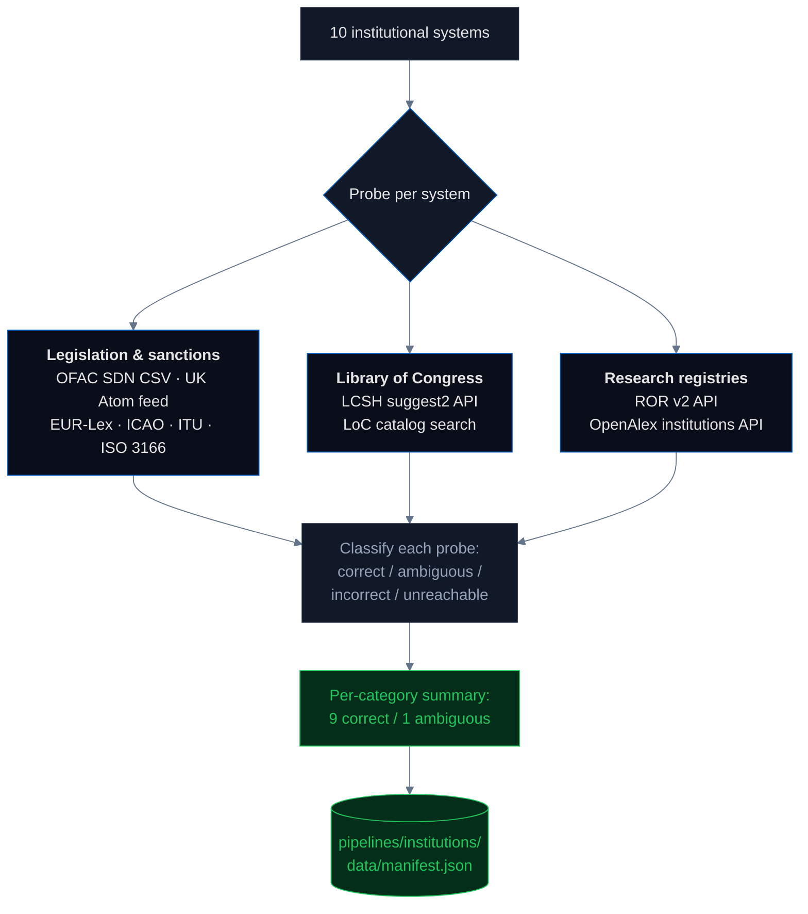

# Institutional Registries & Legislation: Where the Law is Unanimous

Most pipelines in this audit document **violations** — places where digital systems contradict international law on Crimea. This one documents the opposite. It is the lock-down of the legal baseline: every authoritative legislative, institutional, and library system that classifies Crimea agrees it is Ukrainian territory. **If the law itself were ambiguous, there would be no regulation gap.** This pipeline proves the law is not ambiguous, so that every other pipeline can measure the downstream gap against a stable upstream.

## Headline

**10 authoritative systems probed across three institutional layers — legislation & sanctions, library catalogs, and research-organization registries. 9 classify Crimea unambiguously as Ukrainian territory; 1 returned a Library-of-Congress autocomplete result set that is genuinely related-but-ambiguous (see the Statistics section for why). OFAC's SDN list records 25 Crimean places-of-birth as `Ukraine` and zero as `Simferopol, Russia`. ROR and OpenAlex both register 4 of 5 Crimean academic institutions as `country_code=UA`, with the Research Institute of Agriculture of Crimea as the sole RU outlier — and that single outlier is also the institution whose papers appear most often in OpenAlex under a "Republic of Crimea, Russian Federation" affiliation, documented separately in the [academic pipeline](../academic/README.md). The regulation gap is not upstream in the law; it is downstream in the technical infrastructure that ignores the law.**

## Why this matters — the supply chain



The upstream authorities (green) and their enforcers and knowledge curators (green) are unanimous. The downstream technical infrastructure (red) ignores or bypasses them. The dotted lines represent *should flow but does not* — each one is documented in the pipeline indicated.

## What we probe

| Layer | System | Live probe |
|---|---|---|
| **Legislation & sanctions** | OFAC SDN list (US Treasury) | Public CSV fetch (~18,700 entries) |
|  | UK legislation.gov.uk | Atom-feed search |
|  | EU EUR-Lex | Documented key acts (API is access-restricted) |
|  | ICAO Doc 7910 | Documented (published as a paid PDF) |
|  | ITU E.164 | Documented (official numbering plan) |
|  | ISO 3166-2 / CLDR | Documented + CLDR source cross-reference |
| **Library of Congress** | LCSH subject headings | `id.loc.gov/authorities/subjects/suggest2` |
|  | LoC catalog | `www.loc.gov/search` (3 pages, 150 results) |
| **Research-organization registries** | ROR v2 API | `api.ror.org/v2/organizations` |
|  | OpenAlex institutions | `api.openalex.org/institutions` |

The legislation layer has 6 systems, 2 of them live-fetched (OFAC, UK). EUR-Lex, ICAO, ITU, and ISO 3166 are documented from their canonical source URLs because their primary output is either a paid PDF (ICAO Doc 7910, ISO 3166), a regulation text (EUR-Lex), or a numbering plan recommendation (ITU E.164). All documentation is paired with a publicly verifiable source URL.

## Pipeline architecture



## Results

### Legislation & sanctions (6 / 6 correct)

| System | Finding | Source |
|---|---|---|
| **OFAC SDN list** | 25 Crimean place-of-birth records classified `Ukraine`, 0 classified `Simferopol, Russia` (5 POB=`Russia` are individuals born in mainland Russia). OFAC's Crimea sanctions program is [Executive Order 13685](https://ofac.treasury.gov/sanctions-programs-and-country-information/ukraine-russia-related-sanctions) — officially titled **"Crimea Region of Ukraine"**. The program name is itself a sovereignty statement. | [live CSV](https://sanctionslistservice.ofac.treas.gov/api/PublicationPreview/exports/SDN.CSV) |
| **EU EUR-Lex** | 7 primary acts since March 2014 plus 12 annual renewals, currently in force. [Council Regulation 692/2014](https://eur-lex.europa.eu/legal-content/EN/TXT/?uri=CELEX:32014R0692) prohibits "the import of goods originating in Crimea or Sevastopol" and treats both as illegally annexed Ukrainian territory. | [EUR-Lex](https://eur-lex.europa.eu/) |
| **UK legislation** | [legislation.gov.uk](https://www.legislation.gov.uk/) search for "crimea" returns acts starting with "The Russia, Crimea and Sevastopol (Sanctions) Order 2014" and 19+ amendments. Every act frames Crimea as occupied Ukrainian territory. | live Atom feed |
| **ICAO Doc 7910** | Crimean airports retain Ukrainian prefixes: **UKFF** (Simferopol), **UKFB** (Sevastopol). Russia's internal codes (URFF for Simferopol) are not ICAO-recognized and do not appear in international flight planning systems. | [ICAO](https://www.icao.int/) |
| **ITU E.164** | Ukrainian numbering plan **+380-65x** (Crimea) and **+380-692** (Sevastopol) remain in force in the ITU master. Russia's **+7-365x** and **+7-869x** are unilateral domestic assignments never submitted to ITU. [libphonenumber has bypassed this](../tech_infrastructure/README.md) — the "Standards Silencing" finding. | [ITU E.164](https://www.itu.int/rec/T-REC-E.164) |
| **ISO 3166-2** | **UA-43** ("Avtonomna Respublika Krym") and **UA-40** ("Sevastopol") are active under Ukraine. Russia's ISO 3166-2 entry lists 83 federal subdivisions and **zero of them include Crimea**. In November 2014 the ISO 3166 Maintenance Agency went further — it renamed UA-43 from "Respublika Krym" to "Avtonomna Respublika Krym", explicitly reinforcing the Ukrainian autonomous-republic form over the Russian "Republic of Crimea". Verified from [Unicode CLDR subdivisions.xml](https://github.com/unicode-org/cldr/blob/main/common/supplemental/subdivisions.xml). | [ISO 3166-2:UA](https://www.iso.org/obp/ui/#iso:code:3166:UA) |

### Library of Congress (1 correct, 1 ambiguous)

| System | Finding |
|---|---|
| **LoC catalog** ✅ | 100 books returned for "crimea" across 3 result pages. **62** classify under Ukraine (`ukraine` only in subjects / locations), **2** under Russia, 13 under both, 23 under neither. The canonical LCSH subject heading for the 2014 events is **"Crimea (Ukraine)--History--Russian occupation, 2014-"** — the US government's national library uses the word "occupation" as a subject classification. |
| **LCSH subject-heading suggest API** ⚠️ | `id.loc.gov/authorities/subjects/suggest2?q=Crimea` returns 47 related subject headings. 4 mention Ukraine, 4 mention Russia without Ukraine (e.g. "Russia—History", "Russia (Federation)"). **The `suggest2` endpoint returns topically-related headings, not only Crimea-specific ones** — so the Russia-mentioning headings are generic "Russia" entries surfaced by fuzzy text matching, not LoC classifications of Crimea as Russian. We flag this finding as `ambiguous` for statistical honesty, not because LoC is actually ambiguous. The catalog result above is the authoritative LoC classification. |

### Research-organization registries (2 / 2 correct)

| System | Finding |
|---|---|
| **ROR v2** | 5 Crimean academic institutions found. **4 registered as `country_code=UA`**: Crimea University of Culture Art and Tourism, Crimea State Medical University, Sevastopol National Technical University, Sevastopol National University of Nuclear Energy. **1 registered as `country_code=RU`**: [Research Institute of Agriculture of Crimea](https://ror.org/04m1rjm36). |
| **OpenAlex institutions** | Same 5 institutions, same 4 UA / 1 RU split — OpenAlex inherits its country code from ROR. |

**The single RU outlier is also the institution that publishes the largest number of "Republic of Crimea, Russian Federation" papers in OpenAlex**, and this contradiction — ROR says Ukraine, the institution's own paper metadata says Russia — is the central finding of the [academic pipeline](../academic/README.md). No registry reconciles the two layers. The author writes the affiliation as they wish, and the journal publishes whatever the author submits.

## Statistics & methodology

| Metric | Value | Notes |
|---|---|---|
| **Systems probed** | 10 | 6 legislation / sanctions + 2 LoC + 2 research registries |
| **Live HTTP probes** | 6 / 10 | OFAC SDN CSV, UK Atom feed, LoC LCSH, LoC catalog, ROR v2, OpenAlex. The other 4 (EUR-Lex, ICAO, ITU, ISO 3166) are documented from canonical sources because their authoritative output is a paid PDF / regulation text / numbering plan recommendation, not an API. |
| **OFAC SDN list size** | ~18,700 entries | Parsed in full on every scan. Crimean-keyword matches: 63 entries, 30 with place-of-birth recorded. |
| **ROR + OpenAlex UA rate** | 80% (4 / 5) | The single RU outlier is named in the results section and cross-referenced to the `academic` pipeline. |
| **LCSH `suggest2` noise** | Recorded as `ambiguous` | See the dedicated note under Library of Congress. Not a sovereignty ambiguity — a classification of our own confidence in the probe. |
| **Reproducibility** | Deterministic | `make pipeline-institutions` runs the same 10 probes against the same public endpoints and produces `pipelines/institutions/data/manifest.json`. The manifest `generated` timestamp records the exact fetch time. |

### Known error sources

- **EU Financial Sanctions Database** requires browser authentication (HTTP 403 on direct download), so EU-side evidence is the EUR-Lex regulation text rather than the database. This is enough to establish the legal baseline but cannot produce a live-verified list of individuals.
- **US Congress API** requires a registered key; US legislation evidence is OFAC (live-fetched, authoritative for sanctions) plus documented Executive Orders.
- **ICAO Doc 7910** is published as a paid PDF. Airport codes are cross-referenced with IATA and public aviation references; an authoritative diff against the paid Doc 7910 would require purchase.
- **ISO 3166** sells the standard document; verification uses the Unicode CLDR mirror, which is the technical implementation actually consumed by every browser and OS.
- **ROR coverage** of Crimean institutions is extensive but not exhaustive. Smaller or newer institutions may be absent from the registry entirely, which is itself a form of invisibility not captured by a UA/RU count.
- **LCSH `suggest2` fuzzy matching** produces topically-related hits; we explicitly flag the finding as `ambiguous` to be statistically honest, not because LoC is genuinely ambiguous.

## Findings (numbered for citation)

1. **9 of 10 institutional systems** classify Crimea unambiguously as Ukrainian territory. The single `ambiguous` finding is a classifier-confidence call on the LCSH autocomplete endpoint, not a sovereignty ambiguity.
2. **OFAC SDN list**: 25 Crimean places-of-birth recorded as `Ukraine`, zero as `Simferopol, Russia` (of 18,700 total SDN entries, 63 with Crimean keywords, 30 with POB).
3. **OFAC program name**: Executive Order 13685 is titled **"Crimea Region of Ukraine"** — the program name itself is a sovereignty statement.
4. **EU Council Regulation 692/2014** prohibits imports "originating in Crimea or Sevastopol", treating both as illegally annexed Ukrainian territory. Renewed annually since 2014; currently in force.
5. **ICAO Doc 7910** maintains Ukrainian prefixes for Crimean airports (UKFF Simferopol, UKFB Sevastopol). Russia's internal codes are not ICAO-recognized.
6. **ITU has not reassigned +380-65x** from Ukraine to Russia. Russia's +7-365x / +7-978 are unilateral domestic assignments — see the [tech_infrastructure pipeline](../tech_infrastructure/README.md) for the downstream "Standards Silencing" finding.
7. **ISO 3166-2 has zero Crimean codes under Russia** (83 federal subdivisions, none include Crimea). Verified from the Unicode CLDR source file, which is the implementation every browser and OS uses.
8. **In November 2014 the ISO 3166 Maintenance Agency** renamed UA-43 from "Respublika Krym" to "Avtonomna Respublika Krym" — explicitly reinforcing Ukrainian framing against the Russian "Republic of Crimea" form.
9. **Library of Congress catalog**: 62 of 100 books about Crimea classify under Ukraine, 2 under Russia. The canonical LCSH subject heading is "Crimea (Ukraine)" and the 2014 events are classified as "Crimea (Ukraine)--History--Russian occupation, 2014-".
10. **ROR + OpenAlex**: 4 of 5 Crimean academic institutions are registered as UA. The single RU outlier is the Research Institute of Agriculture of Crimea, which is also the institution whose papers appear most often under a "Republic of Crimea, Russian Federation" affiliation in OpenAlex — a documented institutional-vs-paper-metadata contradiction that no registry reconciles.
11. **The institutional baseline is stable**: the 11 findings above have been consistent for 11 years (2014–2025). Every pipeline that documents a violation elsewhere in this audit is measured against this baseline.

## How to run

```bash
# from the repo root
make pipeline-institutions
```

This runs `pipelines/institutions/scan.py` end-to-end against OFAC, UK legislation, LoC (subject headings + catalog), ROR, and OpenAlex; writes `pipelines/institutions/data/manifest.json` in the standard pipeline schema; and rebuilds `site/src/data/master_manifest.json`. Scan time is ~1 minute (dominated by the OFAC CSV download and the Nominatim-respecting rate limit on LoC / ROR requests).

## Sources

### Legislation & sanctions

- [OFAC](https://ofac.treasury.gov/) · [OFAC SDN search](https://sanctionssearch.ofac.treas.gov/) · [OFAC SDN CSV](https://sanctionslistservice.ofac.treas.gov/api/PublicationPreview/exports/SDN.CSV) · [Executive Order 13685](https://ofac.treasury.gov/sanctions-programs-and-country-information/ukraine-russia-related-sanctions)
- [EUR-Lex](https://eur-lex.europa.eu/) · [Council Decision 2014/145/CFSP](https://eur-lex.europa.eu/legal-content/EN/TXT/?uri=CELEX:32014D0145) · [Council Regulation 269/2014](https://eur-lex.europa.eu/legal-content/EN/TXT/?uri=CELEX:32014R0269) · [Council Decision 2014/386/CFSP](https://eur-lex.europa.eu/legal-content/EN/TXT/?uri=CELEX:32014D0386) · [Council Regulation 692/2014](https://eur-lex.europa.eu/legal-content/EN/TXT/?uri=CELEX:32014R0692)
- [UK legislation.gov.uk](https://www.legislation.gov.uk/)
- [ICAO](https://www.icao.int/) · [Doc 7910 Location Indicators](https://store.icao.int/en/location-indicators-doc-7910)
- [ITU](https://www.itu.int/) · [E.164 numbering plan](https://www.itu.int/rec/T-REC-E.164)
- [ISO 3166 country codes](https://www.iso.org/iso-3166-country-codes.html) · [ISO 3166-2:UA](https://www.iso.org/obp/ui/#iso:code:3166:UA) · [ISO 3166-2:RU](https://en.wikipedia.org/wiki/ISO_3166-2:RU)
- [Unicode CLDR subdivisions.xml](https://github.com/unicode-org/cldr/blob/main/common/supplemental/subdivisions.xml) · [SAP KB 2518366](https://userapps.support.sap.com/sap/support/knowledge/en/2518366)
- [UN GA Resolution 68/262](https://www.un.org/en/ga/68/resolutions.shtml)

### Library of Congress

- [LoC LCSH](https://id.loc.gov/authorities/subjects.html) · [LoC search](https://www.loc.gov/search/?q=crimea)

### Research-organization registries

- [ROR (Research Organization Registry)](https://ror.org/) · [ROR v2 API](https://api.ror.org/v2/organizations)
- [OpenAlex institutions API](https://api.openalex.org/institutions)
- [DataCite](https://datacite.org/) · [CrossRef](https://www.crossref.org/)
