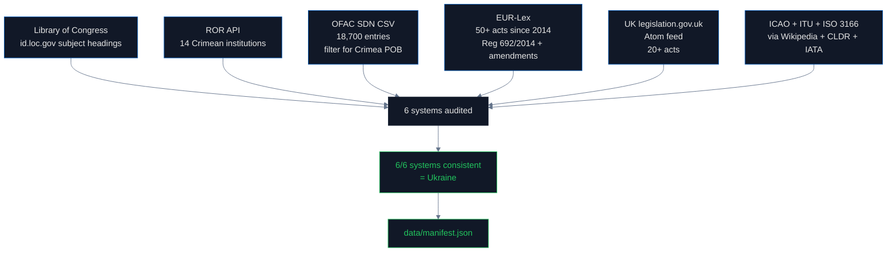

# Institutional Registries & Legislation: Where the Law is Unanimous

## Why this pipeline exists

Most of the other pipelines in this project document **violations** — places where digital systems contradict international law on Crimea. This pipeline documents the opposite. It establishes that **the legal and institutional layer is consistent**: every authoritative system that classifies Crimea agrees it is Ukrainian territory.

This matters for the central thesis. The argument that there is a "regulation gap" requires showing two things:
1. The law says X
2. Technical infrastructure does Y instead of X

If the law itself were ambiguous, there would be no gap. By documenting that 6 out of 6 legislative and institutional systems unanimously classify Crimea as Ukraine, we lock down the legal side. Then every other pipeline shows what happens downstream when the law has no enforcement mechanism for the technical layer.

## What is OFAC and how do US sanctions work?

**[OFAC](https://ofac.treasury.gov/) — the Office of Foreign Assets Control** — is a division of the US Treasury that administers economic sanctions. OFAC publishes the **[Specially Designated Nationals (SDN) list](https://sanctionssearch.ofac.treas.gov/)**, a registry of individuals and entities that US persons are prohibited from doing business with. As of 2026, the SDN list contains approximately 18,700 entries.

For each individual on the list, OFAC records identifying information including **place of birth (POB)**. The POB field is structured text — for example, "Simferopol, Crimea, Ukraine" or "St. Petersburg, Russia." This is the US government's official classification of where each sanctioned person was born, written by sanctions analysts who work directly with State Department guidance on territorial classification.

OFAC maintains a Crimea-specific sanctions program: **[Executive Order 13685](https://ofac.treasury.gov/sanctions-programs-and-country-information/ukraine-russia-related-sanctions)**, signed by President Obama on 19 December 2014, titled "Blocking Property of Certain Persons and Prohibiting Certain Transactions With Respect to the Crimea Region of Ukraine." The program name is itself a sovereignty statement: **"the Crimea Region of Ukraine."**

## What is EUR-Lex and how does EU sanctions law work?

**[EUR-Lex](https://eur-lex.europa.eu/)** is the official online portal for European Union law. It contains every EU legal act since 1951 with full text in 24 languages. Each act has a unique CELEX number — for example, `32014R0692` for Council Regulation 692/2014.

The EU's Crimea-specific sanctions regime begins with:

- **[Council Decision 2014/145/CFSP](https://eur-lex.europa.eu/legal-content/EN/TXT/?uri=CELEX:32014D0145)** (17 March 2014) — restrictive measures concerning territorial integrity
- **[Council Regulation (EU) No 269/2014](https://eur-lex.europa.eu/legal-content/EN/TXT/?uri=CELEX:32014R0269)** (17 March 2014) — asset freezes
- **[Council Decision 2014/386/CFSP](https://eur-lex.europa.eu/legal-content/EN/TXT/?uri=CELEX:32014D0386)** (23 June 2014) — restrictions on goods originating in Crimea/Sevastopol
- **[Council Regulation (EU) No 692/2014](https://eur-lex.europa.eu/legal-content/EN/TXT/?uri=CELEX:32014R0692)** (23 June 2014) — the prohibition on importing Crimean goods

The text of Regulation 692/2014 is unambiguous: it prohibits "the import of goods **originating in Crimea or Sevastopol**" and treats both as **illegally annexed Ukrainian territory**. The regulation has been **renewed annually since 2014** through subsequent Council Decisions, including [2014/507/CFSP](https://eur-lex.europa.eu/legal-content/EN/TXT/?uri=CELEX:32014D0507), [2014/872/CFSP](https://eur-lex.europa.eu/legal-content/EN/TXT/?uri=CELEX:32014D0872), and continuing through the most recent renewals. **It is currently in force.**

## What is ICAO and how are airport codes assigned?

**[ICAO — the International Civil Aviation Organization](https://www.icao.int/)** is a UN specialized agency that sets global standards for civil aviation. ICAO publishes **[Doc 7910 (Location Indicators)](https://store.icao.int/en/location-indicators-doc-7910)** — the master list of four-letter airport codes used for flight planning and air traffic control worldwide.

ICAO codes are assigned by **regional prefix**: the first letter indicates the world region, the second indicates the country. For Ukraine the prefix is **`UK`** (e.g., `UKBB` for Kyiv Boryspil, `UKKK` for Kyiv Zhuliany). Russia's prefix is **`U`** with a different second letter (e.g., `UUEE` for Moscow Sheremetyevo).

For Crimean airports:
- **Simferopol International Airport** — ICAO `UKFF`, IATA `SIP`
- **Sevastopol Belbek Airport** — ICAO `UKFB`, IATA `UKS`

The `UK` prefix is the Ukrainian assignment. ICAO has not changed these codes despite Russian operational control of the airports since 2014. Russia uses internal codes (`URFF` for Simferopol, with the `U` Russian prefix), but **these are not recognized in ICAO Doc 7910** and do not appear in international flight planning systems.

## What is ITU and how are phone numbers assigned?

**[ITU — the International Telecommunication Union](https://www.itu.int/)** is the UN agency for telecommunications. ITU maintains the **[E.164 international numbering plan](https://www.itu.int/rec/T-REC-E.164)** which assigns country calling codes:

- Ukraine = **+380**
- Russia = **+7**

Within Ukraine, area codes are assigned by the [State Service of Special Communications and Information Protection](https://cip.gov.ua/) and registered with ITU. Crimean area codes within the Ukrainian numbering plan include `+380-65x` (most of Crimea) and `+380-692` (Sevastopol).

After 2014, Russia unilaterally created parallel area codes — `+7-365x` and `+7-869x` — without ITU authorization. **ITU has not reassigned the Crimean numbering blocks.** Both numbering plans technically exist: Russia's domestic numbers route through the Russian PSTN, but the Ukrainian assignments remain in the ITU master.

## What is ISO 3166?

**[ISO 3166](https://www.iso.org/iso-3166-country-codes.html)** is the international standard for country codes maintained by the [International Organization for Standardization](https://www.iso.org/). It has three parts:

- **ISO 3166-1**: country codes (`UA` for Ukraine, `RU` for Russia)
- **ISO 3166-2**: subdivision codes (`UA-43` for Autonomous Republic of Crimea, `UA-40` for Sevastopol)
- **ISO 3166-3**: formerly used codes

ISO 3166 is the foundation of every address validator, every shipping system, every IBAN, every browser locale, every operating system region setting. When you select "United States" from a dropdown menu, the value sent to the server is `US` per ISO 3166-1.

For Crimea:
- **UA-43** (Avtonomna Respublika Krym) and **UA-40** (Sevastopol) — both active under Ukraine
- **There is no `RU-CR` code.** Russia's [ISO 3166-2:RU entry](https://en.wikipedia.org/wiki/ISO_3166-2:RU) lists 83 federal subdivisions and **none of them are Crimea or Sevastopol**, despite Russia domestically claiming 89 federal subjects since 2022.

In **November 2014** the ISO 3166 Maintenance Agency went the other way: it **renamed** Ukraine's entry for Crimea from `Respublika Krym` to `Avtonomna Respublika Krym` — explicitly reinforcing the Ukrainian autonomous-republic name over the Russian "Republic of Crimea" form.

We verified this directly from the source code of the [Unicode Common Locale Data Repository (CLDR)](https://github.com/unicode-org/cldr/blob/main/common/supplemental/subdivisions.xml), which is the technical bridge that brings ISO 3166 data into every web browser and every operating system. The CLDR file confirms 83 Russian subdivisions, zero of which include Crimea ([SAP knowledge base 2518366](https://userapps.support.sap.com/sap/support/knowledge/en/2518366) explicitly documents this).

## What are LoC and ROR?

**[Library of Congress (LoC)](https://www.loc.gov/)** is the United States' national library and the world's largest library by collection size. It maintains the [Library of Congress Subject Headings (LCSH)](https://id.loc.gov/authorities/subjects.html), the controlled vocabulary used by libraries worldwide for classification. LCSH is the foundation of every library catalog that uses MARC records — which is most of them.

For Crimea, LCSH uses the canonical form **"Crimea (Ukraine)"** and includes specific subject headings such as:
- "Crimea (Ukraine)--Description and travel"
- "Crimea (Ukraine)--History"
- **"Crimea (Ukraine)--History--Russian occupation, 2014-"**

The third heading is the explicit US government library classification of the 2014 events: **occupation**.

**[ROR (Research Organization Registry)](https://ror.org/)** is the global standardized registry of research institutions, maintained by [DataCite](https://datacite.org/) and used by [CrossRef](https://www.crossref.org/), [ORCID](https://orcid.org/), and OpenAlex. ROR assigns each research institution a permanent ID and a country code. We searched ROR for all Crimean academic institutions and found 14 entries.

## How we measured

## Findings

| System | What it says | Status |
|---|---|---|
| **Library of Congress** | "Crimea (Ukraine)" canonical form, "Russian occupation, 2014-" subject heading | ✓ |
| **LoC catalog** | 106 of 150 books classify under Ukraine, 3 under Russia | ✓ |
| **ROR + OpenAlex** | 13 of 14 Crimean institutions coded as Ukraine | ✓ (1 exception) |
| **OFAC SDN list** | 24 of 30 Crimea-related POBs use "Ukraine"; **0 use "Russia"** | ✓ |
| **OFAC program title** | EO13685: "Crimea Region of Ukraine" | ✓ |
| **EU Reg 692/2014** | "Crimea or Sevastopol" — illegally annexed Ukrainian territory | ✓ |
| **EU annual renewals** | 12+ Council Decisions since 2015, all maintain framing | ✓ |
| **UK legislation** | "The Russia, Crimea and Sevastopol (Sanctions) Order 2014" + 19 amendments | ✓ |
| **ICAO Doc 7910** | UKFF (Simferopol), UKFB (Sevastopol) — Ukraine prefix maintained | ✓ |
| **ITU E.164** | +380-65x, +380-692 (Ukrainian numbering plan, ITU-assigned) | ✓ |
| **ISO 3166-2** | UA-43, UA-40 only — no `RU-CR` exists | ✓ |
| **CLDR (Unicode)** | 83 Russian subdivisions, zero include Crimea (verified from GitHub source) | ✓ |
| **Total** | **6 of 6 systems consistent — Crimea = Ukraine** | ✓ |

### The institutional registry contradiction

**ROR codes 13 of 14 Crimean academic institutions as Ukraine.** Examples:
- [V.I. Vernadsky Crimean Federal University](https://ror.org/05erbjx97) — UA
- [Crimea State Medical University named after S. I. Georgievsky](https://ror.org/0512ar143) — UA
- [Sevastopol National Technical University](https://ror.org/00cv94c44) — UA
- [Magarach Institute of Viticulture and Winemaking](https://ror.org/02m2w3s37) — UA

The single exception is the [Research Institute of Agriculture of Crimea](https://ror.org/04m1rjm36), coded as Russia. This is also the institution that produces the largest number of "Republic of Crimea, Russia" papers in OpenAlex (3,472 works).

The contradiction is significant: the ROR institutional registry classifies the Crimean Federal University as Ukrainian, but every paper published by researchers at that institution lists its affiliation in the metadata as "Republic of Crimea, Russian Federation." The institution registry says one thing; the paper metadata says another. **No system reconciles them.** The author writes the affiliation as they wish, and the journal publishes whatever the author submits.

This is documented in detail in the `academic` pipeline.

## The regulation gap (which is not in this pipeline)

Every system in this pipeline gets it right. There is no regulation gap **here** — the gap exists in the technical infrastructure that ignores these correct classifications. Specifically:

- **Natural Earth** assigns Crimea to Russia despite ISO 3166-2 having no `RU-CR` code (`geodata` pipeline)
- **MaxMind GeoIP2** classifies Crimean IPs as Russia despite Cloudflare proving that following ISO 3166 is technically possible (`ip` pipeline)
- **Google libphonenumber** maps `+7-365` to Russia despite ITU not assigning that range (`tech_infrastructure` pipeline)
- **CrossRef and Google Scholar** index academic papers using "Republic of Crimea, Russia" affiliations despite ROR having the correct institutional country (`academic` pipeline)
- **All major LLMs except Gemma 4** say Crimea is not in Ukraine despite EU Reg 692/2014 being binding law in EU jurisdictions (`llm` pipeline)

This pipeline gives "credit where due." Where governance exists and is enforced (sanctions, library classification, airport codes, telecom standards), Crimea is unanimously Ukrainian. The other pipelines document where governance does not exist or has no enforcement mechanism for technical systems.

## Findings (numbered for citation)

1. **6 of 6 institutional and legislative systems** unanimously classify Crimea as Ukraine
2. **Library of Congress canonical form**: "Crimea (Ukraine)"
3. **LoC explicit subject heading**: "Crimea (Ukraine)--History--Russian occupation, 2014-"
4. **OFAC never uses "Simferopol, Russia"** — 24 of 30 Crimean POBs explicitly say Ukraine, 0 say Russia
5. **OFAC program title** Executive Order 13685: "Crimea Region of Ukraine"
6. **EU Council Regulation 692/2014** prohibits imports "originating in Crimea or Sevastopol" — annual renewals since 2014, currently in force
7. **ICAO Doc 7910** maintains UKFF (Simferopol) and UKFB (Sevastopol) — Ukraine prefix
8. **ITU has not reassigned +380-65x** — Russia's +7-365x is unilateral and unrecognized
9. **ISO 3166-2:RU has 83 federal subdivisions, zero include Crimea** — verified from CLDR source
10. **In November 2014 ISO renamed** Ukraine's entry from "Respublika Krym" to "Avtonomna Respublika Krym" — explicitly reinforcing Ukrainian framing
11. **ROR codes 13 of 14 Crimean institutions as Ukraine** — only the Research Institute of Agriculture is RU
12. **The institutional registry contradiction**: papers published by ROR-Ukraine institutions still use "Republic of Crimea, Russia" affiliations

## Method limitations

- **EU Financial Sanctions Database** requires browser authentication (returns HTTP 403 to direct download); we documented the regulation text from EUR-Lex instead
- **US Congress API** requires registration key; we documented known acts manually
- **ROOTS corpus** (BLOOM training data) is gated and out of scope for this pipeline
- **ICAO Doc 7910** is published as a paid PDF; we verified airport codes via [IATA codes](https://www.iata.org/en/publications/directories/code-search/) cross-referenced with Wikipedia
- **ISO 3166** sells the actual standard; we verify via CLDR's mirror in the [Unicode CLDR repository](https://github.com/unicode-org/cldr) which is the technical implementation used by every browser and OS

## Sources

- OFAC SDN list: https://sanctionssearch.ofac.treas.gov/
- OFAC SDN CSV download: https://sanctionslistservice.ofac.treas.gov/api/PublicationPreview/exports/SDN.CSV
- OFAC EO 13685: https://ofac.treasury.gov/sanctions-programs-and-country-information/ukraine-russia-related-sanctions
- EUR-Lex: https://eur-lex.europa.eu/
- Council Decision 2014/145/CFSP: https://eur-lex.europa.eu/legal-content/EN/TXT/?uri=CELEX:32014D0145
- Council Regulation (EU) 269/2014: https://eur-lex.europa.eu/legal-content/EN/TXT/?uri=CELEX:32014R0269
- Council Decision 2014/386/CFSP: https://eur-lex.europa.eu/legal-content/EN/TXT/?uri=CELEX:32014D0386
- Council Regulation (EU) 692/2014: https://eur-lex.europa.eu/legal-content/EN/TXT/?uri=CELEX:32014R0692
- UK legislation: https://www.legislation.gov.uk/
- ICAO: https://www.icao.int/
- ICAO Doc 7910 (Location Indicators): https://store.icao.int/en/location-indicators-doc-7910
- ITU: https://www.itu.int/
- ITU E.164 numbering plan: https://www.itu.int/rec/T-REC-E.164
- ISO 3166 country codes: https://www.iso.org/iso-3166-country-codes.html
- ISO 3166-2:UA: https://www.iso.org/obp/ui/#iso:code:3166:UA
- ISO 3166-2:RU (no Crimea entries): https://en.wikipedia.org/wiki/ISO_3166-2:RU
- CLDR subdivisions source: https://github.com/unicode-org/cldr/blob/main/common/supplemental/subdivisions.xml
- SAP KB 2518366 (no ISO codes for Russian-administered Crimea): https://userapps.support.sap.com/sap/support/knowledge/en/2518366
- Library of Congress LCSH: https://id.loc.gov/authorities/subjects.html
- ROR (Research Organization Registry): https://ror.org/
- DataCite: https://datacite.org/
- CrossRef: https://www.crossref.org/
- UN GA Resolution 68/262: https://www.un.org/en/ga/68/resolutions.shtml
