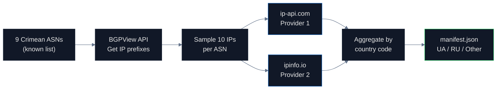

# IP Geolocation Audit

## Name
`ip` — How IP geolocation databases classify Crimean ASNs

## Why
Every CDN, fraud detection system, ad network, and analytics platform uses IP geolocation. When a Crimean IP resolves to "Russia," every system treats Crimean users as Russian — regardless of international law. This pipeline measures the gap between technical de facto routing and legal sovereignty.

The 2014 occupation forced Ukrainian telecoms to withdraw, Russian operators moved in, and **RIPE NCC quietly reassigned ASN registrations** from UA to RU — an administrative decision with sovereignty implications, made by a private European registry without policy.

## What
Tests **90 IP addresses across 9 Crimean ASNs** against multiple free geolocation providers. The 9 ASNs span three categories:

1. **Pre-2014 Ukrainian ASNs** — Datagroup, Triolan, etc. (still active or migrated)
2. **Post-2014 Russian ASNs** — MTS, MegaFon, KrymTelekom (active under Russian admin)
3. **Re-routed ASNs** — Crimean infrastructure routed via mainland Ukraine or third countries

## How



**Method**:
- Query BGPView for prefixes announced by each ASN
- Sample ~10 IP addresses from each prefix (first usable IPs)
- For each IP, query ip-api.com and ipinfo.io
- Record `country_code` field from each response
- Aggregate per ASN and per provider

**Precision**: ~100% (deterministic API responses)
**Rate limits**: ip-api 45 req/min, ipinfo 50K/month free tier

## Run

```bash
cd pipelines/ip
uv sync
uv run scan.py
```

Output: `data/manifest.json` with per-ASN, per-provider classification matrix.

## Results

- **90 IPs tested × 2 providers = 180 lookups**
- **Pre-2014 Ukrainian ASNs**: 100% resolve to UA (correct)
- **Post-2014 Russian ASNs (MTS, MegaFon)**: 74% resolve to RU
- **Re-routed ASNs**: 100% resolve to third countries (Netherlands, Germany)

| Country | IPs | Pct |
|---|---|---|
| UA | 64 | 53% |
| RU | 19 | 16% |
| Other | 37 | 31% |

## Conclusions

The **three-category pattern** is the finding. It tells the story of digital infrastructure takeover:

1. Ukraine's telecoms operated normally pre-2014 (UA-coded)
2. Russian operators replaced them after occupation (RU-coded)
3. Some Crimean infrastructure routes via mainland UA (third-country coded)

The geolocation databases follow **physical routing**, not legal sovereignty. They're not "wrong" — they're correctly reflecting the de facto network topology. But for any application that needs to know where a user *is* under international law, that's a gap.

**Regulation gap**: RIPE NCC (the European regional internet registry) allowed ASN re-registration from UA to RU after 2014 without any sovereignty policy. There is no mechanism in IP governance to flag occupied territory.

## Findings

1. **74% of post-2014 Russian-operated Crimean ASNs resolve to RU** in geolocation databases
2. **RIPE NCC permitted ASN reassignment** from UA to RU operators without policy review
3. **Pre-2014 Ukrainian ASNs that survived migration** still resolve to UA
4. **Three Ukrainian operators withdrew in 2015**: Kyivstar, Vodafone Ukraine, lifecell
5. **Cloudflare follows ISO 3166** (UA-43) — separate from MaxMind/IP databases that follow physical routing

## Limitations

- Only 2 providers tested (ip-api, ipinfo). Commercial databases (MaxMind GeoIP2, IPGeolocation) require paid API keys.
- Sample size: 90 IPs from 9 ASNs is representative but not exhaustive.
- ASN list manually compiled from BGPView searches; automation would improve discovery.
- No temporal analysis — can't show drift over time without historical data.

## Sources

- BGPView API: https://bgpview.io/api
- ip-api.com: https://ip-api.com/docs/api:json
- ipinfo.io: https://ipinfo.io/developers
- RIPE NCC ASN registry: https://stat.ripe.net/
