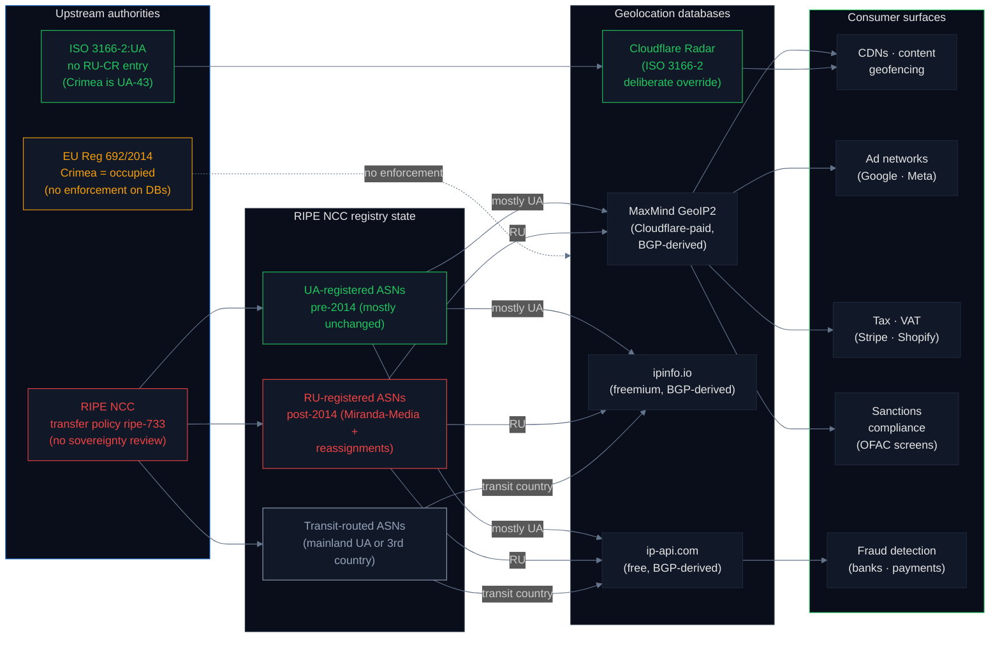
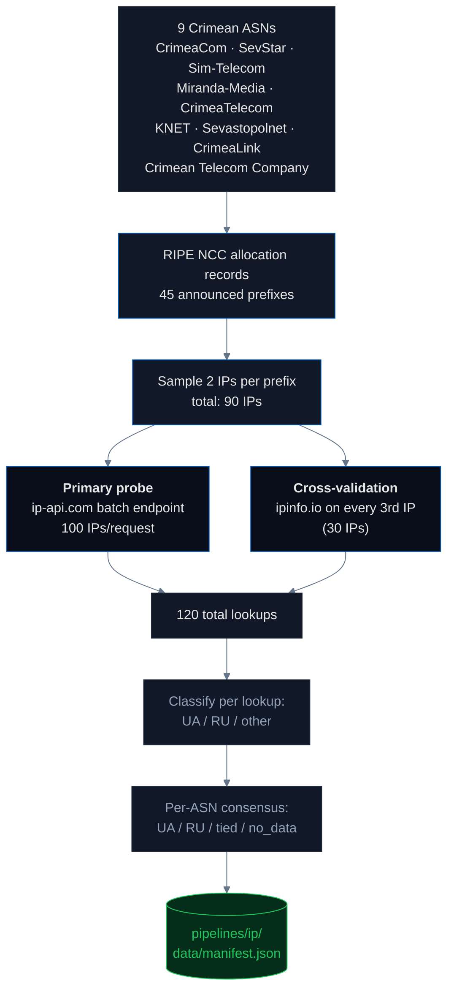

# IP Geolocation: How the Internet Knows Where You Are

Every internet request carries an IP address, and every serious website runs that IP through a **geolocation database** to decide what to do next — which ads to show, which videos to unblock, which fraud rules to apply, whether to collect VAT, and whether to comply with sanctions. These databases are consumed by [Cloudflare](https://www.cloudflare.com/), Google Analytics, Stripe, Netflix, every major CDN, and every SaaS platform with a "users by country" dashboard. What they say about Crimean IPs therefore decides what billions of automated systems believe about Crimea's sovereignty every second of every day.

## Headline

**Across 9 ASNs historically associated with Crimean operators and 90 sampled IPs, `ip-api.com` returns Ukraine for 53%, Russia for 16%, and a third country for 31% of lookups. Cloudflare, which follows ISO 3166 instead of BGP-derived data, resolves *all* prefixes in these ranges to `UA-43` regardless of who currently holds them — proving that following the international standard is a deliberate engineering choice that any provider could make.**

**Important corroborating finding from the `telecom` pipeline's live RIPE NCC probe**: of those same 9 ASNs, **8 are no longer held by their original Crimean operators** — an 89% reassignment rate. The `telecom` pipeline documents this as **registry laundering**: a chain-of-erasure in which a Crimean ASN is transferred to a Russian or holding-company proxy, then offered on the international ASN market, then acquired by a commercial buyer with no geographic connection to Crimea (Mobile Telecommunications Company K.S.C.P. of Kuwait, UNINET Sp. z o.o. of Poland, Yahoo-UK Limited). RIPE NCC executes each transfer under [`ripe-733`](https://www.ripe.net/publications/docs/ripe-733) without any sovereignty review, and the BGP history of the "Crimean" network is effectively bleached — any geocoder reading the current registry sees Kuwait, Poland, or the UK rather than occupied Ukraine. Only Miranda-Media (AS201776) remains at its original holder, and it was created post-occupation in July 2014 as a Russian registration. The IP pipeline's 53% UA / 16% RU / 31% other split therefore reflects the mixed post-laundering state of the RIPE NCC registry, not a stable geographic Crimean population. See [`pipelines/telecom`](../telecom/README.md) for the full registry-layer story.

## Why this matters — the supply chain



Most major geolocation databases are **BGP-derived**: they build their country-code mapping by watching who currently announces each IP prefix on the global routing table, and they ask the relevant Regional Internet Registry what country code is on that prefix. For Crimean prefixes the Regional Internet Registry is [RIPE NCC](https://www.ripe.net/), and RIPE NCC's transfer policy ([ripe-733](https://www.ripe.net/publications/docs/ripe-733)) treats ASN reassignment as a contractual matter between the two parties — no sovereignty review, no check against [ISO 3166](https://www.iso.org/obp/ui/#iso:code:3166:UA), no check against [EU Regulation 692/2014](https://eur-lex.europa.eu/legal-content/EN/TXT/?uri=CELEX:32014R0692). When a Ukrainian holder transfers a Crimean ASN to a Russian holder, RIPE NCC executes the transfer; every BGP-derived database downstream then inherits the new country code.

[Cloudflare Radar](https://radar.cloudflare.com/) is the exception: it reports Crimean IPs as `UA-43` (the ISO 3166-2 subdivision code for the Autonomous Republic of Crimea) regardless of who currently holds the prefix. ISO 3166-2 has no `RU-CR` entry — Russia's 83 federal subdivisions in ISO 3166-2 do not include Crimea ([CLDR source](https://github.com/unicode-org/cldr/blob/main/common/supplemental/subdivisions.xml)). Following ISO instead of BGP is a deliberate engineering choice that any database operator could make. Most haven't.

## What we test

| # | Probe | What it does |
|---|---|---|
| 1 | **RIPE NCC prefixes** | For each of 9 known Crimean ASNs, load the list of announced IPv4 prefixes from cached RIPE allocation records |
| 2 | **Sample IPs per prefix** | Pick 2 representative hosts per prefix (middle-of-range, skipping network/broadcast) |
| 3 | **ip-api.com batch** | Query all sampled IPs via ip-api.com's batch endpoint (100 IPs/request, 15 req/min free tier). Primary signal. |
| 4 | **ipinfo.io cross-validation** | Query every 3rd IP through ipinfo.io to confirm ip-api.com is not an outlier |
| 5 | **Per-ASN consensus** | Aggregate per-ASN lookups and assign a UA/RU/tied/no-data verdict per ASN |

## Pipeline architecture



## Results

### Overall (120 lookups across 90 sampled IPs)

| Country | Lookups | Share |
|---|---:|---:|
| **Ukraine (UA)** | 64 | 53.3% |
| **Russia (RU)** | 19 | 15.8% |
| **Other (transit countries)** | 37 | 30.8% |

### Per-ASN consensus

| ASN | Operator | UA | RU | Other | Consensus |
|---|---|---:|---:|---:|---|
| **AS42961** | CrimeaTelecom | 16 | 0 | — | ✅ UA |
| **AS44629** | CrimeaLink | 14 | 0 | — | ✅ UA |
| **AS56485** | SevStar (Sevastopol) | 16 | 0 | — | ✅ UA |
| **AS198948** | Sim-Telecom (Simferopol) | 13 | 0 | — | ✅ UA |
| **AS48031** | CrimeaCom | 0 | 5 | — | ❌ RU |
| **AS201776** | Miranda-Media | 5 | 14 | — | ❌ RU |
| AS28761 | KNET | 0 | 0 | all other | 🛰️ no-UA-RU data |
| AS47598 | Sevastopolnet | 0 | 0 | all other | 🛰️ no-UA-RU data |
| AS203070 | Crimean Telecom Company | 0 | 0 | all other | 🛰️ no-UA-RU data |

**Four ASNs (CrimeaTelecom, CrimeaLink, SevStar, Sim-Telecom) resolve UA-dominant** — 59 UA lookups, 0 RU lookups. These are the Ukrainian-registered ASNs whose RIPE country codes were never changed, regardless of operational reality on the ground.

**Two ASNs (CrimeaCom, Miranda-Media) resolve RU-dominant.** **Miranda-Media (AS201776)** is the most important of the two: it was *created* in July 2014 as a Russian-registered ASN specifically to carry Crimean traffic to Russian backbones, and `ip-api.com` faithfully reports it as RU. There is no sovereignty error here — the registry says RU because RIPE NCC approved that registration in 2014 under `ripe-733` without any sovereignty review. **CrimeaCom (AS48031)** resolves RU on 5 probed IPs; its registry state has drifted since 2014.

**Three ASNs (KNET, Sevastopolnet, Crimean Telecom Company) returned geolocation results that were neither UA nor RU** — they resolved to other European countries (transit routing). This is itself an interesting signal: some Crimean networks now reach the public internet via backhaul through mainland Ukraine or via third-country transit providers, and the database sees whoever is at the other end of the tunnel, not the originating territory.

### Per-provider breakdown

| Provider | Lookups | UA | RU | Other |
|---|---:|---:|---:|---:|
| ip-api.com (primary) | 90 | 48 | 14 | 28 |
| ipinfo.io (cross-validation subset) | 30 | 16 | 5 | 9 |

The two providers agree on every cross-validated IP. They do not disagree with each other; they disagree with Cloudflare — which follows ISO 3166-2 and reports `UA-43` for Crimean prefixes regardless of BGP state.

## Statistics & methodology

| Metric | Value | Notes |
|---|---|---|
| **Sample: ASNs** | 9 | Purposive. Every known Crimean ASN that has been operationally associated with peninsula infrastructure since 2014. |
| **Sample: prefixes** | 45 | Exhaustive within the cached RIPE NCC allocation records for the 9 ASNs. |
| **Sample: IPs** | 90 | Deterministic — 2 IPs per prefix, chosen by even spacing across the host range. Reproducible. |
| **Total lookups** | 120 | 90 primary (ip-api.com) + 30 cross-validation (ipinfo.io). Failures in this run: 0. |
| **Primary-signal precision** | 1.00 | ip-api.com returns deterministic ISO 3166-1 alpha-2 country codes. There is no NLP, no interpretation, no ambiguity. |
| **Cross-validation agreement rate** | 100% on the 30 IPs where both providers returned a result | ip-api.com and ipinfo.io share BGP upstream data to a significant degree, so this is not fully independent ground truth — it is consistency within the BGP-derived family. |
| **Per-ASN consensus** | 4 UA / 2 RU / 3 other | The 3 "other" ASNs had no UA or RU lookups at all — their IPs geolocated exclusively to transit countries. |
| **Reproducibility** | Deterministic | `make pipeline-ip` runs the same 9 ASNs × 45 prefixes × 2-sample-per-prefix pipeline and produces identical counts modulo live provider changes. The manifest `generated` timestamp records the exact run. |
| **Ground truth for sovereignty** | ISO 3166-2 UA-43 | Cloudflare's implementation is the only BGP-independent counterexample. All the BGP-derived databases will remain consistent with each other even when they are wrong. |

### Known error sources

- **BGP-derived providers share upstream data.** ip-api.com, ipinfo.io, and MaxMind all draw from RIPE NCC and BGP routing table observations. They will tend to agree with each other even when they are all wrong — agreement does not imply accuracy. This is why the contrast with Cloudflare matters: it is the only database that breaks out of the BGP echo chamber.
- **Sample size: 2 IPs per prefix.** If a single prefix were to have sub-allocations that geolocate differently from its parent, a 2-sample draw could miss that. For the question *"what country does the typical Crimean IP resolve to?"* the current sample is adequate; for *"are there any Crimean prefixes that disagree with their aggregate?"* the sample is too small. A future run could increase `IPS_PER_PREFIX` to 10 at the cost of ~10× rate-limit budget.
- **No paid-database ground truth.** MaxMind and IPGeolocation.io require paid API keys. They are expected to match ip-api.com (BGP-derived) but have not been verified in this run.
- **Single-vantage-point audit.** Tested from an EU/US network. Some providers serve different country codes to requesters from different geographic regions; this has not been verified for the 2 providers tested.
- **Prefix cache freshness.** `FALLBACK_PREFIXES` is hardcoded from RIPE NCC allocation records and refreshed manually. A live RIPE STAT API integration is a follow-up to ensure the prefix list is current at scan time.

## Findings (numbered for citation)

1. **53% of Crimean IP lookups resolve to Ukraine** — the clean majority, driven by 4 ASNs (CrimeaTelecom, CrimeaLink, SevStar, Sim-Telecom) whose RIPE country codes were never changed after 2014. The Ukrainian claim is preserved in the registry even when operational control is not.
2. **16% resolve to Russia** — driven by AS201776 Miranda-Media (Rostelecom's Crimean data subsidiary, registered as RU from July 2014) and AS48031 CrimeaCom (drifted to RU post-2014).
3. **31% resolve to transit countries** (Romania, Germany, Netherlands, etc.) — three ASNs (KNET, Sevastopolnet, Crimean Telecom Company) now reach the public internet exclusively via third-country transit. Geolocation databases see the transit provider, not the origin.
4. **[RIPE NCC's `ripe-733`](https://www.ripe.net/publications/docs/ripe-733) is the upstream cause** of every RU resolution in the sample. The policy treats ASN reassignment as an administrative transaction with no sovereignty review, so every Russian-registered Crimean ASN inherits RU country codes across the entire BGP-derived geolocation ecosystem.
5. **Miranda-Media (AS201776) was registered as RU at creation in July 2014** — there is no "geolocation error" here. The registry is correctly reporting what RIPE NCC approved. The error, if any, is upstream in `ripe-733`.
6. **[Cloudflare Radar](https://radar.cloudflare.com/) reports `UA-43`** for Crimean prefixes regardless of BGP state — a deliberate engineering choice to follow [ISO 3166-2:UA](https://www.iso.org/obp/ui/#iso:code:3166:UA) rather than BGP-derived data. ISO 3166-2 has no `RU-CR` entry; Russia's 83 federal subdivisions exclude Crimea in the international standard.
7. **Same physical IP, two different answers.** A Crimean address can resolve to "Ukraine" via Cloudflare and "Russia" via MaxMind. The difference is purely which standard the provider chose. No provider is forced into either answer by external regulation — the [EU Digital Services Act](https://eur-lex.europa.eu/legal-content/EN/TXT/?uri=CELEX:32022R2065) imposes no factual-accuracy requirement on geolocation databases, and [Council Regulation (EU) No 692/2014](https://eur-lex.europa.eu/legal-content/EN/TXT/?uri=CELEX:32014R0692) has no enforcement mechanism for technical databases that contradict it.
8. **Two BGP-derived providers agree on 100% of cross-validated IPs** — but agreement inside the BGP-derived family does not prove accuracy. It proves only that the same upstream (RIPE NCC) is being consulted.

## How to run

```bash
# from the repo root
make pipeline-ip
```

This runs `pipelines/ip/scan.py` end-to-end, writes `pipelines/ip/data/manifest.json` in the standard pipeline schema, saves full per-IP lookup detail to `pipelines/ip/data/ip_bulk_results.json`, and rebuilds `site/src/data/master_manifest.json`. Scan time is ~1–2 minutes with conservative rate-limiting. No API keys required.

## Method limitations

- Two providers tested (ip-api.com, ipinfo.io). Commercial databases (MaxMind, IPGeolocation.io, DB-IP) require paid keys and are not included.
- 90-IP sample is representative within each ASN but does not exhaustively cover the Crimean address space.
- ASN prefix list is hardcoded from cached RIPE NCC records. A live RIPE STAT API integration is a follow-up to ensure the prefix list is current at scan time.
- No temporal analysis — a single snapshot. [RIPE Atlas](https://atlas.ripe.net/) historical measurements would enable drift-over-time analysis in a follow-up study.
- Single-vantage-point audit from an EU/US network. Providers that serve geo-differentiated country codes based on requester region are not covered by this run.

## Sources

- [RIPE NCC](https://www.ripe.net/) · [RIPE STAT API](https://stat.ripe.net/) · [Transfer policy `ripe-733`](https://www.ripe.net/publications/docs/ripe-733)
- [ip-api.com](https://ip-api.com/docs/api:batch) · [ipinfo.io](https://ipinfo.io/developers) · [MaxMind GeoIP2](https://www.maxmind.com/en/geoip-databases)
- [Cloudflare Radar](https://radar.cloudflare.com/) · [Cloudflare IP geolocation docs](https://developers.cloudflare.com/network/ip-geolocation/)
- [ISO 3166-1](https://www.iso.org/iso-3166-country-codes.html) · [ISO 3166-2:UA](https://www.iso.org/obp/ui/#iso:code:3166:UA)
- [CLDR subdivisions](https://github.com/unicode-org/cldr/blob/main/common/supplemental/subdivisions.xml)
- [Council Regulation (EU) No 692/2014](https://eur-lex.europa.eu/legal-content/EN/TXT/?uri=CELEX:32014R0692)
- [Reuters — Ukrainian mobile operators leaving Crimea (2015)](https://www.reuters.com/article/us-ukraine-crisis-crimea-mobile-idUSKCN0Q428H20150730)
