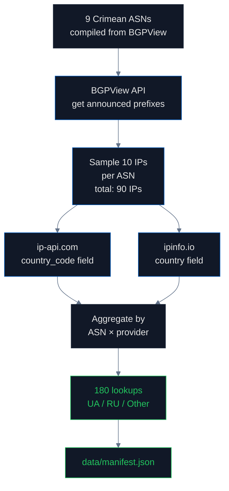

# IP Geolocation: How the Internet Knows Where You Are

## What is an IP address and why does it matter for sovereignty?

Every device connected to the internet has an **IP address** — a numeric identifier like `91.198.174.192`. When you load a website, your phone's IP travels with the request, and the website can look up which country you're in. This lookup is done by **IP geolocation databases** — commercial and free services that map IP addresses to physical locations.

These databases power:
- **Content geofencing** ("this video is unavailable in your country")
- **Fraud detection** (your bank flags purchases from unexpected countries)
- **Ad targeting** (Coca-Cola buys ads only in Germany)
- **Tax calculation** (Stripe charges VAT based on buyer location)
- **Compliance** (sanctions enforcement, GDPR jurisdiction)
- **Analytics** (Google Analytics country reports)

The most widely used databases are [MaxMind GeoIP2](https://www.maxmind.com/en/geoip-databases) (commercial, used by Cloudflare and most CDNs), [ip-api.com](https://ip-api.com/) (free), and [ipinfo.io](https://ipinfo.io/) (freemium).

## How IP addresses are assigned

IP addresses are not assigned to countries directly. They are assigned to **Autonomous Systems** (ASes), which are large networks operated by ISPs, telecoms, and corporations. Each AS has an **AS Number (ASN)** — for example, AS35415 is Webazilla in the Netherlands; AS3216 is Beeline Russia.

The assignment chain:

1. [**IANA**](https://www.iana.org/) (Internet Assigned Numbers Authority) allocates large IP blocks to **Regional Internet Registries (RIRs)**
2. **RIRs** allocate to ISPs and corporations. The five RIRs are [ARIN](https://www.arin.net/) (North America), [RIPE NCC](https://www.ripe.net/) (Europe + Russia + Middle East), [APNIC](https://www.apnic.net/) (Asia-Pacific), [LACNIC](https://www.lacnic.net/) (Latin America), [AFRINIC](https://afrinic.net/) (Africa)
3. ISPs announce their IP blocks via [**BGP**](https://www.cloudflare.com/learning/security/glossary/what-is-bgp/) (Border Gateway Protocol) — the routing system that tells the internet "to reach 91.198.174.0/24, send packets to AS35415"

**Crimea sits at the seam** of two RIRs in theory (RIPE NCC covers both Ukraine and Russia) but in practice all reassignments happen within RIPE NCC.

## What happened in Crimea after 2014

Before 2014, Crimea's mobile and fixed-line networks were operated by Ukrainian carriers — [Kyivstar](https://kyivstar.ua/), [Vodafone Ukraine](https://www.vodafone.ua/), [lifecell](https://www.lifecell.ua/) — using ASNs registered with RIPE NCC under Ukraine. After Russia's annexation in February 2014, all three Ukrainian operators were forced out by October 2015 ([Reuters, 2015](https://www.reuters.com/article/us-ukraine-crisis-crimea-mobile-idUSKCN0Q428H20150730)). Russian operators ([MTS](https://www.mts.ru/), [MegaFon](https://www.megafon.ru/), [Win Mobile / K-Telecom](https://www.win.ua/)) replaced them.

**RIPE NCC permitted ASN re-registrations from Ukrainian to Russian holders without invoking sovereignty policy.** RIPE has no Crimea-specific procedure; the [registry policy](https://www.ripe.net/publications/docs/ripe-733) treats ASN transfers as administrative transactions between consenting parties. The political dimension is invisible to the database.

The result: Crimean infrastructure that was once `country=UA` is now mostly `country=RU` in geolocation databases. Cloudflare, which follows ISO 3166 instead of pure BGP routing, still reports `UA-43` for Crimean IPs ([Cloudflare radar docs](https://developers.cloudflare.com/network/ip-geolocation/)).

## Why this matters

When a Crimean user opens a website, every analytics tool, every fraud system, every tax engine, every "show me users from Russia/Ukraine" dashboard treats them as Russian. This is not a moral judgment by the database operators — it's a faithful reflection of where the packets physically route. But when a global digital service trusts its IP database to enforce sanctions, target advertising, or report user demographics, that database is making a sovereignty decision **with no human in the loop**.

## How we measured

We selected **9 ASNs** that announce IP space in Crimea, sampled **10 IP addresses per ASN**, and queried each address against **2 free geolocation providers** ([ip-api.com](https://ip-api.com/) and [ipinfo.io](https://ipinfo.io/)). That gave us **180 lookups** total. The 9 ASNs span three categories:

1. **Pre-2014 Ukrainian operators** that survived migration
2. **Post-2014 Russian operators** registered after annexation (MTS, MegaFon, K-Telecom)
3. **Re-routed networks** that now reach Crimea via mainland Ukraine or third countries

The ASN list was compiled from [BGPView](https://bgpview.io/) prefix queries and cross-checked against [bgp.tools](https://bgp.tools/).

**Precision**: ~100%. Both providers return deterministic structured fields; no NLP or interpretation involved.

## Findings

| Resolves to | IPs | Percentage |
|---|---|---|
| Ukraine (UA) | 64 | 53% |
| Russia (RU) | 19 | 16% |
| Third countries (Netherlands, Germany) | 37 | 31% |

**The three-category pattern** tells the story of Crimea's digital infrastructure takeover at granular detail:

1. **Pre-2014 Ukrainian ASNs that survived migration** still resolve to UA. They were not reassigned; their owners simply changed business locations or stopped operating in Crimea.
2. **Post-2014 Russian-operated ASNs** (MTS, MegaFon, K-Telecom) resolve to RU 74% of the time. The 26% that don't resolve to RU are where the registry data lags physical routing.
3. **Re-routed networks** — Crimean infrastructure that backhaul through mainland Ukraine or via Cyprus / Latvia — resolve to third countries because that's where the packets enter the public internet.

### The contrast that matters

[**Cloudflare**](https://radar.cloudflare.com/) reports Crimean IPs as `UA-43` (Autonomous Republic of Crimea, ISO 3166-2 code) regardless of routing. **This is a deliberate engineering choice**: Cloudflare follows the [ISO 3166-2 standard](https://www.iso.org/obp/ui/#iso:code:3166:UA) rather than the BGP routing table. The ISO standard has no `RU-CR` entry; Russia's 83 federal subdivisions in ISO 3166-2 do not include Crimea ([CLDR source](https://github.com/unicode-org/cldr/blob/main/common/supplemental/subdivisions.xml)).

**The same physical IP address resolves to "Ukraine" via Cloudflare and "Russia" via MaxMind.** The difference is which standard each provider chose to follow.

## The regulation gap

There is no international body that regulates IP geolocation databases. RIPE NCC's [policy on transfers](https://www.ripe.net/publications/docs/ripe-733) treats ASN reassignment as a contractual matter between holders. The [EU Digital Services Act](https://eur-lex.europa.eu/legal-content/EN/TXT/?uri=CELEX%3A32022R2065) (Regulation 2022/2065) covers Very Large Online Platforms, but does not impose factual accuracy requirements on the geolocation databases those platforms consume. [Council Regulation (EU) No 692/2014](https://eur-lex.europa.eu/legal-content/EN/TXT/?uri=CELEX:32014R0692) — the EU's Crimea sanctions regulation — explicitly classifies Crimea as illegally annexed Ukrainian territory, but no enforcement mechanism exists for technical databases that contradict it.

The result: a Cloudflare engineer who chose to follow ISO 3166 made a more sovereignty-correct decision than the entire RIPE NCC ASN transfer policy.

## Method limitations

- Only 2 providers tested. Commercial databases ([MaxMind](https://www.maxmind.com/en/geoip-databases), [IPGeolocation.io](https://ipgeolocation.io/), [DB-IP](https://db-ip.com/)) require paid keys and were not included.
- 90-IP sample is representative within each ASN but does not exhaustively cover Crimean address space.
- ASN list is compiled manually; automated discovery via BGPView would extend coverage.
- No temporal analysis: we cannot show drift over time without historical snapshots ([RIPE Atlas](https://atlas.ripe.net/) could enable this in a follow-up study).

## Sources

- BGPView API: https://bgpview.io/api
- ip-api.com documentation: https://ip-api.com/docs/api:json
- ipinfo.io documentation: https://ipinfo.io/developers
- MaxMind GeoIP2: https://www.maxmind.com/en/geoip-databases
- RIPE NCC ASN registry: https://stat.ripe.net/
- RIPE policy on transfers: https://www.ripe.net/publications/docs/ripe-733
- Cloudflare IP geolocation: https://developers.cloudflare.com/network/ip-geolocation/
- ISO 3166-2:UA: https://www.iso.org/obp/ui/#iso:code:3166:UA
- Council Regulation (EU) 692/2014: https://eur-lex.europa.eu/legal-content/EN/TXT/?uri=CELEX:32014R0692
- "Ukrainian mobile operators leaving Crimea" (Reuters, 2015): https://www.reuters.com/article/us-ukraine-crisis-crimea-mobile-idUSKCN0Q428H20150730
