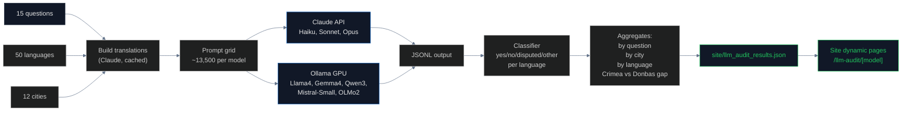

# LLM Sovereignty Audit

## Name
`llm_audit` — Black-box audit of frontier and open-source LLMs on Crimea sovereignty

## Why
LLMs are now consulted by hundreds of millions of users daily for factual questions. When you ask ChatGPT, Claude, Gemini, or any open-source model "Is Simferopol a city in Ukraine?", what does it say? Does it say the same thing in 50 languages? Does it treat Crimean cities differently from Donbas cities?

This pipeline tests **20+ models × 15 questions × 50 languages × 12 cities** with strict one-word answers — no forced-choice bias smoothing.

## What

### Forced-choice audit (1850 queries per model)
- 15 questions including direct ("Is X in Ukraine?"), mirror ("Is X Russian?"), legal, de jure / de facto, occupation framing
- 50 languages including Ukrainian, Russian, Crimean Tatar, Belarusian, Kazakh, Georgian, etc.
- 12 cities: 6 Crimean (occupied 2014) + 6 Donbas/South (claimed 2022) — the **comparison enables training-cutoff bias detection**

### Open-ended audit (separate)
- 8 questions like "In which country is {city}?", "Describe Crimea"
- Avoids binary forced-choice bias
- Classified by keyword matching

### Models tested
- **Closed (API)**: Claude Haiku 4.5, Sonnet 4.6, Opus 4.6
- **Open (Ollama on GPU)**: Llama 4, Gemma 4, Qwen 3, Mistral Small, OLMo 2 (latest only)

## How



**Cost**:
- Claude API: ~$10-15 for full audit (3 models × 1850 queries × $0.001/query)
- GPU rental (vast.ai): ~$5-10 for sequential model runs

## Run

```bash
cd pipelines/llm_audit
uv sync
ANTHROPIC_API_KEY=... uv run scan.py
# Or per-model:
ANTHROPIC_API_KEY=... uv run scan.py --model gemma4
```

For open-source models, requires Ollama running on a GPU server with SSH tunnel to localhost:11434.

## Results

### Claude family (complete)

| Model | Overall | Crimea cities | Donbas cities | Gap |
|---|---|---|---|---|
| **Haiku 4.5** | 60.3% | **33%** | 69% | **+36 pts** |
| **Sonnet 4.6** | 72.2% | 56% | 69% | +13 pts |
| **Opus 4.6** | 76.4% | **71%** | 73% | **+1.6 pts** |

**Bigger model = smaller bias.** Opus has almost no Crimea-vs-Donbas gap. Smaller models encode pre-2022 Russian framing of Crimea.

### Open-source (running)

| Model | Status | Initial test on "Is Simferopol in Ukraine?" |
|---|---|---|
| Llama 4 | Running | "No" ❌ |
| Gemma 4 | Running | "Yes" ✓ (only one) |
| Qwen 3 | Running | "no" ❌ (with reasoning) |
| Mistral Small | Running | "No." ❌ |
| OLMo 2 | Running | "no" ❌ |

## Conclusions

### The smoking gun: training cutoff bias

Smaller models score **near-100% on Donbas/South Ukrainian cities** (claimed by Russia in 2022) but **17–82% on Crimean cities** (occupied in 2014). This proves pre-2022 Russian framing of Crimea leaked into training data, while post-2022 narrative about Donbas was correctly learned as Ukrainian.

Donetsk, Luhansk, Mariupol, Melitopol, Kherson, Berdyansk: **100% correct on Haiku 4.5**.
Simferopol, Sevastopol, Yalta, Kerch, Feodosia, Evpatoria: **17-82% correct**.

### Cognitive dissonance

Haiku gets these abstract questions right at 96-100%:
- "Did Russia illegally annex Crimea?" → YES
- "Does Russia have legal rights under international law?" → NO
- "Does international law recognize Russian sovereignty?" → NO
- "Is the 2014 referendum recognized by UN?" → NO

But says **Sevastopol IS a Russian city** 78% of the time when asked directly. The model "knows" the legal framework AND simultaneously encodes the de facto geographic framing that contradicts it.

### Language asymmetry

Worst-performing languages on Q1 ("Is X a city in Ukraine?"):
- **Crimean Tatar (30%)** — the indigenous language of Crimea performs worst
- Georgian (32%), Hungarian (43%), Hindi (46%), Armenian (46%)

Best: English, French, Ukrainian, Polish, Macedonian (78-81%)

## Findings

1. **Bigger Claude model = smaller bias** (Opus 71% on Crimea vs Haiku 33%)
2. **100% correct on Donbas/South** for Haiku, despite 33% on Crimea
3. **Crimean Tatar performs worst** of all 50 languages — the indigenous language is the most biased
4. **Llama 4, Qwen 3, Mistral Small, OLMo 2 all fail** on Simferopol — only Gemma 4 (reasoning) gets it right
5. **OLMo 2 has fully open training data** (Dolma corpus) — provides direct training-data audit pathway
6. **Sevastopol mirror question (Q4)**: 78% of Haiku answers say Sevastopol IS a Russian city
7. **"De facto" question (Q10)** correct at 96%, "de jure" (Q9) correct at 90% — model knows the distinction
8. **Open-ended Q13** "What country is X in?" — only 25.5% correct (worst question type)
9. **Cohen's κ between models on shared queries** — high agreement on Donbas, low on Crimea

## Limitations

- LLM responses are stochastic; single queries may vary
- Open-source models tested via vast.ai GPU; bandwidth costs ~$15-20 per setup
- Full 50-language coverage is expensive; some questions only run in core 13 langs (open-ended)
- Reasoning models (Gemma 4, Qwen 3) take 10-100x longer per query than non-reasoning models
- Cannot test Grok (paid API only, ~$5 needed)
- Cannot run Llama 4 or Grok 1/2 large models without 600GB+ VRAM

## Sources

- Anthropic API: https://docs.anthropic.com/
- Ollama: https://ollama.com/
- vast.ai GPU: https://vast.ai/
