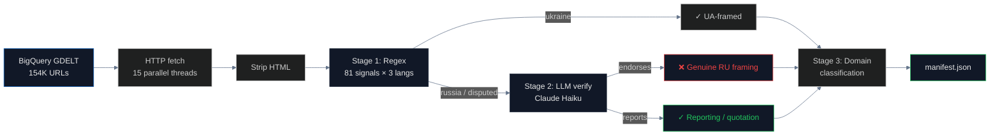

# Media Framing Audit

## Name
`media` — How news media frames Crimea's sovereignty (GDELT 154K articles)

## Why
The conventional wisdom is that Western media has fallen for Russian propaganda about Crimea. This pipeline tests that empirically across 154,000 news articles from GDELT 2015–2026. The result is the opposite of the assumption: **major international media correctly frames Crimea as Ukrainian territory at near-100% rates**. The remaining "violations" are Russian state media, content aggregators, and pro-Russian fringe sites.

This is a story about **advocacy success**. Ukraine's MFA, civil society, and the #KyivNotKiev/#CrimeaIsUkraine campaigns have held the line. The data proves it.

## What
Three-stage pipeline over 154K GDELT articles:

1. **Stage 1 (Regex)**: 81 sovereignty signals across 3 languages catch every framing mention
2. **Stage 2 (LLM)**: Claude Haiku verifies all 8,472 flagged articles, separates endorsement from quotation
3. **Stage 3 (Manual)**: Per-domain analysis identifies fringe vs mainstream

## How



**Cost**: ~$2 BigQuery + ~$5 LLM verification

## Run

```bash
cd pipelines/media
uv sync
ANTHROPIC_API_KEY=... uv run scan.py
```

## Results

| Source type | Articles | Endorsement rate |
|---|---|---|
| All media | 154,000 | n/a |
| Russia-flagged (regex) | 8,079 | n/a |
| LLM-verified endorsements | 5,123 | 60.5% precision |
| **Non-Russian media only** | 47,657 | **0.5%** |
| Russian media | ~8,000 | **85%** |

## Conclusions

The story flips. Russian state media (RIA, TASS, Sputnik, e-crimea.info, etc.) endorses Russian Crimea framing at 85%. Everyone else doesn't.

Of 47,657 non-Russian articles with sovereignty signals, only **239 are LLM-confirmed endorsements** — and breaking down by domain:
- 53 pro-Russian fringe (Infowars, Theduran, Veteranstoday, etc.)
- 47 content aggregators (BigNewsNetwork, EturboNews — repackage RU wire stories)
- 12 non-Western state media (PressTV/Iran, Belta/Belarus, APA/Azerbaijan)
- 127 marginal/single-hit (mostly false positives — sloppy reporting, not endorsement)
- **0 major international outlets** (BBC, Reuters, CNN, NYT, AP, Guardian, etc.)

**Trend**: Endorsement rate is flat at ~0.5% from 2015 to 2026. **Advocacy works.** When mistakes happen (Coca-Cola 2016, Apple 2019, Olympics 2021, Hungary 2023, FIFA 2024), MFA pressure leads to swift corrections.

## Findings

1. **Zero major international outlets** systematically endorse Russian Crimea framing
2. **0.5% endorsement rate** in international media, stable since 2015
3. **Russian state media at 85%** — the source of all genuine endorsement
4. **Coverage timeline**: documented corrections at Coca-Cola (2016), Apple (2019), Tokyo Olympics (2021), Hungary (2023), FIFA (2024)
5. **Content aggregators** repackage Russian wire stories into English-language fringe sites
6. **`disputed` label is good journalism**: 94% of disputed articles are confirmed reporting (cites both Russian and Ukrainian framings)
7. **Two-stage pipeline precision**: 60.5% (regex) → 100% (LLM verifies endorsement vs quotation)
8. **Cohen's κ = 0.926** between regex and LLM (almost perfect agreement)

## Limitations

- 8,472 LLM-verified is a sample of the 154K — not exhaustive
- LLM verification cost: ~$5 (could be more thorough at higher cost)
- "Non-Western state media" classification depends on country-of-origin metadata
- Cannot distinguish editorial intent from sloppy reporting in single-incident outlets
- BigQuery GDELT data cuts off at 2026; recent articles may not be indexed yet

## Sources

- GDELT Global Knowledge Graph: https://www.gdeltproject.org/
- Sovereignty classifier: `_shared/sovereignty_signals.py`
- LLM verification: Claude Haiku (Anthropic)
