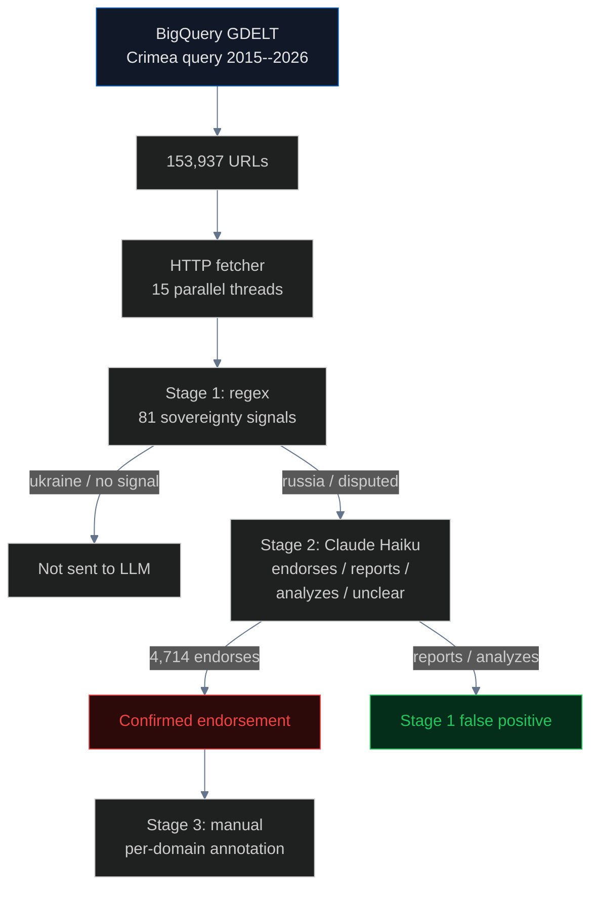

# Media Framing: 153,937 Articles, Zero Major-Outlet Endorsements

Across 153,937 Crimea-mentioning articles indexed by [GDELT](https://www.gdeltproject.org/) 2015--2026, the LLM verification stage confirmed 4,714 genuine Russian-sovereignty endorsements. Of those, 239 came from non-Russian-domain publishers, and **zero from the 10 major international outlets** (BBC, Reuters, CNN, NYT, Guardian, AP, AFP, DW, Le Monde, El Pais). Stage 1 non-Russian precision is 9.1% -- confirming that keyword-based monitoring produces ~91% false positives on Western media (quotation, not endorsement).

## Pipeline



## Results

| Stage | Metric | Value |
|---|---|---:|
| GDELT retrieval | Total articles 2015--2026 | **153,937** |
| Stage 1 | Articles with sovereignty signal | 38,663 (25.1%) |
| Stage 2 | LLM-confirmed endorsements | **4,714** |
| Stage 2 | Non-Russian-domain endorsements | **239** |
| Stage 3 | Major international outlets | **0** |

### Non-Russian endorsements by category

| Category | Count |
|---|---:|
| Pro-Russian fringe (Infowars, TheDuran, VeteransToday) | 53 |
| Content aggregators (BigNewsNetwork, EturboNews) | 47 |
| Non-Western state media (PressTV, Belta, APA) | 12 |
| Marginal / single-incident | 127 |
| **Major international outlets** | **0** |

### Top violators

| Domain | Endorsements | Country |
|---|---:|---|
| e-crimea.info | 1,621 | Russia |
| abnews.ru | 682 | Russia |
| sevastopol.su | 377 | Russia |
| ria.ru | 328 | Russia |
| fedpress.ru | 216 | Russia |
| rt.com | 131 | Russia |

### Statistics

| Metric | Value | 95% CI |
|---|---:|---|
| Stage 1 overall precision | 61.5% | [60.4%, 62.5%] |
| Stage 1 non-Russian precision | **9.1%** | [8.1%, 10.3%] |
| Non-Russian endorsement rate | 0.62% | [0.55%, 0.70%] |
| Major outlets endorsement count | 0 | rule-of-3: <= 0.11% |

## Advocacy correction timeline

| Year | Incident | Outcome |
|---|---|---|
| **2016** | Coca-Cola Russia map | **Corrected after boycott** |
| **2019** | Apple Maps shows Crimea as Russian | Partial correction in 2022 |
| **2021** | Tokyo Olympics website map | **Corrected after MFA protest** |
| **2023** | Hungarian government video | **Corrected within days** |
| **2024** | FIFA World Cup 2026 draw map | **Corrected after MFA protest** |

## Key findings

1. **Zero major international outlets** systematically endorse Russian framing
2. **91% of Stage 1 non-Russian flags are false positives** (quotation, not endorsement) -- the Measurement Gap for keyword-based monitoring
3. **Endorsement rate flat at ~0.6% in non-Russian media** from 2015 to 2026
4. **5 documented corrections** after Ukrainian advocacy pressure
5. **Contextual Disambiguation at Scale**: LLM sees only article text (not domain or Stage 1 output); 38.5% Stage 1/2 disagreement rate proves substantive classification

## Limitations

- GDELT coverage gaps for recent months; paywalled content not fetched
- Domain-country attribution depends on GDELT metadata (occasionally empty)
- Single-vantage-point LLM verification (Claude Haiku only)

## How to run

```bash
make pipeline-media
```

Requires `ANTHROPIC_API_KEY`. Full verification ~$5.

## Sources

- [GDELT](https://www.gdeltproject.org/) | [BigQuery](https://blog.gdeltproject.org/announcing-the-gdelt-2-0-event-database-now-available-on-google-bigquery/)
- [Entman (1993)](https://onlinelibrary.wiley.com/doi/10.1111/j.1460-2466.1993.tb01304.x) -- Framing paradigm
- [EU DSA Art 34](https://eur-lex.europa.eu/legal-content/EN/TXT/?uri=CELEX%3A32022R2065) | [EU Reg 692/2014](https://eur-lex.europa.eu/legal-content/EN/TXT/?uri=CELEX:32014R0692)
- Correction sources: [Coca-Cola (Kyiv Post)](https://www.kyivpost.com/article/content/ukraine-politics/coca-cola-officially-apologizes-for-map-showing-crimea-as-part-of-russia-405513.html) | [Olympics (ESPN)](https://www.espn.com/olympics/story/_/id/31866845/ioc-correct-ukraine-map-olympics-website-protests) | [FIFA (Kyiv Independent)](https://kyivindependent.com/ukraine-calls-for-fifa-apology-over-map-of-crimea/)
