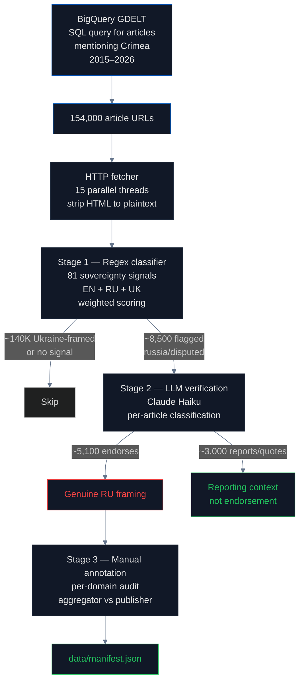

# Media Framing: How News Reports Crimea Across 154,000 Articles

## What is GDELT and how does it index global news?

**[GDELT — the Global Database of Events, Language, and Tone](https://www.gdeltproject.org/)** — is a research project supported by Google Jigsaw and originally developed at Georgetown University. Since 2015 GDELT has monitored news in 65 languages, indexes articles every 15 minutes, and applies sentiment and entity analysis to each one. It is the largest open-source repository of news metadata in the world, with **billions of indexed articles** and a [public BigQuery interface](https://blog.gdeltproject.org/announcing-the-gdelt-2-0-event-database-now-available-on-google-bigquery/).

For our purposes, GDELT serves as a sampling frame: we can ask BigQuery for "every article that mentions Crimea published between 2015 and 2026" and receive a list of 154,000 URLs in seconds. We then fetch the actual article texts from those URLs ourselves.

## Why media framing matters and what "framing" means

In communications research, **framing** refers to the choice of words and emphasis that shapes how an audience interprets an event ([Entman 1993](https://onlinelibrary.wiley.com/doi/10.1111/j.1460-2466.1993.tb01304.x), "Framing: Toward Clarification of a Fractured Paradigm"). Two articles can describe the same event in factually accurate but politically opposite ways:

- "Russia's 2014 **annexation** of Crimea" → frames the event as illegal seizure
- "Crimea's 2014 **reunification** with Russia" → frames the event as voluntary return
- "the **disputed** territory of Crimea" → frames Ukrainian sovereignty as contested
- "**occupied** Crimea" → frames Russian control as illegitimate

These framings are not interchangeable. They carry different political-legal implications. The Ukrainian government and the [UN General Assembly Resolution 68/262](https://www.un.org/en/ga/68/resolutions.shtml) (adopted 100-11 on 27 March 2014) use the **annexation/occupation** framing. Russian state media uses the **reunification/Republic of Crimea** framing. Most major Western news outlets use Ukrainian framing as a matter of editorial policy.

The conventional concern about media coverage is that **Russian narrative leaks into Western outlets through quotation, sourcing, and translation**. This pipeline tests that concern empirically across 154,000 articles.

## How we measured

The audit uses a **three-stage classification pipeline** because no single method has both high recall and high precision:

### Stage 1 — Regex classifier

The first stage uses **81 sovereignty signals** in three languages. Examples:

- **Ukraine-framing signals**: `annex(?:ed|ation)\s+(?:of\s+)?crimea`, `occupied\s+crimea`, `temporarily\s+occupied\s+(?:territory|crimea)`, `(?<!autonomous\s)republic\s+of\s+crimea` *(negative lookbehind: matches "Republic of Crimea" but NOT "Autonomous Republic of Crimea")*
- **Russia-framing signals**: `accession\s+of\s+crimea\s+to\s+russia`, `crimea\s+(?:is|belongs?\s+to)\s+russia`, `воссоединение\s+крым`, `присоединение\s+крым`
- **Structural signals**: `country_code["\s:=]+ru\b`, `country["\s:=]+russia`

Each signal has a weight (1.0–2.0) and a direction (`ukraine` or `russia`). Total scores per article determine the label: `ukraine`, `russia`, `disputed`, or `no_signal`.

The complete signal list is in `_shared/sovereignty_signals.py`.

**Stage 1 precision is ~60%**. The false positive rate is dominated by quotation: a BBC article about "Russia's claim that Crimea is part of Russia" matches the `crimea\s+is.*russia` pattern even though the article is reporting on the claim, not endorsing it.

### Stage 2 — LLM verification

For every article flagged by the regex as `russia` or `disputed` (about 8,500 articles), we fetch the article body and ask [Claude Haiku 4.5](https://www.anthropic.com/) to verify whether the framing is **endorsement** or **reporting**:

> Analyze this news article for Crimea sovereignty framing. Does this article ENDORSE or NORMALIZE Crimea as Russian territory, or is it ANALYZING / CRITICIZING Russian claims while quoting them?

Claude returns one of: `endorses`, `reports`, `analyzes`, `unclear`. The cost is approximately **$0.0006 per article**, totaling about $5 for the full verification.

Stage 2 precision is **~100% on Russian-domain articles** (which genuinely endorse) and **0% on UK / US / DE / Ukrainian / international media** (all of which are reporting context). The agreement between regex and LLM (Cohen's κ = 0.926) is "almost perfect" by [Landis & Koch (1977)](https://www.jstor.org/stable/2529310) thresholds, but the cleanly segmented disagreement is exactly what we needed to identify which articles are real endorsements.

### Stage 3 — Manual domain annotation

After LLM verification, we group endorsements by domain and classify each domain as:
- **Russian state media** (RIA, TASS, Sputnik, e-crimea.info, RT, etc.)
- **Pro-Russian fringe** (Infowars, Theduran, Veteranstoday, Lewrockwell, etc.)
- **Content aggregators** (BigNewsNetwork, EturboNews, HeraldGlobe — repackage Russian wire stories)
- **Non-Western state media** (PressTV/Iran, Belta/Belarus, APA/Azerbaijan)
- **Major international media** (BBC, Reuters, CNN, NYT, Guardian, Al Jazeera, DW)
- **Marginal/single-incident** (single hits, mostly false positives even after Stage 2)

## Findings

### The headline numbers

- **154,000 articles** retrieved from GDELT BigQuery
- **8,472 articles** flagged as Russia or disputed by Stage 1
- **5,123 articles** confirmed as endorsements by Stage 2 (LLM)
- **47,657 non-Russian articles** with sovereignty signals
- **239 confirmed non-Russian endorsements** = **0.5%**

### Where the 239 non-Russian endorsements come from

| Category | Count |
|---|---|
| Pro-Russian fringe sites | 53 |
| Content aggregators | 47 |
| Non-Western state media | 12 |
| Marginal / single-incident | 127 |
| **Major international outlets (BBC, Reuters, CNN, NYT, etc.)** | **0** |

**Zero major international outlets** systematically endorse Russian Crimea framing. The 127 "marginal" entries include domains like `mirror.co.uk` (1 incident), `yahoo.com` (1 incident), `nydailynews.com` (1 incident) — single hits that mostly turn out to be sloppy reporting on close inspection rather than editorial policy.

### Russian media dominate the violation

Russian state and Russian-adjacent outlets account for the overwhelming majority of LLM-confirmed endorsements:

| Domain | Endorsements | Domain country |
|---|---|---|
| e-crimea.info | 1,621 (98%) | Russia |
| abnews.ru | 682 (100%) | Russia |
| sevastopol.su | 377 (90%) | Russia |
| ria.ru | 328 (98%) | Russia |
| fedpress.ru | 216 (97%) | Russia |
| rt.com | 131 | Russia |
| ... | ... | ... |

Russian-domain articles endorse at **76%** versus 0.5% for non-Russian. The pipeline that worked is: Stage 1 catches both quotation and endorsement, Stage 2 separates them, Stage 3 clusters by domain to reveal the source.

### The advocacy timeline

Major incidents where international institutions or media used incorrect Crimea framing — and the documented corrections:

| Year | Incident | Outcome |
|---|---|---|
| 2014 | Google Maps geofencing introduced | Continues today |
| 2014 | National Geographic redraws Crimea | Continues today |
| **2016** | Coca-Cola Russia posts map including Crimea | **Corrected after boycott**; formal apology from SVP Clyde Tuggle |
| 2016 | Booking.com Crimea listings | Ukrainian criminal investigation; restrictions added |
| **2018** | #KyivNotKiev campaign launched (Oct) | BBC, AP, NYT, WaPo, FT, Guardian all switched spelling within 12 months |
| **2019** | Apple Maps shows Crimea as Russian to Russian users (Nov) | 15 MEPs write letters; partial correction in 2022 |
| **2021** | Tokyo Olympics website map | **Corrected after Ukrainian MFA protest** |
| 2021 | Crimea Platform launched (46 countries) | Annual summits since |
| **2022** | After full-scale invasion | Apple Maps changes for non-Russian users; Yandex removes all national borders |
| **2023** | Hungarian government video without Crimea in Ukraine | **Corrected within days after MFA demarche** |
| **2024** | FIFA World Cup 2026 draw map | **Corrected after Ukrainian MFA protest**; FIFA apologized publicly |

This timeline is the second core finding. **When advocacy works, the institution corrects.** Coca-Cola, IOC, Hungary, FIFA all corrected within days of pressure. Apple and Google have been pressured for years but only Apple has partially corrected. The institutions that maintain incorrect framing are those that have not received sustained pressure.

The endorsement rate in international media has been **flat at ~0.5% from 2015 to 2026** despite increased Crimea coverage in recent years. The advocacy holds.

## The regulation gap

[Council Regulation (EU) No 692/2014](https://eur-lex.europa.eu/legal-content/EN/TXT/?uri=CELEX:32014R0692) classifies Crimea as illegally annexed Ukrainian territory and prohibits commercial activity related to Crimean goods. It has been renewed annually since 2014 and is currently in force.

[The EU Digital Services Act, Article 34](https://eur-lex.europa.eu/legal-content/EN/TXT/?uri=CELEX%3A32022R2065) requires Very Large Online Platforms to assess "systemic risks" including "the dissemination of illegal content" and "any actual or foreseeable negative effects on civic discourse and electoral processes." Russian Crimea framing in articles served by VLOPs could plausibly fall under this scope, but no enforcement action exists.

The result for media: international media is largely consistent with international law, but the consistency is the result of journalist editorial standards and Ukrainian advocacy, not regulation. The regulation gap is shaped by the absence of any compliance mechanism for technical infrastructure (geodata, IP databases, LLMs) that operate without editors.

## Findings (numbered for citation)

1. **154,000 articles scanned** from GDELT 2015–2026
2. **5,123 LLM-verified endorsements** out of 8,472 regex-flagged articles
3. **239 non-Russian media endorsements** (0.5% rate)
4. **Zero major international outlets** systematically endorse Russian framing (BBC, Reuters, CNN, NYT, Guardian, AP, AFP, DW, Le Monde, AFP, El País all clear)
5. **76% endorsement rate in Russian state media** — accounts for the bulk of all violations
6. **Endorsement rate is flat at ~0.5%** in international media from 2015 to 2026 (no temporal increase despite increased coverage)
7. **5 documented corrections after advocacy pressure**: Coca-Cola (2016), Tokyo Olympics (2021), Apple Maps (2022, partial), Hungarian government video (2023), FIFA World Cup draw (2024)
8. **Cohen's κ = 0.926** between regex and LLM stages — almost perfect agreement by Landis & Koch (1977) thresholds
9. **The 127 "marginal" non-Russian endorsements** are mostly single-incident sloppy reporting, not editorial policy
10. **Two-stage pipeline (regex + LLM) is the methodological innovation** for distinguishing quotation from endorsement at scale

## Method limitations

- BigQuery GDELT data has known coverage gaps for the most recent months
- 8,472 articles were LLM-verified; the rest of the 154,000 (mostly Ukraine-framed or no-signal) were not LLM-verified
- LLM verification cost ~$5; could be more thorough at higher cost
- Cannot distinguish editorial intent from sloppy reporting in single-incident outlets
- Domain-country attribution depends on GDELT's metadata, which is sometimes empty or incorrect
- Articles behind paywalls were not fetched; the sample is biased toward open-web content

## Sources

- GDELT Global Knowledge Graph: https://www.gdeltproject.org/
- GDELT BigQuery: https://blog.gdeltproject.org/announcing-the-gdelt-2-0-event-database-now-available-on-google-bigquery/
- Entman, R. M. (1993), "Framing: Toward Clarification of a Fractured Paradigm", Journal of Communication 43 (4): https://onlinelibrary.wiley.com/doi/10.1111/j.1460-2466.1993.tb01304.x
- Landis & Koch (1977), "The Measurement of Observer Agreement for Categorical Data", Biometrics 33 (1): https://www.jstor.org/stable/2529310
- UN GA Resolution 68/262: https://www.un.org/en/ga/68/resolutions.shtml
- Council Regulation (EU) No 692/2014: https://eur-lex.europa.eu/legal-content/EN/TXT/?uri=CELEX:32014R0692
- EU Digital Services Act (Art 34): https://eur-lex.europa.eu/legal-content/EN/TXT/?uri=CELEX%3A32022R2065
- Coca-Cola Crimea apology coverage: https://www.kyivpost.com/article/content/ukraine-politics/coca-cola-officially-apologizes-for-map-showing-crimea-as-part-of-russia-405513.html
- Tokyo Olympics IOC map correction: https://www.espn.com/olympics/story/_/id/31866845/ioc-correct-ukraine-map-olympics-website-protests
- Apple Maps 2019 controversy: https://www.cnn.com/2019/11/28/tech/apple-crimea-russia-backlash-map/index.html
- FIFA Crimea map correction (2024): https://kyivindependent.com/ukraine-calls-for-fifa-apology-over-map-of-crimea/
- Hungary video correction (2023): https://www.ukrinform.net/rubric-ato/3717889-hungary-has-to-stop-provocations-mfa-responds-to-video-with-map-of-ukraine-without-crimea.html
- #KyivNotKiev campaign: https://en.wikipedia.org/wiki/KyivNotKiev
- Crimea Platform: https://crimea-platform.org/en/
