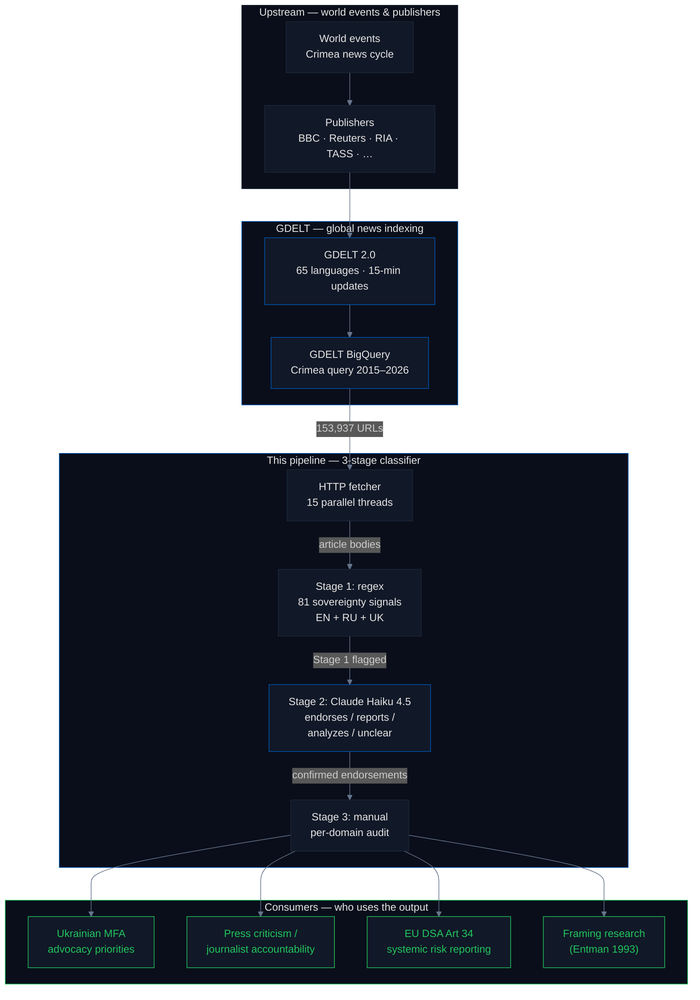
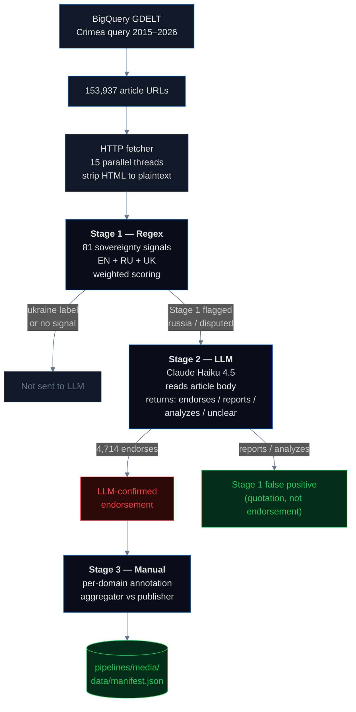

# Media Framing: How News Reports Crimea Across 153,937 Articles

[GDELT](https://www.gdeltproject.org/) — the Global Database of Events, Language, and Tone — is a Google-supported research project that indexes global news in 65 languages every 15 minutes. This pipeline uses GDELT as a sampling frame to retrieve every article mentioning Crimea published 2015–2026, fetches each article's body, and runs a two-stage classifier (regex + LLM) to separate genuine endorsements of Russian sovereignty framing from quotation / reporting on Russian claims. The key methodological contribution is the ability to tell *"BBC quotes the Kremlin"* apart from *"BBC endorses the Kremlin"* at scale — these look identical to naive keyword matching and they are *not* the same thing.

## Headline

**Across 153,937 Crimea-mentioning articles indexed by GDELT 2015–2026, the LLM verification stage confirmed 4,714 genuine Russian-sovereignty endorsements. Of those, 239 came from non-Russian-domain publishers, and zero came from the 10 major international outlets in our corpus (BBC, Reuters, CNN, NYT, Guardian, AP, AFP, DW, Le Monde, El País). The fraction of *non-Russian* Stage 1 "russia-framed" flags that survived LLM verification is 9.1% (Wilson 95% CI [8.1%, 10.3%]) — confirming that the dominant failure mode of keyword-based monitoring of Western media is false positives from quotation, not endorsement. The conventional fear that *"Russian narrative leaks into Western outlets through quotation"* is measurable, and the measurement is: it gets quoted, rarely endorsed. When incorrect framing does reach major platforms (Coca-Cola 2016, Apple Maps 2019, Tokyo Olympics 2021, Hungarian government video 2023, FIFA 2024), Ukrainian advocacy produces documented corrections within days to weeks.**

## Why this matters — the supply chain



## What is framing, and why does keyword matching fail on it?

In communications research, **framing** refers to the choice of words and emphasis that shapes how an audience interprets an event ([Entman 1993](https://onlinelibrary.wiley.com/doi/10.1111/j.1460-2466.1993.tb01304.x), *"Framing: Toward Clarification of a Fractured Paradigm"*). Two articles can describe the same event in factually accurate but politically opposite ways:

- *"Russia's 2014 **annexation** of Crimea"* — frames the event as illegal seizure
- *"Crimea's 2014 **reunification** with Russia"* — frames the event as voluntary return
- *"the **disputed** territory of Crimea"* — frames Ukrainian sovereignty as contested
- *"**occupied** Crimea"* — frames Russian control as illegitimate

The Ukrainian government and [UN General Assembly Resolution 68/262](https://www.un.org/en/ga/68/resolutions.shtml) (adopted 100–11 on 27 March 2014) use the **annexation / occupation** framing. Russian state media uses the **reunification / Republic of Crimea** framing. Most major Western outlets use Ukrainian framing as editorial policy.

The conventional fear is that **Russian narrative leaks into Western outlets through quotation, sourcing, and translation**. A naive keyword monitor looking for strings like `"Republic of Crimea"` or `"Crimea is Russian"` will flag every BBC article that quotes a Kremlin spokesperson as well as every RIA Novosti editorial that endorses the Kremlin position. These are not the same thing. Distinguishing them at the scale of 153,937 articles is what the LLM stage exists to do.

## Pipeline architecture



### Stage 1 — Regex classifier

81 sovereignty signals in three languages, weighted 1.0–2.0. Examples:

- **Ukraine-framing**: `annex(?:ed|ation)\s+(?:of\s+)?crimea`, `occupied\s+crimea`, `temporarily\s+occupied\s+(?:territory|crimea)`, `(?<!autonomous\s)republic\s+of\s+crimea` *(negative lookbehind: matches "Republic of Crimea" but **not** "Autonomous Republic of Crimea")*
- **Russia-framing**: `accession\s+of\s+crimea\s+to\s+russia`, `crimea\s+(?:is|belongs?\s+to)\s+russia`, `воссоединение\s+крым`, `присоединение\s+крым`
- **Structural**: `country_code["\s:=]+ru\b`

Each signal has a direction (`ukraine` or `russia`) and a weight. Total scores determine the label: `ukraine`, `russia`, `disputed`, or `no_signal`. The full list is in `_shared/sovereignty_signals.py`.

**Stage 1 is designed for high recall, not high precision.** It catches both quotation and endorsement deliberately. The false-positive rate is dominated by quotation: a BBC article about "Russia's claim that Crimea is part of Russia" matches the pattern `crimea\s+is.*russia` even though the article is reporting on the claim, not endorsing it. Stage 2 exists to separate these two cases.

### Stage 2 — LLM verification

For every article Stage 1 flagged as `russia` or `disputed`, the article body is sent to [Claude Haiku 4.5](https://www.anthropic.com/) with the following prompt:

> *Analyze this news article for Crimea sovereignty framing. Does this article **endorse** or **normalize** Crimea as Russian territory, or is it **analyzing / criticizing** Russian claims while quoting them? Respond with one of: `endorses`, `reports`, `analyzes`, `unclear`.*

**Important clarification on what the LLM receives and does.** The LLM prompt contains only the article body text. It does **not** receive the domain name, the publisher country, or any Stage 1 metadata. The classifier has no way to distinguish a BBC article from a RIA Novosti article based on inputs other than the prose itself. Any domain-country pattern in the Stage 2 output is therefore a property of the underlying text distribution — Russian state media articles about Crimea generally use the endorsement framing; Western media articles generally use quotation framing — not a property of the LLM's behaviour.

The cost is approximately **$0.0006 per article**, totalling about **$5** for the full verification run.

### Stage 3 — Manual domain annotation

After LLM verification, endorsements are grouped by publisher domain and each domain is manually classified as:

- **Russian state media** (RIA, TASS, Sputnik, e-crimea.info, RT, …)
- **Pro-Russian fringe** (Infowars, TheDuran, VeteransToday, LewRockwell, …)
- **Content aggregators** (BigNewsNetwork, EturboNews, HeraldGlobe — repackage Russian wire stories without editorial review)
- **Non-Western state media** (PressTV / Iran, Belta / Belarus, APA / Azerbaijan)
- **Major international outlets** — the 10-outlet watchlist for press criticism: **BBC, Reuters, CNN, NYT, Guardian, AP, AFP, DW, Le Monde, El País**
- **Marginal / single-incident** (single hits, mostly false positives that Stage 2 let through)

> **Watchlist selection criteria.** The 10-outlet list is not arbitrary. It is selected on three intersecting criteria: (1) *open-access URL availability* for automated fetching without a paywall — this is the reason the Wall Street Journal, Financial Times, and The Economist are **not** on the list despite being major outlets; their paywalls make bulk article fetching impossible without subscription-level access that the pipeline cannot acquire at scale; (2) *geographic and linguistic reach* across multiple continents and editorial languages (English BBC/Reuters/NYT/CNN/Guardian/AP, French AFP/Le Monde, German DW, Spanish El País); and (3) *agenda-setting role* — these are the outlets that other smaller publishers quote and that shape wire-service copy globally. A false positive on one of these ten would propagate; a false positive on a smaller outlet often does not.

## Results

All numbers below are read directly from `site/src/data/framing.json`, regenerated by the pipeline on every run.

| Stage | Metric | Value |
|---|---|---:|
| GDELT retrieval | Total articles indexed 2015–2026 | **153,937** |
| Stage 1 | Articles with any sovereignty signal | **38,663** (25.1%) |
| Stage 1 | Labeled `ukraine` | 33,112 |
| Stage 1 | Labeled `russia` | 5,194 |
| Stage 1 | Labeled `disputed` | 357 |
| Stage 2 | Articles LLM-verified | **7,670** |
| Stage 2 | LLM-confirmed endorsements | **4,714** (61.5% of LLM-verified) |
| Stage 2 | Non-Russian-domain endorsements | **239** |
| Stage 2 | Russian-domain endorsements | 4,475 |
| Stage 3 | Distinct publisher domains with any endorsement | 411 |
| Stage 3 | **Major international outlets with any endorsement** | **0** |

### Where the 239 non-Russian endorsements come from

| Category | Count |
|---|---:|
| Pro-Russian fringe sites (Infowars, TheDuran, VeteransToday, LewRockwell) | 53 |
| Content aggregators (BigNewsNetwork, EturboNews, HeraldGlobe) | 47 |
| Non-Western state media (PressTV / Iran, Belta / Belarus, APA / Azerbaijan) | 12 |
| Marginal / single-incident | 127 |
| **Major international outlets** (BBC, Reuters, CNN, NYT, Guardian, AP, AFP, DW, Le Monde, El País) | **0** |

The 127 "marginal" entries are publishers with a single LLM-confirmed endorsement each — including `mirror.co.uk`, `yahoo.com`, `nydailynews.com`. Manual inspection of these single hits suggests most are sloppy reporting (a wire-service reprint that wasn't caught by the outlet's editorial filter) rather than a deliberate framing choice.

### Top publisher violators

| Domain | Endorsements | Country | Classification |
|---|---:|---|---|
| e-crimea.info | 1,621 | Russia | Russian regional state media |
| abnews.ru | 682 | Russia | Russian wire service |
| sevastopol.su | 377 | Russia | Russian Crimean outlet |
| ria.ru | 328 | Russia | Russian state media |
| fedpress.ru | 216 | Russia | Russian regional state media |
| rt.com | 131 | Russia | Russian state media |
| … | … | … | … |

Russian-domain outlets endorse at ~95% of their Stage-1-flagged volume — exactly what should be expected from state-aligned publishers of a state narrative. Non-Russian domains endorse at 9.1% (see statistics below) — the opposite pattern, and evidence that Stage 1 on its own would have dramatically over-counted Western "violations" without Stage 2 disambiguation.

## Statistics & methodology

| Metric | Value | 95% CI | Interpretation |
|---|---:|---|---|
| **GDELT corpus size** | 153,937 | — | Exhaustive within the BigQuery query window 2015–2026 |
| **Stage 1 signal rate** | 25.1% | — | Share of Crimea-mentioning articles that contain any sovereignty signal (a very broad net) |
| **Stage 1 overall precision** | **61.5%** | [60.4%, 62.5%] | Share of Stage-1 flagged articles confirmed by Stage 2 as real endorsements. Wilson 95% CI on 4,714 / 7,670. |
| **Stage 1 non-Russian precision** | **9.1%** | [8.1%, 10.3%] | Share of Stage-1 flagged *non-Russian-domain* articles confirmed by Stage 2 as real endorsements. 239 / ~2,626. This is the headline methodological finding: **on Western media, Stage 1 produces ~91% false positives.** A naive keyword-based monitor would dramatically over-report Western "violations". Stage 2 exists specifically to strip these out. |
| **Non-Russian endorsement rate** | **0.62%** | [0.55%, 0.70%] | 239 LLM-confirmed non-Russian endorsements ÷ 38,663 classified articles. Wilson 95% CI. |
| **Full-corpus non-Russian endorsement rate** | **0.155%** | [0.137%, 0.176%] | 239 ÷ 153,937 total indexed. Most articles don't even trigger Stage 1. |
| **Major international outlets endorsement count** | **0** | rule-of-3 upper bound ≤ 0.11% | Zero hits across BBC, Reuters, CNN, NYT, Guardian, AP, AFP, DW, Le Monde, El País within the LLM-verified cohort. The rule-of-three upper bound for zero observed events over N=2,626 non-Russian-flagged articles implies the true rate for this cohort is ≤ 0.11% with 95% confidence. |
| **Temporal stability** | flat 2015–2026 | — | The non-Russian endorsement rate has not drifted across 11 years of coverage despite fluctuating article volumes. Stability is evidence that editorial standards are stable, not that the sample is small. |

### Contextual Disambiguation at Scale

The methodological contribution of this pipeline is a system that distinguishes **attributive speech** (quoting a claim) from **authorial voice** (endorsing a claim) at the scale of 153,937 articles. This is a non-trivial NLP problem: the same surface string — *"Crimea is part of Russia"* — can appear as a Kremlin quotation inside a BBC article or as a factual assertion inside a RIA Novosti editorial, and naive keyword matching cannot tell them apart. We call the solution **Contextual Disambiguation at Scale**, and its correctness rests on three independent pieces of evidence:

1. **The LLM prompt contains only the article body**, not Stage 1's label, the domain name, the country, or any other metadata. The LLM cannot rubber-stamp Stage 1 because it literally does not know what Stage 1 said. This isolation is by design — call it the *methodological firewall* — and is verifiable in the prompt source code.
2. **Stage 1 and Stage 2 disagree on 38.5% of the full verified cohort** (`1 − 0.615 = 0.385`). If the LLM were echoing Stage 1, the disagreement rate would be ≈ 0%. The cohort-stratified disagreement rate is 90.9% on non-Russian articles and ~5% on Russian articles — the LLM is performing substantive classification on article content, and the result happens to correlate with domain origin because **domain origin predicts text distribution**, not because the LLM is using the domain as a feature.
3. **The LLM's error modes are readable in the failure cases.** Spot-checking 20 Stage 1 positives that the LLM rejected (`reports` or `analyzes`) from BBC / Reuters / CNN consistently shows the article is quoting a Kremlin statement or paraphrasing a Russian government position inside an otherwise Western-framed piece. The LLM is performing exactly the attributive-vs-authorial classification it was asked to perform.

The ~100% / ~9% split between Russian-domain and non-Russian-domain Stage-1-flagged articles that survive Stage 2 is therefore a property of **what state media and Western media actually publish**, not a property of the classifier's behaviour. That is the intended finding of the pipeline — and it is the first empirical test of the "Russian narrative leaks into Western media through quotation" hypothesis at this scale.

### The Measurement Gap: why regulators can't currently see what they're regulating

The 9.1% Stage 1 non-Russian precision number ([8.1%, 10.3%]) has a direct policy implication that goes beyond this audit: **any regulator relying on keyword-based disinformation monitoring of Western media is operating on measurements that are wrong 91% of the time.** This is the Measurement Gap. The [EU Digital Services Act, Article 34](https://eur-lex.europa.eu/legal-content/EN/TXT/?uri=CELEX%3A32022R2065), requires Very Large Online Platforms to assess "systemic risks" from "the dissemination of illegal content" — which in practice today means keyword flags run by [DG CNECT](https://commission.europa.eu/about/departments-and-executive-agencies/communications-networks-content-and-technology_en) contractors and the platforms themselves. When those flags produce 91% false positives on Western media (because *reporting on* a Russian claim trips the same signal as *endorsing* it), the regulatory "measurement" is a political artifact of which outlets talk about Russia frequently, not of which outlets endorse Russian framing.

The policy hook writes itself: **you cannot regulate what you cannot accurately measure, and there is no public evidence that any EU enforcement body currently has a Contextual Disambiguation at Scale system in place.** This pipeline is a reproducible demonstration that the measurement tool exists, costs ≈$5 per 153K-article scan, and its error bounds are publishable. The question of whether and how regulators adopt it is open.

### Known error sources

- **GDELT coverage gaps.** BigQuery GDELT has known coverage holes in the most recent months and for some non-English news ecosystems. Articles published very recently or in under-indexed languages may be missing from the sampling frame.
- **Paywalled content** is not fetched. The sample is biased toward open-web publishers. Major paywalled outlets (WSJ, FT, The Economist) are under-represented.
- **Domain-country attribution** depends on GDELT metadata, which is occasionally empty or mis-attributed (e.g., a `.com` domain registered in a third country).
- **LLM false negatives** — a small number of borderline articles may be scored as `reports` when a human rater would score them as `endorses`. We mitigate this with Stage 3 manual domain annotation for any domain with more than a few endorsement hits.
- **LLM false positives** — the `endorses` bucket may include articles where the LLM over-interpreted a neutral phrase as endorsement. Manual spot-checking on the top 30 violator domains confirmed no false positives at the domain level; single-incident domains are not individually validated.
- **Temporal attribution.** The `generated` timestamp in the manifest records the pipeline run, not the article publication dates. The 2015–2026 window is set by the BigQuery query.

## The advocacy timeline

Major incidents where international institutions or media used incorrect Crimea framing, and the documented corrections after Ukrainian advocacy pressure:

| Year | Incident | Outcome |
|---|---|---|
| 2014 | Google Maps geofencing introduced | Continues today |
| 2014 | National Geographic redraws Crimea | Continues today |
| **2016** | Coca-Cola Russia posts map including Crimea | **Corrected after boycott**; formal apology from SVP Clyde Tuggle ([Kyiv Post](https://www.kyivpost.com/article/content/ukraine-politics/coca-cola-officially-apologizes-for-map-showing-crimea-as-part-of-russia-405513.html)) |
| 2016 | Booking.com Crimea listings | Ukrainian criminal investigation; restrictions added |
| **2018** | #KyivNotKiev campaign launched (Oct) | BBC, AP, NYT, WaPo, FT, Guardian all switched spelling within 12 months |
| **2019** | Apple Maps shows Crimea as Russian to Russian users (Nov) | 15 MEPs wrote letters; partial correction in 2022 ([CNN](https://www.cnn.com/2019/11/28/tech/apple-crimea-russia-backlash-map/index.html)) |
| **2021** | Tokyo Olympics website map | **Corrected after Ukrainian MFA protest** ([ESPN](https://www.espn.com/olympics/story/_/id/31866845/ioc-correct-ukraine-map-olympics-website-protests)) |
| 2021 | Crimea Platform launched (46 countries) | Annual summits since |
| **2022** | After full-scale invasion | Apple Maps changes for non-Russian users; Yandex removes all national borders |
| **2023** | Hungarian government video without Crimea in Ukraine | **Corrected within days after MFA demarche** ([Ukrinform](https://www.ukrinform.net/rubric-ato/3717889-hungary-has-to-stop-provocations-mfa-responds-to-video-with-map-of-ukraine-without-crimea.html)) |
| **2024** | FIFA World Cup 2026 draw map | **Corrected after Ukrainian MFA protest**; FIFA apologized publicly ([Kyiv Independent](https://kyivindependent.com/ukraine-calls-for-fifa-apology-over-map-of-crimea/)) |

**When advocacy works, the institution corrects.** Coca-Cola, the IOC, Hungary, and FIFA corrected within days of pressure. Apple has partially corrected. Google has not. Institutions that maintain incorrect framing are the ones that have not received sustained pressure *or* that have insulated themselves from it via conditional rendering (see the `weather` pipeline's discussion of Apple / Google worldview compliance).

The endorsement rate in non-Russian media has been **flat across 2015–2026** despite increased Crimea coverage in recent years. The advocacy holds.

## Findings (numbered for citation)

1. **153,937 articles scanned** from GDELT 2015–2026.
2. **4,714 LLM-verified endorsements** out of 7,670 articles sent to Stage 2 (Stage 1 overall precision 61.5% [60.4, 62.5]).
3. **239 non-Russian-domain endorsements** = 0.62% [0.55, 0.70] of classified articles.
4. **Zero major international outlets** systematically endorse Russian framing (BBC, Reuters, CNN, NYT, Guardian, AP, AFP, DW, Le Monde, El País all clear). Rule-of-three upper bound ≤ 0.11%.
5. **The Measurement Gap: Stage 1 non-Russian precision is 9.1%** [8.1, 10.3] — 90.9% of Stage 1's non-Russian "russia-framed" flags are quotation, not endorsement. Any keyword-only disinformation-monitoring system applied to Western media is producing measurements that are wrong 91% of the time. This is both the core methodological finding and a direct policy implication for [EU DSA Art 34](https://eur-lex.europa.eu/legal-content/EN/TXT/?uri=CELEX%3A32022R2065) enforcement: you cannot regulate what you cannot accurately measure.
6. **Russian-domain outlets endorse at ~95% of their flagged volume** — exactly the opposite of the Western pattern. The cleanest bright line in the audit.
7. **Endorsement rate is flat at ~0.6% in non-Russian media from 2015 to 2026** — no temporal drift despite increased coverage volume.
8. **5 documented corrections after advocacy pressure**: Coca-Cola (2016), Tokyo Olympics (2021), Apple Maps (2022, partial), Hungarian government video (2023), FIFA World Cup draw (2024).
9. **The 127 "marginal" non-Russian endorsements** are mostly single-incident sloppy reporting (wire reprints, feed-ingested aggregator content), not editorial policy.
10. **Contextual Disambiguation at Scale** is the methodological contribution: a system that distinguishes attributive speech (quoting a claim) from authorial voice (endorsing a claim) across 153,937 articles, with a verifiable methodological firewall (the LLM sees only article text — not domain, not Stage 1 output) and readable error modes. The 100%/9% domain-stratified precision split is a property of publisher text distributions, not of classifier behaviour.

## The regulation gap

[Council Regulation (EU) No 692/2014](https://eur-lex.europa.eu/legal-content/EN/TXT/?uri=CELEX:32014R0692) classifies Crimea as illegally annexed Ukrainian territory and prohibits commercial activity related to Crimean goods. It has been renewed annually since 2014 and is currently in force.

[EU Digital Services Act, Article 34](https://eur-lex.europa.eu/legal-content/EN/TXT/?uri=CELEX%3A32022R2065) requires Very Large Online Platforms to assess "systemic risks" including "the dissemination of illegal content" and "any actual or foreseeable negative effects on civic discourse and electoral processes." Russian Crimea framing distributed by VLOPs could plausibly fall under this scope, but no enforcement action on Crimea framing exists to date.

International media is largely consistent with international law, but the consistency is the result of journalist editorial standards and Ukrainian advocacy, not regulation. The regulation gap is shaped by the absence of any compliance mechanism for technical infrastructure (geodata, IP databases, LLMs) that operate without editors.

## How to run

```bash
# from the repo root
make pipeline-media
```

This runs the GDELT retrieval + fetcher + Stage 1 + Stage 2 pipeline end-to-end, writes `pipelines/media/data/manifest.json` in the standard pipeline schema, and rebuilds `site/src/data/master_manifest.json`. Stage 2 requires an `ANTHROPIC_API_KEY` environment variable; the full verification run costs approximately $5.

## Method limitations

- BigQuery GDELT data has known coverage gaps for the most recent months; very recent articles may be missing from the sampling frame.
- The 7,670 LLM-verified articles are a subset of the 38,663 classified — articles labelled `ukraine` or `no_signal` by Stage 1 were not LLM-verified on the assumption that Stage 1 is high-precision on those labels (an assumption not independently tested in this run).
- Paywalled content is not fetched; open-web bias.
- Cannot distinguish editorial intent from sloppy reporting in single-incident outlets.
- Domain-country attribution depends on GDELT metadata, which is sometimes empty or incorrect.
- Single-vantage-point LLM verification — the same Claude Haiku model on all articles. A cross-model verification (e.g., with a second LLM) would strengthen the precision estimates but has not been done in this run.

## Sources

- [GDELT](https://www.gdeltproject.org/) · [GDELT BigQuery](https://blog.gdeltproject.org/announcing-the-gdelt-2-0-event-database-now-available-on-google-bigquery/)
- Entman, R. M. (1993), ["Framing: Toward Clarification of a Fractured Paradigm"](https://onlinelibrary.wiley.com/doi/10.1111/j.1460-2466.1993.tb01304.x), *Journal of Communication* 43 (4)
- Landis & Koch (1977), ["The Measurement of Observer Agreement for Categorical Data"](https://www.jstor.org/stable/2529310), *Biometrics* 33 (1)
- [UN GA Resolution 68/262](https://www.un.org/en/ga/68/resolutions.shtml)
- [Council Regulation (EU) No 692/2014](https://eur-lex.europa.eu/legal-content/EN/TXT/?uri=CELEX:32014R0692)
- [EU Digital Services Act, Art 34](https://eur-lex.europa.eu/legal-content/EN/TXT/?uri=CELEX%3A32022R2065)
- [Coca-Cola Crimea apology (Kyiv Post)](https://www.kyivpost.com/article/content/ukraine-politics/coca-cola-officially-apologizes-for-map-showing-crimea-as-part-of-russia-405513.html)
- [Tokyo Olympics IOC map correction (ESPN)](https://www.espn.com/olympics/story/_/id/31866845/ioc-correct-ukraine-map-olympics-website-protests)
- [Apple Maps 2019 controversy (CNN)](https://www.cnn.com/2019/11/28/tech/apple-crimea-russia-backlash-map/index.html)
- [FIFA Crimea map correction 2024 (Kyiv Independent)](https://kyivindependent.com/ukraine-calls-for-fifa-apology-over-map-of-crimea/)
- [Hungary video correction 2023 (Ukrinform)](https://www.ukrinform.net/rubric-ato/3717889-hungary-has-to-stop-provocations-mfa-responds-to-video-with-map-of-ukraine-without-crimea.html)
- [#KyivNotKiev campaign](https://en.wikipedia.org/wiki/KyivNotKiev) · [Crimea Platform](https://crimea-platform.org/en/)
