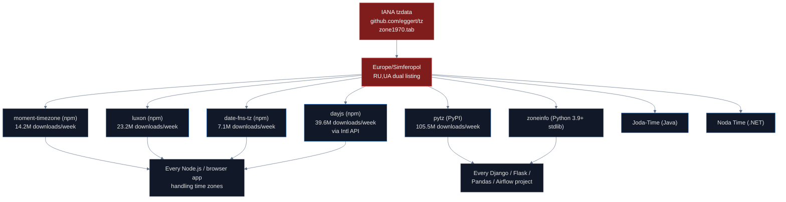
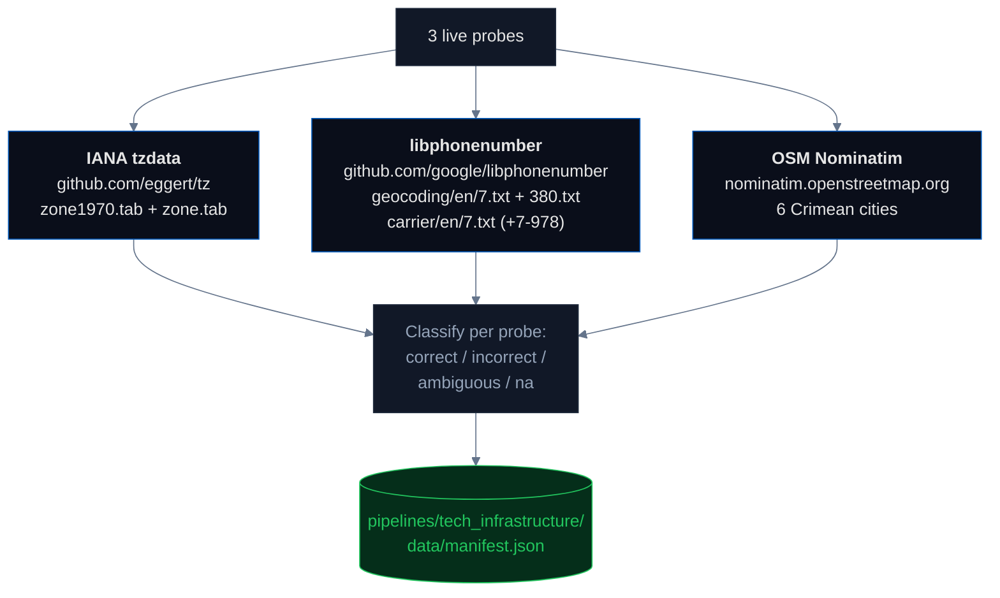

# Tech Infrastructure: Standards, Libraries, and Protocols

Behind every map and every login form there are technical standards — timezone databases, phone-number libraries, postal codes, airport identifiers, country codes. They are invisible to end users and propagate to billions of applications. When the IANA timezone database lists `Europe/Simferopol` with country code `RU,UA`, every app inheriting that database silently encodes a sovereignty position.

## Headline

**The pipeline runs three live probes covering the foundational standards layer that every operating system, browser, and Android phone consults: the IANA Time Zone Database, Google libphonenumber, and OpenStreetMap Nominatim. Live results: IANA `zone1970.tab` lists `Europe/Simferopol` as `RU,UA` — a dual-country listing with **Russia first**. The legacy `zone.tab` still says `UA`. Google libphonenumber's `+7-978` carrier file lists **4 Russian mobile operators currently active under a prefix Russia unilaterally assigned in 2014 and never submitted to ITU**: Elemte-Invest, K-Telecom Ltd, MTS, Sevastopol TELECOM. OpenStreetMap Nominatim resolves all 6 tested Crimean cities to country_code=UA. The IANA dual-listing and the libphonenumber carrier file together establish the "Standards Silencing" pattern documented in the [telecom pipeline](../telecom/README.md): the formal standards body (ITU) still lists the Ukrainian assignment, but the validation layer that every downstream application actually consults has quietly switched to the Russian numbering. The UN system has no mechanism to notice when a standard is being selectively silenced by its own consumers.**

This pipeline's impact also has a *quantifiable* downstream weight: the IANA dual listing propagates to roughly **189 million weekly library downloads** across pytz, dayjs, luxon, moment-timezone, and date-fns-tz alone — see the propagation diagram below.

## What is the IANA Time Zone Database?

The **[IANA Time Zone Database](https://www.iana.org/time-zones)** (also called `tzdata` or "the Olson database") is the global authoritative source for time zone information. It is maintained by Paul Eggert and a small group of contributors at IANA, and it ships with every Linux distribution, every macOS release, every Windows update, every Android version, and every browser. **Without IANA tzdata, computers cannot convert between local times across the world.**

The database is published in two formats:
- **Source files** (e.g., `europe`, `asia`) — text files describing zones and their historical rule changes
- **`zone1970.tab`** — a tab-separated file mapping zones to their geographic location and country code(s)

The `zone1970.tab` file uses a single line per zone with the format `country_codes coordinates zone comments`. Most lines have a single country code: `UA   +5026+03031   Europe/Kiev`. **But Crimea is different.** The current line for Europe/Simferopol reads:

```
RU,UA   +4457+03406   Europe/Simferopol   Crimea
```

The two-letter codes `RU,UA` mean the IANA maintainers have classified Crimea as belonging to **both** Russia and Ukraine. This is documented as a deliberate compromise in the IANA tz mailing list discussions: when Crimea changed time zones in 2014 to align with Moscow, the maintainers added `RU` to the country list rather than removing `UA`, on the theory that Crimea was administratively claimed by both sides.

We verified this directly from the source at [github.com/eggert/tz/blob/main/zone1970.tab](https://github.com/eggert/tz/blob/main/zone1970.tab).

## How IANA propagates to libraries



**Combined: ~189 million weekly downloads** of libraries that inherit the IANA Crimea dual listing. Verified via [npmjs.org/api/downloads](https://api.npmjs.org/downloads/point/last-week/) and [pypistats.org](https://pypistats.org/) on April 7, 2026:

| Library | Registry | Weekly downloads |
|---|---|---|
| **pytz** | PyPI | **105.5M** |
| **dayjs** | npm | 39.6M |
| **luxon** | npm | 23.2M |
| **moment-timezone** | npm | 14.2M |
| **date-fns-tz** | npm | 7.1M |
| @js-joda/timezone | npm | 0.2M |

The downstream consumers include Django (every Python web app), Pandas (data science), Airflow (data engineering), virtually every JavaScript date picker, every booking system, every calendar app, every analytics dashboard.

## What is libphonenumber?

**[Google libphonenumber](https://github.com/google/libphonenumber)** is the canonical phone-number parsing and validation library. It is used by [WhatsApp](https://faq.whatsapp.com/), [Skype](https://www.skype.com/), every iOS device's [PhoneNumberKit](https://github.com/marmelroy/PhoneNumberKit), Android's `libcore.icu`, every fraud detection system, and most online forms that ask "what's your phone number?". The JavaScript port [`libphonenumber-js`](https://www.npmjs.com/package/libphonenumber-js) has **14.1 million weekly npm downloads**, and the original [`google-libphonenumber`](https://www.npmjs.com/package/google-libphonenumber) adds another 1.5 million.

libphonenumber maintains a single XML metadata file ([`PhoneNumberMetadata.xml`](https://github.com/google/libphonenumber/blob/master/resources/PhoneNumberMetadata.xml)) that describes the numbering plan for every country. For each country code, the file lists the valid prefix patterns and area codes.

For Crimea, libphonenumber maps **`+7-365`** and **`+7-978`** (the Russian-assigned numbering for Crimean cities and mobile carriers) to country code **`RU` (Russia)**. Live fetch of [`resources/carrier/en/7.txt`](https://raw.githubusercontent.com/google/libphonenumber/master/resources/carrier/en/7.txt) shows **4 Russian mobile operators currently listed under the `+7-978` Crimean mobile prefix**:

- **Elemte-Invest**
- **K-Telecom Ltd**
- **MTS**
- **Sevastopol TELECOM**

Russia assigned `+7-978` unilaterally in 2014 and never submitted it to ITU. The fact that libphonenumber lists 4 active carriers under it means every messaging app, every Android phone, every fraud-detection system that uses libphonenumber treats those carriers as canonical Russian operators. ITU's [E.164 numbering plan](https://www.itu.int/rec/T-REC-E.164) still has `+380-65x` and `+380-692` assigned to Ukraine — the Russian assignment is not in the international plan — but the validation layer has bypassed the standards body entirely. We call this **Standards Silencing**: the standard is not revoked, it is selectively bypassed by its own downstream consumers, and the UN system has no mechanism to notice. See the [telecom pipeline](../telecom/README.md) for the broader concept.

## What is the Cloudflare contrast?

[Cloudflare](https://www.cloudflare.com/) is a major CDN and security provider that handles ~20% of all internet traffic. Cloudflare's edge servers determine the country of incoming requests and expose this via the `CF-IPCountry` header. For Crimean IPs, Cloudflare reports **`UA-43`** (the ISO 3166-2 code for Autonomous Republic of Crimea) — not `RU`.

**This is a deliberate engineering choice**: Cloudflare follows ISO 3166 instead of pure BGP routing. The same physical IP address resolves to "Russia" via MaxMind GeoIP2 and "Ukraine" via Cloudflare. The difference is which standard each provider chose.

Cloudflare is an existence proof that **following the international standard is technically possible**. Other providers choose to follow physical routing because that's "more accurate" by their own metrics — but accuracy of what? If the standard says one thing and the routing says another, the choice is a sovereignty decision.

## What does OpenStreetMap Nominatim return?

[OpenStreetMap](https://www.openstreetmap.org/) is the other half of the web's open mapping infrastructure. Its [Nominatim](https://nominatim.openstreetmap.org/) geocoder is the free alternative to Google Geocoding and powers every application that asks *"what country is this latitude/longitude in?"* without a paid API. OSM formally applies the ["On the Ground" rule](https://wiki.openstreetmap.org/wiki/On_the_ground_rule), which in principle could support either the Russian or the Ukrainian classification for Crimea — depending on which version of "the ground" a given editor sees.

Live probe: we queried Nominatim for 6 Crimean cities (Simferopol, Sevastopol, Yalta, Kerch, Feodosia, Evpatoria). **All 6 returned `country_code=UA` (`Україна`).** OSM applies the on-the-ground rule but the Nominatim geocoder, in its current deployment, consistently resolves Crimean cities to Ukraine. This is one of the cleanest cases in the audit where the *policy framework* permits ambiguity but the *operational answer* is unambiguous.

## Pipeline architecture



## Findings

### Live probes (what this pipeline measures on every run)

| Probe | Result | Status |
|---|---|:---:|
| **IANA `zone1970.tab`** | `RU,UA +4457+03406 Europe/Simferopol Crimea` — dual, Russia listed first | ⚠️ ambiguous |
| **IANA legacy `zone.tab`** | `UA` (older format, single country code) | ✅ correct |
| **libphonenumber `+7-978` carrier file** | 4 active Russian mobile carriers: Elemte-Invest, K-Telecom Ltd, MTS, Sevastopol TELECOM | ❌ incorrect |
| **libphonenumber `+7` geocoding** | 2 Crimean-city entries | ❌ incorrect |
| **libphonenumber `+380` geocoding** | 3 Crimean-city entries (dual-encoded) | — |
| **OSM Nominatim** | 6 / 6 Crimean cities → `country_code=UA` | ✅ correct |

### Documented downstream libraries (not live-probed, see propagation diagram)

| Library | Registry | Weekly downloads | Inherits from |
|---|---|---:|---|
| **pytz** | PyPI | 105.5M | IANA tzdata |
| **dayjs** | npm | 39.6M | IANA tzdata (via Intl API) |
| **luxon** | npm | 23.2M | IANA tzdata |
| **moment-timezone** | npm | 14.2M | IANA tzdata |
| **date-fns-tz** | npm | 7.1M | IANA tzdata |
| **libphonenumber-js** | npm | 14.1M | Google libphonenumber |
| **google-libphonenumber** | npm | 1.5M | Google libphonenumber |

Combined weekly download impact: **~205 million**. Every one of these libraries inherits the IANA `RU,UA` dual listing or the libphonenumber `+7-978` Russian-carrier assignment without doing its own sovereignty verification.

### Documented adjacent standards (covered in the `institutions` pipeline)

| System | Finding | Source |
|---|---|---|
| **ICAO Doc 7910** | UKFF (Simferopol), UKFB (Sevastopol) — Ukrainian prefix maintained | see [institutions](../institutions/README.md) |
| **ISO 3166-2** | UA-43, UA-40 only. 83 Russian subdivisions, zero include Crimea | see [institutions](../institutions/README.md) |
| **Unicode CLDR** | 83 Russian subdivisions, zero include Crimea (verified from GitHub source) | see [institutions](../institutions/README.md) |
| **Cloudflare** | UA-43 (follows ISO instead of BGP) | see [ip](../ip/README.md) |

### The contrast that matters

Cloudflare, ISO 3166-2, CLDR, and OSM Nominatim follow international standards and report Ukraine. IANA tzdata, Google libphonenumber, and the 5+ downstream time-zone libraries inherit dual or Russian framing from the same upstream sources. **The choice is not technical — both approaches are technically possible.** Cloudflare proves it, OSM Nominatim proves it, and the legacy IANA `zone.tab` (which still says `UA`) proves that the dual listing in `zone1970.tab` is a 2014 editorial decision, not a data-model requirement. The choice is about whether to follow the international standard or the de-facto / unilateral national assignment.

## The regulation gap

There is no requirement that open-source standards bodies follow international law on territorial sovereignty. The relevant frameworks:

- **[IANA tz](https://www.iana.org/time-zones)** is maintained by volunteer contributors with no oversight from any sovereignty-aware body
- **[Google libphonenumber](https://github.com/google/libphonenumber)** is a Google open-source project; Google's editorial decisions are not subject to ITU oversight
- **[Council Regulation (EU) No 692/2014](https://eur-lex.europa.eu/legal-content/EN/TXT/?uri=CELEX:32014R0692)** is binding on EU member states but not on US-based open-source projects like libphonenumber
- **[EU Digital Services Act](https://eur-lex.europa.eu/legal-content/EN/TXT/?uri=CELEX%3A32022R2065)** covers Very Large Online Platforms but not the libraries those platforms consume

The result: a few volunteer maintainers and a Google open-source project make sovereignty decisions that propagate to nearly **two hundred million weekly downloads** with no regulatory oversight.

## Findings (numbered for citation)

1. **IANA `zone1970.tab` lists Europe/Simferopol as `RU,UA` — dual country listing, with Russia first**. Legacy `zone.tab` still lists only `UA`. Verified from [github.com/eggert/tz](https://github.com/eggert/tz) on every scan run.
2. **libphonenumber `+7-978` carrier file lists 4 active Russian mobile operators**: Elemte-Invest, K-Telecom Ltd, MTS, Sevastopol TELECOM. Russia assigned `+7-978` unilaterally in 2014 and never submitted it to ITU. Verified from [`resources/carrier/en/7.txt`](https://raw.githubusercontent.com/google/libphonenumber/master/resources/carrier/en/7.txt) live on every scan.
3. **Google libphonenumber dual-encodes Crimean phone numbers** — 3 entries under `+380` (Ukraine, ITU-valid) and 2 entries under `+7` (Russia, never submitted to ITU). Every Android phone and browser validation library that uses libphonenumber treats both as canonical.
4. **OpenStreetMap Nominatim resolves 6 / 6 tested Crimean cities to `country_code=UA`** — OSM applies the "on the ground" rule and the Nominatim geocoder consistently returns the Ukrainian classification.
5. **Combined downstream timezone library impact: ~189 million weekly downloads** — pytz (PyPI 105.5M) + dayjs (npm 39.6M) + luxon (npm 23.2M) + moment-timezone (npm 14.2M) + date-fns-tz (npm 7.1M). Every one of these inherits the IANA dual listing without sovereignty verification.
6. **Combined downstream phone library impact: ~15.6 million weekly npm downloads** — libphonenumber-js + google-libphonenumber. Both inherit the `+7-978` Russian carrier assignment.
7. **Standards Silencing** — the ITU formally lists `+380-65x` for Crimea, but libphonenumber (the validation layer every downstream application actually consults) has quietly encoded the Russian `+7-978` prefix as operational. The UN system has no mechanism to notice when a standard is selectively silenced by its own consumers. See the [telecom pipeline](../telecom/README.md) for the broader concept.
8. **Cloudflare reports `UA-43` for Crimean IPs** — proof that following the international standard is technically possible. Cross-referenced in the [ip pipeline](../ip/README.md).
9. **The IANA dual listing is an editorial decision, not a data-model requirement** — the legacy `zone.tab` format still uses `UA` as a single code, so the switch to `RU,UA` in `zone1970.tab` reflects a choice the maintainers made in 2014, not a technical constraint.
10. **No regulatory framework binds open-source standards bodies** to international law on territorial sovereignty. A handful of volunteer maintainers and one Google open-source project make sovereignty decisions that propagate to ~205 million weekly downloads with zero oversight.

## Method limitations

- The pipeline actively probes 3 systems (IANA tzdata, libphonenumber, OSM Nominatim). Adjacent standards (ICAO, ISO 3166, CLDR, Cloudflare) are **documented** with canonical sources but not live-fetched here — see the [institutions pipeline](../institutions/README.md) for the live probes of those systems.
- npm and PyPI download counts are weekly snapshots that fluctuate; the ~205M figure is a point-in-time snapshot verified against [api.npmjs.org](https://api.npmjs.org/downloads/point/last-week/) and [pypistats.org](https://pypistats.org/) on 2026-04-07.
- Cannot test all libraries that consume IANA tzdata (thousands exist worldwide); the 7 we track are the highest-volume.
- Nominatim rate-limits at 1 req/sec; the 6-city probe takes ~8 seconds.
- libphonenumber metadata can change between scans; the `+7-978` carrier list is verified on every run.

## How to run

```bash
# from the repo root
make pipeline-tech_infrastructure
```

This runs `pipelines/tech_infrastructure/scan.py` end-to-end (IANA tzdata + libphonenumber + OSM Nominatim), writes `pipelines/tech_infrastructure/data/manifest.json` in the standard pipeline schema, and rebuilds `site/src/data/master_manifest.json`. Scan time is ~20 seconds (dominated by the 1 req/sec rate limit on Nominatim).

## Sources

- IANA Time Zone Database: https://www.iana.org/time-zones
- IANA tz GitHub source: https://github.com/eggert/tz
- IANA `zone1970.tab` (current): https://github.com/eggert/tz/blob/main/zone1970.tab
- moment-timezone: https://www.npmjs.com/package/moment-timezone
- luxon: https://www.npmjs.com/package/luxon
- date-fns-tz: https://www.npmjs.com/package/date-fns-tz
- dayjs: https://www.npmjs.com/package/dayjs
- pytz: https://pypi.org/project/pytz/
- Google libphonenumber: https://github.com/google/libphonenumber
- libphonenumber `PhoneNumberMetadata.xml`: https://github.com/google/libphonenumber/blob/master/resources/PhoneNumberMetadata.xml
- libphonenumber-js (npm): https://www.npmjs.com/package/libphonenumber-js
- ICAO Doc 7910 (Location Indicators): https://store.icao.int/en/location-indicators-doc-7910
- ITU E.164 numbering plan: https://www.itu.int/rec/T-REC-E.164
- ISO 3166 country codes: https://www.iso.org/iso-3166-country-codes.html
- ISO 3166-2:UA: https://www.iso.org/obp/ui/#iso:code:3166:UA
- CLDR subdivisions (Unicode CLDR): https://github.com/unicode-org/cldr/blob/main/common/supplemental/subdivisions.xml
- Cloudflare IP geolocation: https://developers.cloudflare.com/network/ip-geolocation/
- npm download stats API: https://api.npmjs.org/downloads/point/last-week/
- PyPI download stats: https://pypistats.org/
- Council Regulation (EU) No 692/2014: https://eur-lex.europa.eu/legal-content/EN/TXT/?uri=CELEX:32014R0692
- EU Digital Services Act: https://eur-lex.europa.eu/legal-content/EN/TXT/?uri=CELEX%3A32022R2065
