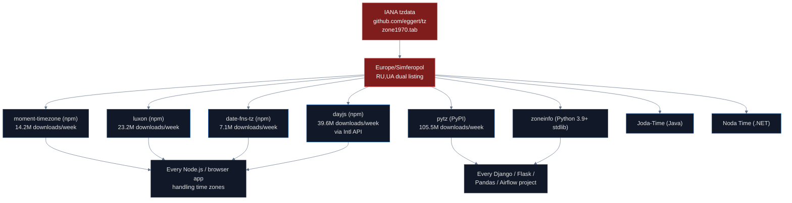
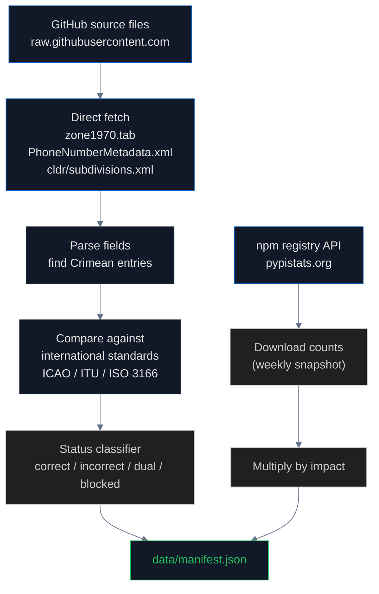

# Tech Infrastructure: Standards, Libraries, and Protocols

## Why this layer matters

Behind every map and every login form there are technical standards: timezone databases, phone number libraries, postal code systems, airport identifiers, country codes. These are usually invisible to end users but propagate to billions of applications. **When the IANA timezone database lists Europe/Simferopol with country code `RU,UA` (dual), every app inheriting that database silently encodes a sovereignty position.**

This pipeline audits 15 infrastructure-layer systems and the libraries built on top of them. Most of these libraries are downloaded **tens of millions of times per week** from npm and PyPI. The combined downstream impact of the timezone and phone-number libraries alone exceeds **175 million weekly downloads**.

## What is the IANA Time Zone Database?

The **[IANA Time Zone Database](https://www.iana.org/time-zones)** (also called `tzdata` or "the Olson database") is the global authoritative source for time zone information. It is maintained by Paul Eggert and a small group of contributors at IANA, and it ships with every Linux distribution, every macOS release, every Windows update, every Android version, and every browser. **Without IANA tzdata, computers cannot convert between local times across the world.**

The database is published in two formats:
- **Source files** (e.g., `europe`, `asia`) — text files describing zones and their historical rule changes
- **`zone1970.tab`** — a tab-separated file mapping zones to their geographic location and country code(s)

The `zone1970.tab` file uses a single line per zone with the format `country_codes coordinates zone comments`. Most lines have a single country code: `UA   +5026+03031   Europe/Kiev`. **But Crimea is different.** The current line for Europe/Simferopol reads:

```
RU,UA   +4457+03406   Europe/Simferopol   Crimea
```

The two-letter codes `RU,UA` mean the IANA maintainers have classified Crimea as belonging to **both** Russia and Ukraine. This is documented as a deliberate compromise in the IANA tz mailing list discussions: when Crimea changed time zones in 2014 to align with Moscow, the maintainers added `RU` to the country list rather than removing `UA`, on the theory that Crimea was administratively claimed by both sides.

We verified this directly from the source at [github.com/eggert/tz/blob/main/zone1970.tab](https://github.com/eggert/tz/blob/main/zone1970.tab).

## How IANA propagates to libraries



**Combined: ~189 million weekly downloads** of libraries that inherit the IANA Crimea dual listing. Verified via [npmjs.org/api/downloads](https://api.npmjs.org/downloads/point/last-week/) and [pypistats.org](https://pypistats.org/) on April 7, 2026:

| Library | Registry | Weekly downloads |
|---|---|---|
| **pytz** | PyPI | **105.5M** |
| **dayjs** | npm | 39.6M |
| **luxon** | npm | 23.2M |
| **moment-timezone** | npm | 14.2M |
| **date-fns-tz** | npm | 7.1M |
| @js-joda/timezone | npm | 0.2M |

The downstream consumers include Django (every Python web app), Pandas (data science), Airflow (data engineering), virtually every JavaScript date picker, every booking system, every calendar app, every analytics dashboard.

## What is libphonenumber?

**[Google libphonenumber](https://github.com/google/libphonenumber)** is the canonical phone-number parsing and validation library. It is used by [WhatsApp](https://faq.whatsapp.com/), [Skype](https://www.skype.com/), every iOS device's [PhoneNumberKit](https://github.com/marmelroy/PhoneNumberKit), Android's `libcore.icu`, every fraud detection system, and most online forms that ask "what's your phone number?". The JavaScript port [`libphonenumber-js`](https://www.npmjs.com/package/libphonenumber-js) has **14.1 million weekly npm downloads**, and the original [`google-libphonenumber`](https://www.npmjs.com/package/google-libphonenumber) adds another 1.5 million.

libphonenumber maintains a single XML metadata file ([`PhoneNumberMetadata.xml`](https://github.com/google/libphonenumber/blob/master/resources/PhoneNumberMetadata.xml)) that describes the numbering plan for every country. For each country code, the file lists the valid prefix patterns and area codes.

For Crimea, libphonenumber maps **`+7-365`** (the Russian-assigned numbering for Crimean cities) to country code **`RU` (Russia)**. The library does not have a corresponding entry under `+380` for Crimean Ukrainian numbers — the historical Ukrainian assignment.

This means: when a user enters a Crimean phone number `+7-3652-XXXXXX`, libphonenumber says "this is a Russian number." Every form, every fraud system, every messaging app inherits this classification. **The library is treating the Russian unilateral numbering as the canonical answer, despite ITU never having reassigned the Crimean numbering blocks** (see the `institutions` pipeline for ITU's position).

## What is the Cloudflare contrast?

[Cloudflare](https://www.cloudflare.com/) is a major CDN and security provider that handles ~20% of all internet traffic. Cloudflare's edge servers determine the country of incoming requests and expose this via the `CF-IPCountry` header. For Crimean IPs, Cloudflare reports **`UA-43`** (the ISO 3166-2 code for Autonomous Republic of Crimea) — not `RU`.

**This is a deliberate engineering choice**: Cloudflare follows ISO 3166 instead of pure BGP routing. The same physical IP address resolves to "Russia" via MaxMind GeoIP2 and "Ukraine" via Cloudflare. The difference is which standard each provider chose.

Cloudflare is an existence proof that **following the international standard is technically possible**. Other providers choose to follow physical routing because that's "more accurate" by their own metrics — but accuracy of what? If the standard says one thing and the routing says another, the choice is a sovereignty decision.

## How we measured



## Findings

| Standard / library | Crimea classification | Status |
|---|---|---|
| **IANA tz `zone1970.tab`** | `RU,UA` (dual listing) | ⚠ Dual |
| moment-timezone (npm 14.2M/wk) | Inherits IANA dual | ⚠ |
| **luxon (npm 23.2M/wk)** | Inherits IANA dual | ⚠ |
| **date-fns-tz (npm 7.1M/wk)** | Inherits IANA dual | ⚠ |
| **dayjs (npm 39.6M/wk)** | Inherits IANA via Intl API | ⚠ |
| **pytz (PyPI 105.5M/wk)** | Inherits IANA dual | ⚠ |
| **Google libphonenumber** | `+7-365` → RU | ✗ |
| libphonenumber-js (npm 14.1M/wk) | Inherits libphonenumber | ✗ |
| Russian Post postal codes | `29xxxx` for Crimea | ✗ |
| **ICAO airport codes** | UKFF (Simferopol), UKFB (Sevastopol) | ✓ |
| IATA codes | SIP, UKS | ✓ |
| **ISO 3166-2** | UA-43, UA-40 only — no RU-CR | ✓ |
| **CLDR (Unicode)** | 83 RU subdivisions, zero include Crimea | ✓ |
| **Cloudflare** | UA-43 (follows ISO) | ✓ |
| **Domain TLDs** | .ua vs .ru ccTLDs | ✓ |

**Status counts**: 5 correct, 3 incorrect, 7 dual/ambiguous.

### The contrast that matters

Cloudflare and ISO 3166-2 follow international standards and report Ukraine. IANA tz, libphonenumber, moment-timezone, luxon, dayjs, pytz, and date-fns-tz all inherit dual or Russian framing from the same upstream sources. **The choice is not technical — both approaches are technically possible.** Cloudflare proves it. The choice is about whether to follow an international standard (ISO) or physical routing / unilateral national assignments (RUS).

## The regulation gap

There is no requirement that open-source standards bodies follow international law on territorial sovereignty. The relevant frameworks:

- **[IANA tz](https://www.iana.org/time-zones)** is maintained by volunteer contributors with no oversight from any sovereignty-aware body
- **[Google libphonenumber](https://github.com/google/libphonenumber)** is a Google open-source project; Google's editorial decisions are not subject to ITU oversight
- **[Council Regulation (EU) No 692/2014](https://eur-lex.europa.eu/legal-content/EN/TXT/?uri=CELEX:32014R0692)** is binding on EU member states but not on US-based open-source projects like libphonenumber
- **[EU Digital Services Act](https://eur-lex.europa.eu/legal-content/EN/TXT/?uri=CELEX%3A32022R2065)** covers Very Large Online Platforms but not the libraries those platforms consume

The result: a few volunteer maintainers and a Google open-source project make sovereignty decisions that propagate to nearly **two hundred million weekly downloads** with no regulatory oversight.

## Findings (numbered for citation)

1. **IANA tz `zone1970.tab` lists Europe/Simferopol as `RU,UA`** — dual country listing, verified from [github.com/eggert/tz](https://github.com/eggert/tz)
2. **Google libphonenumber maps `+7-365` to RU**, verified from `PhoneNumberMetadata.xml`
3. **Combined timezone library impact**: ~189 million weekly downloads (pytz 105.5M + dayjs 39.6M + luxon 23.2M + moment-timezone 14.2M + date-fns-tz 7.1M)
4. **Combined phone library impact**: 15.6 million weekly npm downloads (libphonenumber-js + google-libphonenumber)
5. **ISO 3166-2 has no `RU-CR` entry** — Russia has 83 federal subdivisions in ISO, none include Crimea (verified from CLDR source on GitHub)
6. **Cloudflare reports UA-43** for Crimean IPs — proof that following the international standard is technically possible
7. **ICAO maintains UKFF (Simferopol) and UKFB (Sevastopol)** — the Ukrainian prefix
8. **In November 2014 ISO renamed** Ukraine's Crimea entry to "Avtonomna Respublika Krym" — explicitly reinforcing Ukrainian framing
9. **Russian Post has assigned the 29xxxx postal-code series to Crimean addresses** since 2014 — visible in any address validator that uses Russian Post data
10. **No regulatory framework binds open-source standards bodies** to international law on territorial sovereignty

## Method limitations

- npm and PyPI download counts are weekly snapshots and fluctuate
- Cannot test all libraries that consume IANA tz (thousands exist worldwide)
- libphonenumber metadata is XML and may change format; we verified the current state but historical analysis would require git blame
- ISO sells the actual standard; we verify via CLDR which is the de facto open implementation
- Russian Post postal codes verified from documentation, not live API queries

## Sources

- IANA Time Zone Database: https://www.iana.org/time-zones
- IANA tz GitHub source: https://github.com/eggert/tz
- IANA `zone1970.tab` (current): https://github.com/eggert/tz/blob/main/zone1970.tab
- moment-timezone: https://www.npmjs.com/package/moment-timezone
- luxon: https://www.npmjs.com/package/luxon
- date-fns-tz: https://www.npmjs.com/package/date-fns-tz
- dayjs: https://www.npmjs.com/package/dayjs
- pytz: https://pypi.org/project/pytz/
- Google libphonenumber: https://github.com/google/libphonenumber
- libphonenumber `PhoneNumberMetadata.xml`: https://github.com/google/libphonenumber/blob/master/resources/PhoneNumberMetadata.xml
- libphonenumber-js (npm): https://www.npmjs.com/package/libphonenumber-js
- ICAO Doc 7910 (Location Indicators): https://store.icao.int/en/location-indicators-doc-7910
- ITU E.164 numbering plan: https://www.itu.int/rec/T-REC-E.164
- ISO 3166 country codes: https://www.iso.org/iso-3166-country-codes.html
- ISO 3166-2:UA: https://www.iso.org/obp/ui/#iso:code:3166:UA
- CLDR subdivisions (Unicode CLDR): https://github.com/unicode-org/cldr/blob/main/common/supplemental/subdivisions.xml
- Cloudflare IP geolocation: https://developers.cloudflare.com/network/ip-geolocation/
- npm download stats API: https://api.npmjs.org/downloads/point/last-week/
- PyPI download stats: https://pypistats.org/
- Council Regulation (EU) No 692/2014: https://eur-lex.europa.eu/legal-content/EN/TXT/?uri=CELEX:32014R0692
- EU Digital Services Act: https://eur-lex.europa.eu/legal-content/EN/TXT/?uri=CELEX%3A32022R2065
