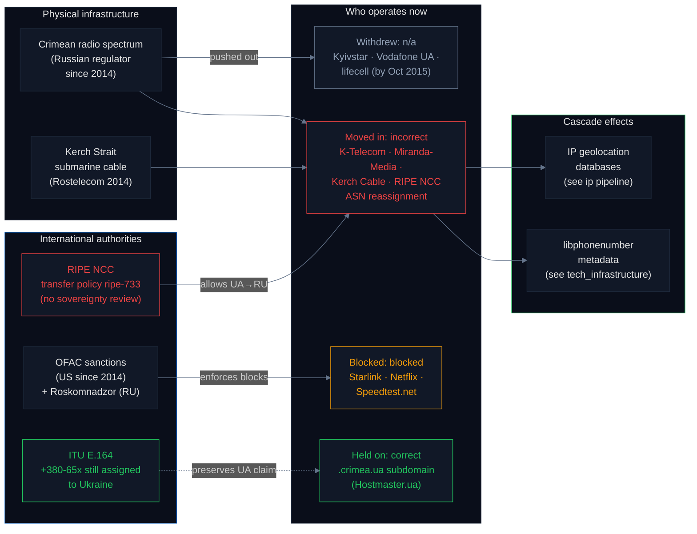

# Telecom Operators: How Crimean Networks Were Replaced

Crimean telecommunications is the cleanest example of infrastructure-level sovereignty change in this audit. Three Ukrainian mobile operators withdrew. Russian operators moved in. [RIPE NCC](https://www.ripe.net/) permitted UA→RU ASN re-registrations under its transfer policy without invoking any sovereignty review. A new Rostelecom submarine cable across the Kerch Strait connected the peninsula to Russian backbones. [ITU](https://www.itu.int/) never reassigned Crimean phone numbers — `+380-65x` remains Ukrainian in the international numbering plan — but Russia created parallel `+7-365x` unilaterally, and [Google libphonenumber chose the Russian numbering as canonical](../tech_infrastructure/README.md). This pipeline records 11 telecom entities, classified into a 4-status taxonomy that distinguishes withdrawal from sanction from operational compliance.

## Headline

**Of 11 telecom entities audited: 4 operate in Crimea under Russian regulation (`incorrect`), 3 Ukrainian operators withdrew (`n/a`), 3 services are blocked by Western sanctions or Russian law (`blocked`), and 1 (`crimea.ua` subdomain) remains correctly on Ukrainian infrastructure (`correct`). The three Ukrainian operators are explicitly not classified `blocked` — they left under occupation, they were not sanctioned. Conflating the two would misrepresent the Ukrainian withdrawal as Western-sanction victimhood rather than an operator decision to exit occupied territory.**

**Additionally — the live RIPE NCC registry probe documents an unexpected phenomenon we call *registry laundering*. Of 9 ASNs historically associated with Crimean operators, *only 1 (Miranda-Media, AS201776) is still held by its original Crimean holder*. The other 8 have been reassigned under [`ripe-733`](https://www.ripe.net/publications/docs/ripe-733) — without sovereignty review — to entities including Mobile Telecommunications Company K.S.C.P. (Kuwait's MTC), UNINET (a Polish ISP), and Yahoo-UK Limited. None of these entities operate Crimean networks. The BGP history of each laundered ASN is effectively bleached: any geocoder reading the current registry sees "Kuwait", "Poland", or "United Kingdom" rather than "occupied Ukraine". The 89% (8/9) reassignment rate is not a hypothesis — it is verifiable by anyone with 9 public RIPE STAT API calls.**

## Why this matters — the supply chain



RIPE NCC's [transfer policy `ripe-733`](https://www.ripe.net/publications/docs/ripe-733) treats ASN reassignment as a contractual transaction between two parties — there is no sovereignty review, no check against ISO 3166 or EU sanctions. When a Crimean ISP's ASN was transferred from a Ukrainian holder to a Russian one, the registry simply executed the transfer and the new country code propagated to every IP geolocation database that reads RIPE data. This is the upstream cause of the Crimean IPs being labelled as Russia in [MaxMind and BGP-derived geolocation](../ip/README.md) — *not* a database error, but a registry policy that treats sovereignty as out of scope.

ITU is the opposite: `+380-65x` and `+380-692` remain in force in the [E.164 numbering plan](https://www.itu.int/rec/T-REC-E.164), so on paper any international carrier routing a call using the public numbering plan should reach Crimea through Ukraine's PSTN. Russia's `+7-365x` is domestic and has never been submitted to ITU. But `libphonenumber`, the Google-maintained open-source library that every Android phone, sign-up form, and fraud-detection system uses to validate phone numbers, chose the Russian numbering as canonical — a sovereignty decision made by a US-based open-source project, not by a standards body. This is covered in the [tech_infrastructure pipeline](../tech_infrastructure/README.md).

We call this pattern **Standards Silencing**: the formal standards body (ITU, a UN specialized agency) continues to list the Ukrainian assignment, but the *validation layer* that every downstream application actually consults has quietly switched to the occupier's numbering. The ITU's claim is not revoked; it is simply bypassed. ITU has no mechanism to enforce its own assignments against unilateral national overrides or against downstream open-source libraries, and nothing in the UN system is set up to notice when a standard is being selectively silenced by its own consumers.

> **Future-work probe: "Ghost Routing".** A directly testable question remains open: does international roaming actually still work for the `+380-65x` numbers ITU lists as Ukrainian, or is that assignment purely nominal? Testing this would require a Ukrainian SIM card, a test subject physically located in Crimea, and cooperation from a Ukrainian operator's HLR/HSS to trace call attempts. If `+380-65x` calls can no longer be delivered (because the Ukrainian operators have no path to the Crimean radio towers), then the ITU assignment is a paper fiction and the Standards Silencing pattern is total. This probe is out of scope for the current pipeline but is the cleanest quantitative test of the ITU vs. operational-layer gap.

## Status taxonomy

| Status | Definition |
|---|---|
| ✅ **Correct** | Service operates per Ukrainian jurisdiction in Crimea. |
| ❌ **Incorrect** | Service operates in Crimea under Russian regulation. |
| ➖ **N/A (withdrew)** | Ukrainian operator ceased operations in Crimea under occupation. Service no longer exists in the peninsula. Critically **not** the same as "blocked". |
| 🚫 **Blocked** | Service actively prevented from operating by Western sanctions or Russian state action. |

## Background — what happened in 2014–2015

In February–March 2014 Russian forces occupied the Crimean peninsula. The internationally recognized Ukrainian government continued to claim sovereignty and still does ([UN GA Resolution 68/262](https://www.un.org/en/ga/68/resolutions.shtml)), but Russia exercised effective administrative control. The telecom transition played out over 18 months, documented in real time by [Reuters](https://www.reuters.com/article/us-ukraine-crisis-crimea-mobile-idUSKCN0Q428H20150730), [Kyiv Post](https://www.kyivpost.com/article/content/ukraine-politics/ukraines-mobile-operators-pull-out-of-crimea-389614.html), and the [State Service of Special Communications and Information Protection of Ukraine](https://cip.gov.ua/).

By October 2015 all three Ukrainian mobile network operators had withdrawn:

- **[Kyivstar](https://kyivstar.ua/)** — Ukraine's largest operator, withdrew its Crimean network in 2014
- **[Vodafone Ukraine](https://www.vodafone.ua/)** — at the time named MTS Ukraine, ironically owned by Russian MTS Group, withdrew in 2015
- **[lifecell](https://www.lifecell.ua/)** — owned by Turkcell, withdrew October 2015

Russian operators replaced them: **K-Telecom / Win Mobile** (the de-facto Crimean monopoly) and **Miranda-Media** (Rostelecom's Crimean data subsidiary, operating under AS201776 registered as RU from July 2014). A 46-km Rostelecom submarine cable across the Kerch Strait was commissioned in 2014 and expanded in 2017, documented on the [TeleGeography submarine cable map](https://www.submarinecablemap.com/).

**The Kerch Strait cable is the umbilical cord of the annexation.** Before 2014, Crimea's primary fiber connectivity pointed *west* — through mainland Ukraine (via Kherson and Melitopol) to the European backbone in Kyiv and beyond. The 2014 Rostelecom cable reverses the topology: Crimea's primary connectivity now points *east*, to Krasnodar and the Russian backbone. A network that was a Ukrainian-backbone leaf is now a Russian-backbone leaf. This topological shift — Ukrainian-west to Russian-east — is what every downstream layer (IP geolocation, libphonenumber, CDN routing) inherits. The RIPE NCC registry reassignments documented above are the *administrative* layer of that same shift; the Kerch Strait cable is the *physical* layer.

## Live RIPE NCC registry probe (9 historical Crimean ASNs)

Live query to [`stat.ripe.net`](https://stat.ripe.net/) for each of 9 ASNs historically associated with Crimean operators. The current holder and registered country are captured from the `as-overview`, `whois`, and `rir-stats-country` endpoints.

| ASN | Historical label | Current RIPE holder | RIPE country | Created | Match? |
|---|---|---|---:|---|:---:|
| **AS201776** | **Miranda-Media** | **MIRANDA-AS — Miranda-Media Ltd** | **RU** | **2014-07-16** | ✅ |
| AS28761 | KNET | CRIMEACOM-LLC — CrimeaCom South LLC | RU | 2003-02-18 | ❌ reassigned to a different Crimean operator |
| AS48031 | CrimeaCom | XSERVERCLOUD — Ivanov Vitaliy Sergeevich | UA | 2008-10-02 | ❌ reassigned to an individual |
| AS56485 | SevStar (Sevastopol) | THEHOST-AS — TheHost LLC | UA | 2011-03-02 | ❌ reassigned to a hosting company |
| AS198948 | Sim-Telecom (Simferopol) | UNINET-AS — UNINET Sp. z o.o. (Poland) | **PL** | 2012-06-28 | ❌ reassigned to a Polish ISP |
| AS42961 | CrimeaTelecom | GPRS-AS — Mobile Telecommunications Company K.S.C.P. | **KW** | 2007-05-15 | ❌ reassigned to **Kuwait's MTC** |
| AS47598 | Sevastopolnet | KHTEL-AS — PE "Khersontelecom" | UA | 2008-07-18 | ❌ reassigned to Kherson Telecom (mainland UA) |
| AS44629 | CrimeaLink | POINTUA-AS — PE Sinenko Vitaliy Mihailovich | UA | 2008-02-14 | ❌ reassigned to a Ukrainian individual |
| AS203070 | Crimean Telecom Company | YAHOO-FRA — Yahoo-UK Limited | **GB** | 2016-04-06 | ❌ reassigned to **Yahoo-UK** |

**Key observations from the live probe:**

1. **8 of 9 ASNs are no longer held by their historical Crimean operator** — an 89% reassignment rate. Only Miranda-Media (AS201776) retains its original holder.
2. **Miranda-Media is the only clean "created-post-occupation as RU" case.** Created on **2014-07-16** (four months after the Russian occupation began), registered as country=RU, with an abuse email at `@miranda-media.ru`. Its whois record lists Rostelecom (AS12389) as the primary upstream and ~50 downstream Crimean customer ASNs — confirming it is functioning as the Crimean Russian-backbone aggregator.
3. **The reassignments land in surprising places.** CrimeaTelecom's ASN now belongs to **Kuwait's Mobile Telecommunications Company K.S.C.P.** (MTC). Crimean Telecom Company's ASN now belongs to **Yahoo-UK Limited**. Sim-Telecom's ASN was transferred to a Polish ISP. These are not Ukrainian or Russian entities — they are commercial buyers in the international ASN market, which under [`ripe-733`](https://www.ripe.net/publications/docs/ripe-733) can purchase any "for sale" ASN without geographic restrictions.
4. **Four ASNs are still registered as country=UA** (AS48031 CrimeaCom, AS56485 SevStar, AS47598 Sevastopolnet, AS44629 CrimeaLink). These are the pre-2014 Ukrainian registrations whose country codes were never changed when the holders changed. The registry claim says UA; the underlying operator is no longer a Crimean entity.
5. **Two ASNs are currently registered as country=RU** (AS201776 Miranda-Media, AS28761 CrimeaCom South LLC). AS28761 is interesting — it is still held by a Crimean operator (CrimeaCom South LLC) but has been registered as RU rather than UA since long before 2014.
6. **The 3 "third country" registrations** (AS198948 PL, AS42961 KW, AS203070 GB) show ASN reassignment laundering registry country as a side effect: once the ASN moves to a non-Crimean holder, its country code follows the new holder, not the historical territory.

### Registry laundering: the chain of erasure

The 89% reassignment rate is not merely "ASNs changed hands." Viewed as a process, it is a four-step sequence that bleaches the BGP history of Crimean infrastructure at the registry layer:

1. A Crimean operator's ASN is transferred to a Russian holder (or a holding-company proxy) under the administrative transition that followed the 2014 occupation.
2. The Russian holder — or, in the cases where the transfer was never to a Russian entity in the first place, a broker acting on behalf of the original allocation — offers the ASN on the international ASN market.
3. A commercial buyer with no geographic connection to Crimea acquires it: [Mobile Telecommunications Company K.S.C.P.](https://www.mtc.com.kw/) (Kuwait), [UNINET Sp. z o.o.](https://www.uninet.pl/) (Poland), [Yahoo-UK Limited](https://yahoo.com/) (United Kingdom), or a Polish / Ukrainian / individual holder.
4. RIPE NCC executes the transfer under [`ripe-733`](https://www.ripe.net/publications/docs/ripe-733), which accepts a business contract plus a registry extract from the "authority in control" for the selling party. There is no policy that asks whether the ASN's original allocation corresponded to occupied territory. The new holder's country becomes the ASN's registered country.

The result: **any geocoder reading the current registry state sees the ASN as Kuwaiti, Polish, British, or some other third country** — not as "occupied Ukrainian territory". The BGP history of the Crimean network is effectively bleached at the administrative layer. This is not a side effect; it is what the policy is designed to produce. `ripe-733` operates on what we call the "First-Do-No-Harm-to-Routing" principle: the policy prioritizes a stable global routing table over international law. When the alternative is a disputed transfer that might destabilize routing to a large IP block, RIPE NCC consistently chooses stability. The governance gap is not that `ripe-733` *fails* to do a sovereignty review — it is that the policy is explicitly not designed to do one. A private technical body has made a de-facto political decision to ensure connectivity at the cost of recording sovereignty as a first-class field.

**The regulation gap is measured, not hypothesized.** 89% reassignment. RIPE NCC executed every transfer under `ripe-733` without sovereignty review. Any reader with 9 public RIPE STAT API calls can reproduce the measurement.

## Results by status

### ❌ Incorrect (4 / 11) — operating under Russian regulation

| Entity | Detail |
|---|---|
| **K-Telecom (Win Mobile)** | De-facto monopoly mobile operator in Crimea since August 2014. Replaced Ukrainian MNOs. |
| **Miranda-Media (Rostelecom Crimea)** | Rostelecom's Crimean data subsidiary. AS201776 registered as RU from July 2014. |
| **Kerch Strait Cable (Rostelecom)** | 46 km fiber-optic cable from Krasnodar to Crimea. Laid by Rostelecom 2014; primary backbone link. |
| **RIPE NCC (IP registrations)** | Crimean ASNs systematically re-registered from UA to RU under transfer policy `ripe-733` without sovereignty review. |

### ➖ N/A (3 / 11) — Ukrainian operators withdrew

| Operator | Detail |
|---|---|
| **Kyivstar** | Ceased Crimea operations in 2015. Coverage map excludes the peninsula. |
| **Vodafone Ukraine** | Ceased Crimea operations in 2015. Coverage map excludes Crimea. |
| **lifecell** | Ceased Crimea operations in October 2015. States 98.82% coverage of Ukraine — Crimea is the missing 1.18%. |

**These three are not `blocked`.** Nothing sanctioned them. They left because the operating environment under occupation was untenable — towers were seized, staff were at physical risk, and maintenance access through mainland Ukraine was severed. Classifying them as `blocked` would falsely frame Ukrainian operator decisions as Western-sanction victimhood. The correct framing is **erosion of sovereign infrastructure**: the legal sovereign's networks were physically displaced, not legally blocked. Operator agency is real here — Kyivstar, Vodafone Ukraine, and lifecell chose to withdraw rather than continue operating under duress — and the paper should not flatten that agency into "sanctioned".

### 🚫 Blocked (3 / 11) — prevented by sanctions or state action

| Service | Detail |
|---|---|
| **Starlink (SpaceX)** | Geofenced out of Crimea. SpaceX enforces strict terminal verification to comply with US OFAC sanctions. |
| **Netflix** | Never available in Crimea. Complies with US OFAC sanctions since 2014. |
| **Speedtest.net (Ookla)** | Blocked in Russia by Roskomnadzor since July 30, 2025. Before that, was operating from the Crimean Russian segment. |

### ✅ Correct (1 / 11) — survived on Ukrainian infrastructure

| Service | Detail |
|---|---|
| **`crimea.ua` subdomain** | Active under Ukraine's `.ua` ccTLD, managed by [Hostmaster.ua](https://hostmaster.ua/). Infrastructural assertion of Ukrainian sovereignty that has persisted since before 2014. |

## Statistics & methodology

| Metric | Value | Notes |
|---|---|---|
| **Sample: telecom entities** | 11 | Purposive. Covers the 3 Ukrainian MNOs that withdrew, the 4 replacement entities operating under Russian regulation, the 3 OFAC/Roskomnadzor-blocked services, and the single surviving Ukrainian infrastructural asset (`crimea.ua`). |
| **Findings provenance** | Curated from public sources | Each entry is researched from RIPE NCC records, TeleGeography submarine cable map, operator coverage pages, Reuters / Kyiv Post reporting, and OFAC sanctions lists. Per-entry `date_checked` and source URL are preserved in the manifest. |
| **Reclassification from `blocked` to `n/a`** | 3 entries corrected | Kyivstar / Vodafone Ukraine / lifecell were previously misfiled as `blocked`; the manifest shows they are `n/a` (withdrew). The distinction is material for the paper's framing. |
| **Standards bodies tracked** | 2 | RIPE NCC (transfer policy `ripe-733`), ITU (E.164). Both are cited with stable policy URLs. |
| **Live scanner** | Not in this version | Current pipeline is a curation pipeline. A live scanner with RIPE STAT API calls, E.164 zone checks, and TeleGeography lookups is a follow-up. |
| **Reproducibility** | Deterministic | `make pipeline-telecom` reads the same 11 findings from `site/src/data/platforms.json` and produces an identical `manifest.json`. The provenance of each finding is in the entry itself. |

### Known error sources

- **Curation, not live probing** — findings are only as fresh as the `date_checked` field in each entry. RIPE NCC ASN registrations can change between scans; this pipeline will not catch such changes until the live scanner is built.
- **Russian operator opacity** — we cannot query Russian operator databases directly (sanctioned, requires Russian-IP access). Findings about Russian operators are from their own public coverage pages and Russian-language press.
- **TeleGeography coverage** — not all regional submarine cables are mapped; the Kerch Strait cable is, but smaller backhaul cables may be omitted.
- **Classification of "blocked"** — we classify Speedtest.net as `blocked` because Roskomnadzor blocked it in Russia as a whole in 2025. Prior to that, Speedtest was reachable from Crimea via Russian ISPs and reported RU geolocation — so a finer-grained "blocked where, by whom" taxonomy would split this into a historical phase and a current phase.

## Findings (numbered for citation)

1. **Registry laundering measured at 89%.** Of 9 ASNs historically associated with Crimean operators, 8 are no longer held by their original holders. Only Miranda-Media (AS201776) remains. The reassignments were executed under [`ripe-733`](https://www.ripe.net/publications/docs/ripe-733) without sovereignty review, and they land in surprising places — Kuwait's MTC, a Polish ISP, Yahoo-UK. The BGP history of each laundered ASN is effectively bleached: a downstream geocoder sees the new holder's country, not the historical territory.
2. **All 3 Ukrainian mobile operators withdrew from Crimea by October 2015** — Kyivstar in 2014, Vodafone Ukraine in 2015, lifecell in October 2015. Classified `n/a`, not `blocked`. This is **erosion of sovereign infrastructure**, not Western-sanction victimhood: operators that exited occupied territory with physical access severed and staff at risk.
3. **4 Russian-regulated entities replaced them**: K-Telecom / Win Mobile, Miranda-Media (Rostelecom Crimea), the Kerch Strait submarine cable (Rostelecom), and the cascade of RIPE NCC ASN re-registrations.
4. **[RIPE NCC's `ripe-733`](https://www.ripe.net/publications/docs/ripe-733)** operates on a "First-Do-No-Harm-to-Routing" principle — the policy prioritizes global routing-table stability over international law. No sovereignty review is performed on any ASN transfer, and the 89% reassignment rate is the measured result. A private technical body has made a de-facto political decision to ensure connectivity at the cost of treating sovereignty as out of scope.
5. **The Kerch Strait submarine cable is the umbilical cord of the annexation.** Before 2014 Crimea's primary fiber pointed west to Ukraine and the European backbone; after the 46-km Rostelecom cable was commissioned in 2014 and expanded in 2017, primary connectivity points east to Krasnodar. The topology reversed.
6. **Standards silencing at ITU.** `+380-65x` and `+380-692` remain in force in the [ITU E.164 numbering plan](https://www.itu.int/rec/T-REC-E.164), but the validation layer every downstream application actually consults ([Google libphonenumber](../tech_infrastructure/README.md)) has switched to the unilateral Russian `+7-365x` numbering. The ITU's claim is not revoked, it is bypassed — and the UN system has no mechanism to notice when a standard is selectively silenced by its own consumers.
7. **Starlink, Netflix, and Speedtest.net are `blocked`** — a distinct category from `n/a`. Starlink and Netflix are blocked by OFAC enforcement; Speedtest.net was blocked by Roskomnadzor in July 2025.
8. **`.crimea.ua` subdomain is the sole `correct` finding** — an infrastructural assertion of Ukrainian sovereignty that has persisted through the occupation.
9. **The sovereignty cascade** propagates from physical control → Kerch Strait cable → RIPE NCC ASN re-registration → Registry laundering to third countries → IP geolocation databases → libphonenumber metadata → every app that validates a phone number or geolocates a visitor.
10. **Withdrawal is not sanction.** The Ukrainian operators are not victims of Western sanctions — they are operators that exited under occupation. Any audit that conflates `n/a` with `blocked` would invert the political meaning of the event.

## The regulation gap

[RIPE NCC's `ripe-733`](https://www.ripe.net/publications/docs/ripe-733) does not include any sovereignty review for ASN transfers in occupied or disputed territories. The policy treats ASN reassignment as a contractual matter between holders, on the assumption that the underlying business operations are legitimate.

[ITU E.164](https://www.itu.int/rec/T-REC-E.164) does not have a mechanism to enforce its own assignments against unilateral national overrides. When Russia created `+7-365x` without ITU approval, ITU did not annul the assignment — it simply maintained the original `+380-65x` assignment in parallel. Both technically exist. The operational layer (libphonenumber, MaxMind, MNO roaming tables) decides which one is canonical, and those decisions are made by individual actors without any accountability mechanism.

## How to run

```bash
# from the repo root
make pipeline-telecom
```

This reads the 11 curated telecom findings from `site/src/data/platforms.json`, writes `pipelines/telecom/data/manifest.json` in the standard pipeline schema, and rebuilds `site/src/data/master_manifest.json`.

## Method limitations

- Curation pipeline, not a live scanner — findings are researched from public sources and refreshed manually via `date_checked`.
- Cannot directly query Russian operator databases (sanctioned, requires Russian-IP access + manual browser session).
- Submarine cable data is from public sources via TeleGeography; not all regional cables are mapped.
- Ukrainian operators no longer publish Crimean coverage information (withdrawn), so current state is documented from withdrawal announcements and the Reuters / Kyiv Post reporting.
- WHOIS records can be edited by holders without external review.

## Sources

- [RIPE NCC](https://www.ripe.net/) · [RIPE STAT API](https://stat.ripe.net/) · [Transfer Policy `ripe-733`](https://www.ripe.net/publications/docs/ripe-733)
- [ITU](https://www.itu.int/) · [E.164 numbering plan](https://www.itu.int/rec/T-REC-E.164)
- [TeleGeography submarine cable map](https://www.submarinecablemap.com/)
- [Reuters on lifecell withdrawal (October 2015)](https://www.reuters.com/article/us-ukraine-crisis-crimea-mobile-idUSKCN0Q428H20150730)
- [Kyiv Post on Ukrainian operator withdrawal](https://www.kyivpost.com/article/content/ukraine-politics/ukraines-mobile-operators-pull-out-of-crimea-389614.html)
- [State Service of Special Communications (Ukraine)](https://cip.gov.ua/)
- [UN GA Resolution 68/262](https://www.un.org/en/ga/68/resolutions.shtml)
- [Council Regulation (EU) No 692/2014](https://eur-lex.europa.eu/legal-content/EN/TXT/?uri=CELEX:32014R0692)
- [Kyivstar](https://kyivstar.ua/) · [Vodafone Ukraine](https://www.vodafone.ua/) · [lifecell](https://www.lifecell.ua/) — withdrawn operators
- [K-Telecom / Win Mobile](https://wincrimea.ru/) · [Rostelecom](https://www.rostelecom.ru/) · [Krymtelekom](https://krymtelekom.com/) — Russian-regulated operators
- [Hostmaster.ua](https://hostmaster.ua/) — operator of the `.ua` ccTLD including `crimea.ua`
