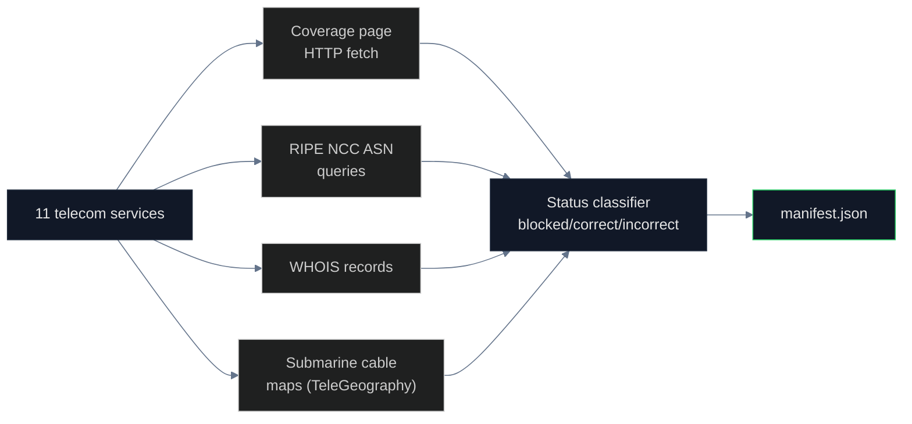

# Telecom Operators Audit

## Name
`telecom` — Mobile and fixed-line telecom operators in Crimea

## Why
After Russia's 2014 annexation, all three Ukrainian mobile operators (Kyivstar, Vodafone Ukraine, lifecell) were forced to withdraw by 2015. Russian operators (MTS, MegaFon, Win Mobile/K-Telecom) replaced them. The transition involved RIPE NCC permitting ASN re-registration and submarine cable rerouting via the Kerch Strait. This pipeline documents who controls Crimean telecom infrastructure and how international telecom registries handle it.

## What
Audits 11 telecom services and registries:

- **Withdrawn Ukrainian operators**: Kyivstar, Vodafone Ukraine, lifecell (3, all blocked)
- **Active Russian operators in Crimea**: MTS, MegaFon, K-Telecom/Win Mobile, Krymtelekom
- **Infrastructure**: Kerch Strait submarine cable (Rostelecom), Miranda-Media (Rostelecom Crimea)
- **Registries**: RIPE NCC ASN registrations, ITU country code +380 vs +7 mapping
- **Roaming partners**: Turkcell (correctly reports +380 for Crimean numbers)

## How



## Run

```bash
cd pipelines/telecom
uv sync
uv run scan.py
```

## Results

| Status | Count |
|---|---|
| Correct (correctly attributes Crimea to UA) | 1 |
| Incorrect (treats Crimea as Russian territory) | 4 |
| Blocked (Ukrainian operators forced out) | 3 |
| N/A | 3 |

## Conclusions

The Crimean telecom landscape is the cleanest example of **infrastructure-level sovereignty change**. Three Ukrainian operators withdrew under threat. Russian operators moved in. RIPE NCC allowed administrative reassignment of ASNs without sovereignty review. Submarine cables were extended from Russia via the new Kerch Strait infrastructure (built in 2017 specifically for telecom and electricity).

ITU has not reassigned Crimean phone numbers (+380-65x remains Ukrainian) but Russia created parallel +7-365x numbering unilaterally. Both systems are active.

## Findings

1. **All 3 Ukrainian operators withdrew by Oct 2015** under Russian pressure
2. **RIPE NCC permitted UA→RU ASN re-registration** without policy
3. **Kerch Strait submarine cable** (commissioned 2014, expanded 2017) carries Crimean traffic to Russia
4. **+7-365x numbering created unilaterally** — never approved by ITU
5. **+380-65x remains active in ITU records** — Ukraine's claim preserved
6. **Turkcell roaming correctly attributes Crimean +380 numbers** to Ukraine

## Limitations

- Cannot directly query Russian operator databases (sanctioned, requires Russian IP)
- Submarine cable data from public sources; not all are mapped
- Ukrainian operators no longer publish Crimean coverage info (withdrawn)

## Sources

- RIPE NCC ASN registry: https://stat.ripe.net/
- TeleGeography submarine cable map: https://www.submarinecablemap.com/
- ITU-T E.164 numbering plan
