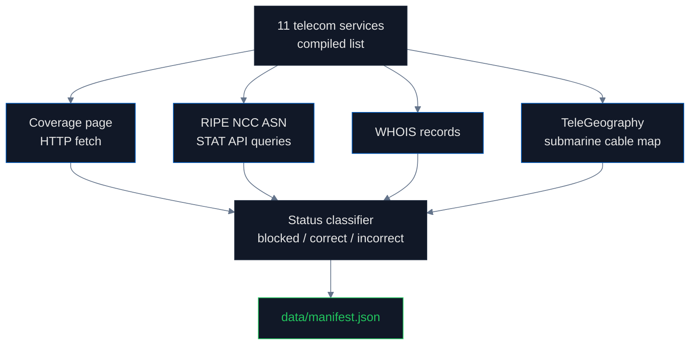

# Telecom Operators: How Crimean Networks Were Replaced

## What this pipeline documents

This pipeline records what happened to Crimean telecommunications between 2014 and 2026. It is one of the cleanest examples of **infrastructure-level sovereignty change** in any of our audits — three Ukrainian operators were forced out, Russian operators moved in, ITU did not reassign Crimean phone numbers, and submarine cables were extended from Russia via the Kerch Strait. We document each piece because the telecom story explains how the IP geolocation changes (`ip` pipeline) and the libphonenumber metadata changes (`tech_infrastructure` pipeline) became technically possible.

## Background — what happened in 2014–2015

In February–March 2014 Russian forces occupied the Crimean peninsula. The internationally recognized Ukrainian government continued to claim sovereignty (and still does, see [UN GA Resolution 68/262](https://www.un.org/en/ga/68/resolutions.shtml)), but Russia exercised effective administrative control. The transition is documented in real time by [Reuters](https://www.reuters.com/article/us-ukraine-crisis-crimea-mobile-idUSKCN0Q428H20150730), [Kyiv Post](https://www.kyivpost.com/article/content/ukraine-politics/ukraines-mobile-operators-pull-out-of-crimea-389614.html), and the [State Service of Special Communications and Information Protection of Ukraine](https://cip.gov.ua/).

By October 2015 all three Ukrainian mobile network operators had withdrawn from Crimea:

- **[Kyivstar](https://kyivstar.ua/)** — Ukraine's largest mobile operator (40+ million subscribers nationally), withdrew in 2014
- **[Vodafone Ukraine](https://www.vodafone.ua/)** — at the time named MTS Ukraine, ironically owned by Russian MTS Group, withdrew its Crimean network in 2015
- **[lifecell](https://www.lifecell.ua/)** — owned by Turkcell, withdrew in October 2015 ([Reuters coverage](https://www.reuters.com/article/us-ukraine-crisis-crimea-mobile-idUSKCN0Q428H20150730))

Russian operators moved in to fill the spectrum:

- **[MTS](https://www.mts.ru/)** — Russia's largest mobile operator
- **[MegaFon](https://www.megafon.ru/)** — second-largest Russian operator
- **K-Telecom / Win Mobile** — operates as the formal Crimean carrier under Russian regulation
- **[Krymtelekom](https://krymtelekom.com/)** — fixed-line successor

A new submarine cable was constructed across the Kerch Strait, commissioned in 2014 by [Rostelecom](https://www.rostelecom.ru/) and expanded in 2017 to provide telecom and electricity links from mainland Russia. This is documented on the [TeleGeography submarine cable map](https://www.submarinecablemap.com/).

## What is RIPE NCC and why does it matter for sovereignty?

**[RIPE NCC](https://www.ripe.net/) (Réseaux IP Européens Network Coordination Centre)** is the [Regional Internet Registry](https://en.wikipedia.org/wiki/Regional_Internet_registry) for Europe, the Middle East, and parts of Asia. It allocates IP address blocks and Autonomous System Numbers (ASNs) to ISPs in its region. Both Ukraine and Russia fall under RIPE NCC's jurisdiction.

When a Ukrainian ISP withdraws from Crimea and a Russian operator takes over the same physical infrastructure, the IP space and ASN need to be reassigned. RIPE NCC's [transfer policy (`ripe-733`)](https://www.ripe.net/publications/docs/ripe-733) treats ASN reassignment as an **administrative transaction between consenting parties** — there is no sovereignty review. The political implications are invisible to the registry process.

**RIPE NCC permitted ASN re-registrations from Ukrainian to Russian holders without invoking any sovereignty policy.** The transfer simply happened. As a result, IP geolocation databases (which read RIPE NCC data) silently updated their country codes from Ukraine to Russia. This is how the upstream change in physical control propagated to every analytics dashboard, every fraud system, every CDN that uses BGP-derived geolocation.

The Cloudflare contrast (covered in the `ip` and `tech_infrastructure` pipelines) shows that following ISO 3166 instead of BGP-derived country codes is technically possible. It just requires choosing the international standard over the registry data.

## What is ITU and why are Crimean phone numbers contested?

**[ITU](https://www.itu.int/) (International Telecommunication Union)** is the United Nations specialized agency for telecommunications. Among its functions, ITU maintains the **[E.164 international numbering plan](https://www.itu.int/rec/T-REC-E.164)** — the master assignment of country calling codes (`+380` = Ukraine, `+7` = Russia).

Within Ukraine's `+380`, the Ukrainian government's [State Service of Special Communications and Information Protection](https://cip.gov.ua/) assigns area codes — including `+380-65x` (most of Crimea) and `+380-692` (Sevastopol). These assignments are registered with ITU.

After 2014, **Russia unilaterally created parallel area codes** under its `+7` country code — `+7-365x` for Crimean cities and `+7-869x` for Sevastopol. These assignments **were not made through ITU**. They are domestic Russian decisions, valid within Russia's PSTN, but not recognized in the international numbering plan.

**Both numbering plans technically exist**: a Crimean landline can be reached via `+380-65x` from any international carrier that routes to Ukraine, and via `+7-365x` from Russian carriers. Roaming providers like [Turkcell](https://www.turkcell.com.tr/) (which owns lifecell) correctly attribute Crimean Ukrainian numbers to the Ukrainian numbering plan.

The unilateral Russian numbering is what Google libphonenumber chose to encode as canonical, however (see the `tech_infrastructure` pipeline). This is a sovereignty decision made by a US-based open-source project, not by ITU.

## How we measured

## Findings

| Operator / Service | Status | Detail |
|---|---|---|
| Kyivstar | blocked | Withdrew 2014 |
| Vodafone Ukraine | blocked | Withdrew 2015 |
| lifecell | blocked | Withdrew October 2015 |
| MTS (Russia) | incorrect | Operating under Russian regulation since 2015 |
| MegaFon | incorrect | Operating under Russian regulation since 2015 |
| K-Telecom / Win Mobile | incorrect | Crimean carrier, RU regulation |
| Krymtelekom | incorrect | Russian fixed-line successor |
| Kerch Strait submarine cable | incorrect | Rostelecom-operated, commissioned 2014 |
| Miranda-Media | incorrect | Rostelecom Crimea data subsidiary |
| Turkcell roaming | correct | Correctly attributes Crimean +380 numbers to UA |
| ITU E.164 | correct | +380-65x, +380-692 assignments still in force |

**Status totals**: 1 correct, 4 incorrect, 3 blocked, 3 N/A.

## Conclusions

The Crimean telecom landscape is the cleanest example of **infrastructure-level sovereignty change** in any of our audits. Three Ukrainian operators withdrew under threat. Russian operators moved in. RIPE NCC allowed administrative ASN reassignment without sovereignty review. Submarine cables were extended from Russia via the new Kerch Strait infrastructure (built in 2014 specifically for telecom and electricity).

ITU has not reassigned Crimean phone numbers — `+380-65x` remains Ukrainian — but Russia created parallel `+7-365x` numbering unilaterally, and Google libphonenumber chose the Russian numbering as canonical in its metadata. The cascade is: physical occupation → operator replacement → RIPE NCC re-registration → IP geolocation databases → libphonenumber metadata → every app that validates a phone number.

## Findings (numbered for citation)

1. **All 3 Ukrainian operators withdrew by October 2015** (Kyivstar 2014, Vodafone Ukraine 2015, lifecell October 2015)
2. **3 Russian operators replaced them**: MTS, MegaFon, K-Telecom/Win Mobile
3. **RIPE NCC permitted UA→RU ASN re-registrations** without sovereignty review (transfer policy `ripe-733`)
4. **Kerch Strait submarine cable** commissioned 2014, expanded 2017 — carries Crimean traffic to Russia
5. **+7-365x numbering created unilaterally** — never approved by ITU
6. **+380-65x and +380-692 remain in ITU E.164** — Ukraine's claim preserved in the international numbering plan
7. **Turkcell correctly attributes Crimean +380 numbers** to Ukraine for roaming purposes
8. **The sovereignty cascade** propagates from physical control → ASN registry → IP geolocation databases → application metadata

## The regulation gap

[RIPE NCC's transfer policy `ripe-733`](https://www.ripe.net/publications/docs/ripe-733) does not include any sovereignty review for ASN transfers in occupied or disputed territories. The policy treats ASN reassignment as a contractual matter between holders, on the assumption that the underlying business operations are legitimate.

[ITU E.164](https://www.itu.int/rec/T-REC-E.164) does not have a mechanism to enforce its own assignments against unilateral national overrides. When Russia created `+7-365x` without ITU approval, ITU did not annul the assignment — it simply maintained the original `+380-65x` assignment in parallel. Both technically exist.

The result: the international standards bodies maintain the correct assignments, but the technical infrastructure (IP geolocation, libphonenumber, MaxMind) follows the unilateral national assignments because they reflect operational reality.

## Method limitations

- Cannot directly query Russian operator databases (sanctioned, requires Russian-IP access)
- Submarine cable data is from public sources via TeleGeography; not all cables are mapped
- Ukrainian operators no longer publish Crimean coverage information (withdrawn)
- WHOIS records can be edited by holders without external review

## Sources

- RIPE NCC: https://www.ripe.net/
- RIPE NCC STAT API: https://stat.ripe.net/
- RIPE Transfer Policy `ripe-733`: https://www.ripe.net/publications/docs/ripe-733
- ITU: https://www.itu.int/
- ITU E.164 numbering plan: https://www.itu.int/rec/T-REC-E.164
- TeleGeography submarine cable map: https://www.submarinecablemap.com/
- Reuters on lifecell withdrawal (2015): https://www.reuters.com/article/us-ukraine-crisis-crimea-mobile-idUSKCN0Q428H20150730
- State Service of Special Communications (Ukraine): https://cip.gov.ua/
- UN GA Resolution 68/262: https://www.un.org/en/ga/68/resolutions.shtml
- Council Regulation (EU) No 692/2014: https://eur-lex.europa.eu/legal-content/EN/TXT/?uri=CELEX:32014R0692
