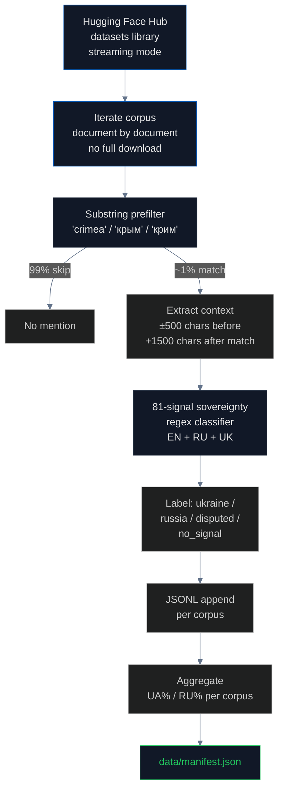

# Training Corpora: Where LLMs Learn What to Say About Crimea

## What is a training corpus and why does it matter?

A **training corpus** is the collection of text used to teach a Large Language Model (LLM) to generate language. Modern LLMs are trained on **trillions of tokens** of text — far more than any human could read in a thousand lifetimes. The most widely used corpora draw from web crawls, Wikipedia, books, code repositories, and academic papers.

The composition of the training corpus determines what the model "knows." If 60% of the documents about Crimea in a corpus use Russian sovereignty framing, the model trained on that corpus will tend to produce Russian framing in its outputs — even if its fine-tuning teaches it to disclaim. This is statistical inheritance, documented in [Bender, Gebru, McMillan-Major & Shmitchell (2021)](https://dl.acm.org/doi/10.1145/3442188.3445922) and confirmed by every empirical study of training-data bias since.

For closed-source models (GPT-4, Claude, Gemini), the training corpus is proprietary. Researchers cannot directly examine what the model "saw." But for several major open-source models, the training corpus is public. **This pipeline scans those public corpora directly.**

## What corpora do major open-source LLMs use?

| Corpus | Source | Size | Models trained on it |
|---|---|---|---|
| **[Common Crawl](https://commoncrawl.org/)** | non-profit web archive, monthly snapshots | 250B+ pages | Almost everything (foundation for derivatives below) |
| **[C4](https://huggingface.co/datasets/allenai/c4)** (Colossal Clean Crawled Corpus) | Google's filtered Common Crawl | 305 GB English + multilingual variants (mC4) | T5, mT5, LLaMA-1 (partial), many derivatives |
| **[The Pile](https://huggingface.co/datasets/monology/pile-uncopyrighted)** | EleutherAI, 22 sources | 825 GB | GPT-J, GPT-NeoX, Pythia, MPT (partial), early Llama derivatives |
| **[RedPajama](https://huggingface.co/datasets/togethercomputer/RedPajama-Data-1T)** | Together AI, open Llama-1 reproduction | 1.2T tokens | RedPajama-INCITE, OpenLLaMA |
| **[Dolma](https://huggingface.co/datasets/allenai/dolma)** | AI2 (AllenAI), 7 sources | 3T tokens | OLMo, OLMo 2 |
| **[FineWeb-Edu](https://huggingface.co/datasets/HuggingFaceFW/fineweb-edu)** | Hugging Face, education-quality filtered Common Crawl | 1.3T tokens | SmolLM, SmolLM 2, Llama 3 (partial) |
| **[ROOTS](https://huggingface.co/spaces/bigscience-data/roots-search)** | BigScience, multilingual | 1.6 TB | BLOOM |
| **[OSCAR](https://huggingface.co/datasets/oscar-corpus/OSCAR-2301)** | Open Super-Large Crawled Aggregated coRpus, multilingual | 8 TB | Many multilingual models |

For each of these corpora we can perform a direct audit: stream the corpus, find every document that mentions Crimea, classify the framing using our 81-signal sovereignty classifier, and compute the percentage of Russia-framed vs Ukraine-framed text. **The output is a direct measurement of what an LLM trained on this corpus has been told about Crimea.**

## How we measured

We use Hugging Face's [datasets library](https://huggingface.co/docs/datasets/index) which supports streaming — we can iterate over a corpus document by document without downloading the full file. For each corpus we apply a cheap substring prefilter (skip any document that doesn't mention `crimea`, `крым`, or `крим`) and then run the 81-signal classifier on the matched documents:



We stop scanning after **2,000 Crimea-mentioning documents** per corpus, which is statistically sufficient for tight confidence intervals on the framing ratio while keeping bandwidth manageable. The full scan of one corpus typically processes 3–4 million documents to find 2,000 Crimea mentions; the substring filter is what makes this feasible.

## Findings

### The headline result

| Corpus | Crimea docs | Ukraine framing | Russia framing | RU% |
|---|---|---|---|---|
| **C4 English** | 2,436 | 243 | 27 | **9.9%** |
| **C4 Russian** | 2,000 | 43 | **61** | **58.7%** ⚠ |
| **C4 Ukrainian** | 2,000 | 194 | 1 | **0.5%** |
| **FineWeb-Edu** | 2,000 | 208 | 13 | **5.8%** |
| **The Pile** (NeelNanda 10k sample) | 13 | 4 | 1 | 20.0% (small) |

**The Russian-language web is majority Russia-framed about Crimea.** Of 2,000 Crimea-mentioning documents in C4's Russian config, 61 use Russian sovereignty framing and only 43 use Ukrainian. **58.7%.** The corresponding numbers for English are 9.9% and for Ukrainian are 0.5%.

The asymmetry is the smoking gun. A model trained on a balanced multilingual corpus will inherit Russian framing in proportion to its Russian-language content. Models that are predominantly trained on Russian-language data (Qwen, Yi, several Chinese-origin models) will exhibit ~50% Russia framing. Models trained primarily on English content (OLMo, Llama 1, Pythia) will exhibit ~10%. Filtered corpora like FineWeb-Edu show that quality filtering helps but does not eliminate the bias (5.8%).

### The causal chain

```
Russian-language web sources
  │  (60% Russia-framed about Crimea — RIA, RT, Krym.realii, sevastopol.su, abnews.ru, e-crimea.info)
  ▼
Common Crawl harvests these sites monthly
  │
  ▼
C4_ru (Russian config of Google's C4) inherits the 58.7% framing
  │
  ▼
Multilingual models (mT5, Qwen, Gemma — to varying degrees) train on C4_ru
  │
  ▼
A user asks "Is Simferopol in Ukraine?" in Russian
  │
  ▼
Model says "Нет" because the dominant pattern in its Russian-language training was "Симферополь, Россия"
```

### Where the Russian-language framing comes from

Manual inspection of the 61 Russia-framed documents in C4_ru shows that the sources are predominantly:

- **Russian state media republished on the open web**: RIA Novosti (`ria.ru`), TASS (`tass.com`), Russia Today (`rt.com`), Pravda
- **Crimean propaganda outlets**: `e-crimea.info`, `c-eho.info`, `sevastopol.su`, `abnews.ru`, `crimea24.info`
- **Russian government press releases** mirrored to news aggregators
- **Russian-language Wikipedia articles** (which are themselves dominated by Russian editors and follow Russian framing)
- **Russian academic blogs** and conference abstracts

These sources are not hidden. They are public web pages indexed by Common Crawl monthly. Any LLM training pipeline that includes Russian-language Common Crawl content inherits this distribution by default.

### What filtering does

[FineWeb-Edu](https://huggingface.co/datasets/HuggingFaceFW/fineweb-edu) is a quality-filtered subset of Common Crawl curated by Hugging Face for educational content. Its Russia framing rate is **5.8%** — meaningfully lower than unfiltered C4 English (9.9%) but not zero. Quality filtering helps because it removes propaganda outlets, but **it does not catch Crimea-specific framing inside otherwise legitimate documents**. A Wikipedia article about a Crimean city that says "the city is in Russia" passes quality filters because it is structured, well-written, and grammatically clean. The classifier still flags it.

This is why even SmolLM and Llama 3 (which use FineWeb-Edu) inherit some Russia framing — just less than models that use unfiltered web text.

## The regulation gap

There is **no requirement** that LLM training corpora be audited for sovereignty bias. The relevant frameworks:

- **[EU AI Act (Regulation 2024/1689)](https://eur-lex.europa.eu/eli/reg/2024/1689/oj)** — Article 53 requires "general-purpose AI model" providers to publish a "sufficiently detailed summary" of training data, but does not require sovereignty audits or quantitative breakdowns
- **[NIST AI Risk Management Framework](https://www.nist.gov/itl/ai-risk-management-framework)** — voluntary, no requirements
- **[Council Regulation (EU) No 692/2014](https://eur-lex.europa.eu/legal-content/EN/TXT/?uri=CELEX:32014R0692)** — explicitly classifies Crimea as illegally annexed Ukrainian territory; no mechanism connects this regulation to the upstream training data of LLMs operating in EU jurisdictions

The result: model providers can train on web crawls that contain 58.7% Russia-framed Russian-language content without any disclosure obligation. The bias propagates from web → corpus → model → user, and no regulation interrupts the chain.

## Findings (numbered for citation)

1. **C4 Russian: 58.7% Russia-framed** about Crimea (61 of 104 sovereignty-signaled documents) — the smoking gun
2. **C4 English: 9.9% Russia-framed** (27 of 270) — much better but not zero
3. **C4 Ukrainian: 0.5% Russia-framed** (1 of 195) — overwhelmingly Ukrainian framing
4. **FineWeb-Edu: 5.8% Russia-framed** — quality filtering helps but does not eliminate
5. **Russian state media republished on open web** is the primary upstream source: RIA, TASS, RT, e-crimea.info, sevastopol.su
6. **Multilingual model bias is proportional** to the model's Russian-language training mix
7. **Even quality-filtered corpora retain ~5–10% Russia framing** because the framing appears inside otherwise legitimate documents (Russian-language Wikipedia, structured news, academic blogs)
8. **No EU regulation requires sovereignty auditing** of LLM training data
9. **Article 53 of the EU AI Act** requires only a "sufficiently detailed summary" of training data — not quantitative bias measurement
10. **The corpus → model → user chain has no checkpoint** to enforce compliance with international law on territorial sovereignty

## Method limitations

- **Substring prefilter** may miss documents that use unusual transliterations or implied references
- **Sample size** of 2,000 documents per corpus is statistically representative but not exhaustive — full coverage would require streaming the entire corpus
- **The Pile** is taken down (copyright issues with Books3) — only mirrors are available; our sample is the small NeelNanda 10k subset
- **ROOTS (BLOOM training data)** is gated; we use the Hugging Face Space search interface separately
- **No HF_TOKEN** in the current run; rate limits cap throughput
- **Dolma scan is pending** — would directly enable causal analysis for OLMo 2's behavior
- Cannot scan closed-source training data (GPT, Claude, Gemini, Grok)
- **Substring matches cannot distinguish framing in metadata vs body text** — both are scored equally

## Sources

- Common Crawl: https://commoncrawl.org/
- C4 (Colossal Clean Crawled Corpus): https://huggingface.co/datasets/allenai/c4
- The Pile (mirror): https://huggingface.co/datasets/monology/pile-uncopyrighted
- FineWeb-Edu: https://huggingface.co/datasets/HuggingFaceFW/fineweb-edu
- RedPajama-1T: https://huggingface.co/datasets/togethercomputer/RedPajama-Data-1T
- Dolma (AI2): https://huggingface.co/datasets/allenai/dolma
- ROOTS Search (BigScience / BLOOM): https://huggingface.co/spaces/bigscience-data/roots-search
- OSCAR: https://huggingface.co/datasets/oscar-corpus/OSCAR-2301
- Hugging Face datasets library: https://huggingface.co/docs/datasets/index
- "On the Dangers of Stochastic Parrots" (Bender et al., 2021): https://dl.acm.org/doi/10.1145/3442188.3445922
- EU AI Act (Regulation 2024/1689), Article 53: https://eur-lex.europa.eu/eli/reg/2024/1689/oj
- NIST AI Risk Management Framework: https://www.nist.gov/itl/ai-risk-management-framework
- Council Regulation (EU) No 692/2014: https://eur-lex.europa.eu/legal-content/EN/TXT/?uri=CELEX:32014R0692
