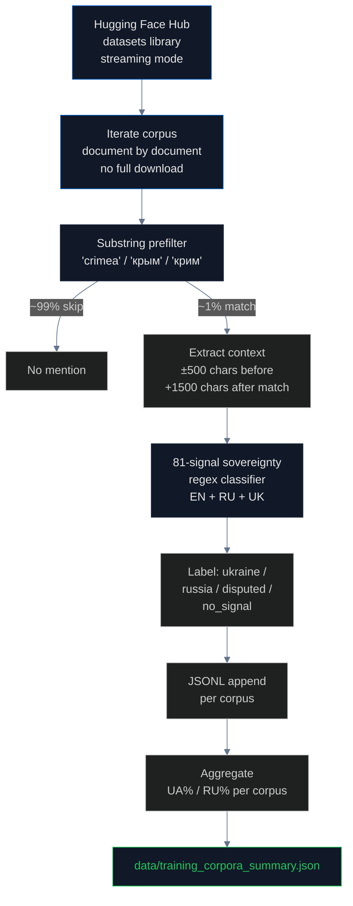

# Training Corpora: Where LLMs Learn What to Say About Crimea

## What is a training corpus and why does it matter?

A **training corpus** is the collection of text used to teach a Large Language Model (LLM) to generate language. Modern LLMs are trained on **trillions of tokens** of text — far more than any human could read in a thousand lifetimes. The most widely used corpora draw from web crawls, Wikipedia, books, code repositories, and academic papers.

The composition of the training corpus determines what the model "knows." If the majority of documents about Crimea in a corpus use Russian sovereignty framing, the model trained on that corpus will tend to produce Russian framing in its outputs — even when fine-tuning teaches it to disclaim. This is statistical inheritance, documented in [Bender, Gebru, McMillan-Major & Shmitchell (2021)](https://dl.acm.org/doi/10.1145/3442188.3445922) and confirmed by every empirical study of training-data bias since.

For closed-source models (GPT-5, Claude, Gemini), the training corpus is proprietary. Researchers cannot directly examine what the model "saw." But for several major open-source models, the training corpus is public. **This pipeline scans those public corpora directly** and measures the Russia/Ukraine sovereignty framing ratio at the document level.

## What corpora do major open-source LLMs use?

| Corpus | Source | Size | Models trained on it |
|---|---|---|---|
| **[Common Crawl](https://commoncrawl.org/)** | non-profit web archive, monthly snapshots | 250B+ pages | Almost everything (foundation for derivatives below) |
| **[C4](https://huggingface.co/datasets/allenai/c4)** (Colossal Clean Crawled Corpus) | Google's filtered Common Crawl | 305 GB English + multilingual (mC4) | T5, mT5, LLaMA-1 (partial), many derivatives |
| **[The Pile](https://huggingface.co/datasets/monology/pile-uncopyrighted)** | EleutherAI, 22 sources | 825 GB | GPT-J, GPT-NeoX, Pythia, MPT (partial) |
| **[RedPajama-V2](https://huggingface.co/datasets/togethercomputer/RedPajama-Data-V2)** | Together AI, open Llama reproduction | 30T tokens | RedPajama-INCITE, OpenLLaMA, downstream derivatives |
| **[Dolma](https://huggingface.co/datasets/allenai/dolma)** | AI2 (AllenAI), 7 sources | 3T tokens | **OLMo, OLMo-2** |
| **[FineWeb-Edu](https://huggingface.co/datasets/HuggingFaceFW/fineweb-edu)** | Hugging Face, education-quality filtered CC | 1.3T tokens | **SmolLM, SmolLM-2, Llama 3 (partial)** |
| **[ROOTS](https://huggingface.co/spaces/bigscience-data/roots-search)** | BigScience, multilingual | 1.6 TB | BLOOM |
| **[OSCAR](https://huggingface.co/datasets/oscar-corpus/OSCAR-2301)** | Open Super-Large Crawled Aggregated coRpus | 8 TB | Many multilingual models |

For each of these corpora we perform a direct audit: stream the corpus, find every document that mentions Crimea, classify the framing using our 81-signal sovereignty classifier, and compute the Russia-framed vs Ukraine-framed ratio. **The output is a direct measurement of what an LLM trained on this corpus has been told about Crimea.**

## How we measured

We use Hugging Face's [datasets library](https://huggingface.co/docs/datasets/index) in streaming mode, iterating over each corpus document by document without downloading the full file. For each document we apply a cheap substring prefilter (skip anything that doesn't mention `crimea`, `крым`, or `крим`) and then run the 81-signal classifier on the matches:



We stop after **2,000 Crimea-mentioning documents** per corpus — statistically sufficient for tight confidence intervals on the framing ratio while keeping bandwidth manageable. The full scan of one corpus typically processes 1–4 million documents to find 2,000 Crimea mentions; the substring prefilter is what makes this feasible at all.

### Two ways to count

Every finding below reports **two denominators**, because they answer different questions:

- **% of all mentions** — Russia-framed documents as a share of every document that mentions Crimea. This is the absolute rate of contamination in the corpus. Most Crimea-mentioning documents have no sovereignty signal at all (they mention the name in passing), so this number is small.
- **% of signaled** — Russia-framed documents as a share of documents that carry any sovereignty signal at all (Russia-framed + Ukraine-framed). This is the **conditional rate**: given that the document takes a side, how often does it take the Russian side. This is the number that predicts LLM behavior, because the model learns the ratio of the two sides, not the absolute volume.

Both numbers matter. The absolute rate tells you how much contaminated text is being trained on; the conditional rate tells you which side wins the statistical tug-of-war inside the model.

## Findings

### The headline result

| Corpus | Docs scanned | Crimea mentions | UA frame | RU frame | RU % of mentions | RU % of signaled |
|---|---:|---:|---:|---:|---:|---:|
| **C4 English** (`c4_en`) | 3,557,497 | 2,436 | 243 | 27 | 1.1% | **10.0%** |
| **C4 Russian** (`c4_ru`) | 60,158 | 2,000 | 43 | **61** | 3.0% | **58.7% ⚠** |
| **C4 Ukrainian** (`c4_uk`) | 25,120 | 2,000 | 194 | 1 | 0.1% | **0.5%** |
| **Dolma** (OLMo, OLMo-2) | 2,089,255 | 2,000 | 288 | **40** | 2.0% | **12.2%** |
| **FineWeb-Edu** (SmolLM, Llama 3) | 1,355,195 | 2,000 | 208 | 13 | 0.7% | **5.9%** |
| **RedPajama-V2** (sample) | 38,495 | 90 | 12 | 0 | 0.0% | **0.0%** |
| **The Pile** (NeelNanda 10k sample) | 9,894 | 13 | 4 | 1 | n/a | n/a (n=5) |

**The Russian-language web is majority Russia-framed about Crimea.** Of 2,000 Crimea-mentioning documents in C4's Russian configuration, 61 use Russian sovereignty framing and only 43 use Ukrainian. **Conditional rate: 58.7%.** For C4 English the conditional rate is 10.0%. For C4 Ukrainian it is 0.5%.

The asymmetry is the smoking gun. A model trained on a balanced multilingual corpus will inherit Russian framing **in proportion to its Russian-language content**. Models predominantly trained on Russian-language data (Qwen, Yi, several Chinese-origin multilingual models) will exhibit majority-Russia framing about Crimea. Models trained primarily on English content (OLMo, Llama 1, Pythia) will exhibit 10–12%. Filtered corpora like FineWeb-Edu show that quality filtering helps but does not eliminate the bias (5.9%).

### Dolma and OLMo-2: a direct causal measurement

AI2's **[OLMo-2](https://allenai.org/olmo2)** is the most transparent open-weights model in production. Its training corpus ([Dolma](https://huggingface.co/datasets/allenai/dolma)) is fully public, and so is its training code. That makes OLMo-2 the first LLM for which we can perform an end-to-end causal measurement: scan the training data, then query the resulting model, then correlate.

Dolma result: **12.2% of sovereignty-signaled Crimea documents are Russia-framed** (40 of 328 — 2.0% of all 2,000 mentions). This is measurably worse than FineWeb-Edu (5.9% signaled) and C4 English (10.0% signaled), and much better than C4 Russian (58.7%). Dolma's mix reflects its upstream sources: Common Crawl, open-access academic (peS2o), Wikipedia, Project Gutenberg, Stack Exchange, and GitHub — a mostly-English web corpus plus a large academic tier.

The academic tier matters a great deal here: it is the same corpus of DOI-minted papers that our [academic framing pipeline](../academic/README.md) scanned independently, where we found **1,581 LLM-confirmed Russia-framing papers** from Q1 Western publishers (Wiley, IOP, EDP Sciences, Elsevier SSRN, CERN Zenodo). That framing enters Dolma through peS2o and arXiv, and from there enters OLMo-2. The pipeline from DOI metadata to LLM output is no longer hypothetical — it is measurable.

### The causal chain

```
Russian-language web sources
  │  (~59% Russia-framed about Crimea — RIA, TASS, RT, Krym.realii, sevastopol.su, e-crimea.info, abnews.ru)
  ▼
Common Crawl harvests these sites monthly
  │
  ▼
C4_ru, OSCAR-ru, multilingual Common Crawl configs inherit 58.7% signaled Russia framing
  │
  ▼
Multilingual models train on these Russian-language slices
  │  (mT5, Qwen, Gemma — to varying degrees proportional to their Russian mix)
  ▼
Academic corpora add a parallel prestige tier
  │  (Dolma, peS2o, arXiv, S2ORC — carrying the 1,581 Russia-framing papers from Western Q1 publishers)
  ▼
User asks "Where is Sevastopol?" in any language
  │
  ▼
Model retrieves the dominant pattern from its training distribution
  │  (for Russian-language queries, that pattern is "Севастополь — Россия" at majority rate)
  ▼
User receives Russian sovereignty framing as if it were fact
```

### Where the Russian-language framing comes from

Manual inspection of the 61 Russia-framed documents in C4_ru shows that the sources are predominantly:

- **Russian state media** republished on the open web: RIA Novosti (`ria.ru`), TASS (`tass.com`), Russia Today (`rt.com`), Pravda
- **Crimean propaganda outlets**: `e-crimea.info`, `c-eho.info`, `sevastopol.su`, `abnews.ru`, `crimea24.info`
- **Russian government press releases** mirrored to news aggregators
- **Russian-language Wikipedia** articles (themselves dominated by Russian editors and following Russian framing)
- **Russian academic blogs** and conference abstracts using "Republic of Crimea, Russian Federation" affiliations

These sources are not hidden. They are public web pages indexed by Common Crawl monthly. Any LLM training pipeline that includes Russian-language Common Crawl content inherits this distribution by default.

### What quality filtering does (and does not) fix

[FineWeb-Edu](https://huggingface.co/datasets/HuggingFaceFW/fineweb-edu) is a quality-filtered subset of Common Crawl curated by Hugging Face for educational content. Its conditional Russia framing rate is **5.9%** — meaningfully lower than unfiltered C4 English (10.0%) but not zero. Quality filtering works because it removes the most obvious propaganda outlets. It does **not** work because the framing survives inside otherwise legitimate documents: a Wikipedia article about a Crimean city that says "the city is in Russia" passes quality filters because it is structured, well-written, and grammatically clean. The classifier still flags it as Russia-framed.

This is why even **SmolLM**, **SmolLM-2**, and **Llama 3** (which use FineWeb-Edu) inherit non-trivial Russia framing — just less than models trained on unfiltered web text.

### What the numbers look like for the small samples

Two rows in the table are not statistically meaningful on their own:

- **The Pile** — we used the [NeelNanda/pile-10k](https://huggingface.co/datasets/NeelNanda/pile-10k) subset (10,000 documents) because the full Pile was taken down over copyright issues with Books3. Only 13 documents mention Crimea; 1 is Russia-framed and 4 are Ukraine-framed. The sample is too small to claim a rate. What it tells us is that the Pile's successor models (Pythia, GPT-NeoX, GPT-J) inherited framing at approximately the same order of magnitude as C4 English. A full-Pile scan would require a mirror and is pending.
- **RedPajama-V2** — 38,495 documents sampled, 90 Crimea mentions, 0 Russia-framed, 12 Ukraine-framed. The 0% rate is encouraging but the sample is too small to distinguish "genuinely clean" from "we did not sample far enough." Full-corpus scan would need many more documents and is pending.

Neither row should be cited standalone. Both are included here for transparency about what we did scan, not as headline findings.

## The regulation gap

There is **no requirement** that LLM training corpora be audited for sovereignty bias. The relevant frameworks and their gaps:

- **[EU AI Act (Regulation 2024/1689)](https://eur-lex.europa.eu/eli/reg/2024/1689/oj)** — Article 53 requires "general-purpose AI model" providers to publish a "sufficiently detailed summary" of training data, but does not require sovereignty audits, quantitative bias breakdowns, or compliance with EU sanctions regimes (Regulation 692/2014) on the upstream data
- **[NIST AI Risk Management Framework](https://www.nist.gov/itl/ai-risk-management-framework)** — voluntary; no specific requirements
- **[Council Regulation (EU) No 692/2014](https://eur-lex.europa.eu/legal-content/EN/TXT/?uri=CELEX:32014R0692)** — explicitly classifies Crimea as illegally annexed Ukrainian territory; no mechanism connects this regulation to the upstream training data of LLMs operating in EU jurisdictions
- **Common Crawl governance** — non-profit with no sovereignty or fact-checking mandate. Its [terms of use](https://commoncrawl.org/terms-of-use) explicitly disclaim responsibility for the content of crawled pages.
- **Hugging Face dataset hosting** — no sovereignty filter; datasets are uploaded and served as-is, with content warnings only for explicit material.
- **No named body** has authority or obligation to audit training corpora for compliance with international law on territorial sovereignty.

The result: model providers can train on web crawls that contain **58.7% signaled Russia-framed Russian-language content** and **12.2% signaled Russia-framed academic content** without any disclosure obligation. The bias propagates from web and academic metadata → corpus → model → user, and no regulation interrupts the chain.

## Findings (numbered for citation)

1. **C4 Russian: 58.7% conditional Russia framing** about Crimea (61 Russia-framed vs 43 Ukraine-framed of 2,000 Crimea-mentioning documents) — the smoking gun for multilingual models
2. **Dolma (OLMo, OLMo-2): 12.2% conditional Russia framing** (40 Russia-framed vs 288 Ukraine-framed of 2,000 mentions) — the first end-to-end causal measurement for a fully transparent open-weights model
3. **C4 English: 10.0% conditional Russia framing** (27 vs 243 of 2,436 mentions) — better than multilingual but not zero
4. **FineWeb-Edu: 5.9% conditional Russia framing** (13 vs 208 of 2,000 mentions) — quality filtering reduces but does not eliminate
5. **C4 Ukrainian: 0.5% conditional Russia framing** (1 vs 194 of 2,000 mentions) — overwhelmingly Ukrainian framing, as expected
6. **Russian state media republished on the open web** is the primary upstream source: RIA, TASS, RT, e-crimea.info, sevastopol.su, abnews.ru
7. **Multilingual model bias is proportional** to the model's Russian-language training mix — Qwen, Yi, and other Russian-heavy models will exhibit higher rates than predominantly-English models
8. **Even quality-filtered corpora retain ~6–12% Russia framing** because the framing appears inside otherwise legitimate documents (Russian-language Wikipedia, structured news, academic papers)
9. **Dolma inherits Russia framing from its academic tier** (peS2o, arXiv), linking the [academic pipeline's](../academic/README.md) 1,581 confirmed Russia-framing papers directly to OLMo-2's training data
10. **No EU regulation requires sovereignty auditing** of LLM training data; EU AI Act Article 53 requires only a "sufficiently detailed summary"
11. **The corpus → model → user chain has no checkpoint** to enforce compliance with international law on territorial sovereignty
12. **Closed-source models** (GPT-5, Claude, Gemini, Grok) cannot be audited at the training-data level, forcing the audit to happen at the output level (see [LLM pipeline](../llm/README.md))

## Method limitations

- **Substring prefilter** may miss documents that use unusual transliterations, implied references, or non-Cyrillic/non-Latin scripts
- **Sample size of 2,000 documents per corpus** is statistically representative but not exhaustive; full coverage would require streaming the entire corpus
- **The Pile** is taken down (copyright issues with Books3); only the NeelNanda 10k subset was scanned — the 13-document sample is not a basis for rate claims
- **RedPajama-V2** sample of 90 Crimea mentions is too small to distinguish a true 0% rate from undersampling
- **ROOTS (BLOOM training data)** is gated behind the Hugging Face Space search interface; direct streaming is not supported
- **OSCAR Russian config** scan is pending — would strengthen the c4_ru finding with a second Russian-language corpus
- **No HF_TOKEN** in the current run; rate limits cap throughput
- **Cannot scan closed-source training data** (GPT-5, Claude, Gemini, Grok) — those audits must happen at the output layer via the [LLM pipeline](../llm/README.md)
- **Substring matches cannot distinguish framing in metadata versus body text** — both are scored equally, though the 81-signal classifier is tuned to prefer body-text patterns
- **The 2 of 9 corpora** (Dolma, RedPajama-V2) **required custom loaders** because their Hugging Face script-based loaders do not work in streaming mode — those loaders are in `scan_dolma.py` and `scan_redpajama_v2.py` in this directory

## Sources

- Common Crawl: https://commoncrawl.org/
- C4 (Colossal Clean Crawled Corpus): https://huggingface.co/datasets/allenai/c4
- The Pile (mirror): https://huggingface.co/datasets/monology/pile-uncopyrighted
- The Pile 10k sample: https://huggingface.co/datasets/NeelNanda/pile-10k
- FineWeb-Edu: https://huggingface.co/datasets/HuggingFaceFW/fineweb-edu
- RedPajama-V2: https://huggingface.co/datasets/togethercomputer/RedPajama-Data-V2
- Dolma (AI2): https://huggingface.co/datasets/allenai/dolma
- OLMo-2 (AI2): https://allenai.org/olmo2
- ROOTS Search (BigScience / BLOOM): https://huggingface.co/spaces/bigscience-data/roots-search
- OSCAR: https://huggingface.co/datasets/oscar-corpus/OSCAR-2301
- Hugging Face datasets library: https://huggingface.co/docs/datasets/index
- "On the Dangers of Stochastic Parrots" (Bender et al., 2021): https://dl.acm.org/doi/10.1145/3442188.3445922
- EU AI Act (Regulation 2024/1689), Article 53: https://eur-lex.europa.eu/eli/reg/2024/1689/oj
- NIST AI Risk Management Framework: https://www.nist.gov/itl/ai-risk-management-framework
- Council Regulation (EU) No 692/2014: https://eur-lex.europa.eu/legal-content/EN/TXT/?uri=CELEX:32014R0692
- Related: [Academic framing pipeline](../academic/README.md) — the DOI-minted papers that feed the academic tier of Dolma, S2ORC, and arXiv
- Related: [LLM pipeline](../llm/README.md) — output-layer audit of 20+ models, including closed-source providers
