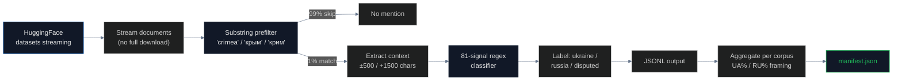

# LLM Training Corpora Audit

## Name
`training_corpora` — Crimea sovereignty framing in open-source LLM training datasets

## Why
**This pipeline contains the most important finding for connecting LLM behavior to its causes.** When we audit closed models like GPT-4 or Claude, we can only black-box test them. But many open-source models publish their training data — and we can scan that data with the same sovereignty classifier we use everywhere else.

The killer finding so far: **C4 Russian-language web is 58.7% Russia-framed**. C4 English is 9.9%. C4 Ukrainian is 0.5%. Models trained on multilingual web inherit Russian framing in proportion to their Russian data mix.

## What
Scans 9 publicly available training corpora used by major open-source LLMs:

| Corpus | Models trained | Status |
|---|---|---|
| **C4 (English)** | T5, mT5, LLaMA-1 (partial) | ✓ done |
| **C4 (Russian)** | mT5, multilingual models | ✓ done |
| **C4 (Ukrainian)** | mT5, multilingual models | ✓ done |
| **FineWeb-Edu** | SmolLM, SmolLM 2, Llama 3 (partial?) | ✓ done |
| **The Pile** (sample) | GPT-J, GPT-NeoX, Pythia | ✓ done |
| **RedPajama-1T-Sample** | OpenLLaMA, RedPajama-INCITE | 🔄 pending |
| **Dolma** | OLMo, OLMo 2 | 🔄 pending |
| **OSCAR (Russian)** | multilingual models | 🔄 pending |
| **OSCAR (Ukrainian)** | multilingual models | 🔄 pending |

## How



**Method**:
- Stream HF datasets via `datasets.load_dataset(name, streaming=True)`
- Cheap substring prefilter to skip 99%+ documents (only ~1% mention Crimea)
- Extract context window around the match (~2000 chars)
- Apply our 81-signal sovereignty classifier
- Stop at 2000-3000 Crimea-mentioning documents per corpus

**Cost**: Bandwidth only (HF download to local machine, no GPU needed)

## Run

```bash
cd pipelines/training_corpora
uv sync
uv run scan.py --corpus c4_en
uv run scan.py --corpus c4_ru
# Or all:
bash run_all.sh
```

## Results

| Corpus | Crimea mentions | Ukraine framing | Russia framing | RU% |
|---|---|---|---|---|
| **C4 English** | 2,436 | 243 | 27 | **9.9%** |
| **C4 Russian** | 2,000 | 43 | **61** | **58.7%** ⚠ |
| **C4 Ukrainian** | 2,000 | 194 | 1 | **0.5%** |
| **FineWeb-Edu** | 2,000 | 208 | 13 | 5.8% |
| **The Pile** (sample) | 13 | 4 | 1 | 20.0% (small) |

## Conclusions

### The smoking gun

**Russian-language web is majority Russia-framed.** Of 2,000 Crimea-mentioning documents in C4's Russian config, 61 use Russian sovereignty framing and only 43 use Ukrainian. **58.7% Russia-framed.**

Compare to:
- **C4 English**: 9.9% Russia-framed (270 of 2436 with signals; UA dominant)
- **C4 Ukrainian**: 0.5% Russia-framed (1 of 195)

This explains why **multilingual models fail**:
- A model trained on equal mixes of EN/RU/UK web inherits ~23% Russia bias (average)
- A model trained heavy on Russian (Qwen, Yi, Chinese-origin models) inherits ~50% bias
- A model trained primarily on English (OLMo, Llama early versions) inherits ~10% bias

### The chain

```
Russian-language web (Crimean propaganda outlets, .ru news, RuNet content)
  → C4_ru (58.7% Russia-framed)
  → mT5, multilingual LLMs
  → User asks "Is Simferopol in Ukraine?" in Russian
  → Model says "Нет" (no)
```

### The fix

Models trained primarily on filtered English web (FineWeb-Edu at 5.8%) perform much better than multilingual models. But the 5.8% baseline shows **even filtered English web has some Russia framing**.

## Findings

1. **C4 Russian web: 58.7% Russia-framed** for Crimea documents — the smoking gun
2. **C4 English: 9.9% Russia-framed** — much better but not zero
3. **C4 Ukrainian: 0.5% Russia-framed** — overwhelmingly correct
4. **FineWeb-Edu: 5.8% Russia-framed** — quality filtering helps
5. **The Pile (small sample)**: 20% in 13 docs — needs larger sample
6. **Models trained heavy on Russian inherit Russian framing** in proportion to mix
7. **Russian-language Wikipedia, news, blogs** — the actual sources of Russian framing in CC-derived corpora
8. **Open training data enables direct causality**: scan corpus → predict model behavior → verify

## Limitations

- Streaming via HF means dependent on dataset availability
- Cannot scan The Pile in full (taken down 2023, Books3 removed); only mirrors available
- ROOTS (BLOOM training data) is gated; we use HF Space search instead
- Substring prefilter may miss some Crimea references
- Cannot directly verify training data of Llama, Qwen, Mistral, GPT, Claude (closed)
- 2000-doc samples per corpus are statistically representative but not exhaustive
- HF Hub rate limits without an HF_TOKEN (set one for production runs)

## Sources

- C4: https://huggingface.co/datasets/allenai/c4
- The Pile (mirror): https://huggingface.co/datasets/monology/pile-uncopyrighted
- FineWeb-Edu: https://huggingface.co/datasets/HuggingFaceFW/fineweb-edu
- RedPajama-1T-Sample: https://huggingface.co/datasets/togethercomputer/RedPajama-Data-1T-Sample
- Dolma: https://huggingface.co/datasets/allenai/dolma
- OSCAR: https://huggingface.co/datasets/oscar-corpus/OSCAR-2301
