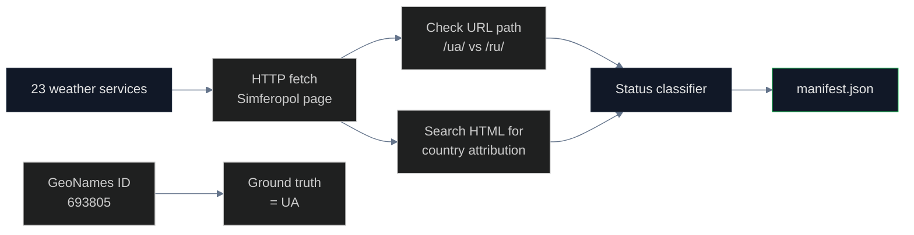

# Weather Services Audit

## Name
`weather` — Weather forecast services and APIs

## Why
Weather services are consumed by hundreds of millions of users daily. They embed sovereignty in URL paths (`/ua/simferopol` vs `/ru/simferopol`) and display text ("Simferopol, Ukraine" vs "Simferopol, Russia"). The good news: most major weather services use GeoNames as their backing geocoder, which correctly identifies Crimean cities under Ukraine.

## What
Audits 23 weather platforms across global, regional, and Russian providers.

## How



## Run

```bash
cd pipelines/weather
uv sync
uv run scan.py
```

## Results

| Status | Count | Percentage |
|---|---|---|
| Correct | 16 | 70% |
| Incorrect | 4 | 17% |
| Ambiguous | 2 | 9% |
| N/A | 1 | 4% |

## Conclusions

Weather services that use **GeoNames** (ID 693805 for Simferopol) get it right. Services that use their own geodata or are Russian-origin get it wrong. The data supply chain determines the outcome. The 4 violators are exclusively Russian-origin (Yandex Weather, Gismeteo, rp5.ru, Pogoda.mail.ru). Every Western weather service correctly classifies Simferopol as Ukrainian.

## Findings

1. **70% of weather services correctly show Crimea as Ukraine** — the good news
2. **All 4 violators are Russian-origin** (Yandex, Gismeteo, rp5, Pogoda.mail.ru)
3. **GeoNames is the determining factor** — services that consume GeoNames are correct
4. **OpenWeatherMap** uses GeoNames ID 693805 → returns `country: UA`
5. **AccuWeather, Weather.com, Windy, TimeAndDate** all correct

## Limitations

- Some services require user IP for personalization; tested from EU IP
- Mobile apps not tested (requires device access)
- Weather data accuracy is not measured — only geographic attribution

## Sources

- GeoNames Simferopol: https://www.geonames.org/693805/simferopol.html
- OpenWeatherMap geocoding: https://openweathermap.org/api/geocoding-api
