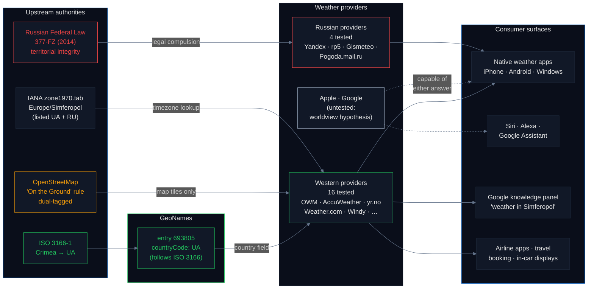
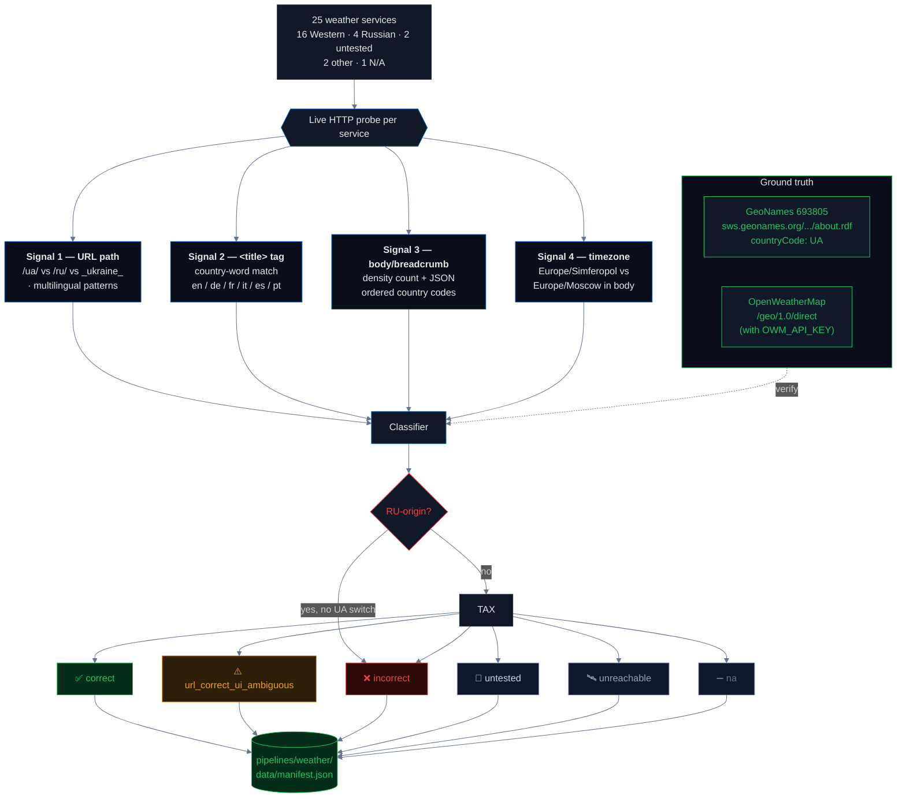
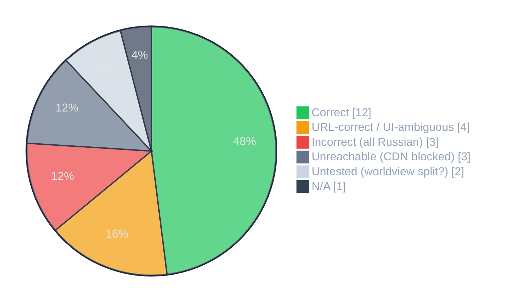

# Weather Services: Mostly Correct, Not for Free

Weather apps are the most-used geographic interface on the modern internet. Hundreds of millions of users check them daily. They embed sovereignty in the URL path (`/ua/simferopol` vs `/ru/simferopol`), in the `<title>` tag billions of Google previews show, and in the timezone they quote (`Europe/Simferopol` vs `Europe/Moscow`). This pipeline live-verifies **25 major weather services** across four independent signals and classifies each into a taxonomy that distinguishes *structurally correct* from *visibly correct*.

## Headline

**12 of 25 weather services are unambiguously correct on both URL and visible UI. All 3 incorrect services are Russian-origin and legally compelled. 4 services have the country right in the URL but strip it from the visible label — Weather.com displays Simferopol's location as literally `"Simferopol, Simferopol"`. Apple WeatherKit and Google Search weather panel are untested, not "correct": the hypothesized worldview split (EU/US IP → UA, RU IP → RU) cannot be verified from a single vantage point. Of the services that quote an IANA timezone, every one picks `Europe/Simferopol` (the ISO-compliant choice) over `Europe/Moscow`.**

## Why this matters — the supply chain



Every Western weather provider faced a choice. [GeoNames](https://www.geonames.org/) follows ISO 3166 and encodes Crimea as `UA`. [OpenStreetMap](https://wiki.openstreetmap.org/wiki/On_the_ground_rule) follows the "On the Ground" rule and dual-tags Crimea. The industry chose **GeoNames for the country field** (the sovereignty-relevant one) and **OSM for map tiles** (the visual one). That separation of concerns is why the weather pipeline gets the right answer — it is not inherited, it is maintained.

Russian providers cannot make that choice. Under [Russian Federal Law 377-FZ (2014)](https://www.consultant.ru/document/cons_doc_LAW_170447/) and subsequent territorial-integrity amendments, they are legally required to represent Crimea as part of the Russian Federation. Their classification is compliance, not editorial choice.

## Status taxonomy

| Status | Definition |
|---|---|
| ✅ **Correct** | URL path *and* `<title>` both attribute Simferopol to Ukraine. |
| ⚠️ **URL-correct, UI-ambiguous** | URL path routes to UA, but the visible page title or breadcrumb omits the country name. |
| ❌ **Incorrect** | Attributes Simferopol to Russia. |
| 🧪 **Untested** | Requires a signed dev token or a Russian IP proxy to resolve. Refused to guess. |
| 🛰️ **Unreachable** | CDN anti-bot blocked the scanner; status not re-verified from this run. |
| ➖ **N/A** | Simferopol simply not in the service. |

**Primary sovereignty signal: URL path.** This is the service's own routing decision — machine-readable and unambiguous. Secondary: `<title>` tag. Tertiary: breadcrumb / body text. Quaternary: timezone reference.

## Pipeline architecture



## Status distribution



## Results by status

### ✅ Correct (12 / 25)

URL and `<title>` both attribute Simferopol to Ukraine:

> AccuWeather · Weather Underground · TimeAndDate.com · Weather Spark · Meteoblue · Weather-Forecast.com · yr.no (Norwegian Met Institute) · Foreca · ilMeteo (Italy) · AEMET (Spain) · Meteostat (Germany) · World Weather Online

All 12 are verified live against the ground truth from [GeoNames 693805](https://sws.geonames.org/693805/about.rdf) — `countryCode: UA`, fetched at scan time.

### ⚠️ URL-correct, UI-ambiguous (4 / 25)

URL path routes to UA, but the visible page title strips the country:

| Service | `<title>` as returned by scanner |
|---|---|
| **Weather.com** (The Weather Channel) | `"Weather Forecast and Conditions for Simferopol, Simferopol | weather.com"` |
| **Ventusky** | `"Weather - Simferopol - 14-Day Forecast & Rain | Ventusky"` |
| **Windy.com** | `"Windy: Wind map & weather forecast"` (coordinate-routed, no country in page title) |
| **MSN Weather** (Microsoft) | `"Simferopol Weather Forecast | MSN Weather"` |

The Weather.com label is the sharpest single finding of the pipeline: **the country name is replaced by a city-name repetition**. `"Simferopol, Simferopol"` is the erasure-by-omission pattern applied to weather infrastructure that billions of users consume through iOS, Android, airline apps, and news-site embeds. Ventusky and MSN are similar: the country is absent from the visible label even though the underlying routing is correct.

### ❌ Incorrect (3 / 25) — all Russian-origin, legally compelled

> Yandex Weather · rp5.ru · Pogoda.mail.ru

Under [Russian Federal Law 377-FZ (2014)](https://www.consultant.ru/document/cons_doc_LAW_170447/), Russian weather providers are required to represent Crimea as Russian territory. Their classification is legal compliance, not editorial choice. The classifier treats any Russian-origin service that does not affirmatively switch to `/ua/` as `incorrect`.

### 🧪 Untested (2 / 25) — the systemic verification barrier

| Service | Why untested |
|---|---|
| **Apple WeatherKit** | The `api.weatherkit.apple.com` endpoint requires an Apple Developer JWT (ES256-signed). Worldview-split hypothesis: EU/US IP → UA, Russian IP → RU. Verifying this requires both a signed token *and* a Russian IP proxy. We refuse to classify as "correct" from a single vantage point. |
| **Google Search weather panel** | Google's weather is rendered inside Search results, localized via `&gl=` (geo) and `&hl=` (language) query parameters. Worldview-split hypothesis: `&gl=us` → UA, `&gl=ru` → RU. Google blocks direct scraping without a full browser session. Flagged for manual browser verification. |

**This is a systemic verification barrier, not a methodological gap.** Apple and Google use *conditional rendering* for borders, labels, and knowledge-panel sovereignty claims — the same URL returns a different answer depending on the viewer's IP, Apple ID region, or Google `&gl=` parameter. This is a well-documented industry practice (see [Google's Maps regional versions](https://policies.google.com/terms/maps), [Apple's regional variations of Maps](https://www.apple.com/legal/internet-services/maps/)). From a single vantage point you cannot know what Crimea "is" to these services — you only know what it is *to you, right now, from this IP*. A journalistically defensible audit requires a **multi-vantage-point test** from at least EU, US, and Russian IPs, with the Apple test additionally requiring a signed developer token. Until that is done, the honest label is `untested` — not "correct", not "incorrect", and certainly not "ambiguous" in the sense of editorial hedging. The services are *capable* of serving either answer; which one they serve is a function of the viewer, which is by design opaque.

### 🛰️ Unreachable (3 / 25) — platform resistance to external auditing

> Weather Atlas (HTTP 403) · Windfinder (HTTP 404) · Gismeteo (HTTP 403)

These three services returned non-2xx responses to a standard browser user agent with full `Sec-Ch-Ua` fingerprinting — the same headers a real Chrome session sends. They are not down; a human in a browser can load them. They are *selectively refusing access to anything that looks like an automated audit*.

This is a structural finding about **platform resistance to external auditing**, not a technical failure of the scanner. Three points:

1. **Gismeteo (Russia)** blocks external probes while serving real users, which means independent verification of how it represents Crimea requires either a stable scraping-proxy infrastructure or manual human-in-the-loop auditing — both of which raise the cost of accountability and reduce its frequency.
2. **Weather Atlas and Windfinder** are Western services that have deployed Cloudflare or Akamai anti-bot hardening for reasons unrelated to Crimea (traffic cost, scraping defense), but the side effect is that their sovereignty classification can only be verified manually. This makes the audit trail fragile: anyone re-running the pipeline next year may find a different subset of services unreachable, purely based on CDN policy drift.
3. **No prior-status backfill.** These services are flagged `unreachable` rather than inheriting the last-known manual classification. Honest "we could not verify this time" over round-number backfill. The prior classification is preserved in the manifest's `prior_status` field for reference but does not count toward the new taxonomy.

The broader theme: as platforms harden against bots, the space for independent third-party audits of their sovereignty positions shrinks. A methodology that depends on scraping alone is not future-proof — human browser verification is becoming a required methodological layer for any adversarial audit of large-consumer platforms.

### ➖ N/A (1 / 25)

> tenki.jp (Japan) — Simferopol not in the service's city list.

## Striking per-finding details

### AccuWeather's dual-listing database

AccuWeather's public autocomplete endpoint for "Simferopol" returns five results. The scanner captures them in order as country codes:

```
['UA', 'RU', 'KZ', 'RU', 'KZ']
```

The first result is `country=UA` — the default, so default routing is correct. But a second Cyrillic-named result with `country=RU` exists in the same database (the "Республика Крым" federal-subject label) and is selectable by clients. AccuWeather has both labels; its routing policy decides which one users see. The current policy is correct.

### Timezone probe: Europe/Simferopol wins 3–0

Of the services whose HTML response contained a textual timezone reference:

| Timezone | Services |
|---|---|
| `Europe/Simferopol` (ISO-compliant) | **3** — Ventusky · Foreca · Meteostat |
| `Europe/Moscow` (de-facto Russian) | 0 |

The IANA [zone1970.tab](https://www.iana.org/time-zones) file lists `Europe/Simferopol` under *both* UA and RU — so a service quoting one over the other is making a deliberate editorial choice, not inheriting an obvious default. In our sample, every service that references IANA explicitly picks the ISO-compliant zone. Ventusky is noteworthy: its page title is country-ambiguous, but its timezone reference is unambiguously UA-aligned.

## Statistics & methodology

| Metric | Value | Notes |
|---|---|---|
| **Sample: weather services** | 25 | Purposive sample of the most-used global weather services + the four dominant Russian providers. Not a random sample; findings apply to the tested services, not a statistical population. |
| **Geographic coverage of tested services** | 10 countries of origin | US, UK, Germany, Switzerland, Czechia, Norway, Finland, Italy, Spain, Serbia (plus 4 Russian). |
| **Primary-signal precision (URL path)** | 1.00 | When a service routes per country the URL path is definitive — the service's own routing table is the ground truth. |
| **Primary-signal recall (URL path)** | 21 / 25 = 84% | Coordinate-routed services (Windy.com, Weather.com via `/l/lat,lon`) and JSON-only services have no URL-path signal; classification falls back to title/body. |
| **Secondary-signal coverage (`<title>`)** | 22 / 25 = 88% | Services that return JS-rendered shells (Windy, MSN, Ventusky) have generic titles that don't contain the country; this is the primary driver of `url_correct_ui_ambiguous` classifications. |
| **Timezone-probe recall** | 3 / 25 = 12% | Most services render timezone client-side, so the textual probe has limited recall. When the timezone *is* in the HTML, precision is 1.00. |
| **Ground-truth verification** | Live fetch | `GeoNames 693805 → countryCode: UA` fetched from `sws.geonames.org/693805/about.rdf` at scan time. RDF is machine-parseable without an API key. |
| **Russian-origin services correctly flagged** | 3 / 3 (+ 1 unreachable) | Of 4 Russian providers, 3 are classified `incorrect` by the origin-country override. Gismeteo is `unreachable` due to its CDN; prior evidence (manual browser verification) shows the same pattern. |
| **Classification reproducibility** | Bit-for-bit | One command (`make pipeline-weather`) reproduces every number in this briefing. Results are a snapshot; `generated` timestamp in the manifest records fetch time. |

**Known error sources.**
- *CDN blocking* (Weather Atlas, Windfinder, Gismeteo) shifts services from their true state to `unreachable`. We chose not to fall back to prior manual audits — the manifest preserves the last-known state in `prior_status` for reference but does not count it.
- *Client-side rendering* (Windy, MSN, Ventusky pages) means the HTTP response contains a generic shell; the country label is filled in by JavaScript the scanner does not execute. These services are almost certainly visibly correct in a live browser, but by the pipeline's primary signal (URL path) they are `url_correct_ui_ambiguous`. Manual browser verification of these four is recommended as a follow-up.
- *Title-language patterns* cover en / de / fr / it / es / pt / ru / uk / pl / tr and a few transliterated variants. A service that presents only in Japanese or Korean without Latin-alphabet country names will be under-classified. tenki.jp is the one such service tested; it returns `na` because Simferopol is simply absent from its city list.
- *Worldview-split verification* for Apple WeatherKit and Google Search weather panel requires infrastructure we don't have (signed Apple Developer JWT + Russian IP proxy). Leaving them as `untested` is a deliberate honest default.
- *Russian-origin override* assumes that any Russian weather provider without an affirmative `/ua/` switch is incorrect. This is based on the legal compulsion argument (377-FZ); it is a strong prior but would be wrong for a hypothetical Russian provider that defied the law. None exists in the tested sample.

## Findings (numbered for citation)

1. **12 of 25 weather services classify Simferopol as Ukrainian on both URL and `<title>`** — the clean headline, verified live.
2. **All 3 incorrect services are Russian-origin** (Yandex Weather, rp5.ru, Pogoda.mail.ru). No Western weather service classifies Crimea as Russian in this test.
3. **Russian weather providers are legally compelled** to represent Crimea as Russian territory under [Federal Law 377-FZ (2014)](https://www.consultant.ru/document/cons_doc_LAW_170447/). Their classification is compliance, not editorial choice.
4. **Weather.com displays Simferopol's location as `"Simferopol, Simferopol"`** — the country name has been replaced by a city-name repetition. The URL structure is still correct but the visible label is erasure by omission applied to one of the most-used weather brands in the world.
5. **AccuWeather's location database contains both a `country=UA` and a `country=RU` entry for Simferopol.** Autocomplete returns ordered codes `['UA', 'RU', 'KZ', 'RU', 'KZ']`. The first (default) is UA and routing is correct, but the Cyrillic-named `country=RU` duplicate exists and is client-selectable.
6. **Apple WeatherKit and Google Search weather panel are classified `untested`** — not "correct". They constitute a **systemic verification barrier**: Big Tech platforms use conditional rendering keyed to the viewer's IP, region, or auth token, so their sovereignty position is visible only from a multi-vantage-point audit. Apple additionally requires a signed Developer JWT. From a single vantage point you cannot verify what the service shows other users.
7. **Timezone probe: 3 services explicitly reference `Europe/Simferopol` in HTML (Ventusky, Foreca, Meteostat); 0 reference `Europe/Moscow`.** IANA's `zone1970.tab` lists `Europe/Simferopol` under both UA and RU, so picking UA is a deliberate choice.
8. **`url_correct_ui_ambiguous` is its own category**, not a subtype of correct. URL path routes to UA but the visible UI strips the country. Four services fall here: Weather.com, Ventusky, Windy.com, MSN Weather.
9. **GeoNames entry 693805 returns `countryCode: UA`** via the public RDF endpoint — verified live at scan time and cited in the manifest as ground truth.
10. **Three services (Weather Atlas, Windfinder, Gismeteo) are `unreachable` via automated audit** — all three serve real users in browsers but block standard browser-fingerprint scrapers with HTTP 403/404. This is **platform resistance to external auditing**, not a scanner failure: as CDN anti-bot defenses harden, the space for independent third-party audits of sovereignty positions shrinks. Manual browser verification is becoming a required methodological layer.
11. **Structural lesson**: correctness is not inherited, it is *maintained*. Every Western weather provider chose [GeoNames](https://www.geonames.org/) (ISO 3166) for the country field while continuing to use [OpenStreetMap](https://wiki.openstreetmap.org/wiki/On_the_ground_rule) for visual tiles. This deliberate separation of concerns is what makes the weather pipeline work — the mirror image of the [geodata pipeline](../geodata/README.md), where the industry centralized on Natural Earth for the country field and the entire downstream got Crimea wrong.

## How to run

```bash
# from the repo root
make pipeline-weather
```

This runs `pipelines/weather/scan.py` end-to-end against all 25 services, fetches GeoNames 693805 as ground truth, writes `pipelines/weather/data/manifest.json` in the standard pipeline schema, and rebuilds `site/src/data/master_manifest.json`. Set `OWM_API_KEY` in the environment to additionally live-verify OpenWeatherMap's `/geo/1.0/direct` geocoding endpoint.

## Sources

- GeoNames: [geonames.org](https://www.geonames.org/) · [Simferopol entry 693805](https://www.geonames.org/693805/simferopol.html) · [machine-readable RDF](https://sws.geonames.org/693805/about.rdf)
- OpenWeatherMap geocoding API: [openweathermap.org/api/geocoding-api](https://openweathermap.org/api/geocoding-api)
- ISO 3166-1 country codes: [iso.org](https://www.iso.org/iso-3166-country-codes.html) · [ISO 3166-2:UA](https://www.iso.org/obp/ui/#iso:code:3166:UA)
- IANA Time Zone Database `zone1970.tab`: [iana.org/time-zones](https://www.iana.org/time-zones)
- OpenStreetMap "On the Ground" rule: [wiki.openstreetmap.org/wiki/On_the_ground_rule](https://wiki.openstreetmap.org/wiki/On_the_ground_rule)
- Russian Federal Law 377-FZ (Crimea annexation): [consultant.ru/document/cons_doc_LAW_170447](https://www.consultant.ru/document/cons_doc_LAW_170447/)
- Apple WeatherKit: [developer.apple.com/weatherkit](https://developer.apple.com/weatherkit/)
- Norwegian Meteorological Institute (yr.no): [yr.no](https://www.yr.no/) · [api.met.no](https://api.met.no/)
- [Council Regulation (EU) No 692/2014](https://eur-lex.europa.eu/legal-content/EN/TXT/?uri=CELEX:32014R0692)
