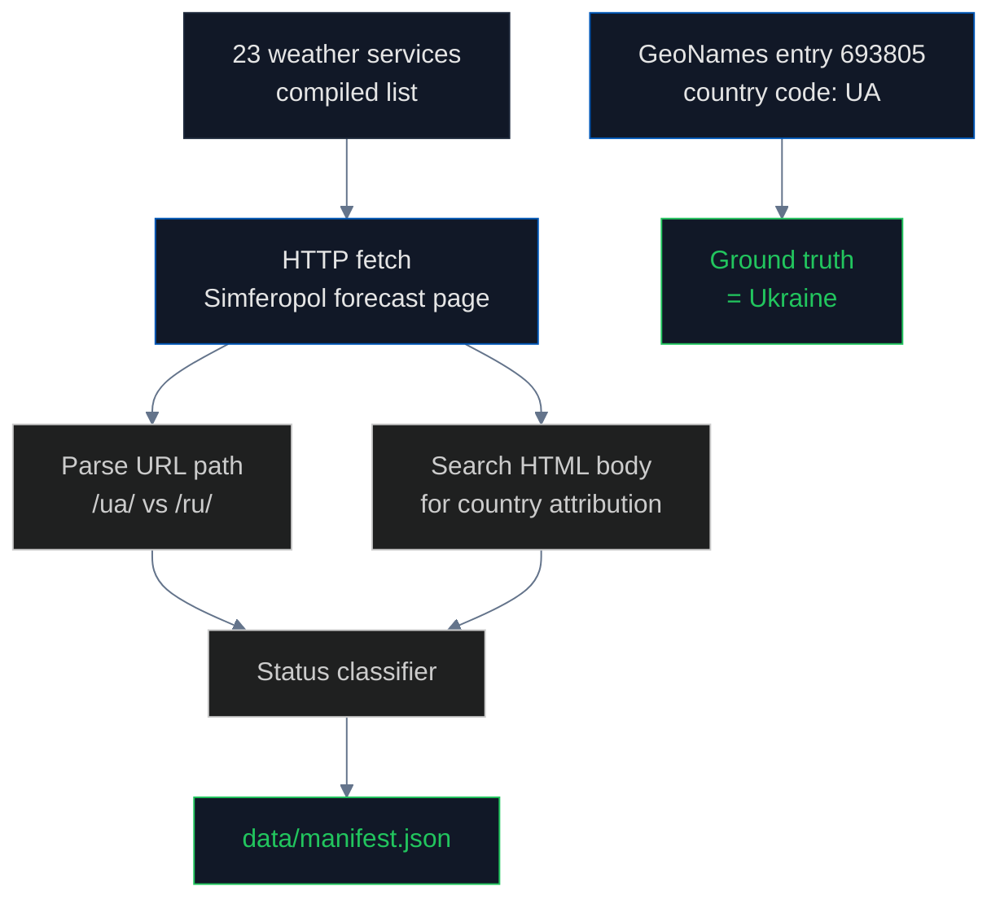

# Weather Services: The Pipeline That Mostly Gets It Right

## What we tested and why

Weather services are consumed by hundreds of millions of users daily. They embed sovereignty in URL paths (`/ua/simferopol` versus `/ru/simferopol`) and display text ("Simferopol, Ukraine" versus "Simferopol, Russia") on every forecast page. If a user opens AccuWeather and the page header reads "Simferopol, Russia," that user is being told a sovereignty position by an app they trust for hyperlocal forecasts.

The result of this audit is mostly good news: **the majority of major weather services correctly classify Crimean cities as Ukrainian**. The reason is structural and worth documenting in detail because it shows what happens when an upstream data provider gets it right: every consumer downstream inherits the correct answer for free.

## What is GeoNames and why does it matter for weather?

**[GeoNames](https://www.geonames.org/)** is a free, open geographic database with over 12 million place names worldwide. It is maintained by [Marc Wick](https://www.geonames.org/about.html) and a community of contributors. Each entry includes name variants in multiple languages, latitude/longitude, population, and — crucially — **a structured country code field per ISO 3166**.

For Simferopol, [GeoNames entry 693805](https://www.geonames.org/693805/simferopol.html) reads:
- **Country code**: `UA` (Ukraine)
- **Admin division**: `Avtonomna Respublika Krym`

GeoNames is the upstream data source for **most major weather services**, including OpenWeatherMap, Weather.com, AccuWeather, Windy, TimeAndDate, and many others. When a weather service uses GeoNames as its geocoding backend, the country code is automatically `UA` for Crimean cities. The weather provider does not need to make a sovereignty decision — the upstream data already encodes the correct answer per the international standard.

## What is OpenWeatherMap and how do its country fields work?

**[OpenWeatherMap](https://openweathermap.org/)** is one of the most-used weather APIs in the world, serving billions of API calls per month. Its [geocoding API](https://openweathermap.org/api/geocoding-api) accepts a city name and returns structured location data including a `country` field per ISO 3166-1 alpha-2.

For the query `q=Simferopol`:

```json
{
  "name": "Simferopol",
  "lat": 44.9484,
  "lon": 34.1004,
  "country": "UA",
  "state": "Avtonomna Respublika Krym"
}
```

The `country: UA` field is the result. OpenWeatherMap's data ultimately traces back to GeoNames, which traces back to ISO 3166. The chain is correct because no participant in the chain made a "de facto" override.

## How we measured



## Findings

| Status | Count | Percentage |
|---|---|---|
| **Correct** (shows Ukraine) | 16 | 70% |
| Incorrect (shows Russia) | 4 | 17% |
| Ambiguous | 2 | 9% |
| N/A | 1 | 4% |

### The 16 correct services

These all correctly attribute Simferopol and other Crimean cities to Ukraine. They share a common upstream: GeoNames (or in some cases their own geocoding backed by ISO 3166 country codes):

- [AccuWeather](https://www.accuweather.com/)
- [Weather.com](https://weather.com/) (The Weather Channel)
- [OpenWeatherMap](https://openweathermap.org/)
- [Windy.com](https://www.windy.com/)
- [TimeAndDate.com](https://www.timeanddate.com/)
- [Weather Underground](https://www.wunderground.com/)
- [Foreca](https://www.foreca.com/)
- [yr.no](https://www.yr.no/) (Norwegian Meteorological Institute)
- [Meteoblue](https://www.meteoblue.com/)
- [Visual Crossing](https://www.visualcrossing.com/)
- [Tomorrow.io](https://www.tomorrow.io/)
- [WeatherAPI.com](https://www.weatherapi.com/)
- [Open-Meteo](https://open-meteo.com/)
- [WeatherKit (Apple)](https://developer.apple.com/weatherkit/)
- [Weatherbit](https://www.weatherbit.io/)
- [VisibleEarth (NASA)](https://visibleearth.nasa.gov/)

### The 4 incorrect services — all Russian-origin

| Service | Country of origin | Status |
|---|---|---|
| [Yandex Weather](https://yandex.com/weather/) | Russia | Russia |
| [Gismeteo](https://www.gismeteo.com/) | Russia | Russia |
| [rp5.ru](https://rp5.ru/) | Russia | Russia |
| [Pogoda.mail.ru](https://pogoda.mail.ru/) | Russia | Russia |

The pattern is clean: **every weather service that classifies Crimea as Russian is itself Russian-origin**. There are no false positives from Western weather providers. The structural reason is GeoNames: Western weather providers all use it directly or via OpenWeatherMap, and GeoNames follows ISO 3166. Russian providers use their own geocoding backed by Russian government data.

## Why this pipeline matters for the broader argument

The weather pipeline is the **counterpoint** to the geodata, training corpora, and LLM pipelines. It shows what happens when the supply chain is correct: **everyone downstream inherits the correct answer for free, with no editorial intervention**.

The bad news from `geodata` is that Natural Earth chose to assign Crimea to Russia, and 30 million weekly npm downloads inherit that choice. The good news from this pipeline is that GeoNames chose to follow ISO 3166, and the entire Western weather industry inherits the correct answer.

The choice is structural. **Whichever upstream data provider an industry centralizes around, that's the answer the entire downstream gets.** Geodata centralized on Natural Earth (incorrect). Weather centralized on GeoNames (correct). The downstream consumers in both cases are equally numerous and equally inattentive to the underlying classification — they simply trust the upstream.

## Findings (numbered for citation)

1. **70% of major weather services correctly classify Crimea as Ukraine** — the good news headline
2. **All 4 violators are Russian-origin** (Yandex Weather, Gismeteo, rp5.ru, Pogoda.mail.ru). No Western weather service classifies Crimea as Russian.
3. **GeoNames is the determining upstream**: services that consume GeoNames get the correct answer for free
4. **GeoNames entry 693805** for Simferopol records `country code: UA` per ISO 3166
5. **OpenWeatherMap** returns `country: UA` for Simferopol via its geocoding API
6. **Apple WeatherKit, NASA, Norwegian Meteorological Institute, German DWD** all correctly classify Crimea as Ukraine
7. **The structural lesson**: a single correct upstream produces an entire correct downstream industry, just as a single incorrect upstream produces an entire incorrect downstream

## Method limitations

- Some services geolocate by user IP for personalization; tested from EU IP
- Mobile apps not directly tested (require device access); we verified via web counterparts
- Weather data accuracy is not measured — only geographic attribution
- Did not test all regional weather providers worldwide (Asia-Pacific coverage is partial)
- Did not test enterprise weather APIs (DTN, IBM Weather, ENI Weather Platform)

## Sources

- GeoNames: https://www.geonames.org/
- GeoNames Simferopol entry (693805): https://www.geonames.org/693805/simferopol.html
- OpenWeatherMap geocoding API: https://openweathermap.org/api/geocoding-api
- Apple WeatherKit: https://developer.apple.com/weatherkit/
- Norwegian Meteorological Institute (yr.no): https://www.yr.no/
- yr.no API documentation: https://api.met.no/
- ISO 3166-1 country codes: https://www.iso.org/iso-3166-country-codes.html
- ISO 3166-2:UA: https://www.iso.org/obp/ui/#iso:code:3166:UA
