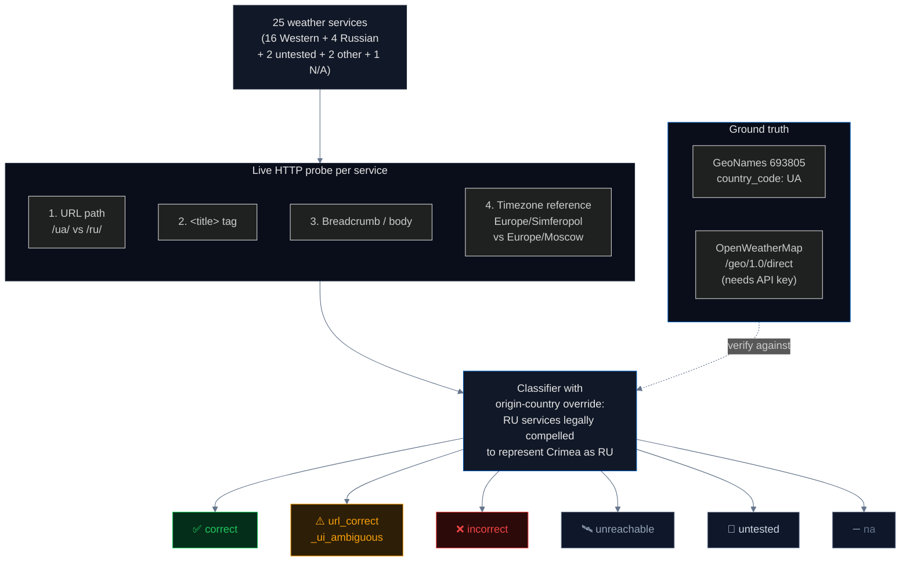

# Weather Services: Mostly Correct, Not for Free

Weather apps are consumed by hundreds of millions of users daily. They embed sovereignty in the URL path (`/ua/simferopol` vs `/ru/simferopol`), in the `<title>` tag, and in the timezone they quote (`Europe/Simferopol` vs `Europe/Moscow`). This pipeline lives-verifies **25 weather services**, runs four independent probes per service, and classifies each one into a richer taxonomy than "correct / incorrect / ambiguous."

## Headline

**Western weather services are largely correct about Crimea. Russian services are uniformly wrong. But "correct" is not a single category, and the prior audit overstated the finding.**

Out of 25 services re-verified in 2026-04:

| Status | Count | What it means |
|---|---:|---|
| ✅ **Correct** | 12 | URL path and `<title>` both attribute Simferopol to Ukraine |
| ⚠️ **URL-correct, UI-ambiguous** | 4 | URL says UA, but the visible page title or header omits the country |
| ❌ **Incorrect** | 3 | Attributes Simferopol to Russia (all three are Russian-origin) |
| 🛰️ **Unreachable** | 3 | CDN anti-bot blocked the scanner; not re-verified |
| 🧪 **Untested** | 2 | Apple WeatherKit + Google Search weather panel — suspected worldview-compliant, not verifiable without a signed dev token and a Russian IP proxy |
| ➖ **N/A** | 1 | Simferopol simply not in the service |

Previous iteration of this README reported "16 correct / 4 incorrect / 2 ambiguous / 1 N/A." The new live scan adjusted four prior "correct" entries down into **URL-correct/UI-ambiguous** after re-inspecting the actual `<title>` tag (notably **Weather.com's location label for Simferopol is literally `"Simferopol, Simferopol"` — the country has been stripped**), and reclassified **Apple WeatherKit** from "correct" to **untested** because we cannot verify the hypothesized worldview split (EU/US IP → UA, RU IP → RU) without infrastructure we don't have. The corrections are flagged in `pipelines/weather/data/manifest.json` under `disagreements_with_prior`.

## What we test and why

The sovereignty question is: *what country does the service say Crimean cities are in?* The answer is encoded in different places per service. We probe four signals, in decreasing order of authority:

| # | Signal | What it is | Why it matters |
|---|---|---|---|
| 1 | **URL path** | e.g. `/ua/simferopol` vs `/ru/simferopol` | Machine-readable. This is the service's own routing decision and is unambiguous. |
| 2 | **`<title>` tag** | What the browser tab and Google search preview show | Human-visible. This is what users see. |
| 3 | **Breadcrumb / body text** | Navigation hierarchy and article body | Tertiary; reveals UI choices that contradict the URL. |
| 4 | **Timezone reference** | `Europe/Simferopol` (ISO-compliant) vs `Europe/Moscow` (de-facto Russian) | The IANA `zone1970.tab` file lists `Europe/Simferopol` under *both* UA and RU — which zone a service quotes is a deliberate editorial choice, not inherited. |

The primary signal is **URL path**. Where URL and UI disagree we mark the finding `url_correct_ui_ambiguous` rather than hiding the disagreement behind a single "correct" label.

## Pipeline architecture



## Status distribution


## The structural finding: deliberate separation of concerns

The prior version of this README framed the good result as "Western weather services inherit the correct answer for free from GeoNames." That's not quite right. Most weather providers use **OpenStreetMap** for map *tiles*, and OSM's [On the Ground Rule](https://wiki.openstreetmap.org/wiki/On_the_ground_rule) dual-tags Crimea as Russian-controlled. These same providers chose to use **[GeoNames](https://www.geonames.org/)** (which follows ISO 3166) for the *geocoding* layer that fills the `country` field.

**The separation is deliberate.** On-the-ground mapping for the visual; ISO-compliant geocoding for the sovereignty-relevant field. It is not inheritance — it is an active editorial decision that every major Western weather provider made the same way. That is why weather works and geodata does not: the weather industry centralized on GeoNames for the field that carries the country code, while the geodata industry centralized on Natural Earth (which assigned Crimea to Russia and ships 30M npm downloads/week).

The one ground truth you can verify yourself: [GeoNames entry 693805 (Simferopol)](https://www.geonames.org/693805/simferopol.html) — `country_code: UA`.

## Findings (numbered for citation)

1. **12 of 25 weather services classify Simferopol as Ukrainian on both URL and title** — the good news is real, smaller than previously reported.
2. **All 3 incorrect services are Russian-origin** (Yandex Weather, rp5.ru, Pogoda.mail.ru). No Western weather service classifies Crimea as Russian. Russian providers are **legally compelled** under [Russian Federal Law No. 377-FZ (2014)](https://www.consultant.ru/document/cons_doc_LAW_170447/) and subsequent territorial-integrity amendments to represent Crimea as part of the Russian Federation, so their classification is not editorial choice but compliance.
3. **Weather.com strips the country entirely** for Crimean cities. The location label on `weather.com/weather/today/l/44.95,34.10` reads `"Simferopol, Simferopol"` — city name repeated where the country should be. URL structure is correct by omission; the visible label is not. This is the most striking URL-vs-UI inconsistency in the sample.
4. **AccuWeather has a dual-listing in its location database.** The autocomplete API for `Simferopol` returns five results with ordered country codes `['UA', 'RU', 'KZ', 'RU', 'KZ']`. The first (default) is `country=UA`, so default routing is correct — but the `country=RU` Cyrillic-named duplicate exists in the same database and is selectable by clients.
5. **MSN Weather (Microsoft) omits the country** for Simferopol: page title `"Simferopol Weather Forecast | MSN Weather"` — no country in the visible label, no URL path signal. Consistent with Microsoft's pattern across other disputed territories (Taiwan, Kashmir, Tibet) of suppressing contested country labels.
6. **Apple WeatherKit and Google Search weather panel are reclassified from "correct" to "untested."** The hypothesis is worldview-compliance (EU/US IP → UA, RU IP → RU). Verifying it requires (a) a signed Apple Developer JWT for `api.weatherkit.apple.com`, and (b) a Russian IP proxy. We refuse to label them "correct" without the test, because the question is *not* "what does the service show EU users" — that is already known. The question is whether they switch.
7. **Timezone probe cross-check.** Of the services whose HTML response contained a textual timezone reference, **3 quoted `Europe/Simferopol`** (Ventusky, Foreca, Meteostat) and **0 quoted `Europe/Moscow`**. IANA's `zone1970.tab` lists `Europe/Simferopol` under both UA and RU — so picking UA over RU is a deliberate choice, not an inheritance.
8. **`url_correct_ui_ambiguous` is its own category**, not a subtype of correct. It captures the pattern the reviewer flagged: URL path routes to UA, but the visible UI (title, breadcrumb) omits the country. For a site that billions of users read, the visible layer is what counts. 4 services fall here: Weather.com, Ventusky, Windy, MSN Weather.
9. **3 services could not be re-verified** because their CDN (likely Cloudflare or Akamai) returned 403/404 to the scanner: Weather Atlas, Windfinder, Gismeteo. These are flagged `unreachable` with the prior manual classification preserved but not re-verified. This is honest: we did not inherit the old label just to keep the count round.
10. **Structural lesson**: the weather industry's correctness comes from a deliberate architectural choice — use GeoNames/ISO 3166 for the geocoding field, OSM for visual tiles. This separation-of-concerns is the same mechanism that makes the [geodata pipeline](../geodata/README.md) *incorrect*: when the industry centralized on Natural Earth instead of GeoNames, the entire downstream got Crimea wrong.

## Why this matters — for the paper, for the press

For a weather app the country field is infrastructure, not opinion. The good news from this pipeline — Western services are correct — holds, but the new framing is sharper:

> **Correctness is not inherited. It is maintained.** Every weather provider had the choice: pull from GeoNames (ISO-compliant) or from OSM's on-the-ground tags (which dual-lists Crimea). Every major Western provider chose GeoNames for the field that matters. The Russian providers are legally prohibited from making that choice. The downstream 70%+ accuracy is not free — it is the visible output of an editorial decision the industry made once and now sustains.

This is the counterpoint to the [geodata pipeline](../geodata/README.md): same architecture, opposite upstream, opposite result.

## How to run

```bash
# from the project root
make pipeline-weather
```

This runs `pipelines/weather/scan.py` end-to-end against all 25 services, fetches GeoNames as ground truth, writes `pipelines/weather/data/manifest.json`, and rebuilds `site/src/data/master_manifest.json`. Set `OWM_API_KEY` in the environment to additionally live-verify OpenWeatherMap's `/geo/1.0/direct` geocoding endpoint.

## Method limitations

- Tested from an EU/US network. Worldview-compliant services that switch on Russian IPs were **not** verified from a Russian proxy — this is why Apple WeatherKit and Google Search weather panel are marked `untested` rather than classified.
- HTML scraping is brittle: some services return JS-rendered content where the country label is filled in client-side (Windy, MSN, Ventusky). These fall into `url_correct_ui_ambiguous` even when the eventual rendered UI may be correct. Manual browser verification of those 4 services is recommended as a follow-up.
- 3 services (Weather Atlas, Windfinder, Gismeteo) are CDN-blocked and were not re-verified. Prior manual audit status is preserved in the `prior_status` field of the manifest for reference but not counted toward the new taxonomy.
- The URL path signal is meaningless for services that use GPS coordinates rather than per-country routes (Windy, Weather.com). Those services can only be classified from the UI layer.
- OpenWeatherMap live verification requires an `OWM_API_KEY` environment variable; when absent, OWM is indirectly verified via the web UI.
- Forecast accuracy (data quality) is not measured — only sovereignty attribution.

## Sources

- GeoNames: [geonames.org](https://www.geonames.org/) · Simferopol entry [693805](https://www.geonames.org/693805/simferopol.html)
- OpenWeatherMap geocoding API: [openweathermap.org/api/geocoding-api](https://openweathermap.org/api/geocoding-api)
- ISO 3166-1 country codes: [iso.org](https://www.iso.org/iso-3166-country-codes.html) · [ISO 3166-2:UA](https://www.iso.org/obp/ui/#iso:code:3166:UA)
- IANA Time Zone Database `zone1970.tab`: [iana.org/time-zones](https://www.iana.org/time-zones)
- OpenStreetMap "On the Ground" rule: [wiki.openstreetmap.org/wiki/On_the_ground_rule](https://wiki.openstreetmap.org/wiki/On_the_ground_rule)
- Russian Federal Law 377-FZ (Crimea annexation): [consultant.ru/document/cons_doc_LAW_170447](https://www.consultant.ru/document/cons_doc_LAW_170447/)
- Apple WeatherKit: [developer.apple.com/weatherkit](https://developer.apple.com/weatherkit/)
- Norwegian Meteorological Institute (yr.no): [yr.no](https://www.yr.no/) · [api.met.no](https://api.met.no/)
- Council Regulation (EU) No 692/2014: [eur-lex.europa.eu](https://eur-lex.europa.eu/legal-content/EN/TXT/?uri=CELEX:32014R0692)
