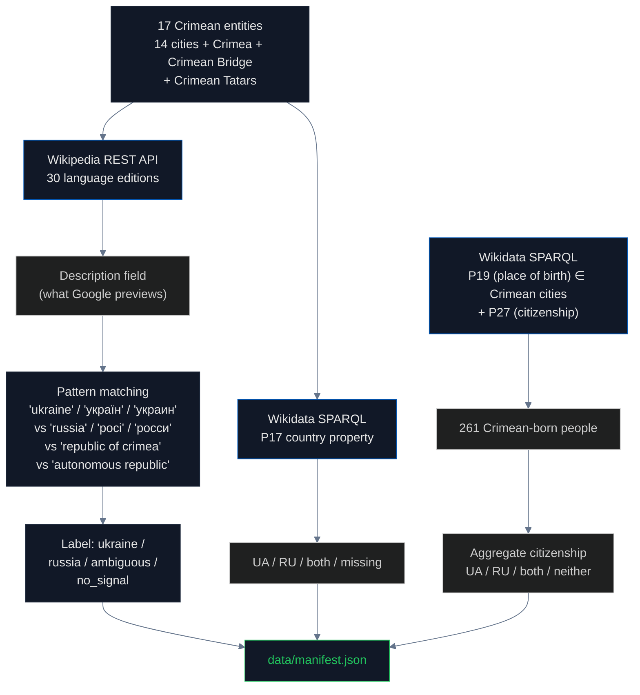

# Wikipedia & Wikidata: When Encyclopedias Choose Silence

## What are Wikipedia and Wikidata?

**[Wikipedia](https://www.wikipedia.org/)** is the world's largest encyclopedia, with **6.8 million articles in English alone** and editions in over 300 languages. It is operated by the [Wikimedia Foundation](https://wikimediafoundation.org/) under the policy of a [neutral point of view](https://en.wikipedia.org/wiki/Wikipedia:Neutral_point_of_view) (WP:NPOV) — articles should "represent fairly, proportionately, and, as far as possible, without editorial bias, all the significant views that have been published by reliable sources."

**[Wikidata](https://www.wikidata.org/)** is Wikipedia's structured-data sister project. While Wikipedia stores natural-language text, Wikidata stores **machine-readable facts as triples**: subject, property, value. For example, the Wikidata entity for [Simferopol (Q178149)](https://www.wikidata.org/wiki/Q178149) has properties like `P31` (instance of: city), `P17` (country: ?), and `P19` (place of birth, used by people entities pointing back to Simferopol). Wikidata feeds the structured "knowledge panels" that Google, Bing, Siri, Alexa, and ChatGPT all use to answer factual questions.

The most important Wikidata property for sovereignty is **[P17 (country)](https://www.wikidata.org/wiki/Property:P17)**. When you ask Google "What country is Simferopol in?", the knowledge panel reads from Wikidata's P17 value. If P17 is missing, Google has nothing to display, and the model falls back to the article description text.

## What we tested

We ran **five checks** on the Wikipedia/Wikidata corpus for Crimean entities:

1. **Wikipedia article description** — the short text Google displays in search previews (12 major language editions × 17 entities)
2. **Wikipedia categories** — the navigation hierarchy that places articles under "Cities in Russia" or "Cities in Ukraine"
3. **Wikidata P17 country property** — the structured-data answer
4. **Wikidata entity sitelink asymmetry** — for each Wikipedia edition, does it have a standalone article for the **Russian federal subject** ([Q15966495](https://www.wikidata.org/wiki/Q15966495) "Republic of Crimea", established March 2014), the **Ukrainian Autonomous Republic** ([Q756294](https://www.wikidata.org/wiki/Q756294)), both, or only the geographic **peninsula** ([Q7835](https://www.wikidata.org/wiki/Q7835))? Creating a standalone article for the Russian entity is an affirmative editorial act that accepts it as article-worthy.
5. **Wikidata people stratified** — people born in Crimean cities (P19), their citizenship (P27), **stratified by date of death (P570)** into four cohorts (died pre-1991 / 1991–2014 / post-2014 / alive-or-unknown) and cross-tabulated with the P27 qualifier **P580 (start time)** to detect unambiguous post-2014 Russian passportization.

> **Prior version correction.** A previous iteration of this README reported "69% of 261 Crimean-born people in Wikidata have Russian citizenship." That figure was a **biographical-lag artifact**: it conflated Imperial Russia, the Soviet Union, and the modern Russian Federation into a single "Russia" bucket, and the underlying query was also undercounting (N=577, not 261, when P27 is OPTIONAL). The stratified rewrite below supersedes it and is **directionally the opposite** — UA and RU are essentially tied among living people.

## How descriptions become Google previews

When you type "Simferopol" into Google, the result page typically shows a knowledge panel on the right side. The first line of that panel is usually the **Wikipedia description field** — a short phrase that Wikipedia editors curate to summarize what the article is about. Google uses this exact text via the [Wikimedia REST API summary endpoint](https://en.wikipedia.org/api/rest_v1/page/summary/Simferopol).

For Crimean cities, three description patterns are possible:

- **Pro-Ukraine framing**: "Simferopol is a city in Ukraine, the capital of the Autonomous Republic of Crimea"
- **Pro-Russia framing**: "Simferopol is a city in the Republic of Crimea, Russia"
- **Erasure by omission**: "Simferopol is a city in Crimea" — no country mentioned

The third option is the one we found most often in English Wikipedia. **Erasure by omission is the form the bias takes in WP:NPOV-compliant editorial culture**: instead of taking sides, editors remove the disputed information. The result is a description that appears neutral but in practice fails the basic encyclopedic question — "what country is this city in?"

## How we measured



## Findings

### Wikipedia descriptions by language

For the 14 Crimean cities tested across language editions:

| Language | Says "Ukraine" | Says "Russia" | Says nothing (just "Crimea") |
|---|---|---|---|
| **German** | 6 of 6 | 0 | 0 |
| **Indonesian** | 5 of 5 | 0 | 0 |
| **French** | 1 of 1 | 0 | 0 |
| **Romanian** | 1 of 1 | 0 | 0 |
| **English** | 3 of 14 | 0 | **11 of 14** ⚠ |
| **Italian** | 1 of 8 | 0 | 7 of 8 |
| **Spanish** | 2 of 12 | 0 | 10 of 12 |
| **Chinese** | 0 | **1** ("Republic of Crimea") | 0 |

**English Wikipedia uses "city in Crimea" for 11 of 14 Crimean cities.** German Wikipedia says "Ukraine" for all 6 cities tested. The largest English-language encyclopedia in the world — the source that Google uses for billions of searches — has chosen to remove country attribution from Crimean city descriptions. This is the erasure by omission pattern.

A single Chinese-language data point in the description-field scan used the phrase "Republic of Crimea," but the systematic sitelink check below supersedes it: Chinese Wikipedia is not an outlier — it has dedicated articles for **both** the Russian federal subject and the Ukrainian Autonomous Republic, like most major editions. The real asymmetry appears in smaller editions (next section).

### Wikidata P17 country property

We queried Wikidata for the country property of all 17 Crimean entities:

| Result | Count |
|---|---|
| Country property missing entirely | **11 of 17** |
| Listed as Ukraine (P17 = Q212) | 5 of 17 |
| Listed as Russia (P17 = Q159) | 1 of 17 |

**The most-used structured knowledge base in the world has no country property for 11 of 17 Crimean entities.** When Google's knowledge panel or ChatGPT's training data wants to answer "what country is Crimean Bridge in?", Wikidata returns nothing. The system that powers structured factual answers worldwide simply does not say.

### Entity sitelink asymmetry: Russian federal subject vs Ukrainian Autonomous Republic

There are three distinct Wikidata items at play:

| Entity | QID | What it is |
|---|---|---|
| **Crimea** | [Q7835](https://www.wikidata.org/wiki/Q7835) | the geographic peninsula (neutral) |
| **Republic of Crimea** | [Q15966495](https://www.wikidata.org/wiki/Q15966495) | the Russian federal subject, established March 2014 |
| **Autonomous Republic of Crimea** | [Q756294](https://www.wikidata.org/wiki/Q756294) | the Ukrainian administrative unit |

For each Wikipedia edition, we asked: does it have a **standalone article** sitelinked to each of these? Creating a standalone article (rather than a redirect) is an affirmative editorial act — it says "this entity is distinct enough to deserve its own encyclopedia entry."

| Entity | Editions with standalone article |
|---|---|
| **Peninsula (Q7835)** — geographic | **156** |
| **Ukrainian Autonomous Republic (Q756294)** | **100** |
| **Russian federal subject (Q15966495)** | **92** |

Crossing the two administrative entities:

| Pattern | Editions | What it means |
|---|---|---|
| **Both** | 69 | Treats the two administrative entities as distinct topics |
| **UA-only** | 31 | Has the Ukrainian entity but no standalone Russian entity article |
| **RU-only** | **23** | Has the Russian federal subject as an article but no Ukrainian counterpart |
| **Peninsula only** | 51 | Only the geographic article; neither administrative entity |

**23 Wikipedia editions have created a standalone article for the Russian federal subject "Republic of Crimea" without a parallel article for the Ukrainian Autonomous Republic.** These are mostly smaller editions — Breton, Welsh, Frisian, Bengali, Swahili, Albanian, Maltese, Norwegian Nynorsk, Alemannic, Altai, Burmese, among others — but the asymmetry is structural: editorial labor flowed toward the Russian administrative entity first (or only).

This does not mean those editions "support Russia." It means that at the moment an editor decided to create an article about Crimea's administrative status, the Russian federal subject was the one that felt notable enough to write about, while the Ukrainian administrative unit did not. In 23 out of 143 editions that cover either, that is what happened.

### Wikidata people: stratified by death date and citizenship start time

Our previous iteration reported a raw "69% Russian citizenship" aggregate for 261 Crimean-born people. That finding was wrong on two counts:

1. The query was under-counting. With `P27` made OPTIONAL, the actual cohort is **577 people**, not 261.
2. The aggregate conflated Imperial Russia (Q34266 / Q12544), the Soviet Union (Q15180), and the modern Russian Federation (Q159) into a single "Russia" bucket, producing a biographical-lag artifact driven by 19th-century military officers and Soviet-era administrators whose citizenship at death was "USSR" but who got collapsed into "Russia" by the earlier script.

The stratified query, split by P570 (date of death) and with Imperial Russia / Soviet Union broken out as separate buckets:

| Cohort | n | UA-only | RU-only (modern) | Soviet Union | Russian Empire | Both UA+RU | Missing |
|---|---|---|---|---|---|---|---|
| **Died pre-1991** (Imperial / Soviet) | 216 | 0 (0%) | **1 (0%)** | 89 | 42 | 1 | 35 |
| **Died 1991–2014** | 67 | 8 (11%) | 19 (28%) | 15 | 0 | 1 | 8 |
| **Died post-2014** | 50 | 9 (18%) | 14 (28%) | 6 | 1 | 6 | 7 |
| **Alive or unknown** | 244 | **60 (24%)** | **58 (23%)** | 13 | 1 | 31 | 42 |

Among the 244 living-or-unknown cohort (where "citizenship" is a meaningful present-tense claim), **UA and RU are essentially tied: 24% vs 23%**. The pre-1991 cohort is dominated by Soviet Union and Russian Empire citizenship, exactly as it should be — Wikidata's historical modeling is actually correct here; the earlier script's collapsed aggregate was not.

**Post-2014 passportization signal.** Russia issued an estimated 2 million passports in Crimea after March 2014. Wikidata records citizenship with a `P27` edge, and that edge can carry a qualifier `P580` (start time) indicating *when* the citizenship began. If passportization were being captured in Wikidata, we would expect large numbers of living Crimean-born people to have a `P27=Q159` edge with `P580 ≥ 2014-03-18`. The actual count across all cohorts: **1 person**.

**This is the real finding about people.** Not "69% are Russian" — that was wrong — but rather: **the world's most-used structured knowledge base has no mechanism for representing the single largest post-occupation demographic event**. Editors can add a `P27=Russia` edge, but they almost never qualify it with "since 2014," so there is no way to tell a person who acquired Russian citizenship under occupation from one who was always a Russian citizen. The data gap is the finding.

## Why this happens — the WP:NPOV trap

[WP:NPOV](https://en.wikipedia.org/wiki/Wikipedia:Neutral_point_of_view) requires Wikipedia editors to "represent fairly, proportionately, and, as far as possible, without editorial bias, all the significant views that have been published by reliable sources." For most topics this works well. For an active territorial dispute, it produces a perverse result: the editorial culture prefers **silence over taking sides**, even when international law is clear.

The English Wikipedia article on [Simferopol](https://en.wikipedia.org/wiki/Simferopol) does state that Crimea is occupied by Russia and recognized as Ukrainian under international law — this information is in the article body. But the **description field** (what Google previews) avoids the contested word. The result is that 1.7 billion English speakers see "city in Crimea" when they search, with no country.

This is also documented in the Wikipedia Manual of Style for [disputed territories](https://en.wikipedia.org/wiki/Wikipedia:Manual_of_Style/Disputed_territories), which explicitly recommends avoiding language that "asserts" sovereignty.

## The regulation gap

There is no external accountability mechanism for Wikipedia or Wikidata. Both are operated by the [Wikimedia Foundation](https://wikimediafoundation.org/), a US 501(c)(3) non-profit. Editorial decisions are made by volunteer editors following community policy.

[Council Regulation (EU) No 692/2014](https://eur-lex.europa.eu/legal-content/EN/TXT/?uri=CELEX:32014R0692) is binding on EU member states but does not bind Wikipedia. No mechanism exists to require that the world's largest encyclopedia state the legal classification of an EU partner state's territory.

The result: **Wikipedia is more careful than international law requires it to be**, in a direction that benefits the occupying power. Editorial silence about Crimea's country is not neutrality — it is an editorial choice that has the effect of normalizing the disputed status.

## Findings (numbered for citation)

1. **English Wikipedia uses "city in Crimea" with no country mentioned** for 11 of 14 Crimean cities — the most common pattern is erasure by omission
2. **German Wikipedia says "Ukraine" for 6 of 6 cities tested** — proof that taking the Ukrainian framing is editorially possible
3. **Italian and Spanish Wikipedia editions** are dominated by ambiguous descriptions (7/8 and 10/12 respectively)
4. **Wikidata has no current P17 country property** for 11 of 17 Crimean entities — a structural data gap
5. **Entity sitelink asymmetry:** 92 Wikipedia editions have a standalone article for the Russian federal subject [Q15966495](https://www.wikidata.org/wiki/Q15966495); 100 have one for the Ukrainian Autonomous Republic [Q756294](https://www.wikidata.org/wiki/Q756294); **23 editions have the Russian entity but no parallel Ukrainian article**; 31 have the reverse
6. **Crimean-born people (stratified, N=577):** among the 244 living-or-unknown-death cohort, UA-only and RU-only citizenship are essentially tied at 24% vs 23%. The prior 69% figure was a biographical-lag artifact conflating Imperial Russia, the Soviet Union, and the modern Russian Federation, and is withdrawn.
7. **Wikidata cannot represent post-2014 passportization:** only 1 person across the entire cohort has a `P27=Q159` edge with a `P580` (start time) qualifier on or after 2014-03-18, despite ~2 million passports issued in reality. The structured-data gap is the finding.
8. **In 2014 the Wikipedia category structure was renamed** from "Republic of Crimea" to "Autonomous Republic of Crimea" following ISO 3166-2 — proof that infrastructural fixes are possible
9. **The WP:NPOV editorial culture** prefers silence over taking sides on disputed territories, even when international law is unambiguous
10. **Google's knowledge panel reads directly from Wikipedia's description field** — what 1.7 billion English speakers see when they search "Simferopol"
11. **No external enforcement mechanism** binds Wikipedia or Wikidata to international law on sovereignty

## Method limitations

- Description-text check covers 12 major language editions; the sitelink sweep covers all ~330 editions that have any Crimea-related article
- Description text is what we measured; full article body content was not classified
- Wikidata P17 and sitelink results are a snapshot; the data changes as editors update entries
- Stratification bucket "alive_or_unknown" includes entries with no `P570` death date — Wikidata does not reliably record "alive" as a distinct state from "unknown"
- `P580` (citizenship start-time) qualifier is rarely populated on `P27` edges; absence of the qualifier is not proof that citizenship pre-dated occupation
- Entity sitelinks count standalone articles only — editions that cover both topics in a single combined article are counted as "peninsula only," not "both"
- Cannot distinguish editorial intent from translation gaps in description field
- Did not test whether description text changes for logged-in users in different countries (we believe it does not, but did not verify)

## Running this pipeline

```bash
# from the repo root
make pipeline-wikipedia
```

This runs `pipelines/wikipedia/scan.py` end-to-end (description check, P17 check, sitelink sweep, stratified people query), writes `pipelines/wikipedia/data/manifest.json` following the standard pipeline schema, and rebuilds `site/src/data/master_manifest.json`.

## Sources

- Wikipedia: https://www.wikipedia.org/
- Wikipedia REST API: https://en.wikipedia.org/api/rest_v1/page/summary/{title}
- Wikipedia WP:NPOV policy: https://en.wikipedia.org/wiki/Wikipedia:Neutral_point_of_view
- Wikipedia Manual of Style for disputed territories: https://en.wikipedia.org/wiki/Wikipedia:Manual_of_Style/Disputed_territories
- Wikidata: https://www.wikidata.org/
- Wikidata SPARQL endpoint: https://query.wikidata.org/sparql
- Wikidata P17 (country) property: https://www.wikidata.org/wiki/Property:P17
- Wikidata P19 (place of birth) property: https://www.wikidata.org/wiki/Property:P19
- Wikidata P27 (citizenship) property: https://www.wikidata.org/wiki/Property:P27
- Simferopol Wikidata entity (Q178149): https://www.wikidata.org/wiki/Q178149
- Wikimedia Foundation: https://wikimediafoundation.org/
- Council Regulation (EU) No 692/2014: https://eur-lex.europa.eu/legal-content/EN/TXT/?uri=CELEX:32014R0692
