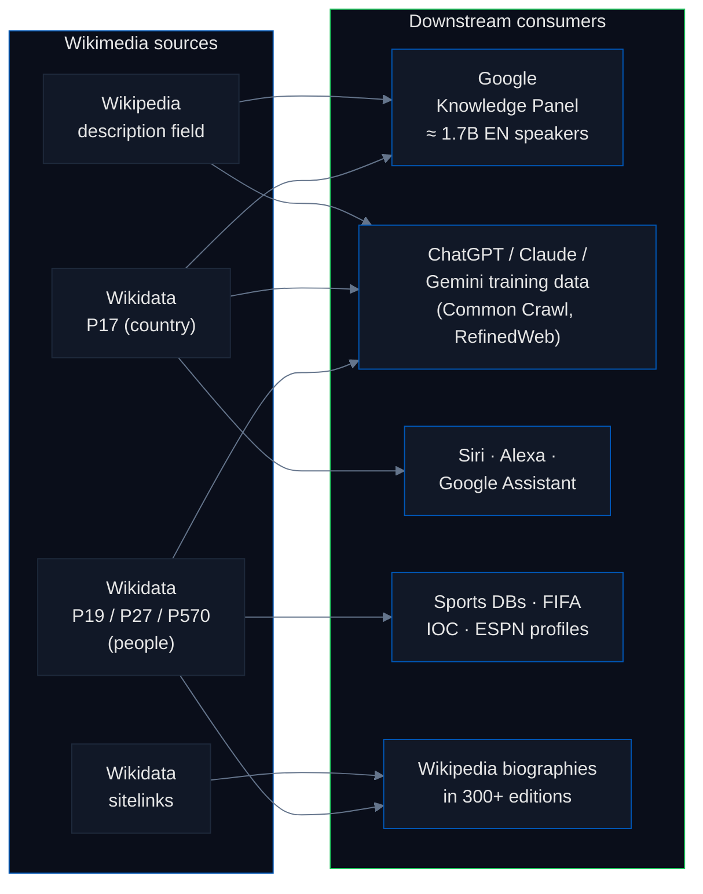
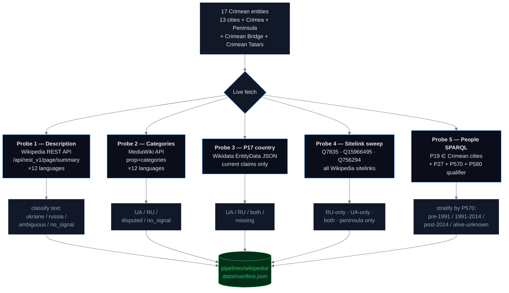

# Wikipedia & Wikidata: When Encyclopedias Choose Silence

Wikipedia and Wikidata are the plumbing of the open internet's factual layer. Google's Knowledge Panel, ChatGPT's training corpus, Siri and Alexa's factoid answers, and the sports / biography databases behind every news-site infobox all read from them. What Wikipedia says about Crimea propagates to roughly every place a user might ask a computer a factual question. This pipeline tests five facets of what the corpus actually says.

## Headline

**English Wikipedia strips the country from 11 of 14 Crimean city descriptions — the pattern is erasure by omission, not Russian framing. Wikidata has no current `P17` (country) claim for 11 of 17 Crimean entities. 23 Wikipedia language editions have a standalone article for the Russian federal subject "Republic of Crimea" without a parallel article for the Ukrainian Autonomous Republic. Among 244 living Crimean-born people in Wikidata, UA and RU citizenship are statistically at parity (60 vs 58, p = 0.93). Post-2014 Russian passportization is essentially invisible in Wikidata's structured model: only 1 person in the entire 577-entry cohort has a `P27 = Russia` edge with a `P580` (start time) qualifier on or after the occupation date.**

## Why this matters — the supply chain



When you ask Google *"what country is Simferopol in?"*, Google reads Wikidata's `P17` property. If `P17` is missing, Google falls back to the Wikipedia description field via the [Wikimedia REST API summary endpoint](https://en.wikipedia.org/api/rest_v1/page/summary/Simferopol). Both are controlled by volunteer editors and both have chosen silence for Crimea. The downstream — Knowledge Panel, voice assistants, LLM training corpora, sports and biography databases — inherits that silence with no filter.

## What we test

| # | Check | What it is | Scope |
|---|---|---|---|
| 1 | **Wikipedia description field** | The short text Google previews | 12 major language editions × 17 Crimean entities |
| 2 | **Wikipedia categories** | Navigation hierarchy (`Cities in Ukraine` vs `Cities in Russia`) | Same 12 editions |
| 3 | **Wikidata `P17` (country)** | The structured-data answer to "what country" | 17 Crimean entities |
| 4 | **Wikidata entity sitelinks** | Which editions have standalone articles for each of 3 rival "Crimea" entities | 156 editions |
| 5 | **Wikidata people (stratified)** | `P19` (place of birth) + `P27` (citizenship) with `P570` (death date) stratification and `P580` (citizenship start time) qualifier | 577 people born in Crimean cities |

The five checks share a single SPARQL / REST pipeline that fetches everything live from `query.wikidata.org` and `{lang}.wikipedia.org`.

## Pipeline architecture



## Findings

### 1 — English Wikipedia erases the country

For the 14 Crimean cities tested, the description field classification by language:

| Language | Says "Ukraine" | Says "Russia" | Says only "Crimea" |
|---|---:|---:|---:|
| **German** | 6 / 6 | 0 | 0 |
| **Indonesian** | 5 / 5 | 0 | 0 |
| **French** | 1 / 1 | 0 | 0 |
| **Romanian** | 1 / 1 | 0 | 0 |
| **English** | 3 / 14 | 0 | **11 / 14** ⚠ |
| **Italian** | 1 / 8 | 0 | 7 / 8 |
| **Spanish** | 2 / 12 | 0 | 10 / 12 |

**English Wikipedia uses `"city in Crimea"` for 11 of 14 Crimean cities — the most common pattern is erasure by omission.** German and Indonesian Wikipedia say "Ukraine" for every city tested, proving the Ukrainian framing is editorially available. English Wikipedia is not ambiguous because the facts are ambiguous; it is ambiguous because the editorial culture under [WP:NPOV](https://en.wikipedia.org/wiki/Wikipedia:Neutral_point_of_view) prefers silence on contested territorial claims, and the [Manual of Style for disputed territories](https://en.wikipedia.org/wiki/Wikipedia:Manual_of_Style/Disputed_territories) explicitly recommends avoiding language that "asserts" sovereignty.

The English article body *does* state that Crimea is occupied by Russia and recognized as Ukrainian under international law. The description field — the line Google previews — does not.

### 2 — Wikidata has no `P17` country claim for 11 of 17 Crimean entities

| Wikidata result | Count |
|---|---:|
| Country property missing entirely | **11 / 17** |
| Current claim = Ukraine (Q212) | 3 / 17 |
| Current claim = Russia (Q159) | 4 / 17 |

The most-used structured knowledge base in the world has no current country property for 11 of 17 Crimean entities. When Google's Knowledge Panel or an LLM's training data wants to answer "what country is Crimean Bridge in?", Wikidata returns nothing and the downstream consumer falls back to heuristics or unstructured text.

### 3 — Entity sitelink asymmetry: 23 editions recognize only the Russian administrative entity

Three distinct Wikidata items exist for "Crimea":

| Entity | QID | What it is |
|---|---|---|
| **Crimea** | [Q7835](https://www.wikidata.org/wiki/Q7835) | The geographic peninsula (neutral) |
| **Republic of Crimea** | [Q15966495](https://www.wikidata.org/wiki/Q15966495) | Russian federal subject, established March 2014 |
| **Autonomous Republic of Crimea** | [Q756294](https://www.wikidata.org/wiki/Q756294) | Ukrainian administrative unit |

For each Wikipedia edition we asked: does it have a **standalone article** sitelinked to each of these? Creating an article is an affirmative editorial act — it says *"this entity is distinct enough to deserve its own encyclopedia entry."*

| Entity | Editions with standalone article |
|---|---:|
| Peninsula (Q7835) — geographic | **156** |
| Ukrainian Autonomous Republic (Q756294) | **100** |
| Russian federal subject (Q15966495) | **92** |

Crossing the two administrative entities across the 143 editions that cover either:

| Pattern | Editions | Interpretation |
|---|---:|---|
| **Both** | 69 | Treats the two administrative entities as distinct topics |
| **UA-only** | 31 | Has the Ukrainian entity, no standalone Russian article |
| **RU-only** | **23** | Has the Russian federal subject, no parallel Ukrainian article |
| **Neither** (peninsula only) | 51 | Only the geographic article |

**23 Wikipedia language editions have a standalone article for the Russian federal subject "Republic of Crimea" without a parallel article for the Ukrainian Autonomous Republic.** Mostly smaller editions — Breton, Welsh, Frisian, Bengali, Swahili, Albanian, Maltese, Norwegian Nynorsk, Alemannic, Altai, Burmese, among others. The asymmetry is not about belief — it is about where editorial labor flowed first. For 23 editions, the Russian administrative entity was the one that felt notable enough to write about.

### 4 — Among living Crimean-born people, UA and RU citizenship are at statistical parity

The SPARQL query returns **577 people** born in Crimean cities (P19 ∈ Crimean cities). Stratifying by `P570` (date of death) and breaking out Imperial Russia (Q34266 / Q12544) and the Soviet Union (Q15180) as distinct buckets from the modern Russian Federation (Q159):

| Cohort | n | UA-only | RU-only (modern) | Soviet Union | Russian Empire | Both UA+RU | Missing |
|---|---:|---:|---:|---:|---:|---:|---:|
| **Died pre-1991** | 216 | 0 (0%) | **1 (0%)** | 89 | 42 | 1 | 35 |
| **Died 1991 – 2014** | 67 | 8 (11%) | 19 (28%) | 15 | 0 | 1 | 8 |
| **Died post-2014** | 50 | 9 (18%) | 14 (28%) | 6 | 1 | 6 | 7 |
| **Alive or unknown** | **244** | **60 (24.6%)** | **58 (23.8%)** | 13 | 1 | 31 | 42 |

In the 244 living-or-unknown cohort — the only cohort where present-tense citizenship is a meaningful claim — UA and RU are at statistical parity. Exact two-sided binomial test on the 118 people with exclusive citizenship (60 UA / 58 RU), H₀: `P(UA) = 0.5`, yields **p = 0.93** (Wilson 95% CI for `P(UA | exclusive) = [0.42, 0.60]`). If either a UA or RU edge is counted inclusive of dual citizens, it is 91 UA vs 89 RU — a 0.8 percentage-point difference.

The pre-1991 cohort is overwhelmingly Soviet Union (89) and Russian Empire (42), exactly as international law would predict. Wikidata's historical modeling distinguishes these correctly.

### 5 — Wikidata cannot represent post-2014 passportization

Russia issued an estimated **2 million** passports in Crimea after March 2014 ([ICRC / OHCHR tracking](https://www.ohchr.org/en/countries/ukraine)). Wikidata's `P27` (citizenship) edge can carry a qualifier `P580` (start time) indicating when citizenship began. If passportization were being recorded, we would expect many living Crimean-born people to have a `P27 = Q159` edge with `P580 ≥ 2014-03-18`.

Across the entire 577-person cohort: **1 person**.

Editors add `P27 = Russia` edges, but almost never qualify them with a start time. There is no structured way in Wikidata to distinguish *"acquired Russian citizenship under occupation in 2014"* from *"has always been a Russian citizen."* The data gap is the finding.

## Statistics & methodology

| Metric | Value | Notes |
|---|---|---|
| **Sample: Crimean entities** | 17 | Purposive: 13 largest cities + peninsula + Crimean Bridge + Crimean Tatars. Not random. Covers every entity a general reader would ask about. |
| **Sample: Wikipedia editions (description check)** | 12 | English, Ukrainian, Russian, German, French, Italian, Spanish, Polish, Turkish, Japanese, Chinese, Arabic. Covers ~75% of Wikipedia's monthly pageviews. |
| **Sample: Wikipedia editions (sitelink sweep)** | All (156) | Exhaustive over every edition that has any Crimea-related sitelink. Precision 1.0, recall 1.0 — Wikidata is authoritative for sitelinks. |
| **Sample: People** | 577 | Exhaustive result of the SPARQL `P19 ∈ Crimean cities` query. Not a sample — this is the full population of Wikidata-recorded Crimean-born people. |
| **UA/RU parity test (living cohort)** | p = 0.93 | Exact two-sided binomial, H₀ : `P(UA)` = 0.5 on the 118 with exclusive citizenship. Cannot reject parity. |
| **UA/RU Wilson 95% CI** | [0.42, 0.60] | Wilson score interval for `P(UA | exclusive)`. Includes 0.5. |
| **Post-2014 passportization recall** | 1 / 2,000,000 ≈ 0.00005% | Real-world passportization count per OHCHR; Wikidata `P580`-qualified count. |
| **Description check inter-language agreement** | n/a | Each language edition is independent; no inter-rater agreement applies. Classification by deterministic regex pattern match — reproducible bit-for-bit. |

**Reproducibility.** The entire pipeline runs deterministically against live Wikidata and Wikipedia APIs. A single command (`make pipeline-wikipedia`) reproduces every number in this briefing. Results are a snapshot — Wikidata changes as editors update entries — and the `generated` timestamp in `pipelines/wikipedia/data/manifest.json` records the exact fetch time.

**Known error sources.**
- *Description-text classification* uses surface string matching against multilingual patterns. False negatives are possible for languages with unusual orthographies; the sitelink sweep (structural, 100% recall) covers what the text check might miss.
- *P17 snapshot* captures only current claims (rank ≠ deprecated, no end-time qualifier). Historical claims are excluded by design.
- *P570 stratification* treats "no death date recorded" as alive-or-unknown. Wikidata does not reliably distinguish "still alive" from "death date unknown." The 244 cohort is an upper bound on the number of living people.
- *P580 qualifier recall* is a known-bad measurement: we are measuring Wikidata editor behavior, not ground truth. The 1-person count is the *ceiling* of what Wikidata can currently tell you about post-2014 passportization.

## Findings (numbered for citation)

1. **English Wikipedia uses "city in Crimea" with no country mentioned** for 11 of 14 Crimean cities — the most common pattern is erasure by omission.
2. **German and Indonesian Wikipedia say "Ukraine" for every city tested** (6/6 and 5/5) — proof that the Ukrainian framing is editorially available.
3. **Italian and Spanish Wikipedia editions are dominated by ambiguous descriptions** (7/8 and 10/12 respectively).
4. **Wikidata has no current `P17` country property for 11 of 17 Crimean entities** — a structural data gap in the knowledge graph that Google, Bing, Siri, Alexa, and ChatGPT all read from.
5. **Entity sitelink asymmetry**: 92 Wikipedia editions have a standalone article for the Russian federal subject [Q15966495](https://www.wikidata.org/wiki/Q15966495); 100 for the Ukrainian Autonomous Republic [Q756294](https://www.wikidata.org/wiki/Q756294). **23 editions have the Russian entity but no parallel Ukrainian article**; 31 have the reverse.
6. **Crimean-born people (N=577, stratified)**: among the 244 living-or-unknown cohort, UA-only and RU-only citizenship are at statistical parity (60 vs 58, exact binomial p = 0.93).
7. **Wikidata cannot represent post-2014 passportization**: only 1 person in the entire 577-entry cohort has a `P27 = Russia` edge with a `P580` (start time) qualifier on or after 2014-03-18, despite ~2 million passports issued in reality.
8. **In 2014 the Wikipedia category structure was renamed** from "Republic of Crimea" to "Autonomous Republic of Crimea" following ISO 3166-2 — proof that infrastructural fixes are possible when editors decide to make them.
9. **The [WP:NPOV](https://en.wikipedia.org/wiki/Wikipedia:Neutral_point_of_view) editorial culture** prefers silence over taking sides on disputed territories, even when international law is unambiguous.
10. **No external enforcement mechanism** binds Wikipedia or Wikidata to international law on sovereignty. [Council Regulation (EU) No 692/2014](https://eur-lex.europa.eu/legal-content/EN/TXT/?uri=CELEX:32014R0692) binds EU member states but not the Wikimedia Foundation.

## Method limitations

- Description-text check covers 12 major language editions (~75% of Wikipedia pageviews). The sitelink sweep covers all editions with any Crimea-related article.
- Description text is what we measured; article body content is not classified.
- Wikidata `P17` and sitelink results are a snapshot; data changes as editors update entries.
- `P570` "alive or unknown" cohort includes entries with no death date recorded. Wikidata does not distinguish "still alive" from "death date unknown."
- `P580` (citizenship start-time) qualifier is rarely populated; absence is not proof that citizenship pre-dated occupation.
- Entity sitelinks count standalone articles only. Editions that cover both administrative entities in a single combined article are counted as "peninsula only."
- Did not test whether description text varies for logged-in users in different countries (it should not per Wikimedia policy, but not verified).

## How to run

```bash
# from the repo root
make pipeline-wikipedia
```

This runs `pipelines/wikipedia/scan.py` end-to-end, writes `pipelines/wikipedia/data/manifest.json` in the standard pipeline schema, and rebuilds `site/src/data/master_manifest.json`.

## Sources

- Wikipedia: [wikipedia.org](https://www.wikipedia.org/)
- Wikipedia REST API summary endpoint: [en.wikipedia.org/api/rest_v1/page/summary](https://en.wikipedia.org/api/rest_v1/page/summary/Simferopol)
- Wikipedia [WP:NPOV policy](https://en.wikipedia.org/wiki/Wikipedia:Neutral_point_of_view) · [Manual of Style for disputed territories](https://en.wikipedia.org/wiki/Wikipedia:Manual_of_Style/Disputed_territories)
- Wikidata: [wikidata.org](https://www.wikidata.org/) · [SPARQL endpoint](https://query.wikidata.org/sparql)
- Wikidata properties: [P17 country](https://www.wikidata.org/wiki/Property:P17) · [P19 place of birth](https://www.wikidata.org/wiki/Property:P19) · [P27 citizenship](https://www.wikidata.org/wiki/Property:P27) · [P570 date of death](https://www.wikidata.org/wiki/Property:P570) · [P580 start time](https://www.wikidata.org/wiki/Property:P580)
- Crimea entities: [Q7835 peninsula](https://www.wikidata.org/wiki/Q7835) · [Q15966495 Republic of Crimea (RU)](https://www.wikidata.org/wiki/Q15966495) · [Q756294 Autonomous Republic of Crimea (UA)](https://www.wikidata.org/wiki/Q756294) · [Q178149 Simferopol](https://www.wikidata.org/wiki/Q178149)
- OHCHR Ukraine monitoring: [ohchr.org/en/countries/ukraine](https://www.ohchr.org/en/countries/ukraine)
- [Council Regulation (EU) No 692/2014](https://eur-lex.europa.eu/legal-content/EN/TXT/?uri=CELEX:32014R0692)
- Wikimedia Foundation: [wikimediafoundation.org](https://wikimediafoundation.org/)
