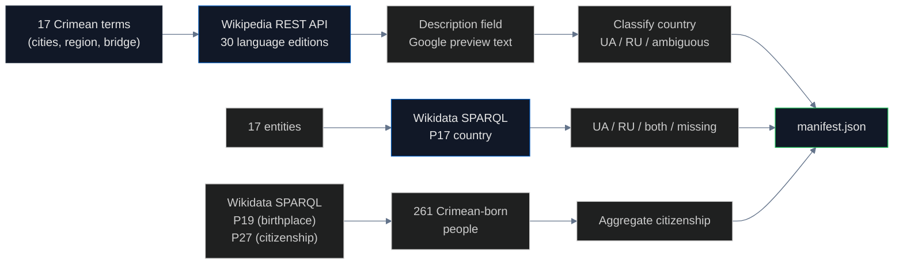

# Wikipedia & Wikidata Audit

## Name
`wikipedia` — How Wikipedia and Wikidata classify Crimean entities across languages

## Why
Wikipedia descriptions are what Google shows in search previews. Wikidata's `P17` (country property) feeds knowledge graphs worldwide. When 1.7 billion English speakers Google "Simferopol" and the preview says "city in Crimea" (no country), that's not neutrality — it's **erasure by omission**.

## What
Audits 17 Crimean entities (cities + region + bridge + Tatars) across 30 Wikipedia language editions:

1. **Wikipedia descriptions** — REST API `summary` endpoint, what Google shows
2. **Wikipedia categories** — country hierarchy in navigation
3. **Wikidata P17** (country property) — structured data
4. **Wikidata P19+P27** (birthplace + citizenship) — 261 Crimean-born people

## How



## Run

```bash
cd pipelines/wikipedia
uv sync
uv run scan.py
```

## Results

### Wikipedia descriptions by language

| Language | Says Ukraine | Says Russia | Says nothing |
|---|---|---|---|
| German | 6/6 | 0 | 0 |
| Indonesian | 5 | 0 | 0 |
| Spanish | 2 | 0 | 10 (ambiguous) |
| Italian | 1 | 0 | 7 (ambiguous) |
| **English** | 3 | 0 | **11 (just "city in Crimea")** |
| Chinese | 0 | **1** ("Republic of Crimea") | 0 |

### Wikidata P17

- **11/17 entities have NO country property at all** — structural gap
- 5/17 list Ukraine
- 1/17 lists Russia (Republic of Crimea entity)

### Wikidata people

- **261 people** born in Crimea with P19 entries
- **96 ru_only** (37%)
- **44 ua_only** (17%)
- **13 both**
- **108 neither / missing**
- **69% Russian citizenship** when at least one is set

## Conclusions

**English Wikipedia uses erasure by omission.** Of 14 Crimean cities tested, 11 say "city in Crimea" with no country mentioned. Compare to German Wikipedia which says "Ukraine" in 6/6 cases. The English encyclopedia avoids controversy by removing information — that is not neutrality.

**Wikidata structural gap**: 11 of 17 Crimean entities have no `P17` country property. The most-used structured knowledge base for the world's encyclopedia simply doesn't say what country Crimea is in.

**Chinese Wikipedia is the only non-Russian edition** to use "Republic of Crimea" — Russia's administrative name.

**Crimean-born people**: 69% are listed with Russian citizenship in Wikidata. This is partly legitimate (people may have changed citizenship after 2014 occupation) but the aggregate pattern is the finding.

## Findings

1. **English Wikipedia "erasure by omission"** — 11/14 cities say "city in Crimea" with no country
2. **German Wikipedia gets it right** — 6/6 say Ukraine
3. **Chinese Wikipedia uses "Republic of Crimea"** (Russian admin name) — only non-Russian edition to do so
4. **Italian and Spanish Wikipedia: mostly ambiguous**
5. **Wikidata P17 missing for 11/17 entities** — structural gap
6. **261 Crimean-born people in Wikidata** — 69% Russian citizenship
7. **In 2014 ISO renamed Wikipedia categories** from "Republic of Crimea" to "Autonomous Republic of Crimea"
8. **Wikipedia's policy** (WP:NPOV) has no mechanism to enforce sovereignty consistency across language editions

## Limitations

- 30 languages tested but Wikipedia has 300+ editions
- People classification by citizenship can be politically charged for individuals
- Cannot distinguish Wikipedia's editorial intent from translation gaps
- Wikidata data quality varies by entity

## Sources

- Wikipedia REST API: `https://{lang}.wikipedia.org/api/rest_v1/page/summary/{title}`
- Wikidata SPARQL: https://query.wikidata.org/sparql
