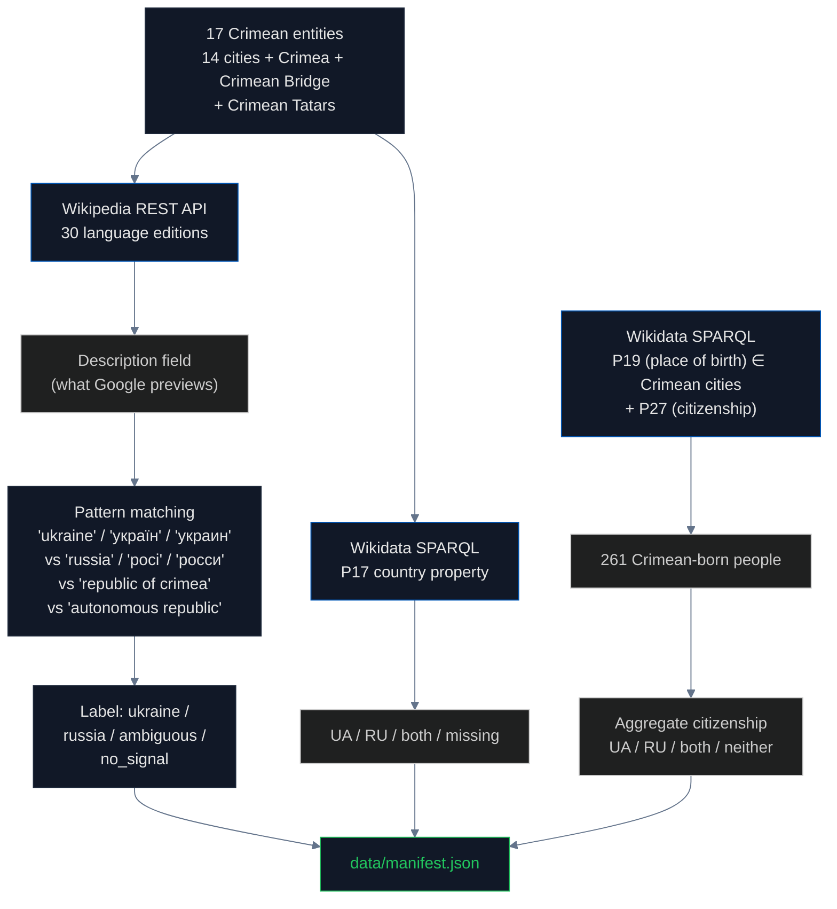

# Wikipedia & Wikidata: When Encyclopedias Choose Silence

## What are Wikipedia and Wikidata?

**[Wikipedia](https://www.wikipedia.org/)** is the world's largest encyclopedia, with **6.8 million articles in English alone** and editions in over 300 languages. It is operated by the [Wikimedia Foundation](https://wikimediafoundation.org/) under the policy of a [neutral point of view](https://en.wikipedia.org/wiki/Wikipedia:Neutral_point_of_view) (WP:NPOV) — articles should "represent fairly, proportionately, and, as far as possible, without editorial bias, all the significant views that have been published by reliable sources."

**[Wikidata](https://www.wikidata.org/)** is Wikipedia's structured-data sister project. While Wikipedia stores natural-language text, Wikidata stores **machine-readable facts as triples**: subject, property, value. For example, the Wikidata entity for [Simferopol (Q178149)](https://www.wikidata.org/wiki/Q178149) has properties like `P31` (instance of: city), `P17` (country: ?), and `P19` (place of birth, used by people entities pointing back to Simferopol). Wikidata feeds the structured "knowledge panels" that Google, Bing, Siri, Alexa, and ChatGPT all use to answer factual questions.

The most important Wikidata property for sovereignty is **[P17 (country)](https://www.wikidata.org/wiki/Property:P17)**. When you ask Google "What country is Simferopol in?", the knowledge panel reads from Wikidata's P17 value. If P17 is missing, Google has nothing to display, and the model falls back to the article description text.

## What we tested

We checked **17 Crimean entities × 30 Wikipedia language editions** for three things:

1. **Wikipedia article description** — the short text Google displays in search previews
2. **Wikipedia categories** — the navigation hierarchy that places articles under "Cities in Russia" or "Cities in Ukraine"
3. **Wikidata P17 country property** — the structured-data answer

We also queried Wikidata for **261 people born in Crimea** (P19 = Crimean city) and aggregated their **citizenship (P27)**.

## How descriptions become Google previews

When you type "Simferopol" into Google, the result page typically shows a knowledge panel on the right side. The first line of that panel is usually the **Wikipedia description field** — a short phrase that Wikipedia editors curate to summarize what the article is about. Google uses this exact text via the [Wikimedia REST API summary endpoint](https://en.wikipedia.org/api/rest_v1/page/summary/Simferopol).

For Crimean cities, three description patterns are possible:

- **Pro-Ukraine framing**: "Simferopol is a city in Ukraine, the capital of the Autonomous Republic of Crimea"
- **Pro-Russia framing**: "Simferopol is a city in the Republic of Crimea, Russia"
- **Erasure by omission**: "Simferopol is a city in Crimea" — no country mentioned

The third option is the one we found most often in English Wikipedia. **Erasure by omission is the form the bias takes in WP:NPOV-compliant editorial culture**: instead of taking sides, editors remove the disputed information. The result is a description that appears neutral but in practice fails the basic encyclopedic question — "what country is this city in?"

## How we measured

## Findings

### Wikipedia descriptions by language

For the 14 Crimean cities tested across language editions:

| Language | Says "Ukraine" | Says "Russia" | Says nothing (just "Crimea") |
|---|---|---|---|
| **German** | 6 of 6 | 0 | 0 |
| **Indonesian** | 5 of 5 | 0 | 0 |
| **French** | 1 of 1 | 0 | 0 |
| **Romanian** | 1 of 1 | 0 | 0 |
| **English** | 3 of 14 | 0 | **11 of 14** ⚠ |
| **Italian** | 1 of 8 | 0 | 7 of 8 |
| **Spanish** | 2 of 12 | 0 | 10 of 12 |
| **Chinese** | 0 | **1** ("Republic of Crimea") | 0 |

**English Wikipedia uses "city in Crimea" for 11 of 14 Crimean cities.** German Wikipedia says "Ukraine" for all 6 cities tested. The largest English-language encyclopedia in the world — the source that Google uses for billions of searches — has chosen to remove country attribution from Crimean city descriptions. This is the erasure by omission pattern.

**Chinese Wikipedia is the only non-Russian edition** to use "Republic of Crimea" — Russia's administrative name. The Russian Wikipedia edition naturally uses Russian framing.

### Wikidata P17 country property

We queried Wikidata for the country property of all 17 Crimean entities:

| Result | Count |
|---|---|
| Country property missing entirely | **11 of 17** |
| Listed as Ukraine (P17 = Q212) | 5 of 17 |
| Listed as Russia (P17 = Q159) | 1 of 17 |

**The most-used structured knowledge base in the world has no country property for 11 of 17 Crimean entities.** When Google's knowledge panel or ChatGPT's training data wants to answer "what country is Crimean Bridge in?", Wikidata returns nothing. The system that powers structured factual answers worldwide simply does not say.

### Wikidata people: birthplace and citizenship

We queried Wikidata for all people whose place of birth (P19) is a Crimean city. This returned **261 people** with at least one citizenship (P27) entry:

| Citizenship | Count | Percent |
|---|---|---|
| Russia only | 96 | 37% |
| Ukraine only | 44 | 17% |
| Both Russia and Ukraine | 13 | 5% |
| Neither / missing | 108 | 41% |

Among those with at least one citizenship recorded, **69% are listed as Russian citizens**. This is the result of three overlapping factors: Russian-edited entries dominate Wikidata for Russian-language entities, Russia issued passports to Crimeans after 2014 occupation (so individuals legitimately have Russian citizenship), and Wikidata editors have not consistently removed older citizenship information when updating entries.

The aggregate finding is the data point. The individual citizenship of any given person may be legitimate. The pattern across 261 entries is what is striking.

## Why this happens — the WP:NPOV trap

[WP:NPOV](https://en.wikipedia.org/wiki/Wikipedia:Neutral_point_of_view) requires Wikipedia editors to "represent fairly, proportionately, and, as far as possible, without editorial bias, all the significant views that have been published by reliable sources." For most topics this works well. For an active territorial dispute, it produces a perverse result: the editorial culture prefers **silence over taking sides**, even when international law is clear.

The English Wikipedia article on [Simferopol](https://en.wikipedia.org/wiki/Simferopol) does state that Crimea is occupied by Russia and recognized as Ukrainian under international law — this information is in the article body. But the **description field** (what Google previews) avoids the contested word. The result is that 1.7 billion English speakers see "city in Crimea" when they search, with no country.

This is also documented in the Wikipedia Manual of Style for [disputed territories](https://en.wikipedia.org/wiki/Wikipedia:Manual_of_Style/Disputed_territories), which explicitly recommends avoiding language that "asserts" sovereignty.

## The regulation gap

There is no external accountability mechanism for Wikipedia or Wikidata. Both are operated by the [Wikimedia Foundation](https://wikimediafoundation.org/), a US 501(c)(3) non-profit. Editorial decisions are made by volunteer editors following community policy.

[Council Regulation (EU) No 692/2014](https://eur-lex.europa.eu/legal-content/EN/TXT/?uri=CELEX:32014R0692) is binding on EU member states but does not bind Wikipedia. No mechanism exists to require that the world's largest encyclopedia state the legal classification of an EU partner state's territory.

The result: **Wikipedia is more careful than international law requires it to be**, in a direction that benefits the occupying power. Editorial silence about Crimea's country is not neutrality — it is an editorial choice that has the effect of normalizing the disputed status.

## Findings (numbered for citation)

1. **English Wikipedia uses "city in Crimea" with no country mentioned** for 11 of 14 Crimean cities — the most common pattern is erasure by omission
2. **German Wikipedia says "Ukraine" for 6 of 6 cities tested** — proof that taking the Ukrainian framing is editorially possible
3. **Chinese Wikipedia is the only non-Russian edition** to use "Republic of Crimea" (Russia's administrative name)
4. **Italian and Spanish Wikipedia editions** are dominated by ambiguous descriptions (7/8 and 10/12 respectively)
5. **Wikidata has no country property (P17)** for 11 of 17 Crimean entities — a structural data gap
6. **Of 261 Crimean-born people in Wikidata**, 69% have Russian citizenship recorded (96 RU-only, 13 dual, vs 44 UA-only)
7. **In 2014 the Wikipedia category structure was renamed** from "Republic of Crimea" to "Autonomous Republic of Crimea" following ISO 3166-2 — proof that infrastructural fixes are possible
8. **The WP:NPOV editorial culture** prefers silence over taking sides on disputed territories, even when international law is unambiguous
9. **Google's knowledge panel reads directly from Wikipedia's description field** — what 1.7 billion English speakers see when they search "Simferopol"
10. **No external enforcement mechanism** binds Wikipedia or Wikidata to international law on sovereignty

## Method limitations

- 30 language editions tested out of 300+ Wikipedia editions
- Description text is what we measured; full article body content was not classified
- Wikidata P17 results are a snapshot; the data changes as editors update entries
- People classification by citizenship can be politically charged for individuals; the aggregate finding is the data point
- Cannot distinguish editorial intent from translation gaps in description field
- Did not test whether description text changes for logged-in users in different countries (we believe it does not, but did not verify)

## Sources

- Wikipedia: https://www.wikipedia.org/
- Wikipedia REST API: https://en.wikipedia.org/api/rest_v1/page/summary/{title}
- Wikipedia WP:NPOV policy: https://en.wikipedia.org/wiki/Wikipedia:Neutral_point_of_view
- Wikipedia Manual of Style for disputed territories: https://en.wikipedia.org/wiki/Wikipedia:Manual_of_Style/Disputed_territories
- Wikidata: https://www.wikidata.org/
- Wikidata SPARQL endpoint: https://query.wikidata.org/sparql
- Wikidata P17 (country) property: https://www.wikidata.org/wiki/Property:P17
- Wikidata P19 (place of birth) property: https://www.wikidata.org/wiki/Property:P19
- Wikidata P27 (citizenship) property: https://www.wikidata.org/wiki/Property:P27
- Simferopol Wikidata entity (Q178149): https://www.wikidata.org/wiki/Q178149
- Wikimedia Foundation: https://wikimediafoundation.org/
- Council Regulation (EU) No 692/2014: https://eur-lex.europa.eu/legal-content/EN/TXT/?uri=CELEX:32014R0692
